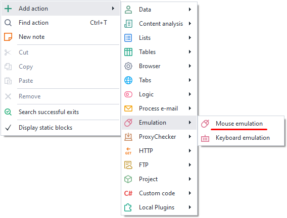
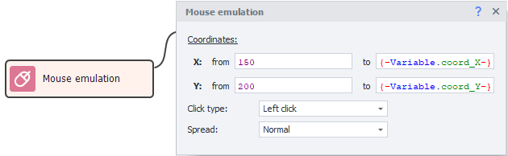
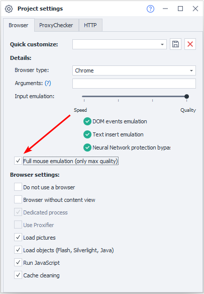
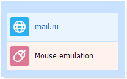

---
sidebar_position: 1
title: "Mouse Emulation"
description: ""
date: "2025-08-04"
converted: true
originalFile: "Эмуляция мыши.txt"
targetUrl: "https://zennolab.atlassian.net/wiki/spaces/RU/pages/534315158"
---
:::info **Please take a look at the [*Terms of Use for materials on this resource*](../Disclaimer).**
:::

> 🔗 **[Original page](https://zennolab.atlassian.net/wiki/spaces/RU/pages/534315158)** — Source of this material

_______________________________________________  

## Description

Mouse emulation lets you bypass site protections by clicking or triggering an element by moving the cursor over it.

  

## How do I add this action to a project?

Via the context menu **Add action** → **Emulation** → **Mouse emulation**

Or use the [❗→ smart search](https://zennolab.atlassian.net/wiki/spaces/RU/pages/506200090/ProjectMaker+7#%D0%A3%D0%BC%D0%BD%D1%8B%D0%B9-%D0%BF%D0%BE%D0%B8%D1%81%D0%BA-%D0%B4%D0%B5%D0%B9%D1%81%D1%82%D0%B2%D0%B8%D0%B9 "https://zennolab.atlassian.net/wiki/spaces/RU/pages/506200090/ProjectMaker+7#%D0%A3%D0%BC%D0%BD%D1%8B%D0%B9-%D0%BF%D0%BE%D0%B8%D1%81%D0%BA-%D0%B4%D0%B5%D0%B9%D1%81%D1%82%D0%B2%D0%B8%D0%B9").

  

## What is it used for?

- Moving the mouse cursor
- Hovering over an object
- Clicking an element (for example, if the element is rendered on a [canvas](https://developer.mozilla.org/ru/docs/Web/API/Canvas_API "https://developer.mozilla.org/ru/docs/Web/API/Canvas_API") and can’t be reached using the [❗→ Run event](https://zennolab.atlassian.net/wiki/spaces/RU/pages/534020211 "https://zennolab.atlassian.net/wiki/spaces/RU/pages/534020211") action)

  

## How to use the action?

### Coordinates

You need to specify the points within which the click will be performed (a random position within these coordinates will be selected).

**X** - horizontal  
**Y** - vertical

:::note Note
You can find the coordinates in the browser window.
:::

:::note Note
Coordinates can be either static or dynamic variables.
:::

### Click type

**Left click** - press the left mouse button.  
**Right click** - right mouse button click.  
**Double click** - simulate a double click.  

### Distribution

a) **Normal** - more likely to click closer to the center of the object.  
b) **Uniform** - even distribution within the given coordinates.

  

## Full mouse emulation

In the [❗→ project settings](https://zennolab.atlassian.net/wiki/spaces/RU/pages/534315477 "https://zennolab.atlassian.net/wiki/spaces/RU/pages/534315477") you can centrally enable the mouse emulation level at the template level. This means that when performing the “[❗→ Set value](https://zennolab.atlassian.net/wiki/spaces/RU/pages/534315117 "https://zennolab.atlassian.net/wiki/spaces/RU/pages/534315117")” (Set) and “[❗→ Run action](https://zennolab.atlassian.net/wiki/spaces/RU/pages/534020211 "https://zennolab.atlassian.net/wiki/spaces/RU/pages/534020211")” (Rise) actions, mouse emulation from the current cursor position to the HTML element specified in the action is automatically added.

  

## Usage example

To change the design in Mail, you need to move the mouse cursor over an element, which then opens an additional window where you can change the design.

1. [❗→ Get the element’s coordinates](https://zennolab.atlassian.net/wiki/spaces/RU/pages/534315373#%D0%9A%D0%BE%D0%BE%D1%80%D0%B8%D0%BD%D0%B0%D1%82%D1%8B-%D0%BA%D1%83%D1%80%D1%81%D0%BE%D1%80%D0%B0-%D0%BC%D1%8B%D1%88%D0%B8 "https://zennolab.atlassian.net/wiki/spaces/RU/pages/534315373#%D0%9A%D0%BE%D0%BE%D1%80%D0%B4%D0%B8%D0%BD%D0%B0%D1%82%D1%8B-%D0%BA%D1%83%D1%80%D1%81%D0%BE%D1%80%D0%B0-%D0%BC%D1%8B%D1%88%D0%B8") and store them in variables.
2. Add the mouse emulation action.
3. Enter the variables with coordinates in the action block.

This way, the email service tries to prevent bots from working, but with the functionality in Zennoposter, that won’t be a problem for you.

  

## Useful links

- [❗→ Variable window](https://zennolab.atlassian.net/wiki/spaces/RU/pages/735608872 "https://zennolab.atlassian.net/wiki/spaces/RU/pages/735608872")
- [❗→ Project settings](https://zennolab.atlassian.net/wiki/spaces/RU/pages/534315477 "https://zennolab.atlassian.net/wiki/spaces/RU/pages/534315477")
- [❗→ Keyboard emulation](https://zennolab.atlassian.net/wiki/spaces/RU/pages/735608949 "https://zennolab.atlassian.net/wiki/spaces/RU/pages/735608949")
- [❗→ Image search](https://zennolab.atlassian.net/wiki/spaces/RU/pages/492044304 "https://zennolab.atlassian.net/wiki/spaces/RU/pages/492044304")