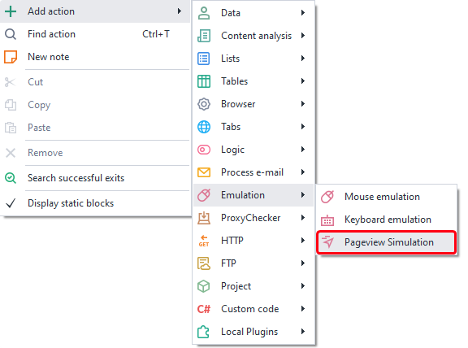
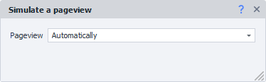
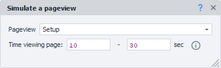

:::info **Please read the [*Material Usage Rules on this site*](../../../../Disclaimer).**
:::

> 🔗 **[Original page](https://zennolab.atlassian.net/wiki/spaces/RU/pages/2076082178)** — Source of this material

_______________________________________________  

## Description

This action is used to simulate activity on a page. While this block is running, mouse movements and scrolling will be performed on the active tab at random speeds and with random pauses. The actions will closely resemble what you’d see during real visits to pages as recorded in WebVisor. The logic takes into account the layout of HTML elements on the page to make the behavior as similar to a real user as possible. The virtual mouse is independent of your actual computer cursor, so it can be run seamlessly in multithreaded mode (ZennoPoster Standard and Pro).

  

## How do I add this action to a project?

Via the context menu: **Add Action** → **Emulation** → **Page View Simulation**

Or use the [❗→ smart search](https://zennolab.atlassian.net/wiki/spaces/RU/pages/506200090/ProjectMaker+7#%D0%A3%D0%BC%D0%BD%D1%8B%D0%B9-%D0%BF%D0%BE%D0%B8%D1%81%D0%BA-%D0%B4%D0%B5%D0%B9%D1%81%D1%82%D0%B2%D0%B8%D0%B9 "https://zennolab.atlassian.net/wiki/spaces/RU/pages/506200090/ProjectMaker+7#%D0%A3%D0%BC%D0%BD%D1%8B%D0%B9-%D0%BF%D0%BE%D0%B8%D1%81%D0%BA-%D0%B4%D0%B5%D0%B9%D1%81%D1%82%D0%B2%D0%B8%D0%B9").

  

## How do I use this action?

Run this action after navigating to your target web page. There are two ways to configure the action:

### Automatic

This mode will use the default settings.

### Custom

In this mode, you can set the time to spend on the page. Each time the block runs, the actual time will be randomly selected from the range you specified.

  

## Action limitations

1. Supported only in CEF (Chrome) and Chromium.
2. Currently, ForceTouch value is not accounted for, so it’s not recommended for use in mobile profiles.
3. The time set in the action is approximate. In some cases, there may be a minor overrun of the upper limit. For example, if you specify a page time of 10 to 10 seconds, the block might actually run for 11 seconds.

  

## Useful links

- [❗→ Navigate to Page](https://zennolab.atlassian.net/wiki/spaces/RU/pages/534052989 "https://zennolab.atlassian.net/wiki/spaces/RU/pages/534052989")
- [❗→ Web Page Settings](https://zennolab.atlassian.net/wiki/spaces/RU/pages/534020228 "https://zennolab.atlassian.net/wiki/spaces/RU/pages/534020228")