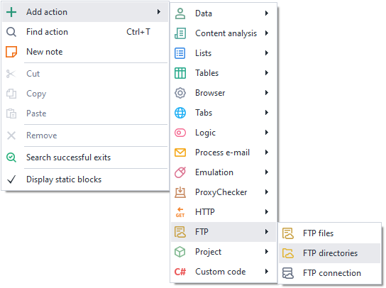
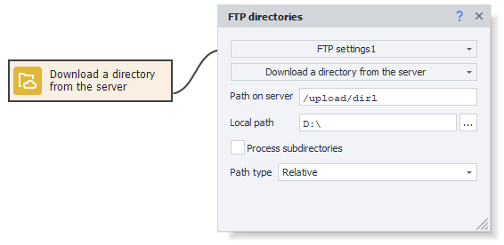
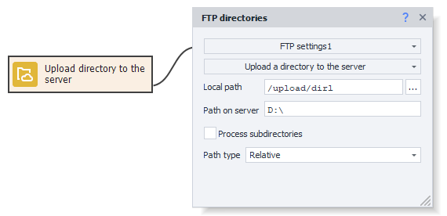
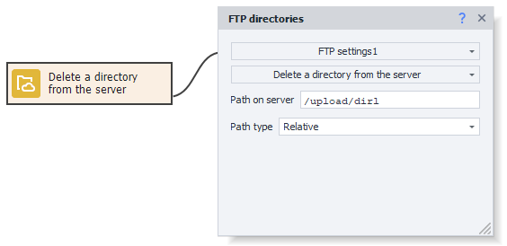
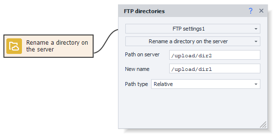
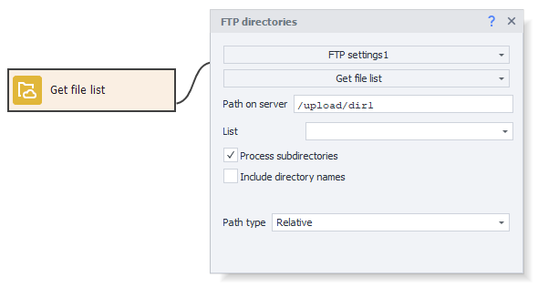
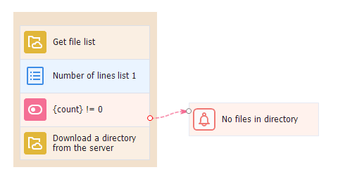

---
sidebar_position: 2
title: "FTP Directories"
description: ""
date: "2025-08-04"
converted: true
originalFile: "Директории FTP.txt"
targetUrl: "https://zennolab.atlassian.net/wiki/spaces/RU/pages/534085901/FTP"
---
import DisclaimerNotice from '@site/src/components/DisclaimerNotice';

<DisclaimerNotice />

> 🔗 **[Original page](https://zennolab.atlassian.net/wiki/spaces/RU/pages/534085901/FTP)** — Source of this material

_______________________________________________  

## Description

The “FTP Directories” action is used for working with directories on an FTP server. With it, you can:

- Download a directory from the FTP server.
- Upload a directory to the server.
- Delete a directory on the server.
- Rename a directory on the server.
- Get a list of files.

## How do I add this action to my project?

Through the context menu: **Add Action → FTP → FTP Directories**

Or you can use the [❗→ smart search](https://zennolab.atlassian.net/wiki/spaces/RU/pages/506200090/ProjectMaker+7#%D0%A3%D0%BC%D0%BD%D1%8B%D0%B9-%D0%BF%D0%BE%D0%B8%D1%81%D0%BA-%D0%B4%D0%B5%D0%B9%D1%81%D1%82%D0%B2%D0%B8%D0%B9 "https://zennolab.atlassian.net/wiki/spaces/RU/pages/506200090/ProjectMaker+7#%D0%A3%D0%BC%D0%BD%D1%8B%D0%B9-%D0%BF%D0%BE%D0%B8%D1%81%D0%BA-%D0%B4%D0%B5%D0%B9%D1%81%D1%82%D0%B2%D0%B8%D0%B9").

## What is this used for?

- Download a directory containing your project data files from the FTP server.
- Save your project data on the FTP server.
- Delete a directory with your project data files from the FTP server.
- Get a list of working project data files located in a particular directory.

## How do I use this action?

To start using this action, you need to set up your FTP connection. How to do this is described in the article [❗→ FTP Settings](https://zennolab.atlassian.net/wiki/spaces/RU/pages/534315484/FTP "https://zennolab.atlassian.net/wiki/spaces/RU/pages/534315484/FTP").

This action has the following main settings:

- Server path — the path to the required directory on the server.
- Local path — the path on your computer where you want to save the downloaded directory.
- Path type — Relative or absolute path on the server. For relative paths, it's measured from the current folder; for absolute paths, it's from the system root.
- Process subdirectories — take subdirectories into account if there are any in the main directory.

### Downloading a directory from the server

Used to download a directory from the server to your computer.

  

### Uploading a directory to the server

Used to upload a directory from your computer to the server.

  

### Deleting a directory on the server

Used to delete a directory on the server. You need to specify the path to the directory.

  

### Renaming a directory on the server

Use this if you need to rename a directory on the server. You need to specify the directory path and the new name for the directory.

  

### Getting a list of files

Use this if you need to get a list of files contained in a particular directory on the server. You need to specify the list where the file names will be saved. Working with lists is described in the article [❗→ List](https://zennolab.atlassian.net/wiki/spaces/RU/pages/534053375 "https://zennolab.atlassian.net/wiki/spaces/RU/pages/534053375"). The additional option “Include directory names” allows you to add directory names from the main directory to the resulting file list.

  

## Example of use

### Downloading a folder with files

You check whether there are files in the directory on the FTP server, and if it is not empty, you download it for further work.

You get the list of files into a variable, check how many lines are in the list, and if the number of lines is greater than 0, you download all the files from the FTP server and continue to work with them. If the list length is 0, you display the appropriate notification and end the process.

