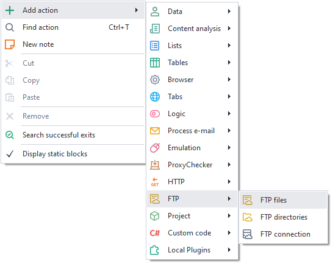
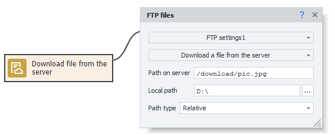
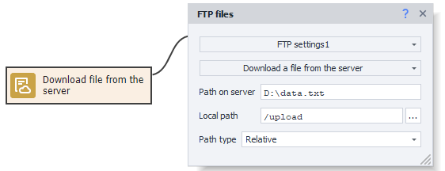
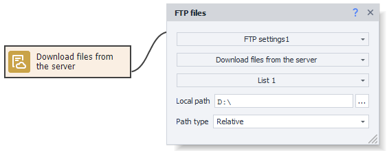
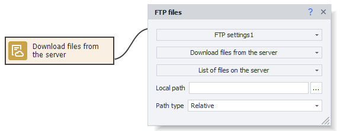
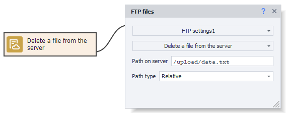
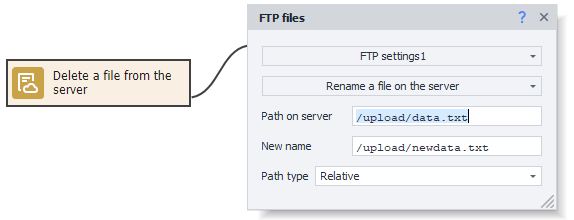
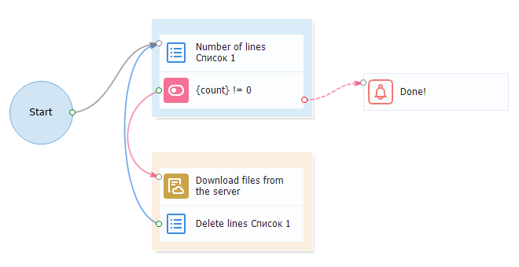

---
sidebar_position: 1
title: "FTP Files"
description: ""
date: "2025-08-04"
converted: true
originalFile: "Файлы FTP.txt"
targetUrl: "https://zennolab.atlassian.net/wiki/spaces/RU/pages/534315197/FTP"
---
import DisclaimerNotice from '@site/src/components/DisclaimerNotice';

<DisclaimerNotice />

> 🔗 **[Original page](https://zennolab.atlassian.net/wiki/spaces/RU/pages/534315197/FTP)** — Source of this material

_______________________________________________  

## Description

The “FTP Files” action is used to work with files on an FTP server. With this action, you can:

- Download a file from the server.
- Upload a file to the server.
- Download multiple files from the server.
- Upload multiple files to the server.
- Delete a file on the server.
- Rename a file on the server.

## How do I add the action to my project?

Via the context menu **Add action** → **FTP** → **FTP files**

Or you can use the [❗→ smart search](https://zennolab.atlassian.net/wiki/spaces/RU/pages/506200090/ProjectMaker+7#%D0%A3%D0%BC%D0%BD%D1%8B%D0%B9-%D0%BF%D0%BE%D0%B8%D1%81%D0%BA-%D0%B4%D0%B5%D0%B9%D1%81%D1%82%D0%B2%D0%B8%D0%B9 "https://zennolab.atlassian.net/wiki/spaces/RU/pages/506200090/ProjectMaker+7#%D0%A3%D0%BC%D0%BD%D1%8B%D0%B9-%D0%BF%D0%BE%D0%B8%D1%81%D0%BA-%D0%B4%D0%B5%D0%B9%D1%81%D1%82%D0%B2%D0%B8%D0%B9").

## What is it used for?

- Download project data files stored on the FTP server.
- Save your project data to the FTP server.
- Delete project data files from the FTP server.
- Rename files on the FTP server.

## How do I use the action?

To start using this action, you need to configure the FTP connection. How to do this is described in the article [❗→ FTP settings](https://zennolab.atlassian.net/wiki/spaces/RU/pages/534315484/FTP "https://zennolab.atlassian.net/wiki/spaces/RU/pages/534315484/FTP").

The action has the following main settings:

- Server path — the path to the required file on the server.
- Local path — the path on your computer where the downloaded file will be saved.
- Path type — Relative or absolute path on the server. If relative, the path is relative to the current folder; if absolute, the path is specified from the root of the system.

### Download a file from the server

Used to download a file from the server to your computer.

  

### Upload a file to the server

Used to upload a file from your computer to the server.

  

### Download multiple files from the server

Used to download several files from the server to your computer. You need to specify the file paths in a list. How to work with lists is described in the article [❗→ List](https://zennolab.atlassian.net/wiki/spaces/RU/pages/534053375 "https://zennolab.atlassian.net/wiki/spaces/RU/pages/534053375"). One line from the list is taken per cycle, containing the file path.

  

### Upload multiple files to the server

Used to upload several files from your computer to the server. You need to specify the file paths in a list. How to work with lists is described in the article [❗→ List](https://zennolab.atlassian.net/wiki/spaces/RU/pages/534053375 "https://zennolab.atlassian.net/wiki/spaces/RU/pages/534053375"). One line from the list is taken per cycle, containing the file path.

  

### Delete a file on the server

Used to delete a file on the server. You need to specify the file path.

  

### Rename a file on the server

Used when you need to rename a file on the server. You need to specify the file path and the new file name.

  

## Example usage

### Download files from FTP using a list

The list contains the paths to the files you need to download from the FTP server.

1. Get the number of lines in the list.
2. If the list is not empty, download a file from the FTP server according to the list.
3. Remove the line containing the downloaded file from the list.
4. Go back to the start of the cycle (step 1).
5. As soon as the number of lines becomes 0, display a notification that all files have been downloaded.

