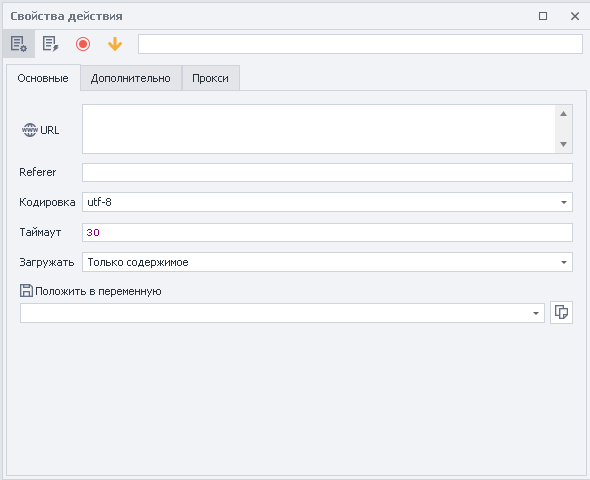
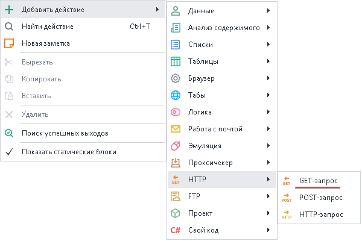
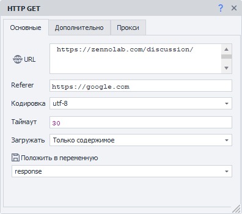
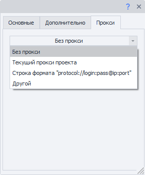
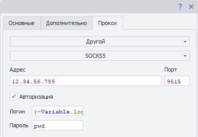
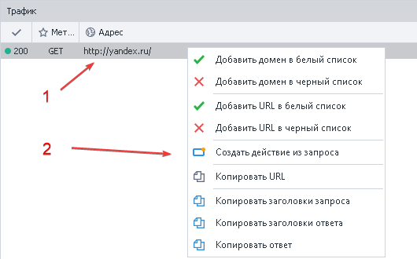
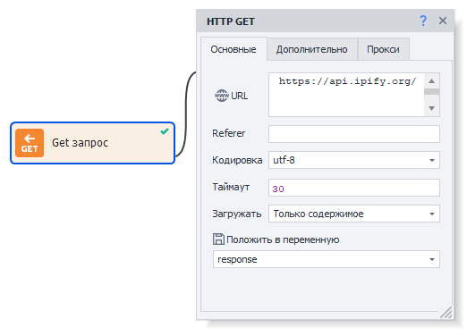

---
sidebar_position: 1
title: "GET request"
description: ""
date: "2025-08-04"
converted: true
originalFile: "GET-запрос.txt"
targetUrl: "https://zennolab.atlassian.net/wiki/spaces/RU/pages/534315165/GET-"
---
:::info **Please review the [*Terms of Use for materials on this resource*](../Disclaimer).**
:::

> 🔗 **[Original page](https://zennolab.atlassian.net/wiki/spaces/RU/pages/534315165/GET-)** — Source of this material

_______________________________________________  
# GET Request

  

## Description

ZennoPoster allows you to use [❗→ HTTP requests](https://zennolab.atlassian.net/wiki/spaces/RU/pages/534085713 "https://zennolab.atlassian.net/wiki/spaces/RU/pages/534085713") when working with various websites. You can retrieve data using **GET** requests, for example: search engine results, file downloads, data parsing, working with web service and application APIs.




  

## How do I add this action to my project?

Through the context menu **Add action** → **HTTP** → **GET request**




Or use the [❗→ smart search](https://zennolab.atlassian.net/wiki/spaces/RU/pages/506200090/ProjectMaker+7#%D0%A3%D0%BC%D0%BD%D1%8B%D0%B9-%D0%BF%D0%BE%D0%B8%D1%81%D0%BA-%D0%B4%D0%B5%D0%B9%D1%81%D1%82%D0%B2%D0%B8%D0%B9 "https://zennolab.atlassian.net/wiki/spaces/RU/pages/506200090/ProjectMaker+7#%D0%A3%D0%BC%D0%BD%D1%8B%D0%B9-%D0%BF%D0%BE%D0%B8%D1%81%D0%BA-%D0%B4%D0%B5%D0%B9%D1%81%D1%82%D0%B2%D0%B8%D0%B9").

  

## What is this used for?

- Running templates without a browser
- A quick way to get data from a website
- Downloading files
- Working with API services

  

## How to use the action: “Basic” tab




### URL

The website address the request will be sent to. You can use a [❗→ variable](https://zennolab.atlassian.net/wiki/spaces/RU/pages/486309922 "https://zennolab.atlassian.net/wiki/spaces/RU/pages/486309922").

### Referer

The [*Referer*](https://developer.mozilla.org/ru/docs/Web/HTTP/Headers/Referer "https://developer.mozilla.org/ru/docs/Web/HTTP/Headers/Referer") header contains the URL of the page from which the current page was accessed. The Referer header lets the server know where a request to the current page came from.
You can use [❗→ variable macros](https://zennolab.atlassian.net/wiki/spaces/RU/pages/486309922 "https://zennolab.atlassian.net/wiki/spaces/RU/pages/486309922").

### Encoding

The encoding the request will be sent in.

### Timeout

The maximum time to wait for a response from the website, in seconds. If this time is reached, the action will end with an error and follow the red branch.
You can use [❗→ variable macros](https://zennolab.atlassian.net/wiki/spaces/RU/pages/486309922 "https://zennolab.atlassian.net/wiki/spaces/RU/pages/486309922").

### Download

#### Only content

Only the response body will be saved to the variable

<details>
<summary>Sample response for https://httpbin.org/get</summary>

```json
{
  "args": {}, 
  "headers": {
    "Accept": "text/html,application/xhtml+xml,application/xml;q=0.9,image/avif,image/webp,image/apng,*/*;q=0.8,application/signed-exchange;v=b3;q=0.9", 
    "Accept-Encoding": "gzip, deflate", 
    "Accept-Language": "en-US,en;q=0.8", 
    "Host": "httpbin.org", 
    "Referer": "https://google.com", 
    "User-Agent": "Mozilla/5.0 (Windows NT 10.0; Win64; x64) AppleWebKit/537.36 (KHTML, like Gecko) Chrome/87.0.4280.141 Safari/537.36", 
    "X-Amzn-Trace-Id": "Root=1-26erb44t-465basaw0z2qwbji492yh5t3"
  }, 
  "origin": "1.2.3.4", 
  "url": "https://httpbin.org/get"
}
```

</details>
#### Only headers

Only the response headers will be saved

<details>
<summary>Sample response for https://httpbin.org/get</summary>
```text
HTTP/1.1 200 OK
Date: Sat, 23 May 2020 01:56:45 GMT
Content-Type: application/json
Content-Length: 613
Connection: keep-alive
Server: gunicorn/19.9.0
Access-Control-Allow-Origin: *
Access-Control-Allow-Credentials: true

```
</details>

#### Headers and content

Both the response headers and body will be saved to the variable. They’re separated by two blank lines.

<details>
<summary>Sample response for https://httpbin.org/get</summary>

```json
HTTP/1.1 200 OK
Date: Sat, 23 May 2020 01:56:45 GMT
Content-Type: application/json
Content-Length: 613
Connection: keep-alive
Server: gunicorn/19.9.0
Access-Control-Allow-Origin: 
Access-Control-Allow-Credentials: true

HTTP/1.1 200 OK
Date: Sat, 23 May 2020 01:56:45 GMT
Content-Type: application/json
Content-Length: 613
Connection: keep-alive
Server: gunicorn/19.9.0
Access-Control-Allow-Origin: *
Access-Control-Allow-Credentials: true


{
  "args": {}, 
  "headers": {
    "Accept": "text/html,application/xhtml+xml,application/xml;q=0.9,image/avif,image/webp,image/apng,*/*;q=0.8,application/signed-exchange;v=b3;q=0.9", 
    "Accept-Encoding": "gzip, deflate", 
    "Accept-Language": "en-US,en;q=0.8", 
    "Host": "httpbin.org", 
    "Referer": "https://google.com", 
    "User-Agent": "Mozilla/5.0 (Windows NT 10.0; Win64; x64) AppleWebKit/537.36 (KHTML, like Gecko) Chrome/87.0.4280.141 Safari/537.36", 
    "X-Amzn-Trace-Id": "Root=1-26erb44t-465basaw0z2qwbji492yh5t3"
  }, 
  "origin": "1.2.3.4", 
  "url": "https://httpbin.org/get"
}
```
</details>

#### As file

Select this mode if you want to download a file using the request.

The path to the downloaded file will be saved to the variable.

:::note Tip
By default, files are downloaded to the `Trash` folder in the installed ZennoPoster directory. The path may look like this - `C:\Program Files\ZennoLab\RU\ZennoPoster Pro V7\7.4.0.0\Progs\Trash\googlelogo_color_92x30dp.png`. You can change this path in the settings (globally for all projects), or via an action during template execution.
:::

#### As file + headers

The response headers and the path to the downloaded file will be saved to the variable.

### Save to variable

Here you need to select (or create a new) variable where the response result will be stored.

  

## How to use the action: “Advanced” tab


### Redirect

Enable redirect — if the server responds with a redirect code (for example 301 or 302), ZennoPoster will use the *Location* header to continue to the next page. You can set the maximum number of redirects: 0 — stay on the original page, 5 — allow up to 5 redirects to the final URL.

### Use original URL

Cancels encoding the URL from the "Basic" tab into urlencode.  
Example:  
*Original URL*: `https://ru.wikipedia.org/wiki/Приветствие`  
*By default*: `https://ru.wikipedia.org/wiki/%D0%9F%D1%80%D0%B8%D0%B2%D0%B5%D1%82%D1%81%D1%82%D0%B2%D0%B8%D0%B5`  

### Headers

#### Use default

The request will use default headers. Here’s how they look (for a request to `https://httpbin.org/get`, note that the `Host` header will change to match the request URL):

```text
Host: httpbin.org
User-Agent: Mozilla/5.0 (Windows NT 10.0; WOW64; rv:45.0) Gecko/20100101 Firefox/45.0
Accept: text/html,application/xhtml+xml,application/xml;q=0.9,*/*;q=0.8
Accept-Encoding: gzip, deflate
Accept-Language: en-US,en;q=0.5
```

#### Current profile

Headers from the current [❗→ project profile](https://zennolab.atlassian.net/wiki/spaces/RU/pages/483426308 "https://zennolab.atlassian.net/wiki/spaces/RU/pages/483426308") will be used.

#### Load from profile

You need to select a file or specify a [❗→ variable](https://zennolab.atlassian.net/wiki/spaces/RU/pages/486309922 "https://zennolab.atlassian.net/wiki/spaces/RU/pages/486309922") containing the path to the [❗→ profile](https://zennolab.atlassian.net/wiki/spaces/RU/pages/483426308 "https://zennolab.atlassian.net/wiki/spaces/RU/pages/483426308") from which headers for the request will be loaded.

#### Custom settings

Allows you to set each request header manually.

##### **Request headers**

:::warning Attention
The first line MUST always be User-Agent! All other headers come after that.
:::

- Each header starts on a new line.
- You can specify *static values*, your own [❗→ *variables*](https://zennolab.atlassian.net/wiki/spaces/RU/pages/486309922 "https://zennolab.atlassian.net/wiki/spaces/RU/pages/486309922"), or [❗→ *profile variables*](https://zennolab.atlassian.net/wiki/spaces/RU/pages/735608872#%D0%9F%D1%80%D0%BE%D1%84%D0%B8%D0%BB%D1%8C "https://zennolab.atlassian.net/wiki/spaces/RU/pages/735608872#%D0%9F%D1%80%D0%BE%D1%84%D0%B8%D0%BB%D1%8C").

##### **Cookie**


You can specify ready-made cookies or use a [❗→ variable](https://zennolab.atlassian.net/wiki/spaces/RU/pages/486309922 "https://zennolab.atlassian.net/wiki/spaces/RU/pages/486309922").

Format: `name=value`, multiple separated with `;` (semicolon). Example:

```text
user=1992103;session=f79fcadd847b80f9df78ba4fb276c867;id=889
```

:::note Tip
Starting with version 7.1.6.0 (5.45.0.0), this input field is only displayed if the "Use CookieContainer" option (see below) is disabled.
:::

##### **Use CookieContainer**

CookieContainer lets you sync cookies with the browser and between individual requests without having to parse or set them manually.

<details>
<summary>Example</summary>

The project works with a site using requests, but you need to be logged in for it to function. Let’s say the login process is too complicated to repeat via plain requests, so you use the browser mode to log in.

Then, you [❗→ turn off the browser](https://zennolab.atlassian.net/wiki/spaces/RU/pages/489324572#%D0%97%D0%B0%D0%BF%D1%83%D1%81%D1%82%D0%B8%D1%82%D1%8C-%D0%B8%D0%BD%D1%81%D1%82%D0%B0%D0%BD%D1%81 "https://zennolab.atlassian.net/wiki/spaces/RU/pages/489324572#%D0%97%D0%B0%D0%BF%D1%83%D1%81%D1%82%D0%B8%D1%82%D1%8C-%D0%B8%D0%BD%D1%81%D1%82%D0%B0%D0%BD%D1%81") and start working via requests. When you enable *Use CookieContainer*, cookies are automatically synced between the browser and your requests — you don’t have to do anything manually, cookies get set automatically.
If a request receives new cookie values from the server, these will also be synced automatically. So the next request or browser visit will use the updated cookies.

</details>
### Example: Custom settings

Using profile variables for headers and manually setting cookies.


* * *

## How to use the action: “Proxy” tab




### No proxy

The action uses the computer’s/server’s real IP.

### Project’s current proxy

Uses the [❗→ proxy set for the project](https://zennolab.atlassian.net/wiki/spaces/RU/pages/489324572#%D0%A3%D1%81%D1%82%D0%B0%D0%BD%D0%BE%D0%B2%D0%B8%D1%82%D1%8C-%D0%BF%D1%80%D0%BE%D0%BA%D1%81%D0%B8 "https://zennolab.atlassian.net/wiki/spaces/RU/pages/489324572#%D0%A3%D1%81%D1%82%D0%B0%D0%BD%D0%BE%D0%B2%D0%B8%D1%82%D1%8C-%D0%BF%D1%80%D0%BE%D0%BA%D1%81%D0%B8").

### String format


Specify the proxy in this format (you can use a [❗→ variable](https://zennolab.atlassian.net/wiki/spaces/RU/pages/486309922 "https://zennolab.atlassian.net/wiki/spaces/RU/pages/486309922")):  
a) *With authentication* — `socks5://login:password@ip:port` or `http://login:password@ip:port`  
b) *Without authentication* — `socks5://ip:port` or `http://ip:port`  
c) *No protocol specified* (http:// is used by default) — `login:password@ip:port` or `ip:port`  

### Other




Choose this option if you need to enter detailed proxy settings. Proxy type, authentication details, address and port. Ask your service provider for this information.

:::note Tip
You can use variables in any of the input fields.
:::

:::warning Attention
If you don’t specify the proxy protocol, http:// will be used by default.
:::

  

## Creating actions from traffic monitor requests

:::info Info
Added in ZennoPoster 7.1.5.0 (5.44.0.0)
:::

You can create an HTTP request right from the [❗→ Traffic Window](https://zennolab.atlassian.net/wiki/spaces/RU/pages/735805465 "https://zennolab.atlassian.net/wiki/spaces/RU/pages/735805465").




1. Hover your cursor over the desired request and right-click to bring up the context menu.
2. Click *Create action from request*.

A fully filled HTTP request action will appear on the project canvas.


Change any static values or replace them with variables — the action is completely ready to use.

  

## Disabling the browser

If you only work with requests, you can turn off the browser and save computer resources. You can do this either in the [❗→ project settings](https://zennolab.atlassian.net/wiki/spaces/RU/pages/534315477#%D0%9D%D0%B5-%D0%B8%D1%81%D0%BF%D0%BE%D0%BB%D1%8C%D0%B7%D0%BE%D0%B2%D0%B0%D1%82%D1%8C-%D0%B1%D1%80%D0%B0%D1%83%D0%B7%D0%B5%D1%80 "https://zennolab.atlassian.net/wiki/spaces/RU/pages/534315477#%D0%9D%D0%B5-%D0%B8%D1%81%D0%BF%D0%BE%D0%BB%D1%8C%D0%B7%D0%BE%D0%B2%D0%B0%D1%82%D1%8C-%D0%B1%D1%80%D0%B0%D1%83%D0%B7%D0%B5%D1%80"), or using the [❗→ Browser Settings](https://zennolab.atlassian.net/wiki/spaces/RU/pages/489324572#%D0%97%D0%B0%D0%BF%D1%83%D1%81%D1%82%D0%B8%D1%82%D1%8C-%D0%B8%D0%BD%D1%81%D1%82%D0%B0%D0%BD%D1%81 "https://zennolab.atlassian.net/wiki/spaces/RU/pages/489324572#%D0%97%D0%B0%D0%BF%D1%83%D1%81%D1%82%D0%B8%D1%82%D1%8C-%D0%B8%D0%BD%D1%81%D1%82%D0%B0%D0%BD%D1%81") action.


  

## Request sending method

ZennoPoster has two ways of processing requests — a third-party implementation (standard method, using the Chilkat library) and a built-in implementation (alternative method). If you have issues with HTTP requests using the standard method, try switching to the alternative method.

You can change the request method in the [❗→ program settings](https://zennolab.atlassian.net/wiki/spaces/RU/pages/809074766#%D0%98%D1%81%D0%BF%D0%BE%D0%BB%D1%8C%D0%B7%D0%BE%D0%B2%D0%B0%D1%82%D1%8C-%D0%B0%D0%BB%D1%8C%D1%82%D0%B5%D1%80%D0%BD%D0%B0%D1%82%D0%B8%D0%B2%D0%BD%D1%8B%D0%B9-%D1%81%D0%BF%D0%BE%D1%81%D0%BE%D0%B1-%D0%BF%D0%B5%D1%80%D0%B5%D0%B4%D0%B0%D1%87%D0%B8-HTTP-%D0%B7%D0%B0%D0%BF%D1%80%D0%BE%D1%81%D0%BE%D0%B2 "https://zennolab.atlassian.net/wiki/spaces/RU/pages/809074766#%D0%98%D1%81%D0%BF%D0%BE%D0%BB%D1%8C%D0%B7%D0%BE%D0%B2%D0%B0%D1%82%D1%8C-%D0%B0%D0%BB%D1%8C%D1%82%D0%B5%D1%80%D0%BD%D0%B0%D1%82%D0%B8%D0%B2%D0%BD%D1%8B%D0%B9-%D1%81%D0%BF%D0%BE%D1%81%D0%BE%D0%B1-%D0%BF%D0%B5%D1%80%D0%B5%D0%B4%D0%B0%D1%87%D0%B8-HTTP-%D0%B7%D0%B0%D0%BF%D1%80%D0%BE%D1%81%D0%BE%D0%B2") (globally for all projects) or in the [❗→ settings for a specific project](https://zennolab.atlassian.net/wiki/spaces/RU/pages/534315477#%D0%9D%D0%B0%D1%81%D1%82%D1%80%D0%BE%D0%B9%D0%BA%D0%B8-HTTP "https://zennolab.atlassian.net/wiki/spaces/RU/pages/534315477#%D0%9D%D0%B0%D1%81%D1%82%D1%80%D0%BE%D0%B9%D0%BA%D0%B8-HTTP").


  

## Usage example

Let’s find out the IP address the project is using. 
To do this, just make a GET request to `https://api.ipify.org/` and on the *Proxy* tab, select *Project’s current proxy*.




  

## Useful links

- [❗→ Project settings](https://zennolab.atlassian.net/wiki/spaces/RU/pages/534315477 "https://zennolab.atlassian.net/wiki/spaces/RU/pages/534315477")
- [❗→ POST request](https://zennolab.atlassian.net/wiki/spaces/RU/pages/534315180/POST- "https://zennolab.atlassian.net/wiki/spaces/RU/pages/534315180/POST-")
- [❗→ HTTP request](https://zennolab.atlassian.net/wiki/spaces/RU/pages/489259052 "https://zennolab.atlassian.net/wiki/spaces/RU/pages/489259052")
- [❗→ Working with JSON and XML](https://zennolab.atlassian.net/wiki/spaces/RU/pages/488964124 "https://zennolab.atlassian.net/wiki/spaces/RU/pages/488964124")
- [❗→ Text processing](https://zennolab.atlassian.net/wiki/spaces/RU/pages/488865793 "https://zennolab.atlassian.net/wiki/spaces/RU/pages/488865793")
- [❗→ Traffic Window](https://zennolab.atlassian.net/wiki/spaces/RU/pages/735805465 "https://zennolab.atlassian.net/wiki/spaces/RU/pages/735805465")
- [❗→ Web Developer Tools (DevTools)](https://zennolab.atlassian.net/wiki/spaces/RU/pages/1331134465 "https://zennolab.atlassian.net/wiki/spaces/RU/pages/1331134465")