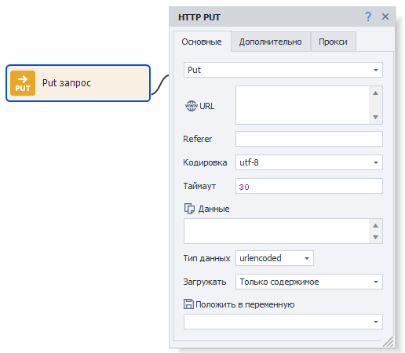
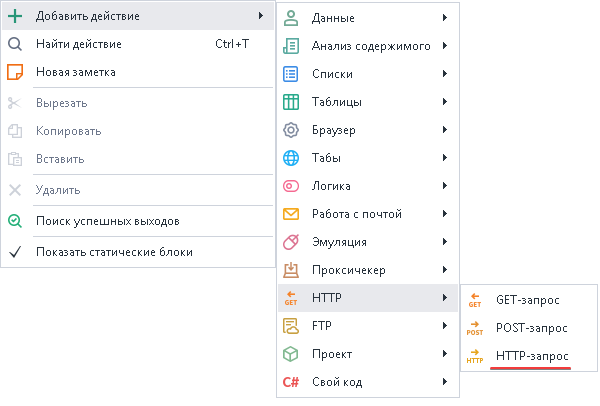
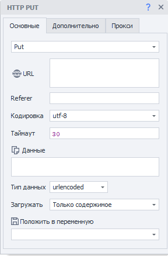
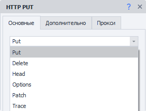
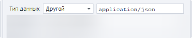
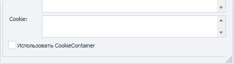
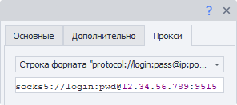
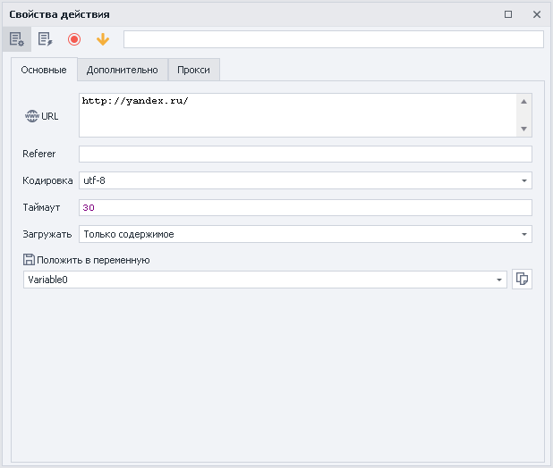
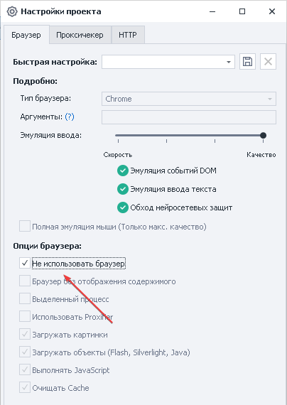
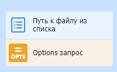

---
sidebar_position: 3
title: "HTTP Request"
description: ""
date: "2025-08-04"
converted: true
originalFile: "HTTP-запрос.txt"
targetUrl: "https://zennolab.atlassian.net/wiki/spaces/RU/pages/489259052/HTTP-"
---
:::info **Please review the [*Terms of Use for materials on this resource*](../Disclaimer).**
:::

> 🔗 **[Original page](https://zennolab.atlassian.net/wiki/spaces/RU/pages/489259052/HTTP-)** — Source of this material

_______________________________________________  
# HTTP Request

## Description

You can create any type of HTTP request: **Put**, **Delete**, **Head**, **Options**, **Patch**, **Trace**.  
For POST and GET requests, there are separate actions - [POST request](/wiki/pages/resumedraft.action?draftId=534315180 "/wiki/pages/resumedraft.action?draftId=534315180") and [❗→ GET request](https://zennolab.atlassian.net/wiki/spaces/RU/pages/534315165 "https://zennolab.atlassian.net/wiki/spaces/RU/pages/534315165")



## How to Add the Action to Your Project

Through the context menu **Add action** → **HTTP** → **HTTP Request**



Or you can use the [❗→ smart search](https://zennolab.atlassian.net/wiki/spaces/RU/pages/506200090/ProjectMaker+7#%D0%A3%D0%BC%D0%BD%D1%8B%D0%B9-%D0%BF%D0%BE%D0%B8%D1%81%D0%BA-%D0%B4%D0%B5%D0%B9%D1%81%D1%82%D0%B2%D0%B8%D0%B9 "https://zennolab.atlassian.net/wiki/spaces/RU/pages/506200090/ProjectMaker+7#%D0%A3%D0%BC%D0%BD%D1%8B%D0%B9-%D0%BF%D0%BE%D0%B8%D1%81%D0%BA-%D0%B4%D0%B5%D0%B9%D1%81%D1%82%D0%B2%D0%B8%D0%B9").

## What Is It Used For?

- Running the project without a browser
- Sending data to a resource
- Uploading files to a server
- Getting data from a website
- Working with API services

## How to Work with the Action: "Main" Tab



### Request Type



Select the required request from the list:

**Put**    **Delete**    **Head**  
**Options**  **Patch**    **Trace**

### URL

The address of the site to which the request will be sent. You may use a [❗→ variable](https://zennolab.atlassian.net/wiki/spaces/RU/pages/486309922 "https://zennolab.atlassian.net/wiki/spaces/RU/pages/486309922").

### Referer

The request header [*Referer](https://developer.mozilla.org/ru/docs/Web/HTTP/Headers/Referer "https://developer.mozilla.org/ru/docs/Web/HTTP/Headers/Referer") contains the URL of the source page from which the link to the current page was followed. The *Referer header allows the server to know where the request to the current page came from.  
You can use [❗→ variable macros](https://zennolab.atlassian.net/wiki/spaces/RU/pages/486309922 "https://zennolab.atlassian.net/wiki/spaces/RU/pages/486309922").

### Encoding

The encoding in which the request will be sent.

### Timeout

The maximum waiting time for a response from the site, in seconds. If the specified time is reached, the action will end with an error and exit via the red branch.  
You can use [❗→ variable macros](https://zennolab.atlassian.net/wiki/spaces/RU/pages/486309922 "https://zennolab.atlassian.net/wiki/spaces/RU/pages/486309922").

### Data

The content of the request.

### Data Type

Here you need to select what kind of data will be sent by this request. The value selected here is passed as the [Content-Type](https://developer.mozilla.org/ru/docs/Web/HTTP/Headers/Content-Type "https://developer.mozilla.org/ru/docs/Web/HTTP/Headers/Content-Type") header.

#### urlencoded

Use this when sending text information to the server, where in the *Data field you specify info in the format `parameterName1=value1&parameterName2=value2`

:::note Note
`Content-Type: application/x-www-form-urlencoded`
:::

#### multipart

This type should be chosen when you are sending binary data (files) to the server through the request.

:::note Note
`Content-Type: multipart/form-data`
:::

#### Other

You can specify a different data type if the ones above don't fit.

For example, to interact with the [CapMonster Cloud](https://zennolab.atlassian.net/wiki/pages/createpage.action?spaceKey=APIS&amp;title=%F0%9F%94%B5%20%D0%A0%D1%83%D1%81%D1%81%D0%BA%D0%B0%D1%8F%20%D0%B2%D0%B5%D1%80%D1%81%D0%B8%D1%8F%20%D0%B4%D0%BE%D0%BA%D1%83%D0%BC%D0%B5%D0%BD%D1%82%D0%B0%D1%86%D0%B8%D0%B8 "https://zennolab.atlassian.net/wiki/pages/createpage.action?spaceKey=APIS&amp;title=%F0%9F%94%B5%20%D0%A0%D1%83%D1%81%D1%81%D0%BA%D0%B0%D1%8F%20%D0%B2%D0%B5%D1%80%D1%81%D0%B8%D1%8F%20%D0%B4%D0%BE%D0%BA%D1%83%D0%BC%D0%B5%D0%BD%D1%82%D0%B0%D1%86%D0%B8%D0%B8") API, you need to send data in a POST request as JSON. To do this, select *Other from the dropdown and enter `application/json` in the field that appears.



### Download

#### Only Content

Only the response body will be saved to the variable.

#### Only Headers

Only the response headers will be saved.

#### Headers and Content

Both the response headers and the body will be saved to the variable, separated by two empty lines.

#### As a File

The variable will store the path to the file.

:::note Note
By default, files are downloaded into the `Trash` folder in the ZennoPoster installation directory. The path may look like this:  
`C:\Program Files\ZennoLab\RU\ZennoPoster Pro V7\7.4.0.0\Progs\Trash\googlelogo\_color\_92x30dp.png`.  
You can change this path in the settings, globally for all projects, or using the action while running a template.
:::

#### As a File + Headers

The variable will store both the response headers and the path to the downloaded file.

#### Save to Variable

Here, you need to select (or create a new) variable where the request result will be saved.

## How to Work with the Action: "Advanced" Tab


### Redirect

Enable redirection - if the response to the request contains a redirect code (e.g., 301, 302), ZennoPoster, using the *Location header, will follow to the next page. Use numbers to set the maximum number of redirects: 0 - stay on the original page, 5 - max number of hops to the final URL.

### Use Original URL

Disables URL encoding from the "Main" tab to urlencode.  
Example:  
*Original url*: `https://ru.wikipedia.org/wiki/Приветствие`  
*By default*: `https://ru.wikipedia.org/wiki/%D0%9F%D1%80%D0%B8%D0%B2%D0%B5%D1%82%D1%81%D1%82%D0%B2%D0%B8%D0%B5`  

### Headers

#### Use Default

Default headers will be inserted into the request.  
Here's how they look (example for a request to `https://httpbin.org/get`, the `Host` header will change depending on the URL in the request):

```text
Host: httpbin.org
User-Agent: Mozilla/5.0 (Windows NT 10.0; WOW64; rv:45.0) Gecko/20100101 Firefox/45.0
Accept: text/html,application/xhtml+xml,application/xml;q=0.9,/;q=0.8
Accept-Encoding: gzip, deflate
Accept-Language: en-US,en;q=0.5
```

#### Current Profile

Headers from the current [❗→ project profile](https://zennolab.atlassian.net/wiki/spaces/RU/pages/483426308 "https://zennolab.atlassian.net/wiki/spaces/RU/pages/483426308") will be inserted.

#### Load from Profile

You need to select a file or specify a [❗→ variable](https://zennolab.atlassian.net/wiki/spaces/RU/pages/486309922 "https://zennolab.atlassian.net/wiki/spaces/RU/pages/486309922") containing the path to a [❗→ profile](https://zennolab.atlassian.net/wiki/spaces/RU/pages/483426308 "https://zennolab.atlassian.net/wiki/spaces/RU/pages/483426308") from which headers for the request will be loaded.

#### Custom Settings

Allows you to specify each request header parameter manually.

##### **Request Headers**

:::warning Attention
The first line must always (⚠) be the User-Agent! Only after that list other headers.
:::

- Each header starts on a new line.
- You can specify *static values, your own [❗→ *variables](https://zennolab.atlassian.net/wiki/spaces/RU/pages/486309922 "https://zennolab.atlassian.net/wiki/spaces/RU/pages/486309922") or [❗→ *profile variables](https://zennolab.atlassian.net/wiki/spaces/RU/pages/735608872#%D0%9F%D1%80%D0%BE%D1%84%D0%B8%D0%BB%D1%8C "https://zennolab.atlassian.net/wiki/spaces/RU/pages/735608872#%D0%9F%D1%80%D0%BE%D1%84%D0%B8%D0%BB%D1%8C").

##### **Cookie**



You can specify ready cookies or from a [❗→ variable](https://zennolab.atlassian.net/wiki/spaces/RU/pages/486309922 "https://zennolab.atlassian.net/wiki/spaces/RU/pages/486309922").

Format: `name=value` , multiple separated by `;` (semicolon). Example:

```text
user=1992103;session=f79fcadd847b80f9df78ba4fb276c867;id=889
```

:::note Note
Starting from version 7.1.6.0 (5.45.0.0), this input field is visible only if the *Use CookieContainer* setting (described below) is disabled.
:::

##### **Use CookieContainer**

CookieContainer allows you to sync cookies with the browser and between separate requests, without manual parsing and inserting.

<details>
<summary>Example</summary>

A project works with a website using requests, but needs to be logged in. Suppose the authentication process is so complex it's easier to log in using browser mode.

Then you [❗→ disable the browser](https://zennolab.atlassian.net/wiki/spaces/RU/pages/489324572#%D0%97%D0%B0%D0%BF%D1%83%D1%81%D1%82%D0%B8%D1%82%D1%8C-%D0%B8%D0%BD%D1%81%D1%82%D0%B0%D0%BD%D1%81 "https://zennolab.atlassian.net/wiki/spaces/RU/pages/489324572#%D0%97%D0%B0%D0%BF%D1%83%D1%81%D1%82%D0%B8%D1%82%D1%8C-%D0%B8%D0%BD%D1%81%D1%82%D0%B0%D0%BD%D1%81") and start working with the site via requests. If you enable *Use CookieContainer*, cookies will automatically be synchronized between the browser and requests — you do not have to do anything manually — cookies will be inserted automatically.  
If the site returns a new value for any cookie in a request, that new value will be synced automatically. On subsequent requests (or when opening the site in the built-in browser), the updated value will be used.

</details>
### Example of Custom Settings

Using profile variables for headers and manual insertion of cookies.


## How to Work with the Action: "Proxy" Tab


### No Proxy

The action works using the real IP of your computer/server.

### Current Project Proxy

Uses the [❗→ proxy set in the project](https://zennolab.atlassian.net/wiki/spaces/RU/pages/489324572#%D0%A3%D1%81%D1%82%D0%B0%D0%BD%D0%BE%D0%B2%D0%B8%D1%82%D1%8C-%D0%BF%D1%80%D0%BE%D0%BA%D1%81%D0%B8 "https://zennolab.atlassian.net/wiki/spaces/RU/pages/489324572#%D0%A3%D1%81%D1%82%D0%B0%D0%BD%D0%BE%D0%B2%D0%B8%D1%82%D1%8C-%D0%BF%D1%80%D0%BE%D0%BA%D1%81%D0%B8").

### String Format



Indicate the proxy in the format (you can specify a [❗→ variable](https://zennolab.atlassian.net/wiki/spaces/RU/pages/486309922 "https://zennolab.atlassian.net/wiki/spaces/RU/pages/486309922")):  
a) *With authentication* — `socks5://login:password@ip:port` or `http://login:password@ip:port`  
b) *Without authentication* — `socks5://ip:port` or `http://ip:port`  
c) *No protocol specified* (by default, http:// will be used) – `login:password@ip:port` or `ip:port`  

### Other


Choose if you need to specify detailed proxy settings: proxy type, authentication data, address, and port. Check these details with your service provider.

:::note Note
Variables can be used in all input fields.
:::

:::warning Attention
If the protocol is not specified for the proxy, http:// will be used by default.
:::

## Creating Actions from Requests in the Traffic Monitor

:::info Info
Added in ZennoPoster 7.1.5.0 (5.44.0.0)
:::

You can create a ready-to-use HTTP request directly from the [❗→ Traffic Window](https://zennolab.atlassian.net/wiki/spaces/RU/pages/735805465 "https://zennolab.atlassian.net/wiki/spaces/RU/pages/735805465").


1. Hover over the needed request and right-click to open the context menu.
2. Click *Create action from request*.

A fully filled-in HTTP Request action will appear on the project canvas.




Change static values or replace with variables — the action is fully ready to use.

* * *

## Disabling the Browser

If you are working exclusively via requests, you can disable the browser to save computer resources. You can do this in the [❗→ project settings](https://zennolab.atlassian.net/wiki/spaces/RU/pages/534315477#%D0%9D%D0%B5-%D0%B8%D1%81%D0%BF%D0%BE%D0%BB%D1%8C%D0%B7%D0%BE%D0%B2%D0%B0%D1%82%D1%8C-%D0%B1%D1%80%D0%B0%D1%83%D0%B7%D0%B5%D1%80 "https://zennolab.atlassian.net/wiki/spaces/RU/pages/534315477#%D0%9D%D0%B5-%D0%B8%D1%81%D0%BF%D0%BE%D0%BB%D1%8C%D0%B7%D0%BE%D0%B2%D0%B0%D1%82%D1%8C-%D0%B1%D1%80%D0%B0%D1%83%D0%B7%D0%B5%D1%80") or using the [❗→ Browser Settings](https://zennolab.atlassian.net/wiki/spaces/RU/pages/489324572#%D0%97%D0%B0%D0%BF%D1%83%D1%81%D1%82%D0%B8%D1%82%D1%8C-%D0%B8%D0%BD%D1%81%D1%82%D0%B0%D0%BD%D1%81 "https://zennolab.atlassian.net/wiki/spaces/RU/pages/489324572#%D0%97%D0%B0%D0%BF%D1%83%D1%81%D1%82%D0%B8%D1%82%D1%8C-%D0%B8%D0%BD%D1%81%D1%82%D0%B0%D0%BD%D1%81") action.



* * *

## Request Sending Method

ZennoPoster has two methods of working with requests — external (standard method, using the Chilkat library) and built-in (alternative method). If something doesn't work as expected with HTTP requests using the standard method, try switching to the alternative method.

You can change the request sending method in the [❗→ program settings](https://zennolab.atlassian.net/wiki/spaces/RU/pages/809074766#%D0%98%D1%81%D0%BF%D0%BE%D0%BB%D1%8C%D0%B7%D0%BE%D0%B2%D0%B0%D1%82%D1%8C-%D0%B0%D0%BB%D1%8C%D1%82%D0%B5%D1%80%D0%BD%D0%B0%D1%82%D0%B8%D0%B2%D0%BD%D1%8B%D0%B9-%D1%81%D0%BF%D0%BE%D1%81%D0%BE%D0%B1-%D0%BF%D0%B5%D1%80%D0%B5%D0%B4%D0%B0%D1%87%D0%B8-HTTP-%D0%B7%D0%B0%D0%BF%D1%80%D0%BE%D1%81%D0%BE%D0%B2 "https://zennolab.atlassian.net/wiki/spaces/RU/pages/809074766#%D0%98%D1%81%D0%BF%D0%BE%D0%BB%D1%8C%D0%B7%D0%BE%D0%B2%D0%B0%D1%82%D1%8C-%D0%B0%D0%BB%D1%8C%D1%82%D0%B5%D1%80%D0%BD%D0%B0%D1%82%D0%B8%D0%B2%D0%BD%D1%8B%D0%B9-%D1%81%D0%BF%D0%BE%D1%81%D0%BE%D0%B1-%D0%BF%D0%B5%D1%80%D0%B5%D0%B4%D0%B0%D1%87%D0%B8-HTTP-%D0%B7%D0%B0%D0%BF%D1%80%D0%BE%D1%81%D0%BE%D0%B2") (globally for all projects) or in the [❗→ specific project settings](https://zennolab.atlassian.net/wiki/spaces/RU/pages/534315477#%D0%9D%D0%B0%D1%81%D1%82%D1%80%D0%BE%D0%B9%D0%BA%D0%B8-HTTP "https://zennolab.atlassian.net/wiki/spaces/RU/pages/534315477#%D0%9D%D0%B0%D1%81%D1%82%D1%80%D0%BE%D0%B9%D0%BA%D0%B8-HTTP").


* * *

## Example Usage

Uploading a file to Mail Cloud



1. Select a file.
2. Add the HTTP Request action.
3. Specify the Options transfer method.
4. Fill in the fields and tabs of the block.
5. Send the file to the server.

* * *

## Useful Links

- [❗→ Project Settings](https://zennolab.atlassian.net/wiki/spaces/RU/pages/534315477 "https://zennolab.atlassian.net/wiki/spaces/RU/pages/534315477")
- [❗→ GET Request](https://zennolab.atlassian.net/wiki/spaces/RU/pages/534315165/GET- "https://zennolab.atlassian.net/wiki/spaces/RU/pages/534315165/GET-")
- [❗→ POST Request](https://zennolab.atlassian.net/wiki/spaces/RU/pages/534315180/POST- "https://zennolab.atlassian.net/wiki/spaces/RU/pages/534315180/POST-")
- [❗→ Working with JSON and XML](https://zennolab.atlassian.net/wiki/spaces/RU/pages/488964124 "https://zennolab.atlassian.net/wiki/spaces/RU/pages/488964124")
- [❗→ Working with Text](https://zennolab.atlassian.net/wiki/spaces/RU/pages/488865793 "https://zennolab.atlassian.net/wiki/spaces/RU/pages/488865793")
- [❗→ Traffic Window](https://zennolab.atlassian.net/wiki/spaces/RU/pages/735805465 "https://zennolab.atlassian.net/wiki/spaces/RU/pages/735805465")
- [❗→ Web Developer Tools (DevTools)](https://zennolab.atlassian.net/wiki/spaces/RU/pages/1331134465 "https://zennolab.atlassian.net/wiki/spaces/RU/pages/1331134465")