---
sidebar_position: 2
title: "POST Request"
description: ""
date: "2025-08-04"
converted: true
originalFile: "POST-запрос.txt"
targetUrl: "https://zennolab.atlassian.net/wiki/spaces/RU/pages/534315180/POST-"
---
:::info **Please take a look at the [*Terms of Use for materials on this resource*](../Disclaimer).**
:::

> 🔗 **[Original page](https://zennolab.atlassian.net/wiki/spaces/RU/pages/534315180/POST-)** — Source of this material

_______________________________________________  

## Description

ZennoPoster allows you to use [❗→ HTTP requests](https://zennolab.atlassian.net/wiki/spaces/RU/pages/534085713 "https://zennolab.atlassian.net/wiki/spaces/RU/pages/534085713") when working with various websites. You can send data using **POST** requests: submit registration data to a website, work with web service and application APIs, and perform many other actions on the web without using a browser, which can significantly reduce resource consumption and speed up execution.

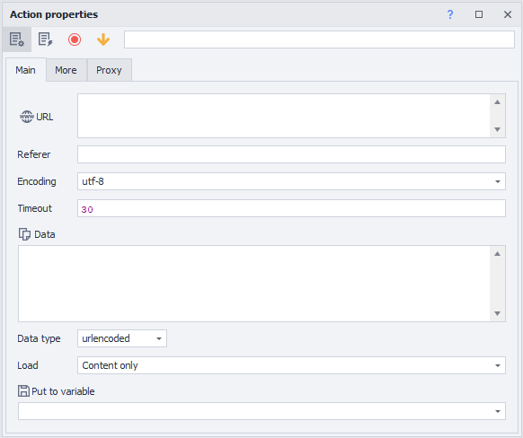


  

## How to add an action to a project?

Through the context menu **Add action** → **HTTP** → **POST request**

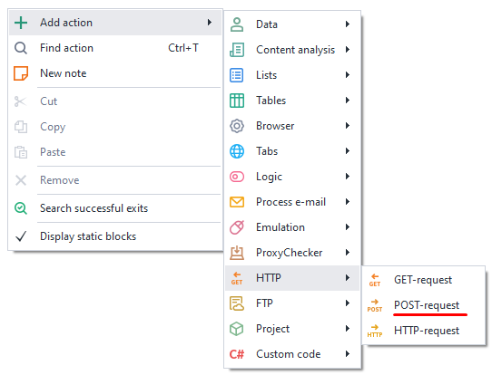


Or use the [❗→ smart search](https://zennolab.atlassian.net/wiki/spaces/RU/pages/506200090/ProjectMaker+7#%D0%A3%D0%BC%D0%BD%D1%8B%D0%B9-%D0%BF%D0%BE%D0%B8%D1%81%D0%BA-%D0%B4%D0%B5%D0%B9%D1%81%D1%82%D0%B2%D0%B8%D0%B9 "https://zennolab.atlassian.net/wiki/spaces/RU/pages/506200090/ProjectMaker+7#%D0%A3%D0%BC%D0%BD%D1%8B%D0%B9-%D0%BF%D0%BE%D0%B8%D1%81%D0%BA-%D0%B4%D0%B5%D0%B9%D1%81%D1%82%D0%B2%D0%B8%D0%B9").

## What can this be used for?

- Template work without a browser
- Uploading files to a server
- Sending data to a website quickly
- Working with API services
- Registering on websites

## Working with the action: “Basic” tab

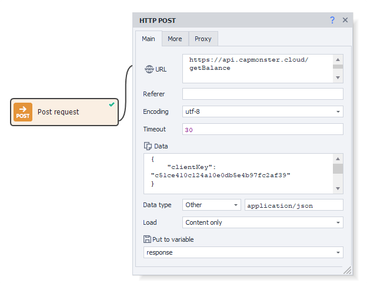


### URL

The website address to which the request will be sent. You can use a [❗→ variable](https://zennolab.atlassian.net/wiki/spaces/RU/pages/486309922 "https://zennolab.atlassian.net/wiki/spaces/RU/pages/486309922").

### Referer

The request header [*Referer](https://developer.mozilla.org/ru/docs/Web/HTTP/Headers/Referer "https://developer.mozilla.org/ru/docs/Web/HTTP/Headers/Referer") contains the URL of the page from which you navigated to the current page. The *Referer header allows the server to know where the request came from.
You can use [❗→ variable macros](https://zennolab.atlassian.net/wiki/spaces/RU/pages/486309922 "https://zennolab.atlassian.net/wiki/spaces/RU/pages/486309922").

### Encoding

The encoding in which the request will be sent.

### Timeout

The maximum wait time (in seconds) for a response from the site. If this time is reached, the action will end with an error and follow the red branch.
You can use [❗→ variable macros](https://zennolab.atlassian.net/wiki/spaces/RU/pages/486309922 "https://zennolab.atlassian.net/wiki/spaces/RU/pages/486309922").

### Data

The content of the request.

### Data type

Here, you need to select what kind of data will be sent with this request. The selected value is sent as the [Content-Type](https://developer.mozilla.org/ru/docs/Web/HTTP/Headers/Content-Type "https://developer.mozilla.org/ru/docs/Web/HTTP/Headers/Content-Type") header.

#### urlencoded

Use this when you are sending text information to the server, indicated in the *Data field in the format `parametername1=value1&parametername2=value2`

:::note Note
`Content-Type: application/x-www-form-urlencoded`
:::

#### multipart

Select this type when you are sending binary data (files) to the server using the request.

:::note Note
`Content-Type: multipart/form-data`
:::

#### Other

You can specify a different data type if the options above are not suitable.

For example, for integration with the [CapMonster Cloud](https://zennolab.atlassian.net/wiki/pages/createpage.action?spaceKey=APIS&amp;title=%F0%9F%94%B5%20%D0%A0%D1%83%D1%81%D1%81%D0%BA%D0%B0%D1%8F%20%D0%B2%D0%B5%D1%80%D1%81%D0%B8%D1%8F%20%D0%B4%D0%BE%D0%BA%D1%83%D0%BC%D0%B5%D0%BD%D1%82%D0%B0%D1%86%D0%B8%D0%B8 "https://zennolab.atlassian.net/wiki/pages/createpage.action?spaceKey=APIS&amp;title=%F0%9F%94%B5%20%D0%A0%D1%83%D1%81%D1%81%D0%BA%D0%B0%D1%8F%20%D0%B2%D0%B5%D1%80%D1%81%D0%B8%D1%8F%20%D0%B4%D0%BE%D0%BA%D1%83%D0%BC%D0%B5%D0%BD%D1%82%D0%B0%D1%86%D0%B8%D0%B8") API, you need to send POST request data as JSON. To do this, select *Other from the drop-down list and enter `application/json` in the field that appears.

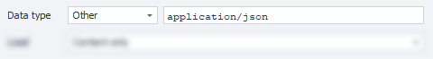


### Download

#### Only content

Only the body of the response will be saved to the variable.

#### Only headers

Only the response headers will be saved.

#### Headers and content

Both the response headers and its body will be saved to the variable. They will be separated by two empty lines.

#### As file

The variable will store the path to the file.

:::note Note
By default, files are downloaded to the `Trash` folder in the ZennoPoster installation directory. The path might look like this: `C:\Program Files\ZennoLab\RU\ZennoPoster Pro V7\7.4.0.0\Progs\Trash\googlelogo\_color\_92x30dp.png`. You can change this path in the settings, globally for all projects, or with an action during template execution.
:::

#### As file + headers

The variable will store the response headers and the path to the downloaded file.

#### Save to variable

Here you need to select (or create a new) variable to store the result of the request.

  

## Working with the action: “Advanced” tab

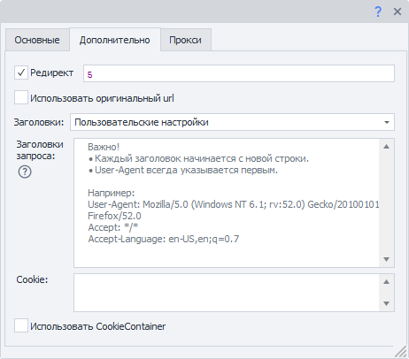


### Redirect

Enable redirection: if the response contains a redirect code (e.g., 301, 302), ZennoPoster will use the *Location* header to proceed to the next page. Enter the maximum number of redirects allowed: 0 — stay on the original page, 5 — number of redirects to the final URL.

### Use original URL

Disables URL encoding from the "Basic" tab to urlencode.  
Example:  
*Original url*: `https://ru.wikipedia.org/wiki/Приветствие`  
*By default*: `https://ru.wikipedia.org/wiki/%D0%9F%D1%80%D0%B8%D0%B2%D0%B5%D1%82%D1%81%D1%82%D0%B2%D0%B8%D0%B5`  

### Headers

#### Use default

Default headers will be added to the request. Here’s what they look like (using a request to `https://httpbin.org/get` as an example, the `Host` header will change depending on the URL used in the request)

```text
Host: httpbin.org
User-Agent: Mozilla/5.0 (Windows NT 10.0; WOW64; rv:45.0) Gecko/20100101 Firefox/45.0
Accept: text/html,application/xhtml+xml,application/xml;q=0.9,/;q=0.8
Accept-Encoding: gzip, deflate
Accept-Language: en-US,en;q=0.5
```

#### 
Current profile

Headers from the current [❗→ project profile](https://zennolab.atlassian.net/wiki/spaces/RU/pages/483426308 "https://zennolab.atlassian.net/wiki/spaces/RU/pages/483426308") will be used.

#### Load from profile

You need to select a file or specify a [❗→ variable](https://zennolab.atlassian.net/wiki/spaces/RU/pages/486309922 "https://zennolab.atlassian.net/wiki/spaces/RU/pages/486309922") containing the path to the [❗→ profile](https://zennolab.atlassian.net/wiki/spaces/RU/pages/483426308 "https://zennolab.atlassian.net/wiki/spaces/RU/pages/483426308") from which the headers for the request will be loaded.

#### Custom settings

Allows you to specify each request header parameter yourself.

##### **Request headers**

:::warning Attention
The first line must always (⚠) be the User-Agent string! Only then can you specify other headers.
:::

- Each header starts on a new line.  
- You can specify *static values, your own [❗→ *variables](https://zennolab.atlassian.net/wiki/spaces/RU/pages/486309922 "https://zennolab.atlassian.net/wiki/spaces/RU/pages/486309922"), or [❗→ *profile variables](https://zennolab.atlassian.net/wiki/spaces/RU/pages/735608872#%D0%9F%D1%80%D0%BE%D1%84%D0%B8%D0%BB%D1%8C "https://zennolab.atlassian.net/wiki/spaces/RU/pages/735608872#%D0%9F%D1%80%D0%BE%D1%84%D0%B8%D0%BB%D1%8C").

##### **Cookie**


You can provide cookies directly or use a [❗→ variable](https://zennolab.atlassian.net/wiki/spaces/RU/pages/486309922 "https://zennolab.atlassian.net/wiki/spaces/RU/pages/486309922").

Format: `name=value` , multiple separated by `;` (semicolon). Example:

```text
user=1992103;session=f79fcadd847b80f9df78ba4fb276c867;id=889
```


:::note Note
Starting from version 7.1.6.0 (5.45.0.0), this input field is only visible when the "Use CookieContainer" option is turned OFF (explained below).
:::

##### **Use CookieContainer**

CookieContainer allows cookies to be synchronized between the browser and individual requests, without needing to manually parse and insert them.

<details>
<summary>Example</summary>

A project works with a site using requests, but to work, you must be authorized/logged in. Suppose the authorization process is too complex to reproduce with requests, so you use browser mode to log in.

Then you [❗→ turn off the browser](https://zennolab.atlassian.net/wiki/spaces/RU/pages/489324572#%D0%97%D0%B0%D0%BF%D1%83%D1%81%D1%82%D0%B8%D1%82%D1%8C-%D0%B8%D0%BD%D1%81%D1%82%D0%B0%D0%BD%D1%81 "https://zennolab.atlassian.net/wiki/spaces/RU/pages/489324572#%D0%97%D0%B0%D0%BF%D1%83%D1%81%D1%82%D0%B8%D1%82%D1%8C-%D0%B8%D0%BD%D1%81%D1%82%D0%B0%D0%BD%D1%81") and start working with the site using requests. If you turn on the *Use CookieContainer* setting, cookies will be automatically synchronized between the browser and requests, so you do not need to do anything manually—cookies will be automatically used in requests.
And if any request receives updated cookie values, those will also be synchronized. So, the next request (or opening the site in the built-in browser) will use the updated value.

</details>
### Example of custom settings

Using profile variables for headers and manually setting cookies.


  

## Working with the action: “Proxy” tab


### No proxy

The action will use the real IP address of your computer/server.

### Current project proxy

Uses the [❗→ proxy set in the project](https://zennolab.atlassian.net/wiki/spaces/RU/pages/489324572#%D0%A3%D1%81%D1%82%D0%B0%D0%BD%D0%BE%D0%B2%D0%B8%D1%82%D1%8C-%D0%BF%D1%80%D0%BE%D0%BA%D1%81%D0%B8 "https://zennolab.atlassian.net/wiki/spaces/RU/pages/489324572#%D0%A3%D1%81%D1%82%D0%B0%D0%BD%D0%BE%D0%B2%D0%B8%D1%82%D1%8C-%D0%BF%D1%80%D0%BE%D0%BA%D1%81%D0%B8").

### Format string


Specify the proxy in this format (you can specify a [❗→ variable](https://zennolab.atlassian.net/wiki/spaces/RU/pages/486309922 "https://zennolab.atlassian.net/wiki/spaces/RU/pages/486309922")):  
a) *With authorization* - `socks5://login:password@ip:port` or `http://login:password@ip:port`  
b) *Without authorization* - `socks5://ip:port` or `http://ip:port`  
c) *Without protocol specified* (http:// will be used by default) — `login:password@ip:port` or `ip:port`  

### Other


Choose this if you need to specify detailed proxy settings. Proxy type, authorization data, address, and port. Please check these details with your service provider.

:::note Note
You can use variables in all input fields.
:::

:::warning Attention
If you do not specify a proxy protocol, http:// will be used by default.
:::

## Creating actions from requests in the Traffic Monitor

:::info Info
Added in ZennoPoster 7.1.5.0 (5.44.0.0)
:::

You can create a ready HTTP request directly from the [❗→ Traffic Window](https://zennolab.atlassian.net/wiki/spaces/RU/pages/735805465 "https://zennolab.atlassian.net/wiki/spaces/RU/pages/735805465").

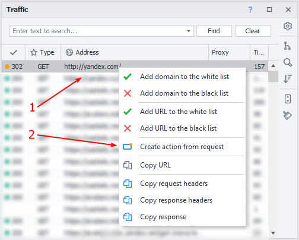


1. Hover over the desired request and right-click to open the context menu.
2. Click *Create action from request*.

A fully filled-out HTTP request action will appear on the project canvas.

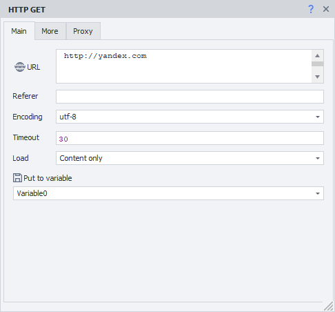


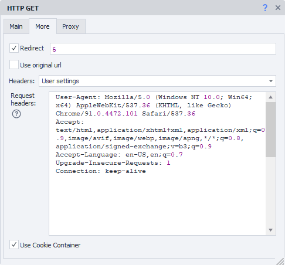


You can change static values or replace them with variables—the action is fully ready for use.

* * *

## Disabling the browser

If you work only with requests, you can disable the browser to save your computer's resources; you can do this either in the [❗→ project settings](https://zennolab.atlassian.net/wiki/spaces/RU/pages/534315477#%D0%9D%D0%B5-%D0%B8%D1%81%D0%BF%D0%BE%D0%BB%D1%8C%D0%B7%D0%BE%D0%B2%D0%B0%D1%82%D1%8C-%D0%B1%D1%80%D0%B0%D1%83%D0%B7%D0%B5%D1%80 "https://zennolab.atlassian.net/wiki/spaces/RU/pages/534315477#%D0%9D%D0%B5-%D0%B8%D1%81%D0%BF%D0%BE%D0%BB%D1%8C%D0%B7%D0%BE%D0%B2%D0%B0%D1%82%D1%8C-%D0%B1%D1%80%D0%B0%D1%83%D0%B7%D0%B5%D1%80") or by using the [❗→ Browser Settings](https://zennolab.atlassian.net/wiki/spaces/RU/pages/489324572#%D0%97%D0%B0%D0%BF%D1%83%D1%81%D1%82%D0%B8%D1%82%D1%8C-%D0%B8%D0%BD%D1%81%D1%82%D0%B0%D0%BD%D1%81 "https://zennolab.atlassian.net/wiki/spaces/RU/pages/489324572#%D0%97%D0%B0%D0%BF%D1%83%D1%81%D1%82%D0%B8%D1%82%D1%8C-%D0%B8%D0%BD%D1%81%D1%82%D0%B0%D0%BD%D1%81") action.

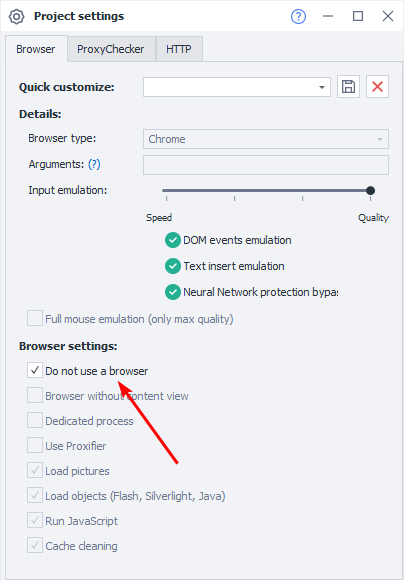


* * *

## Request transmission method

ZennoPoster has two ways of working with requests: external (the standard method, using the Chilkat library) and internal (the alternative method). If something doesn’t work correctly with HTTP requests using the standard method, try switching to the alternative method.

You can change the request transmission method in the [❗→ program settings](https://zennolab.atlassian.net/wiki/spaces/RU/pages/809074766#%D0%98%D1%81%D0%BF%D0%BE%D0%BB%D1%8C%D0%B7%D0%BE%D0%B2%D0%B0%D1%82%D1%8C-%D0%B0%D0%BB%D1%8C%D1%82%D0%B5%D1%80%D0%BD%D0%B0%D1%82%D0%B8%D0%B2%D0%BD%D1%8B%D0%B9-%D1%81%D0%BF%D0%BE%D1%81%D0%BE%D0%B1-%D0%BF%D0%B5%D1%80%D0%B5%D0%B4%D0%B0%D1%87%D0%B8-HTTP-%D0%B7%D0%B0%D0%BF%D1%80%D0%BE%D1%81%D0%BE%D0%B2 "https://zennolab.atlassian.net/wiki/spaces/RU/pages/809074766#%D0%98%D1%81%D0%BF%D0%BE%D0%BB%D1%8C%D0%B7%D0%BE%D0%B2%D0%B0%D1%82%D1%8C-%D0%B0%D0%BB%D1%8C%D1%82%D0%B5%D1%80%D0%BD%D0%B0%D1%82%D0%B8%D0%B2%D0%BD%D1%8B%D0%B9-%D1%81%D0%BF%D0%BE%D1%81%D0%BE%D0%B1-%D0%BF%D0%B5%D1%80%D0%B5%D0%B4%D0%B0%D1%87%D0%B8-HTTP-%D0%B7%D0%B0%D0%BF%D1%80%D0%BE%D1%81%D0%BE%D0%B2") (globally for all projects) or in the [❗→ specific project settings](https://zennolab.atlassian.net/wiki/spaces/RU/pages/534315477#%D0%9D%D0%B0%D1%81%D1%82%D1%80%D0%BE%D0%B9%D0%BA%D0%B8-HTTP "https://zennolab.atlassian.net/wiki/spaces/RU/pages/534315477#%D0%9D%D0%B0%D1%81%D1%82%D1%80%D0%BE%D0%B9%D0%BA%D0%B8-HTTP").

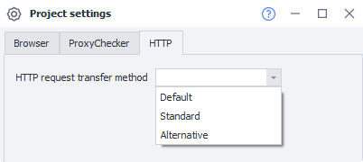


* * *

## Example usage

You need to send a response from [❗→ ReCaptcha2](https://zennolab.atlassian.net/wiki/spaces/RU/pages/534053033/ReCaptcha "https://zennolab.atlassian.net/wiki/spaces/RU/pages/534053033/ReCaptcha") to a website to pass an anti-bot system.

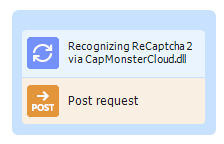


1. Get the captcha response
2. Add a [❗→ POST request](https://zennolab.atlassian.net/wiki/spaces/RU/pages/534315180/POST- "https://zennolab.atlassian.net/wiki/spaces/RU/pages/534315180/POST-") action
3. Fill in all the fields
4. Enter the captcha response in the required format in the data field
5. Submit the response on the website
6. Pass the site's protection

By using the browserless method, you save time and resources otherwise spent solving captchas in the tab window.

* * *

## Useful links

- [❗→ Project settings](https://zennolab.atlassian.net/wiki/spaces/RU/pages/534315477 "https://zennolab.atlassian.net/wiki/spaces/RU/pages/534315477")
- [❗→ GET request](https://zennolab.atlassian.net/wiki/spaces/RU/pages/534315165/GET- "https://zennolab.atlassian.net/wiki/spaces/RU/pages/534315165/GET-")
- [❗→ HTTP request](https://zennolab.atlassian.net/wiki/spaces/RU/pages/489259052 "https://zennolab.atlassian.net/wiki/spaces/RU/pages/489259052")
- [❗→ Traffic window (and Content Policy)](https://zennolab.atlassian.net/wiki/spaces/RU/pages/735805465 "https://zennolab.atlassian.net/wiki/spaces/RU/pages/735805465")
- [❗→ Web Developer Tools (DevTools)](https://zennolab.atlassian.net/wiki/spaces/RU/pages/1331134465 "https://zennolab.atlassian.net/wiki/spaces/RU/pages/1331134465")
- [❗→ Working with JSON and XML](https://zennolab.atlassian.net/wiki/spaces/RU/pages/488964124 "https://zennolab.atlassian.net/wiki/spaces/RU/pages/488964124")
- [❗→ Working with text](https://zennolab.atlassian.net/wiki/spaces/RU/pages/488865793 "https://zennolab.atlassian.net/wiki/spaces/RU/pages/488865793")