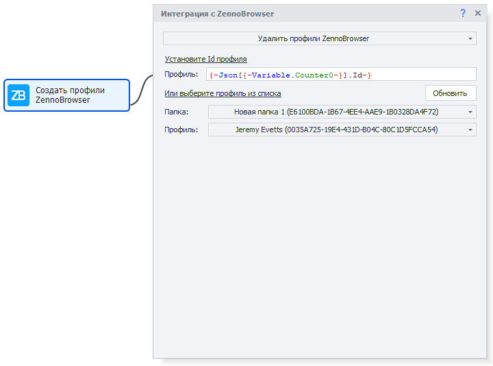
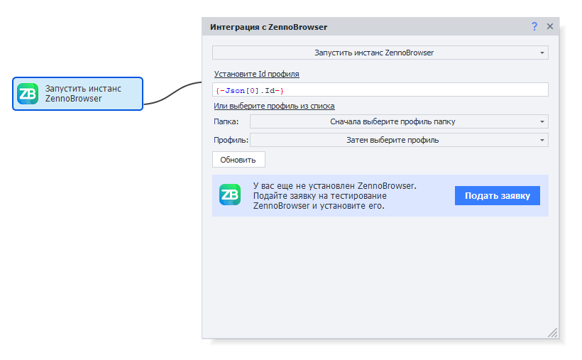
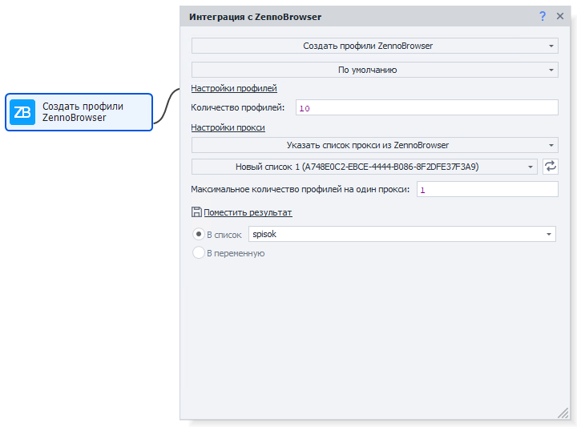
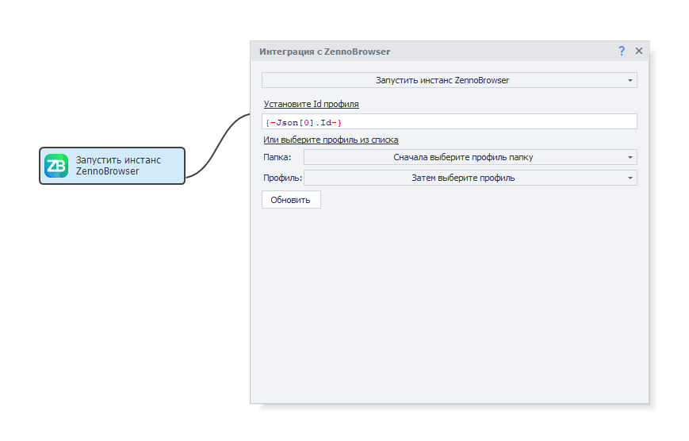
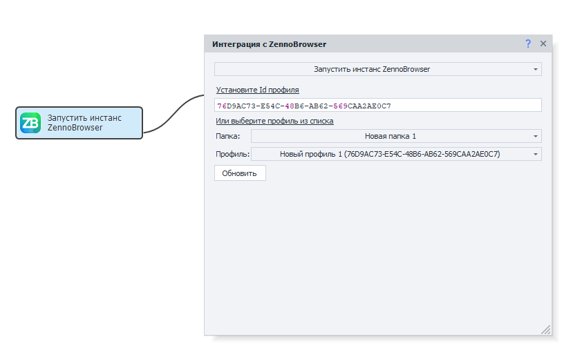
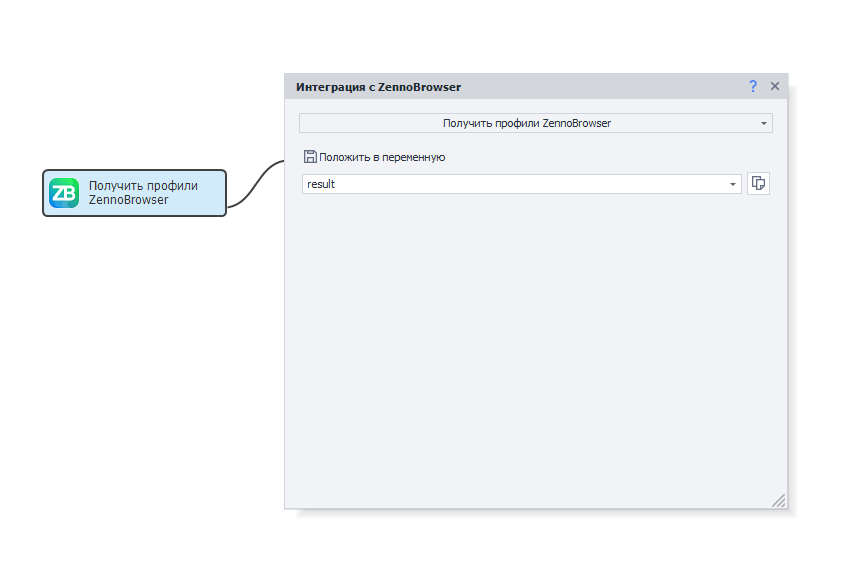
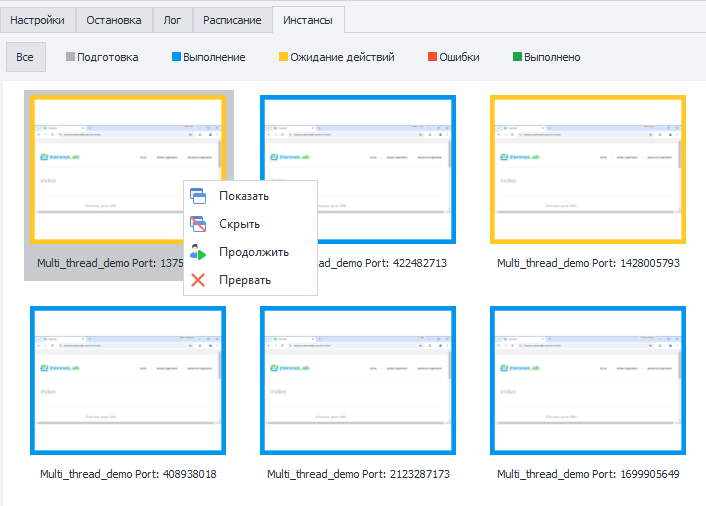

:::info **Please read the [*Terms of Use for materials on this resource*](../Disclaimer).**
:::

> 🔗 **[Original page](https://zennolab.atlassian.net/wiki/spaces/RU/pages/3641737224/ZennoPoster+ZennoBrowser)** — Source of this material

_______________________________________________  
# Integrating ZennoPoster with ZennoBrowser

ZennoPoster 7 introduces new web automation capabilities through integration with ZennoBrowser—a specialized anti-detect browser for working with multiple profiles. This integration allows ZennoPoster7 users to take full advantage of ZennoBrowser, including fingerprint management, proxy support, and creating isolated browser environments. This guide covers the main integration functions: retrieving and managing profiles, launching browser instances, creating and deleting profiles, as well as some specifics of using the new browser type within the ZennoPoster7 environment. The integration ensures seamless communication between the two products, retaining the familiar ZennoPoster7 interface while adding powerful ZennoBrowser features for professional web automation.

## **<u data-renderer-mark="true">1. Retrieving ZennoBrowser Profiles</u>**

The "Get ZennoBrowser Profiles" action is designed to extract information about existing browser profiles from the ZennoBrowser system.

Open AD\_4nXeU\_ib6LPQqGAz2nnpgsTM9jqtUVAzPUfafv84DemGD982-9eNofndMV22g7ykiqZHCn7IEztBOIF\_q9Zk3PK2-\_4rTLXOiQQspfbyZlfCn08T6sAMZIpKn6Va-cBMQIMltY1QnbA?key=YZY71xn4q4K\_PxdeMAaw-Q

### **How it works**

The action sends a request to ZennoBrowser and returns comprehensive information about all available profiles as structured data.

### **Result format**

The result is a **JSON array of objects**, where each object contains detailed information about a specific profile:

- Profile ID
- Profile name
- Browser settings
- Profile status
- Proxy information
- Other metadata

### **Processing results**

To work correctly with the received data, **it is recommended to use the "Parse JSON" action**, which allows you to:

- Extract specific profile parameters
- Filter profiles based on certain criteria
- Convert data into a convenient format for processing

### **Error handling**

If there are issues connecting to ZennoBrowser (e.g., the service is unavailable, incorrect connection settings), the action will return a relevant error, which should be processed in your project logic.

### **Saving the result**

Specify the variable where you want to store the JSON response in the **"Put in variable"** field for further use in your project.

## **<u data-renderer-mark="true">2. Launching a ZennoBrowser Instance</u>**

### **"Launch ZennoBrowser Instance" action**

This action is designed to launch a browser using a specific ZennoBrowser profile by its identifier.

Open AD\_4nXdQmgDpUpU9gvddlteWDS2gpXNnAc8ImcQIMxPqGBd0Kk9M7x2eRJO1dJAngh4lJ8vjV7Y2bnk7\_kw7rUpFDLZqLPyU8ZuOOkOSh5eyuctKX6u\_y2hZhu\_S9n6XWQcZyUT2X5XPEQ?key=YZY71xn4q4K\_PxdeMAaw-Q

### **How it works**

The action takes the **ZennoBrowser profile ID** and launches a browser instance with the corresponding profile settings, including:

- Browser fingerprints
- Proxy settings
- User data
- Extensions and configurations

### **Profile selection**

When you open the action’s settings for the first time, the latest profile list from ZennoBrowser is loaded automatically. There are two ways to specify a profile:

**Manual ID entry:**

- Enter the profile ID in the corresponding field

**Choose from the list:**

1. First, select a **profile folder** from the dropdown
2. Then, choose the specific **profile** within the selected folder

### **Updating the profile list**

To refresh the info about available profiles, use the **"Update"** button in the action settings. This is especially useful after adding new profiles in ZennoBrowser.

Open AD\_4nXeqkWU3wdcaPKxmNPH952Boasqh-tHvx2XPHCiCIVYcVQS3h1Sov\_OU0hHyCKsiuYDcRIanlsTHmkn4jnksq-\_EIhQVt0Le8\_XilsDt8-fTxZL2JyEf9Zjk2KOGqRf0jPZrDbJlBQ?key=YZY71xn4q4K\_PxdeMAaw-Q

## **<u data-renderer-mark="true">3. Creating ZennoBrowser Profiles</u>**

The "Create ZennoBrowser Profiles" action offers two ways to create new browser profiles:

- **Creating default profiles**

When "Default" mode is selected, profiles are created with optimized settings. You need to specify:

- **Number of profiles** — how many profiles you want to create
- **Proxy settings** — parameters for the proxy servers for the profiles

Open AD\_4nXdqgHwL42YiuiZvci2E\_xhjbFTr8lJR-N3nyEp0CW5W5dd-cWH9rGR2eaJqllv1U1AUPCD1IJNgz\_sypFUBgGR6Yn2NSEr2JjjSu7auGCzXZmgY6IKplnCikrHobDGaenDtpn2dvQ?key=YZY71xn4q4K\_PxdeMAaw-Q

- **Profile donor-based creation**

When selecting the "Use profile data" mode, new profiles will inherit all settings from an existing donor profile:

- Provide the **donor profile ID** or pick it from the list
- Browser fingerprint settings, extensions, and other configuration parameters will be copied

**Note:** Only fingerprint settings are copied, not the actual fingerprints—each created profile will get unique fingerprints according to the donor’s configuration.

Open AD\_4nXfVe-Pm-q3ZhQTLr1c4UPH79eABy3g1Ke7XUX0JaXLYWSqTTn4pCq5G4doKrgL3lhlUWA7q7fN7ZmOVbVjMCODblg0wp3Q1HkS8rSBph45BrpnyQt38IyogjwY3wW60yiYJP0T5?key=YZY71xn4q4K\_PxdeMAaw-Q

### **Proxy settings**

The system supports flexible proxy management:

- **Specify a proxy list** — select an existing list from ZennoBrowser
- **Maximum number of profiles per proxy** — a limit to prevent overloading proxies
- **Exclude duplicates** — each proxy is used only once when creating profiles

### **Saving results**

Be sure to save the data of the created profiles for future use:

- **To a list** — for working with multiple profiles
- **To a variable** — to store information about a single profile

## **<u data-renderer-mark="true">4. Deleting ZennoBrowser Profiles</u>**

The "Delete ZennoBrowser Profiles" action is used to permanently remove selected browser profiles from the ZennoBrowser system.

Open AD\_4nXcDLORsPZYdW8Gd5VNmuUU8ZJP3s0vX0KQjGukUn9JN6AiHR0ipCoCYUfqFFl\_23mDNEAOKWFYkjk3ZsT6Sr1FbTOK3P8DUccy8I8RrCbP-qTWskpc1CwdA-nFRDzFwldr9PaGnKA?key=YZY71xn4q4K\_PxdeMAaw-Q

### **Ways to select profiles for deletion**

**Manual ID entry:**

- Enter the profile ID in the **"Set profile IDs"** field
- Variables can be used for dynamic ID specification

**Choose from the list:**

- Select a **profile folder** from the dropdown menu
- Choose the specific **profile** you want to delete from the chosen folder

### **Updating the profile list**

Use the **"Update"** button in the action’s settings to get the current list of available profiles.

## **<u data-renderer-mark="true">5. ZennoBrowser Integration Features</u>**

### **Browser usage**

1. The integrated browser in ZennoPoster7 works just like other browsers, meaning page and browser element actions work natively.
2. If ZennoBrowser isn’t installed, the instance launch action will prompt you to request access to test the new product so you can install it.

Open AD\_4nXdlOQVONf9gElkVTa-CJ2jHv52g1pI\_bnmH8bP-\_LwUKWt7cBHnP2hRvJ3GpXbzm6ckWjS9GiTfUWS5iGR4TQnXM1MXrfqfHpNh6JsKFKAX3\_ULIhahw7lJW8ZpdD5vhaWxw6M7iA?key=YZY71xn4q4K\_PxdeMAaw-Q

### **Launching and connecting**

1. ZennoBrowser does not need to be running beforehand to work with the integration. ZennoPoster7 can launch it on its own. However, if ZennoBrowser is already running, retrieving profiles or launching a new browser will happen faster.
2. When ZennoPoster7 launches the browser, you’ll see its status in ZennoBrowser, and a Stop button will become available. You can stop the browser and release the profile at any time, but doing so may cause errors in your ZennoPoster7 project.
3. If ZennoPoster7 fails to connect to ZennoBrowser, the new actions will return an error. ZennoBrowser might also reject a browser launch for certain reasons, for example, if the profile is already in use. This will also result in a failed action.

### **Differences in ProjectMaker and ZennoPoster**

1. When you launch a new browser in ProjectMaker, the browser is embedded natively in the UI, and you can use all ProjectMaker tools. Just like in Chromium browser, GPU usage is disabled for ProjectMaker. In ZennoPoster, GPU is enabled for the new browser, similar to when “Alternative Chromium browser rendering” is turned on.

### **Working with profiles**

1. When using the new browser, ZennoBrowser profiles and emulations are applied. All browser ZP7 emulations and configuration settings, as well as ZP7 profile functions, are ignored. Related actions will execute without errors but will not actually make any changes. Any action that could affect the profile will be ignored.

### **Browser window management**

1. In ZennoPoster7, when displaying an instance, the real browser window is shown. The minimize/close buttons function like standard window controls but may cause unexpected browser behavior, so it’s not recommended to use them. For more convenience when working with the real browser, the instance preview window’s context menu in ZennoPoster has been enhanced. In the future, minimize/close buttons are planned to work similarly to other browser types in ZennoPoster7.

## **New context menu for instance preview**

To make it easier to work with Chromium windows from ZennoBrowser, the context menu in ZennoPoster7 has been expanded with additional control features.

### **Added menu options**

**Show** — displays the browser window if it was hidden

**Hide** — hides the browser window without closing it

**Continue** — used to resume execution in "Waiting for user action" mode

Open AD\_4nXfNHArd\_JqZalTPzhBfqceoMgmyrbs4CTKILtSTFcldrWAeudyB51SVkxoesnwGmUU7FoLE1XSjfxmUfHdx8XwDFP5UegpQBlsSV800MYLWrpkQCkpDFVQIYhJEffMKDZ56eOqk3A?key=YZY71xn4q4K\_PxdeMAaw-Q

### **Benefits**

The extended context menu lets you control all key ZennoPoster functions right from the instance preview interface, giving you full control over ZennoBrowser browsers without needing to switch between different application windows.
