---
sidebar_position: 1
title: "List Operations"
description: " "
date: "2025-07-24"
converted: true
originalFile: "Операции над списком.txt"
targetUrl: "https://zennolab.atlassian.net/wiki/spaces/RU/pages/534085798"
---
import DisclaimerNotice from '@site/src/components/DisclaimerNotice';

<DisclaimerNotice />

> 🔗 **[Original page](https://zennolab.atlassian.net/wiki/spaces/RU/pages/534085798)** — Source of this material

_______________________________________________  

## Description

[❗→ Lists](/wiki/spaces/RU/pages/534053375 "/wiki/spaces/RU/pages/534053375") are mainly used for getting lines of data from a text document or file data entries. For example, you have a file with a list of URLs and you need to visit them one by one, or you're parsing some values from a site and need to sort, remove duplicates, and save them to a file (like parsed email addresses).

  

## How do you add a list to a project?

:::note Note
You need to create a List before getting started
:::

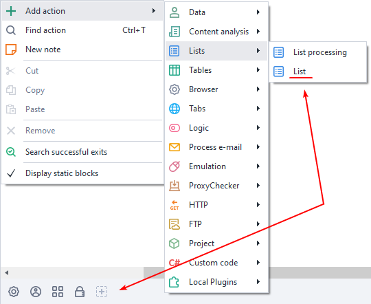

  

## How do you add an action to a project?

Right-click and choose **Add Action** → **Lists** → **List Operations**

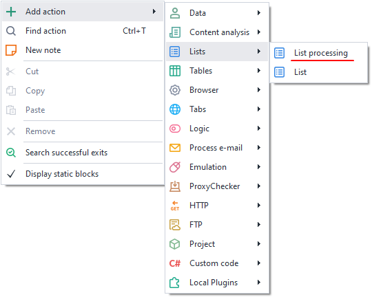

Or use [❗→ Smart Search](https://zennolab.atlassian.net/wiki/spaces/RU/pages/506200090/ProjectMaker+7#%D0%A3%D0%BC%D0%BD%D1%8B%D0%B9-%D0%BF%D0%BE%D0%B8%D1%81%D0%BA-%D0%B4%D0%B5%D0%B9%D1%81%D1%82%D0%B2%D0%B8%D0%B9 "https://zennolab.atlassian.net/wiki/spaces/RU/pages/506200090/ProjectMaker+7#%D0%A3%D0%BC%D0%BD%D1%8B%D0%B9-%D0%BF%D0%BE%D0%B8%D1%81%D0%BA-%D0%B4%D0%B5%D0%B9%D1%81%D1%82%D0%B2%D0%B8%D0%B9").

  

## What is this used for?

- Adding and retrieving list items
- Removing lines and duplicates
- Linking to a file
- Getting the number of lines
- Shuffling
- Sorting values

  

## How do you work with the action?

### Select a sublist

Selects a specific part of the list.

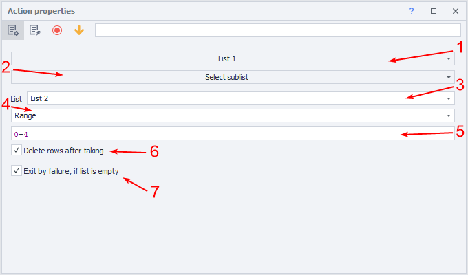

1. Select the list you want to work with.
2. Choose the function.
3. Specify where the result will be saved.
4. Sublist filter method
a) [❗→ Range](/wiki/spaces/RU/pages/488964137 "/wiki/spaces/RU/pages/488964137") - set the range of lines to extract.
b) Items not containing text - selects all lines not containing the given text; you can use variables.
c) Items not matching [❗→ regex](/wiki/spaces/RU/pages/534086111 "/wiki/spaces/RU/pages/534086111") - search criteria using [❗→ regex](/wiki/spaces/RU/pages/534086111 "/wiki/spaces/RU/pages/534086111").
d) Items containing text - selects values containing the needed text; you can use variables.
e) Items matching [❗→ regex](/wiki/spaces/RU/pages/534086111 "/wiki/spaces/RU/pages/534086111") - search criteria using [❗→ regex](/wiki/spaces/RU/pages/534086111 "/wiki/spaces/RU/pages/534086111").
5. Enter the value for step 4 here.
6. Lines that match the criteria will be removed.
7. If the [❗→ list](/wiki/spaces/RU/pages/534053375 "/wiki/spaces/RU/pages/534053375") is empty, **Zennoposter** will go down the red branch.

Example

Let's take the first five lines (numbering starts from zero!) from [❗→ list](/wiki/spaces/RU/pages/534053375 "/wiki/spaces/RU/pages/534053375") 1 and save them to [❗→ list](/wiki/spaces/RU/pages/534053375 "/wiki/spaces/RU/pages/534053375") 2

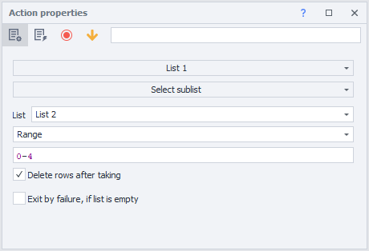

[❗→ List](/wiki/spaces/RU/pages/534053375 "/wiki/spaces/RU/pages/534053375") 1

Before

After

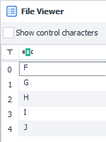

[❗→ List](/wiki/spaces/RU/pages/534053375 "/wiki/spaces/RU/pages/534053375") 2

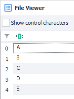

  

### Add data from list

Add data from one list to another.

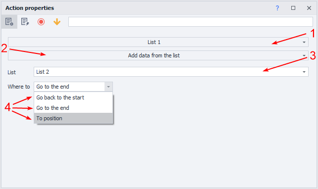

1. Select the list you'll work with
2. Choose the function.
3. Specify where to take the lines from.
4. Where to place the result - *at the end, *at the beginning, *at a position.
5. If *at a position is chosen, enter the line number or a variable.

:::note Note
Lines are copied, not removed from the original list.
:::

Example

Add lines from [❗→ list](/wiki/spaces/RU/pages/534053375 "/wiki/spaces/RU/pages/534053375") 2 to the end of [❗→ list](/wiki/spaces/RU/pages/534053375 "/wiki/spaces/RU/pages/534053375") 1

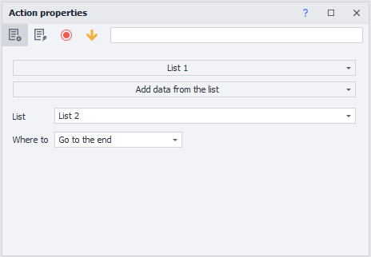

[❗→ List](/wiki/spaces/RU/pages/534053375 "/wiki/spaces/RU/pages/534053375") 2

[❗→ List](/wiki/spaces/RU/pages/534053375 "/wiki/spaces/RU/pages/534053375") 1

Before

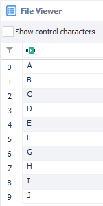

After

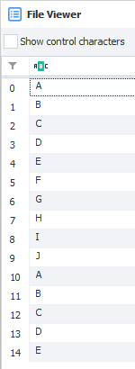

Items from list 2 remain in place

  

### Add a line

Add a line to a list.

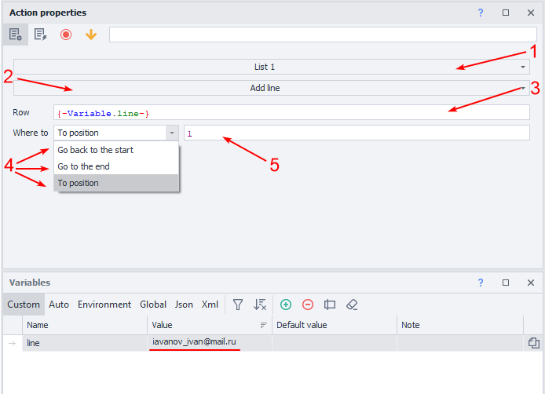

1. Select the list you'll work with
2. Choose the function.
3. Enter the value or variable.
4. Where to place the result - *at the end, *at the beginning, *at a position.
5. If you chose *at a position, enter the row number or variable.

Example

Add a value to the end of [❗→ list](/wiki/spaces/RU/pages/534053375 "/wiki/spaces/RU/pages/534053375") 1

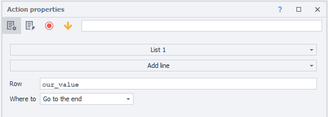

[❗→ List](/wiki/spaces/RU/pages/534053375 "/wiki/spaces/RU/pages/534053375") 1

Before

After

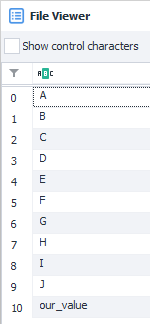

  

### Add text

Add text to a list.

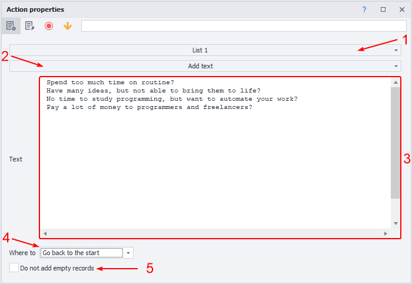

1. Select the list you'll work with
2. Choose the function.
3. Text or character set to add to the list; you can use a variable.
4. Where to place the result - *at the end, *at the beginning, *at a position.
5. Add empty lines if the text is missing.

Example

Add text to [❗→ list](/wiki/spaces/RU/pages/534053375 "/wiki/spaces/RU/pages/534053375") 1

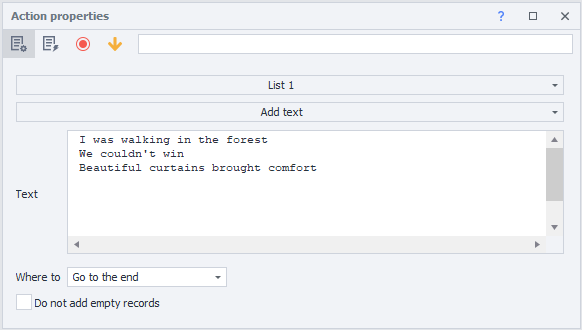

[❗→ List](/wiki/spaces/RU/pages/534053375 "/wiki/spaces/RU/pages/534053375") 1

Before

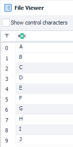

After

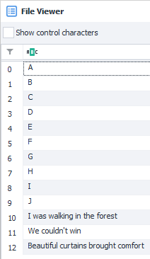

The text had a newline separator, so it was added to the list line by line

  

### Join list items

Join list items with a separator and optionally save to a variable.

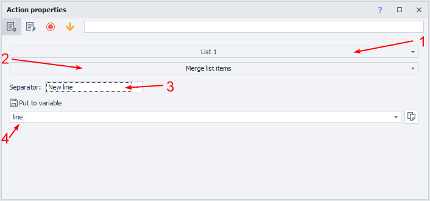

1. Select the list you'll work with
2. Choose the function.
3. Line separator 
a) *New line - every item will be on a new line.
b) *Custom - enter your own text or characters to insert between the list items.
c) *From the list settings - uses the separator from [❗→ list settings](/wiki/spaces/RU/pages/534053375 "/wiki/spaces/RU/pages/534053375").
4. Variable to save the processed data.

Example

Join items from [❗→ list](/wiki/spaces/RU/pages/534053375 "/wiki/spaces/RU/pages/534053375") 1, using the custom separator “-;“

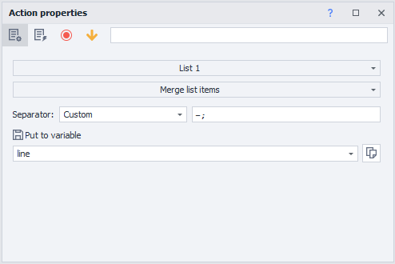

Contents of [❗→ list](/wiki/spaces/RU/pages/534053375 "/wiki/spaces/RU/pages/534053375") 1

The result will be saved to variable *stroka

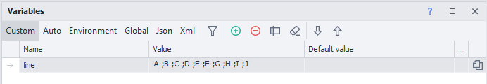

  

### Shuffle list items

Randomly reorder the items in a list.

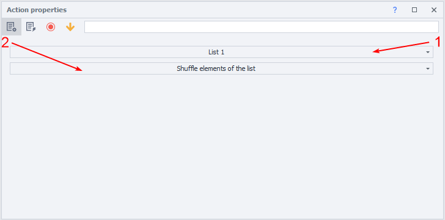

1. Select the list you'll work with
2. Choose the function.

:::note Note
Changing the order will not lose any values.
:::

Example

Shuffle the items in [❗→ list](/wiki/spaces/RU/pages/534053375 "/wiki/spaces/RU/pages/534053375") 1

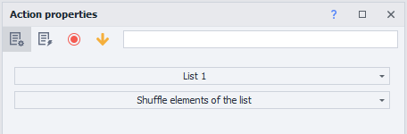

[❗→ List](/wiki/spaces/RU/pages/534053375 "/wiki/spaces/RU/pages/534053375") 1

Before

After

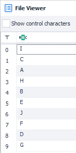

  

### Get number of lines

Get the count of lines in a list.

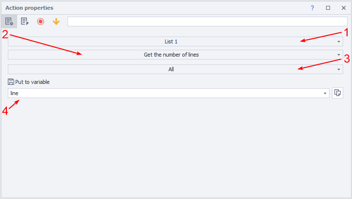

1. Select the list you'll work with
2. Choose the function.
3. Search criteria (can use a variable):
a) All
b) Do not contain text
c) Do not match [❗→ regex](/wiki/spaces/RU/pages/534086111 "/wiki/spaces/RU/pages/534086111")
d) With value
e) Contain text
f) Match [❗→ regex](/wiki/spaces/RU/pages/534086111 "/wiki/spaces/RU/pages/534086111")
4. Variable to save result.

:::note Note
The variable will always only contain a number.
:::

Example

Count the number of lines in [❗→ list](/wiki/spaces/RU/pages/534053375 "/wiki/spaces/RU/pages/534053375") 1 and save it to a variable

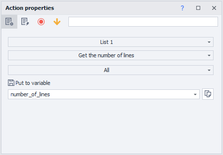

Contents of [❗→ list](/wiki/spaces/RU/pages/534053375 "/wiki/spaces/RU/pages/534053375") 1

The number will be saved to variable kolichestvo\_strok

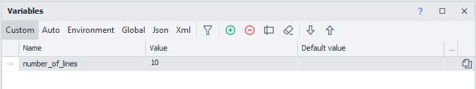

  

### Get a line

Retrieve a line, with an option to remove it from the list and save to a variable.

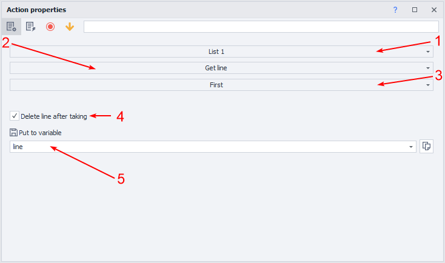

1. Select the list you'll work with
2. Choose the function.
3. Line criteria (can use a variable):
a) Does not contain text
b) Does not match [❗→ regex](/wiki/spaces/RU/pages/534086111 "/wiki/spaces/RU/pages/534086111")
c) First line
d) By number
e) Random
f) Matches [❗→ regex](/wiki/spaces/RU/pages/534086111 "/wiki/spaces/RU/pages/534086111")
4. Remove line after extracting
5. Variable for saving the value.

Example

Get a random line from [❗→ list](/wiki/spaces/RU/pages/534053375 "/wiki/spaces/RU/pages/534053375") 1 into a variable

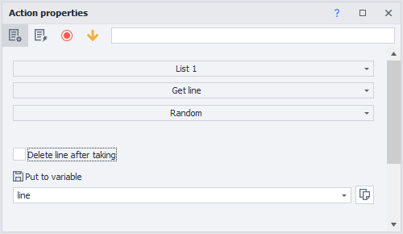

Contents of [❗→ list](/wiki/spaces/RU/pages/534053375 "/wiki/spaces/RU/pages/534053375") 1

The result will be saved to variable stroka

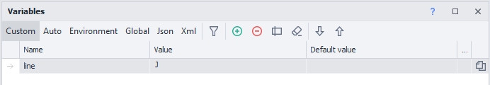

  

### Link to a file

Link a list to a file during project execution.

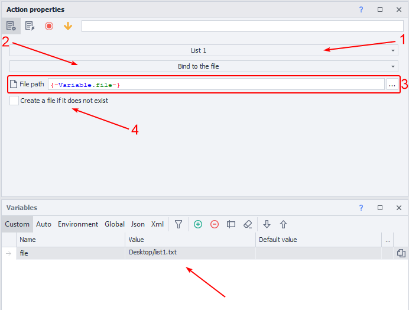

1. Select the list you'll work with
2. Choose the function.
3. Choose a file or specify a variable containing the file path.
4. If a file does not exist at the path, **ZennoPoster** will create it automatically.

Example

Link a file to [❗→ list](/wiki/spaces/RU/pages/534053375 "/wiki/spaces/RU/pages/534053375") 1

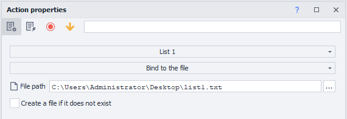

[❗→ List](/wiki/spaces/RU/pages/534053375 "/wiki/spaces/RU/pages/534053375") 1 will be connected to the selected file

  

### Sort

Sort list items in ascending or descending order.

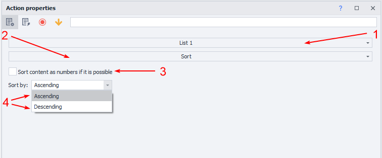

1. Select the list you'll work with
2. Choose the function.
3. Use numeric principle.
4. Choose the sort type: *descending or *ascending.

:::info Info
Not all letter or symbol lines can be sorted
:::

Example

Sort values in [❗→ list](/wiki/spaces/RU/pages/534053375 "/wiki/spaces/RU/pages/534053375") 1 in descending order

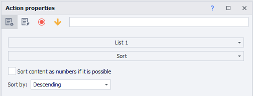

[❗→ List](/wiki/spaces/RU/pages/534053375 "/wiki/spaces/RU/pages/534053375") 1

Before

After

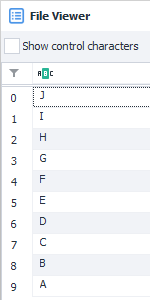

  

### Save to file

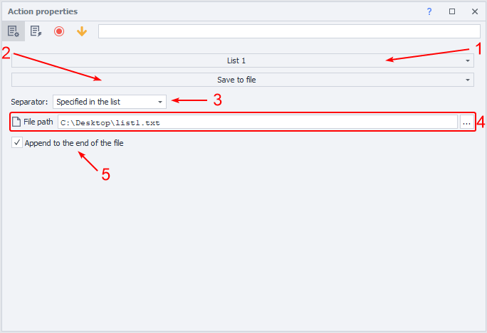

1. Select the list you'll work with
2. Choose the function.
3. Choose the separator (you can use variables):
a) *New line
b) *Custom
c) *From the list
4. Choose the file or specify a variable containing the file path.
5. The checkbox lets you either append to the file or overwrite it completely.

Example

Save values of [❗→ list](/wiki/spaces/RU/pages/534053375 "/wiki/spaces/RU/pages/534053375") 1 to a file

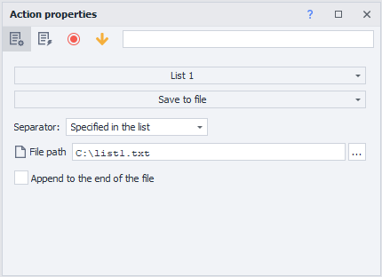

Contents of [❗→ list](/wiki/spaces/RU/pages/534053375 "/wiki/spaces/RU/pages/534053375") 1

After running, all values will be written to the file

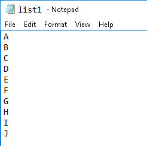

  

### Remove duplicates

Remove duplicate lines from a list.

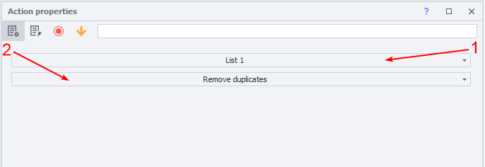

1. Select the list you'll work with
2. Choose the function.

:::note Note
Processing a file with a large number of lines may take some time.
:::

Example

Remove all duplicates in [❗→ list](/wiki/spaces/RU/pages/534053375 "/wiki/spaces/RU/pages/534053375") 1

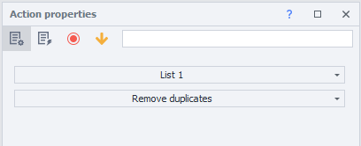

[❗→ List](/wiki/spaces/RU/pages/534053375 "/wiki/spaces/RU/pages/534053375") 1

Before

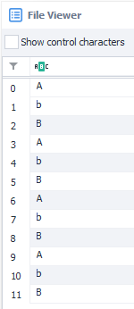

After

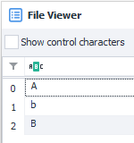

  

### Remove lines

Remove lines from a list based on specific criteria.

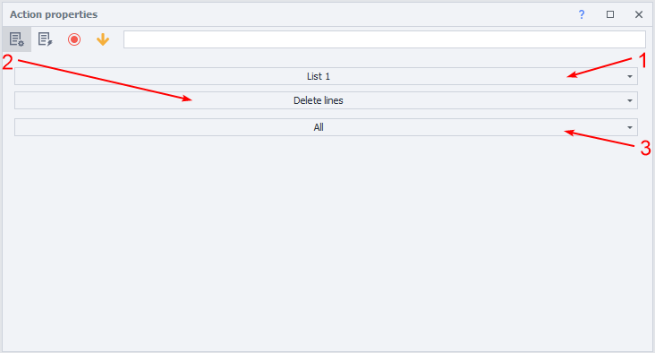

1. Select the list you'll work with
2. Choose the function.
3. Remove lines by criteria (can use variables):
a) All
b) Not containing text
c) Not matching [❗→ regex](/wiki/spaces/RU/pages/534086111 "/wiki/spaces/RU/pages/534086111")
d) First line
e) By numbers (can use [❗→ ranges](/wiki/spaces/RU/pages/488964137 "/wiki/spaces/RU/pages/488964137"))
f) With value
g) Containing text
h) Containing only whitespace
i) Matching [❗→ regex](/wiki/spaces/RU/pages/534086111 "/wiki/spaces/RU/pages/534086111")

Example

Remove lines containing character @ from [❗→ list](/wiki/spaces/RU/pages/534053375 "/wiki/spaces/RU/pages/534053375") 1

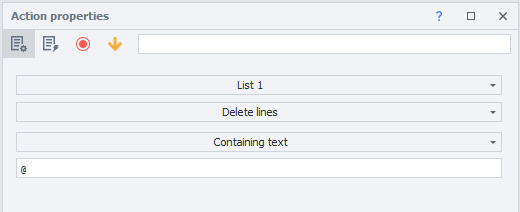

[❗→ List](/wiki/spaces/RU/pages/534053375 "/wiki/spaces/RU/pages/534053375") 1

Before

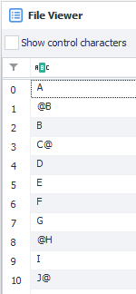

After

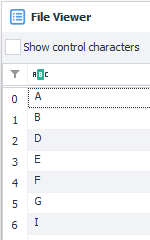

  

## Example usage

Suppose you need to go to all pages from a list, collect their titles, and put them in another list.

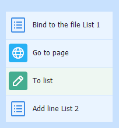

1. Create [❗→ List](/wiki/spaces/RU/pages/534053375 "/wiki/spaces/RU/pages/534053375")_1 with the pages and link it to a file ahead of time.
2. Remove duplicates to avoid visiting the same page twice.
3. Create and link [❗→ List](/wiki/spaces/RU/pages/534053375 "/wiki/spaces/RU/pages/534053375")_2 to a file.
4. Parse the required info from the pages into [❗→ List](/wiki/spaces/RU/pages/534053375 "/wiki/spaces/RU/pages/534053375")_2.
5. Remove duplicates.

This way, you can create lists of any information you need for further processing or use.

  

## Useful links

1. [❗→ Variables window](/wiki/spaces/RU/pages/735608872 "/wiki/spaces/RU/pages/735608872")
2. [❗→ Regex tester](/wiki/spaces/RU/pages/534086111 "/wiki/spaces/RU/pages/534086111")
3. [❗→ List](/wiki/spaces/RU/pages/534053375 "/wiki/spaces/RU/pages/534053375")