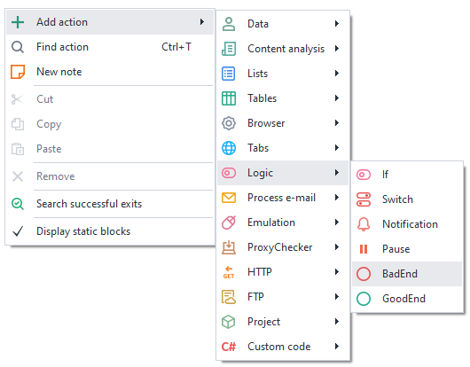
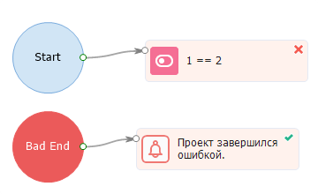
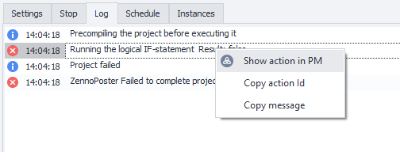
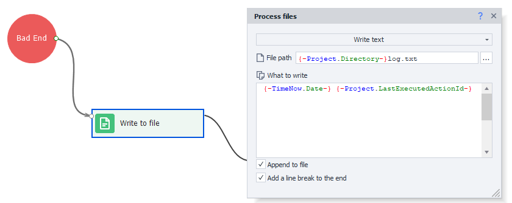
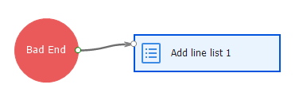
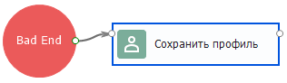

---
sidebar_position: 6
title: "BadEnd (handling project errors)"
description: ""
date: "2025-08-04"
converted: true
originalFile: "BadEnd (выход при возникновении ошибки в проекте).txt"
targetUrl: "https://zennolab.atlassian.net/wiki/spaces/RU/pages/534020265/BadEnd"
---
import DisclaimerNotice from '@site/src/components/DisclaimerNotice';

<DisclaimerNotice />

> 🔗 **[Original page](https://zennolab.atlassian.net/wiki/spaces/RU/pages/534020265/BadEnd)** — Source of this material

_______________________________________________  

## Description

If an error occurs in any of the actions, or the block exits via the red branch, the project execution will move to the block linked to the Bad End action. This is useful if you want to set up additional actions for cases when the template ends with an error.

## How do I add this action to my project?

Right-click to open the context menu and choose **Add action** → **Logic** → **BadEnd**




Or you can use the [❗→ smart search](https://zennolab.atlassian.net/wiki/spaces/RU/pages/506200090/ProjectMaker+7#%D0%A3%D0%BC%D0%BD%D1%8B%D0%B9-%D0%BF%D0%BE%D0%B8%D1%81%D0%BA-%D0%B4%D0%B5%D0%B9%D1%81%D1%82%D0%B2%D0%B8%D0%B9 "https://zennolab.atlassian.net/wiki/spaces/RU/pages/506200090/ProjectMaker+7#%D0%A3%D0%BC%D0%BD%D1%8B%D0%B9-%D0%BF%D0%BE%D0%B8%D1%81%D0%BA-%D0%B4%D0%B5%D0%B9%D1%81%D1%82%D0%B2%D0%B8%D0%B9").

## What is this used for?

When running a template, unexpected errors may occur, such as:

- The website layout changed and now the template can't find the required HTML element
- The template logic wasn't fully considered and doesn't handle certain situations

Because of this, the project won't finish and will immediately stop. To avoid losing data and to handle errors, you can use Bad End for:

- Returning data to lists/tables for later use, so nothing is lost
- Logging errors
- Adding invalid information to the Blacklist
- Creating backups

## How does this action work?

If the template ends due to an error, the actions linked to Bad End will execute:




Bad End also triggers when the template is interrupted or a global [❗→ execution timeout](https://zennolab.atlassian.net/wiki/spaces/RU/pages/852885665 "https://zennolab.atlassian.net/wiki/spaces/RU/pages/852885665") is reached. In ZennoPoster, there's a setting for this — “[❗→ Execute BadEnd on project interruption](https://zennolab.atlassian.net/wiki/spaces/RU/pages/852885665 "https://zennolab.atlassian.net/wiki/spaces/RU/pages/852885665")“:


:::info Info
Bad End is triggered once for each thread.
:::

  

## Multiple transitions to BadEnd when debugging

By default, when debugging, the project will only go into Bad/GoodEnd once per run. You'll need to restart the project with the “Restart” button if you want it to happen again.
If you'd like to go into these actions multiple times while debugging, turn on the [❗→ Go to Bad/GoodEnd when debugging repeatedly](https://zennolab.atlassian.net/wiki/spaces/RU/pages/725352498#%D0%9F%D0%B5%D1%80%D0%B5%D1%85%D0%BE%D0%B4%D0%B8%D1%82%D1%8C-%D0%B2-Bad%2FGoodEnd-%D0%BF%D1%80%D0%B8-%D0%BC%D0%BD%D0%BE%D0%B3%D0%BE%D0%BA%D1%80%D0%B0%D1%82%D0%BD%D0%BE%D0%B9-%D0%BE%D1%82%D0%BB%D0%B0%D0%B4%D0%BA%D0%B5 "https://zennolab.atlassian.net/wiki/spaces/RU/pages/725352498#%D0%9F%D0%B5%D1%80%D0%B5%D1%85%D0%BE%D0%B4%D0%B8%D1%82%D1%8C-%D0%B2-Bad%2FGoodEnd-%D0%BF%D1%80%D0%B8-%D0%BC%D0%BD%D0%BE%D0%B3%D0%BE%D0%BA%D1%80%D0%B0%D1%82%D0%BD%D0%BE%D0%B9-%D0%BE%D1%82%D0%BB%D0%B0%D0%B4%D0%BA%D0%B5") option in the program settings.

  

## Example usage

### Restoring data on error

For example, you might remove a data row from a list before processing it. If something goes wrong before the row is processed, that data is lost. To avoid this, use Bad End and add an action to put the row back into the list. This way, if the process ends unexpectedly, any unprocessed data is saved back to the list for later.

### How do I identify and fix the error?

Each step in the template has a unique ID you can use to find it in ProjectMaker. To get the step ID where the error happened, go to the ZennoPoster log, right-click on the error, and select “*copy action id*”:


Next, in ProjectMaker, open search (Ctrl + F), paste the ID, and click “Find”. The program will highlight the problem action with a blue border:


Or use the “Show erroneous action in PM” option, which will immediately open the project in ProjectMaker and highlight the action that caused the error:




However, it's hard to keep track of all errors, so it's a good idea to log them to a file. To do this, after Bad End, add a “Write to file” action and insert the following text:

```json
{ -TimeNow.Date- } { -Project.LastExecutedActionId- }
```




Now, when there's an error in the template, Bad End will create a log.txt file containing the time and error ID. If the ID alone isn't enough to fix the problem, you can also save a [❗→ screenshot of the instance](https://zennolab.atlassian.net/wiki/spaces/RU/pages/488865806 "https://zennolab.atlassian.net/wiki/spaces/RU/pages/488865806"), the [❗→ page source](https://zennolab.atlassian.net/wiki/spaces/RU/pages/735608872 "https://zennolab.atlassian.net/wiki/spaces/RU/pages/735608872"), or [❗→ current variable values](https://zennolab.atlassian.net/wiki/spaces/RU/pages/735608872 "https://zennolab.atlassian.net/wiki/spaces/RU/pages/735608872"). This lets you get all the details you need to figure out what went wrong and fix it so your project works correctly.

### Adding invalid information to the Blacklist

You can make a list to store invalid details that cause errors, such as incorrect login/password pairs for accounts. Later, have your template check for matches in the Blacklist and swap them out if needed.




### Creating a backup

Save the current working profile so that if an error occurs, you won't lose it. After you fix the problem, you can load it back and keep working.




  

## Useful links

- [❗→ GoodEnd (successful project completion)](https://zennolab.atlassian.net/wiki/spaces/RU/pages/534085881 "https://zennolab.atlassian.net/wiki/spaces/RU/pages/534085881")