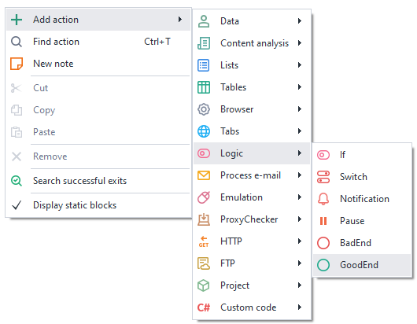
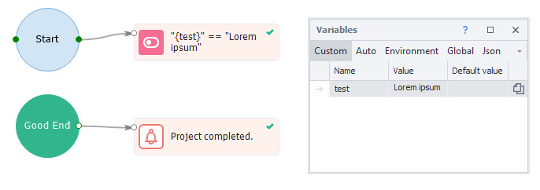

---
sidebar_position: 7
title: "GoodEnd (successful project completion)"
description: ""
date: "2025-08-04"
converted: true
originalFile: "GoodEnd (успешный выход в проекте).txt"
targetUrl: "https://zennolab.atlassian.net/wiki/spaces/RU/pages/534085881/GoodEnd"
---
:::info **Please read the [*Material Usage Rules on this site*](../Disclaimer).**
:::

> 🔗 **[Original page](https://zennolab.atlassian.net/wiki/spaces/RU/pages/534085881/GoodEnd)** — Source of this material

_______________________________________________  

## Description

The Good End action is designed to perform additional steps after the successful completion of a project. It can work together with the [❗→ Bad End](https://zennolab.atlassian.net/wiki/spaces/RU/pages/534020265/Bad+End "https://zennolab.atlassian.net/wiki/spaces/RU/pages/534020265/Bad+End") action.

## How do I add this action to a project?

Right-click to open the context menu, select **Add action** → **Logic** → **GoodEnd**

## What is it used for?

- The project can end with different successful outcomes and you want a common action to run at the end for all of them.

## How does the action work?

If the last block of your project finishes via the green branch, the flow will move to the block linked to Good End.

## Transitioning to GoodEnd during repeated debugging

By default, during debugging, the project transitions to Bad/GoodEnd only once. After that, you'll need to restart the project using the “Start Over” button.
To allow multiple transitions to these actions during debugging, you need to enable the [❗→ Transition to Bad/GoodEnd during repeated debugging](https://zennolab.atlassian.net/wiki/spaces/RU/pages/725352498#%D0%9F%D0%B5%D1%80%D0%B5%D1%85%D0%BE%D0%B4%D0%B8%D1%82%D1%8C-%D0%B2-Bad%2FGoodEnd-%D0%BF%D1%80%D0%B8-%D0%BC%D0%BD%D0%BE%D0%B3%D0%BE%D0%BA%D1%80%D0%B0%D1%82%D0%BD%D0%BE%D0%B9-%D0%BE%D1%82%D0%BB%D0%B0%D0%B4%D0%BA%D0%B5 "https://zennolab.atlassian.net/wiki/spaces/RU/pages/725352498#%D0%9F%D0%B5%D1%80%D0%B5%D1%85%D0%BE%D0%B4%D0%B8%D1%82%D1%8C-%D0%B2-Bad%2FGoodEnd-%D0%BF%D1%80%D0%B8-%D0%BC%D0%BD%D0%BE%D0%B3%D0%BE%D0%BA%D1%80%D0%B0%D1%82%D0%BD%D0%BE%D0%B9-%D0%BE%D1%82%D0%BB%D0%B0%D0%B4%D0%BA%D0%B5") option in the program settings.