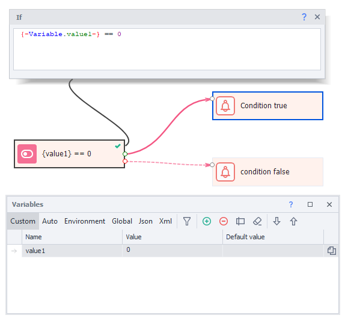
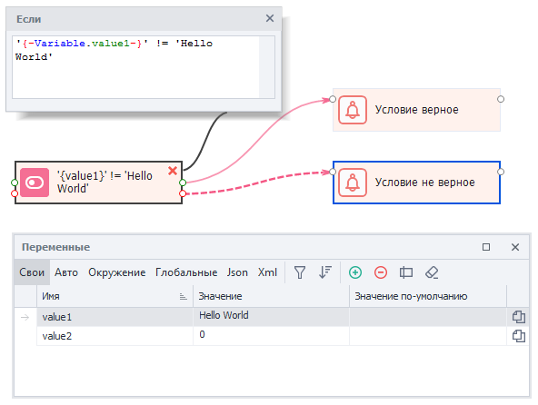
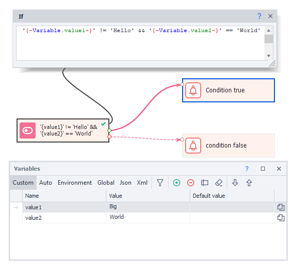

---
sidebar_position: 1
title: "IF (If ... then ... condition)"
description: ""
date: "2025-08-04"
converted: true
originalFile: "IF (условие Если ... то ...).txt"
targetUrl: "https://zennolab.atlassian.net/wiki/spaces/RU/pages/534315151/IF+...+..."
---
:::info **Please read the [*Terms of Use for materials on this resource*](../Disclaimer).**
:::

> 🔗 **[Original page](https://zennolab.atlassian.net/wiki/spaces/RU/pages/534315151/IF+...+...)** — Source of this material

_______________________________________________  

## Description

The "**IF**" block is one of the core logic actions used in ZennoPoster. It operates using JavaScript's if logic.

The "**IF**" action compares values and, depending on whether they meet the condition or not, continues along the “green” or “red” branch. Logical operators are used for comparison. In the simplest form, the if operator compares two values, and if the condition is true, the block takes the value **True** (goes down the green branch); if not, then **False** (goes down the red branch).

The action’s properties represent an input field where you can insert [❗→ project variables](https://zennolab.atlassian.net/wiki/spaces/RU/pages/735608872 "https://zennolab.atlassian.net/wiki/spaces/RU/pages/735608872"), [❗→ environment variables](https://zennolab.atlassian.net/wiki/spaces/RU/pages/735608872#%D0%9E%D0%BA%D1%80%D1%83%D0%B6%D0%B5%D0%BD%D0%B8%D0%B5 "https://zennolab.atlassian.net/wiki/spaces/RU/pages/735608872#%D0%9E%D0%BA%D1%80%D1%83%D0%B6%D0%B5%D0%BD%D0%B8%D0%B5") and constants: numbers or strings (text). Thus, the "**IF**" block only works with two types of data: numbers and strings.

  

## What is it used for?

- Comparing numeric values
- Comparing text strings
- Checking conditions

  

## How does the action work?

Let’s look at a simple example to understand how this operator works.

1. Create a variable called `value1` and assign it the value `1`.
2. Add an IF block using “**Logic**”→ “**If**”.
3. In the block’s properties field, insert the operand `{ -Variable.value1- }`
4. Add the "**equals**" operator - `==`
5. Insert the second value to compare - the constant `1`.
6. Now, if you run the block (select it and click the “Next” button in ProjectMaker), the block will finish along the green line (a green check mark will appear). This tells us the value is correct (True) because the variable `value1` is indeed equal to `1`.
7. Change the value of `value1` to `2` in the “Variables” window and repeat step 6. The block will finish along the red line (a red cross will appear). This means the value is not correct (False), since the variable `value1` is not equal to `1`.

In the example above, we used numeric data and the “**equals**” (`==`) comparison operator. In the following example, let’s compare strings using the “**not equal**” (`!=`) operator.

:::caution Important
Important! When comparing text values, data and variables must be enclosed in quotes: either single or double. For numbers, quotes are not needed. Otherwise, the comparison will not work correctly. This is a common mistake for beginners.
:::

1. Create a variable `value1` and assign it the value `“Hello World“`.
2. Add an IF block via “**Logic**” → “**If**”.
3. In the block’s properties field, insert the operand `{ -Variable.value1- }`
4. Add the "**not equal**" operator - `!=`
5. Insert the second value to compare - the constant `“Hello World“`.
6. Now, if you run the block (select it and click “Next” in ProjectMaker), the block will finish along the red line (a red cross will appear). And that’s logical—the value in the variable is equal to the second string, so the “**not equal**” `!=` operator returns **False** (red branch).
7. Let’s change the value of `value1` in the “Variables” window to `“Goodbye World“` and repeat step 6. The block will complete along the green line, which is absolutely correct because the string in the variable differs from the value on the right side of the expression, and so the “**not equal**” `!=` operator is true and the block outputs **True**.

Aside from the operators above (used for comparing both numbers and strings), there are additional operators for numbers:  

`<` Less than  
`>` Greater than  
`<=` Less than or equal  
`>=` Greater than or equal  

Besides these logical operators, supplement operators are often used in practice to build more complex comparison constructs.

  

### The **OR** Operator (||)

The **OR** operator is written as a double vertical bar. With this operator, you can compare multiple conditions at once. They are evaluated from left to right. The block will return true (**True**) if any of the expressions is true, and false (**False**) if all expressions are false.

1. Assign the variables `{ -Variable.value1- }` and `{ -Variable.value2- }` the values `1` and `12` respectively.
2. In the action’s properties, add the line  
`{ -Variable.value1- }` > 0 || `{ -Variable.value2- }` < 10
3. Even though the second comparison is false, the block completes along the green branch, because the “**OR**” operator returns **True** if at least one comparison is true.
4. Change `{ -Variable.value1- }` to another false value (e.g., make it 0), and now the block will output **False** (the red branch will trigger).

  

### The **AND** Operator (&&)

The "**AND**" operator is written as two ampersands `&&` and returns **True** if all arguments are true, otherwise – **False**.

Let’s see how this operator works with text strings.

Both arguments are true (the value of variable `value1` is not `“Hello“`, and the value of variable `value2` is exactly `“World“`), so the block completes along the green branch. 

:::warning Attention
The "AND" operator `&&` has higher priority than "OR" `||`, so if both are present in one block, "AND" will be executed first.
:::

:::note Note
For logical comparisons, in addition to the "IF" block, you can use the equivalent `if` operator in C# code.
:::

  

### Table of all available operators

| **Operator** | **Description** | **Example of use** |
| --- | --- | --- |
| `<` | Less than | `1<2` |
| `>` | Greater than | `5>3` |
| `<=` | Less than or equal | `7 <= 10` |
| `>=` | Greater than or equal | `8 >= 8` |
| `==` | Equal | `"Hello" == "Hello"` |
| `!=` | Not equal | `"Hello" != "Goodbye"` |
| `&&` | Logical “**AND**” | `"Hello" != "Goodbye" && 5>3` |
| `\|\|` | Logical “**OR**” | `"Day" == "Night" \|\| 2 > 1` |

  

## Usage example

In practice, comparisons are used very widely. For example, you may need to check if there is any text loaded on the page.

Check the environment variable  
`{ -Page.Text- }` for emptiness. If it's empty (no text on the page), the block will go down the green branch and you can reload the page or add an extra pause to wait for the page to load.

The “**IF**” block is also commonly used in counter loops when you need to constantly compare the counter with some maximum value—[❗→ Loops](https://zennolab.atlassian.net/wiki/spaces/RU/pages/489259031 "https://zennolab.atlassian.net/wiki/spaces/RU/pages/489259031") 

## Useful links

- [❗→ Text processing](https://zennolab.atlassian.net/wiki/spaces/RU/pages/488865793 "https://zennolab.atlassian.net/wiki/spaces/RU/pages/488865793")
- [❗→ Checking for text](https://zennolab.atlassian.net/wiki/spaces/RU/pages/1308426253 "https://zennolab.atlassian.net/wiki/spaces/RU/pages/1308426253")