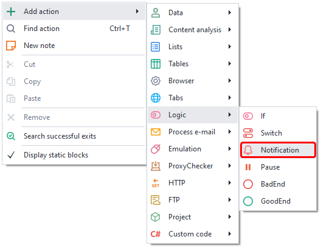
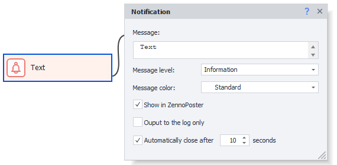
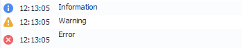
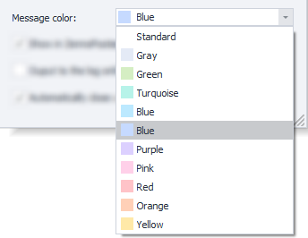
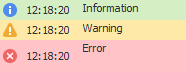
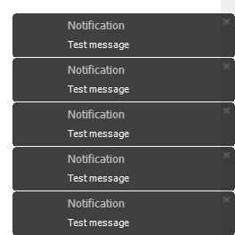

---
sidebar_position: 3
title: "Notification (Log Entry)"
description: ""
date: "2025-08-04"
converted: true
originalFile: "Оповещение (NotificationЗапись в лог).txt"
targetUrl: "https://zennolab.atlassian.net/wiki/spaces/RU/pages/534053050/Notification"
---
import DisclaimerNotice from '@site/src/components/DisclaimerNotice';

<DisclaimerNotice />

> 🔗 **[Original page](https://zennolab.atlassian.net/wiki/spaces/RU/pages/534053050/Notification)** — Source of this material

_______________________________________________  

## Description

This block lets you notify the template user about events and actions happening in your project. Messages will show up in the [❗→ Log window](https://zennolab.atlassian.net/wiki/spaces/RU/pages/725352532 "https://zennolab.atlassian.net/wiki/spaces/RU/pages/725352532").

  

## How to add this action to your project?

Through the context menu **Add action** → **Logic** → **Notification**

Or use the [❗→ smart search](https://zennolab.atlassian.net/wiki/spaces/RU/pages/506200090/ProjectMaker+7#%D0%A3%D0%BC%D0%BD%D1%8B%D0%B9-%D0%BF%D0%BE%D0%B8%D1%81%D0%BA-%D0%B4%D0%B5%D0%B9%D1%81%D1%82%D0%B2%D0%B8%D0%B9 "https://zennolab.atlassian.net/wiki/spaces/RU/pages/506200090/ProjectMaker+7#%D0%A3%D0%BC%D0%BD%D1%8B%D0%B9-%D0%BF%D0%BE%D0%B8%D1%81%D0%BA-%D0%B4%D0%B5%D0%B9%D1%81%D1%82%D0%B2%D0%B8%D0%B9").

  

## Where can this be used?

- Logging actions in the template
- Notifying users about changes
- Notifying about the template version

  

## How to use the action?

### Message Text

Enter the text that will appear for the user here. You can use any macros.

### Message Level

The only difference is the icons shown before the message.

:::note FYI
In the Log window, you can sort messages by type.
:::

### Message Color

:::info Info
Added in ZennoPoster 7.2.1.0
:::

Lets you choose a background color for the message in the [❗→ log window](https://zennolab.atlassian.net/wiki/spaces/RU/pages/725352532 "https://zennolab.atlassian.net/wiki/spaces/RU/pages/725352532").

:::note FYI
In the Log window, you can sort messages by their color.
:::

### Show in ZennoPoster

If checked, the notification will appear both in ProjectMaker and ZennoPoster.

If unchecked, it will only appear in PM.

### Only output to log

If checked, the notification will show only in the log and will not pop up on the desktop.

:::note FYI
In the program settings, you can enable the option "Only output notification to log" and then all messages will ALWAYS appear ONLY in the log.
:::

### Auto close after N seconds

This option sets how long the notification will stay on the desktop when it pops up.

  

## Example of use

For example, you can notify the user about successful completion of an action, stages of template work, number of processed items, and so on.

  

## Useful links

- [❗→ Working with variables](https://zennolab.atlassian.net/wiki/spaces/RU/pages/486309922 "https://zennolab.atlassian.net/wiki/spaces/RU/pages/486309922")
- [❗→ Log window](https://zennolab.atlassian.net/wiki/spaces/RU/pages/725352532 "https://zennolab.atlassian.net/wiki/spaces/RU/pages/725352532")