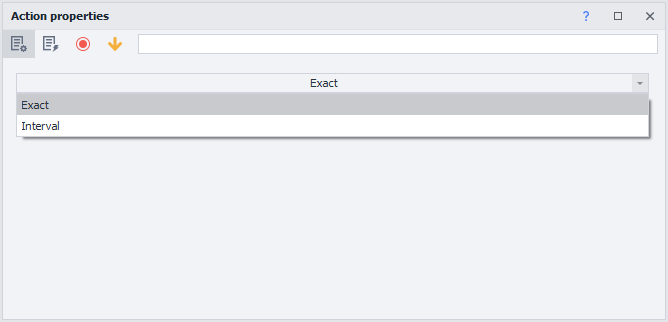
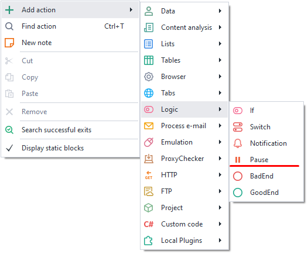
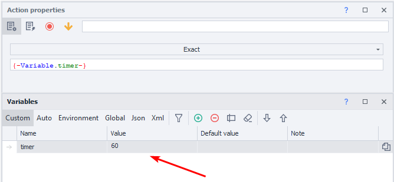
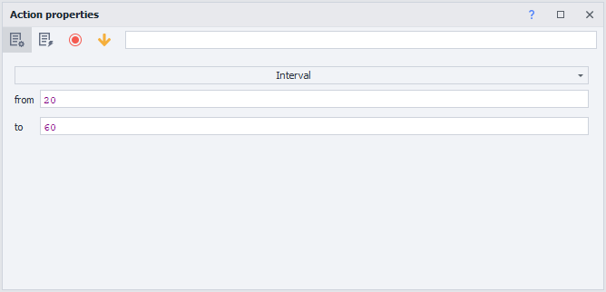

---
sidebar_position: 4
title: "Pause"
description: ""
date: "2025-08-04"
converted: true
originalFile: "Пауза.txt"
targetUrl: "https://zennolab.atlassian.net/wiki/spaces/RU/pages/534053057"
---
:::info **Please read the [*Terms of Use for materials on this site*](../Disclaimer).**
:::

> 🔗 **[Original page](https://zennolab.atlassian.net/wiki/spaces/RU/pages/534053057)** — Source for this material

_______________________________________________  

## Description

This action stops the project for a specified period of time, measured in seconds.

## How do I add this action to a project?

Through the context menu **Add Action** → **Logic** → **Pause**

Or you can use the [❗→ smart search](https://zennolab.atlassian.net/wiki/spaces/RU/pages/506200090/ProjectMaker+7#%D0%A3%D0%BC%D0%BD%D1%8B%D0%B9-%D0%BF%D0%BE%D0%B8%D1%81%D0%BA-%D0%B4%D0%B5%D0%B9%D1%81%D1%82%D0%B2%D0%B8%D0%B9 "https://zennolab.atlassian.net/wiki/spaces/RU/pages/506200090/ProjectMaker+7#%D0%A3%D0%BC%D0%BD%D1%8B%D0%B9-%D0%BF%D0%BE%D0%B8%D1%81%D0%BA-%D0%B4%D0%B5%D0%B9%D1%81%D1%82%D0%B2%D0%B8%D0%B9").

## What is this used for?

- To wait for a website to fully load
- To simulate human behavior on a site by adding random pauses
- To set a time gap between actions

## How do I work with this action?

:::info Information
The value is set in seconds. If you use variables, the value must be numeric.
:::

### **Exact**

The project will pause for the specified number of seconds. You can enter the value directly or use a variable with a numeric value.

  

### **Interval**

Specify a pause within the given numeric range; you can use variables.

- **From** — minimum time in seconds.
- **To** — the maximum pause in seconds, **EXCLUSIVE.**

The project will wait for an amount of time randomly chosen from the range of 20 to 59 seconds.

  

## Example usage

Let’s say you need to perform several similar actions on a website. To keep them from looking too robotic because of how quickly they run, we recommend adding random pauses between the actions.

It would look like this:

1. Load the resource
2. Perform the necessary actions
3. Set a pause in the range
4. Perform actions

By adding pauses between your actions, the website will see you as a “real” user, and not a bot.

  

## Useful links

1. [❗→ Go to page](https://zennolab.atlassian.net/wiki/spaces/RU/pages/534052989/Navigate "https://zennolab.atlassian.net/wiki/spaces/RU/pages/534052989/Navigate")