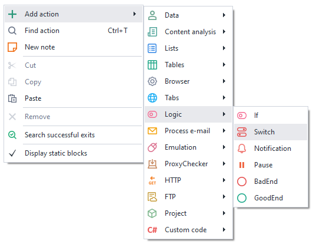
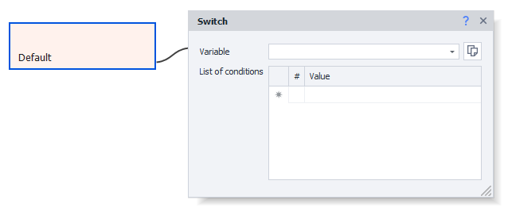
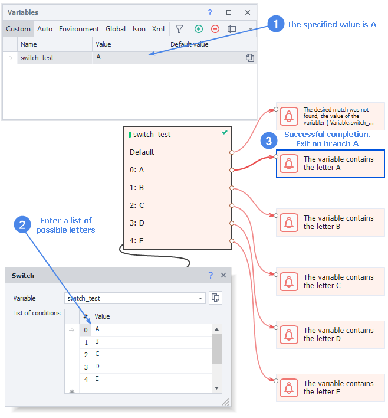

---
sidebar_position: 2
title: "Switch (choosing from multiple options)"
description: ""
date: "2025-08-04"
converted: true
originalFile: "Switch (выбор из нескольких вариантов).txt"
targetUrl: "https://zennolab.atlassian.net/wiki/spaces/RU/pages/534085864/Switch"
---
:::info **Please read the [*Rules for using materials on this resource*](../Disclaimer).**
:::

> 🔗 **[Original page](https://zennolab.atlassian.net/wiki/spaces/RU/pages/534085864/Switch)** — Source of this material

_______________________________________________  

## Description

The Switch operator is an extended version of [❗→ IF (the "If ... then ..." condition)](https://zennolab.atlassian.net/wiki/spaces/RU/pages/534315151 "https://zennolab.atlassian.net/wiki/spaces/RU/pages/534315151") .

While the *IF* operator has only two outcomes - *True* or *False* (green or red branches), *Switch* allows you to select from multiple options. If none of the options match, the block will exit through the "Default" branch.

  

## How do I add this action to a project?

Via the context menu **Add action** → **Logic** → **Switch**




Or use [❗→ smart search](https://zennolab.atlassian.net/wiki/spaces/RU/pages/506200090/ProjectMaker+7#%D0%A3%D0%BC%D0%BD%D1%8B%D0%B9-%D0%BF%D0%BE%D0%B8%D1%81%D0%BA-%D0%B4%D0%B5%D0%B9%D1%81%D1%82%D0%B2%D0%B8%D0%B9 "https://zennolab.atlassian.net/wiki/spaces/RU/pages/506200090/ProjectMaker+7#%D0%A3%D0%BC%D0%BD%D1%8B%D0%B9-%D0%BF%D0%BE%D0%B8%D1%81%D0%BA-%D0%B4%D0%B5%D0%B9%D1%81%D1%82%D0%B2%D0%B8%D0%B9").

  

## What is it used for?

- Selecting an option from a list
- Checking for a specific occurrence (match)

  

## How do you use this action?




### Variable

Here you need to specify the variable you want to check

:::info Information
Starting from version 7.4.0.0, you can create a new variable directly from this field (before that, you could only select an existing one).
:::

### List of conditions

Here you need to set the exit conditions. The value from the *variable* will be compared with each of the conditions, and if a match is found, it will follow the corresponding branch.

You can use not only hardcoded text as a condition, but also [❗→ variables](https://zennolab.atlassian.net/wiki/spaces/RU/pages/735608872 "https://zennolab.atlassian.net/wiki/spaces/RU/pages/735608872"):


### Default

If there aren't any matches, the action will proceed through the *Default* branch.

:::note Note
If the Default branch is not connected to any actions and execution hits it, the action will finish with an error.
:::

### Example




  

## Example usage

Let's imagine a situation where the variable **switch\_test** has some value.

Next, we'll create [❗→ Notification (Notification/Log entry)](https://zennolab.atlassian.net/wiki/spaces/RU/pages/534053050 "https://zennolab.atlassian.net/wiki/spaces/RU/pages/534053050") actions for each option.

Video example


**📹 There was a video here**

<details>
<summary>For those who want to work with C# code</summary>

You can implement similar functionality using C# [❗→ C# code (.NET C# code)](https://zennolab.atlassian.net/wiki/spaces/RU/pages/492011596 "https://zennolab.atlassian.net/wiki/spaces/RU/pages/492011596") 

Example code for the scenario above

```csharp
string switch_var = project.Variables["switch_test"].Value;
switch(switch_var){
case "A": 
	project.SendInfoToLog("The variable contains the letter A", true);
	break;
case "B": 
	project.SendInfoToLog("The variable contains the letter B", true);
	break;
case "C": 
	project.SendInfoToLog("The variable contains the letter C", true);
	break;
case "D": 
	project.SendInfoToLog("The variable contains the letter B", true);
	break;
case "E": 
	project.SendInfoToLog("The variable contains the letter E", true);
	break;
default:
	project.SendInfoToLog("No suitable match found, variable value: " + project.Variables["switch_test"].Value, true);
	break;
}
```

</details>
  

## Useful links

- [❗→ Working with variables](https://zennolab.atlassian.net/wiki/spaces/RU/pages/486309922 "https://zennolab.atlassian.net/wiki/spaces/RU/pages/486309922")
- [❗→ Variables window](https://zennolab.atlassian.net/wiki/spaces/RU/pages/735608872 "https://zennolab.atlassian.net/wiki/spaces/RU/pages/735608872")
- [❗→ IF (the "If ... then ..." condition)](https://zennolab.atlassian.net/wiki/spaces/RU/pages/534315151 "https://zennolab.atlassian.net/wiki/spaces/RU/pages/534315151")
- [❗→ Notification (Notification/Log entry)](https://zennolab.atlassian.net/wiki/spaces/RU/pages/534053050 "https://zennolab.atlassian.net/wiki/spaces/RU/pages/534053050")