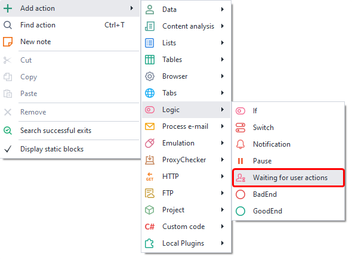
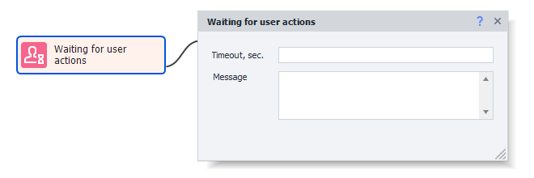
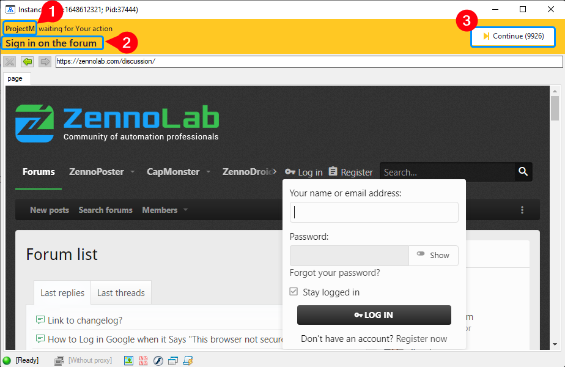

---
sidebar_position: 5
title: "Waiting for User Actions"
description: ""
date: "2025-08-04"
converted: true
originalFile: "Ожидание действий пользователя.txt"
targetUrl: "https://zennolab.atlassian.net/wiki/spaces/RU/pages/2110259201"
---
:::info **Please read the [*Material Usage Rules on this site*](../Disclaimer).**
:::

> 🔗 **[Original page](https://zennolab.atlassian.net/wiki/spaces/RU/pages/2110259201)** — Source for this material

_______________________________________________  

:::info Information
Added in ZennoPoster 7.7.0.0  
In previous versions, this action was one of the sub-functions of the Browser Settings action.
:::

## Description

This action is useful in cases where you need to manually perform certain actions inside the ZennoPoster browser.

## How do you add this action to your project?

Through the context menu **Add Action** → **Logic** → **Waiting for User Actions**

Or use the [❗→ Smart Search](https://zennolab.atlassian.net/wiki/spaces/RU/pages/506200090/ProjectMaker+7#%D0%A3%D0%BC%D0%BD%D1%8B%D0%B9-%D0%BF%D0%BE%D0%B8%D1%81%D0%BA-%D0%B4%D0%B5%D0%B9%D1%81%D1%82%D0%B2%D0%B8%D0%B9 "https://zennolab.atlassian.net/wiki/spaces/RU/pages/506200090/ProjectMaker+7#%D0%A3%D0%BC%D0%BD%D1%8B%D0%B9-%D0%BF%D0%BE%D0%B8%D1%81%D0%BA-%D0%B4%D0%B5%D0%B9%D1%81%D1%82%D0%B2%D0%B8%D0%B9").

## How does this action work?

### Timeout

The number of seconds within which all necessary actions must be completed (if unknown, set for example 99999). When the timeout elapses, the template will continue running.

### Message

The text that will be shown to you at the top of the opened instance window.

## User Action Wait Window

After this action runs, a browser window will open.
At the top of the window (on an orange background), the project name (1) that opened this window is displayed in the top left (in this case, *ProjectM).
Below the project name is the text you set for the action (2).
To the right is the “Continue” button (3), and in parentheses is the number of seconds remaining until the window closes automatically.

## Example usage

You can use this action for those template users who are hesitant to save login data for websites or to enter credit card information.

## Useful links

- [❗→ Browser Settings](https://zennolab.atlassian.net/wiki/spaces/RU/pages/489324572 "https://zennolab.atlassian.net/wiki/spaces/RU/pages/489324572")