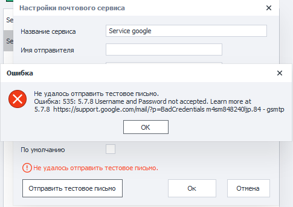
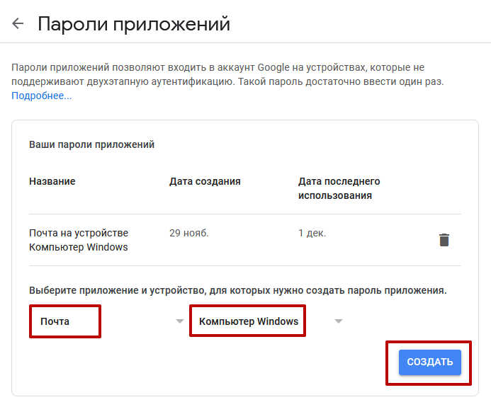
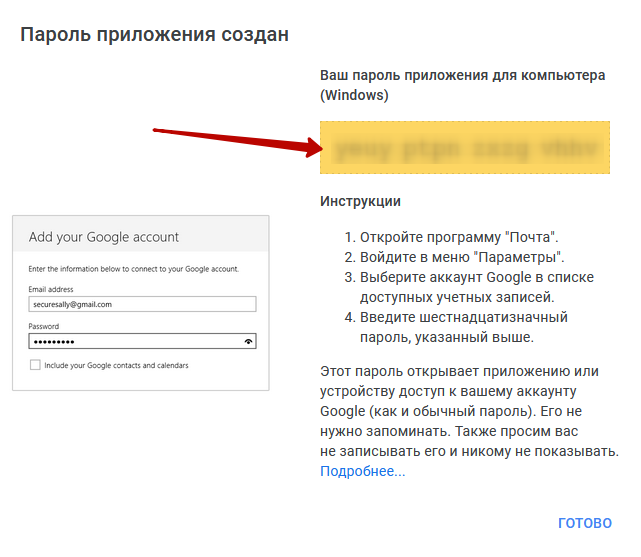
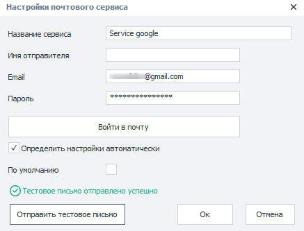
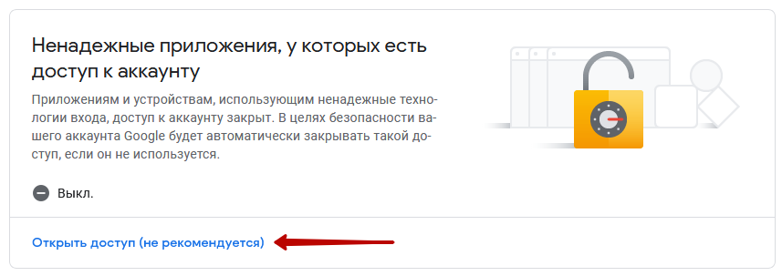
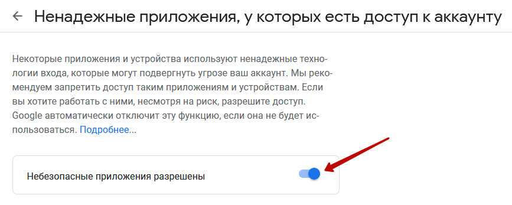
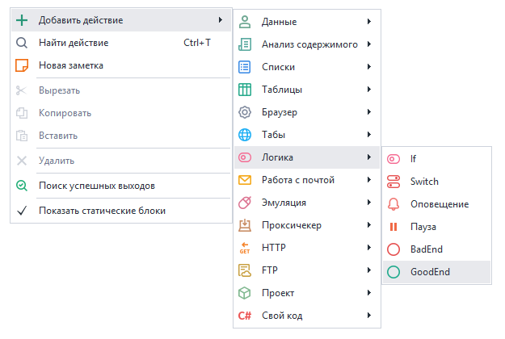

---
sidebar_position: 2
title: "Google.com"
description: ""
date: "2025-08-04"
converted: true
originalFile: "Google.com.txt"
targetUrl: "https://zennolab.atlassian.net/wiki/spaces/RU/pages/1406632097/Google.com"
---
:::info **Please review the [*Terms of Use for materials on this resource*](../Disclaimer).**
:::

> 🔗 **[Original page](https://zennolab.atlassian.net/wiki/spaces/RU/pages/1406632097/Google.com)** — Source of this material

_______________________________________________  
# Google.com

When trying to send a test message (given that your password is correct), you might get an error saying `Username and password not accepted`. This is related to Google's security policy, which considers all third-party apps to be unsafe.

This may mean that access for third-party apps is not enabled in your Google account.

**There are two ways to resolve this:** create an app password (if two-step verification is enabled), or allow access for less secure apps (if two-step verification is disabled).

### Creating an App Password

Using an app password is the most preferred way to use your Google mail account, for security reasons.

To create an app password, you need to enable two-step verification. If for any reason this is not possible, you won’t be able to create an app password.

Enabling two-step verification is described in [this article](https://support.google.com/accounts/answer/185839 "https://support.google.com/accounts/answer/185839").

After this, please do the following steps.

1. On the "Google Account" page, open the [Security](https://myaccount.google.com/security "https://myaccount.google.com/security") section and go to “[App Passwords](https://myaccount.google.com/apppasswords "https://myaccount.google.com/apppasswords")“
2. In the window that opens, choose App → Mail, Device → Windows Computer in the dropdown lists, and click the “Create” button

3. The generated password will be shown in the open window; you need to copy it and paste it into the **mail service settings**

4. After that, repeat the test mail send. If everything is done correctly, the status line will say “Test email sent successfully“.

### Allowing Access for Less Secure Apps

This method is available only if two-step verification is disabled.

To solve this, you need to do the following:

1. On the "Google Account" page, open the [Security](https://myaccount.google.com/security "https://myaccount.google.com/security") section, find the “Less secure apps with access to your account” area, and at the bottom of the page follow the “[Allow access](https://myaccount.google.com/lesssecureapps "https://myaccount.google.com/lesssecureapps")“ link

2. On the page that opens, check the box for “Allow less secure apps“

3. After that, repeat the test mail send. If everything is done correctly, the status line will say “Test email sent successfully“.

