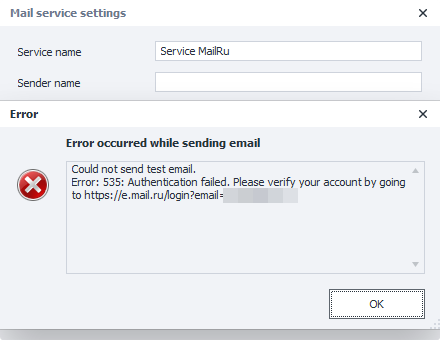
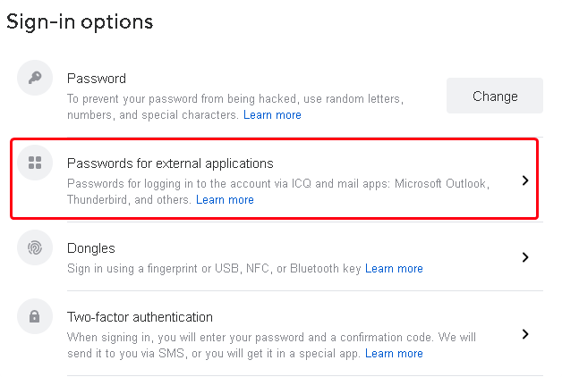
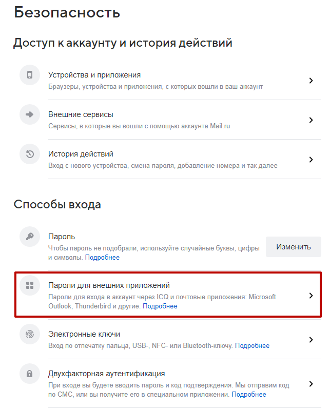
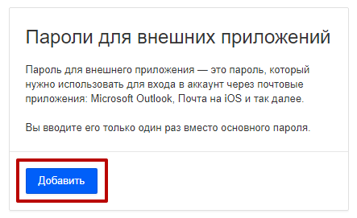
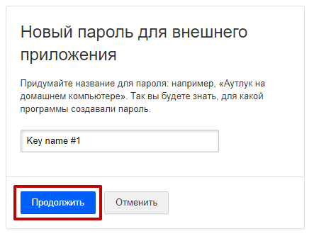
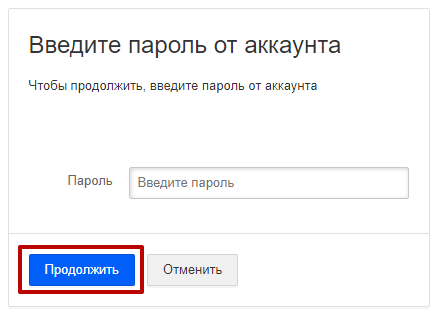
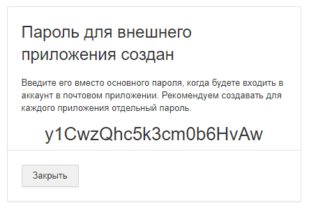

:::info **Please read the [*Material Usage Rules on this site*](../../../../../../Disclaimer).**
:::

> 🔗 **[Original page](https://zennolab.atlassian.net/wiki/spaces/RU/pages/2060156937/Mail.ru)** — Source of this material

_______________________________________________  

When trying to send a test message (as long as the password is entered correctly), you may receive an error message: `535: Authentication failed. Please verify your account by going to https://e.mail.ru/login?email=`.

This may be due to Mail.ru's security policy, which requires you to use a separate password specifically created for access from third-party services.

**To create a password, please do the following:**

Open your Mail.ru account settings in your browser and go to **"Settings" → "All settings" → "Security"**

Go to the **"Passwords for external applications"** setting

On the new page that opens, click the **"Add"** button

Set any name you'd like for the new password and click the **"Continue"** button

Then, enter your main account password and click the **"Continue"** button

After this, Mail.ru will generate a password for access by external applications.

You need to copy the generated password and paste it into the **Mail service settings**