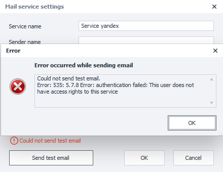
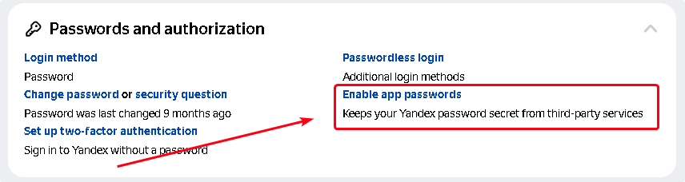
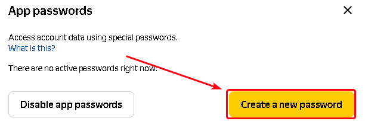
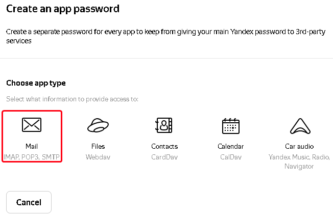
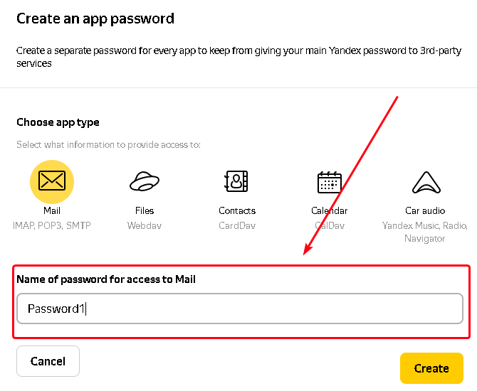
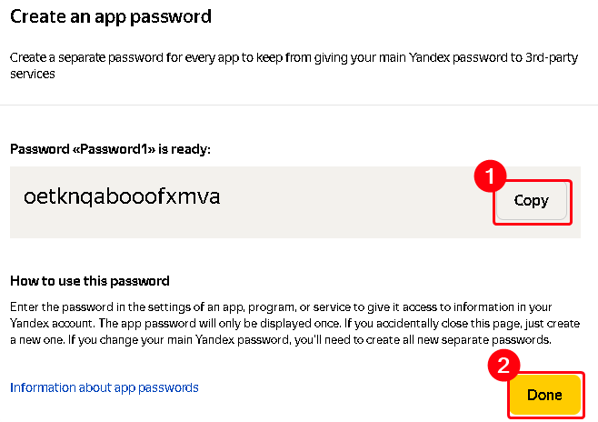
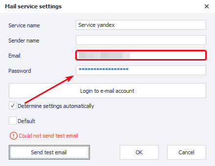
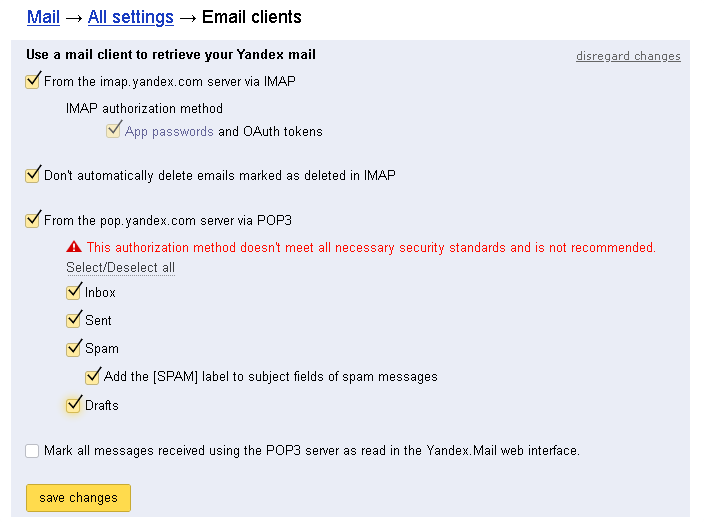
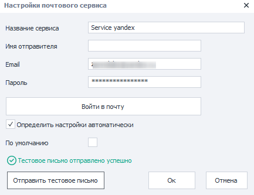

:::info **Please read the [*Material Usage Rules on this site*](../../../../../../Disclaimer).**
:::

> 🔗 **[Original page](https://zennolab.atlassian.net/wiki/spaces/RU/pages/1406632028/Yandex.ru)** — Source of this material

_______________________________________________  

If you try to send a test message (assuming that the password is correct), you may get an error saying that `This user does not have access rights to this service`. 

This means Yandex has recognized you, but you don't have access to your mailbox through third-party services.

**To resolve this, you need to do the following:**

1. Open your profile page on Yandex.Passport https://passport.yandex.ru/profile. Scroll down to **Passwords and Authorization → App Passwords.**

2. In the window that opens, select "Create new password"

3. Choose the application type "Mail"

4. Enter any name for the password (1) and click the "Create" button (2)

5. In the window that appears, click the "Copy" button (1) and the "Done" button (2)

6. Paste the copied password into the properties of the Zennoposter mail service

7. Next, go to the mail settings page **Mail → All settings → Email programs** [<u data-renderer-mark="true">https://mail.yandex.ru/?uid=322585007#setup/client</u>](https://mail.yandex.ru/?uid=322585007#setup/client "https://mail.yandex.ru/?uid=322585007#setup/client")
8. Allow access to your mailbox from third-party mail clients and save the changes.

9. After this, try sending a test email again. If everything is done correctly, the status line will say "Test email sent successfully".

