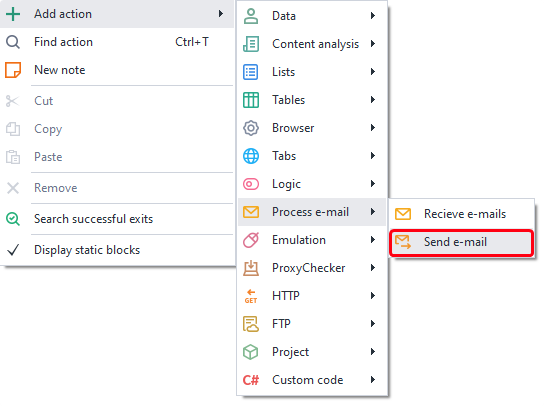
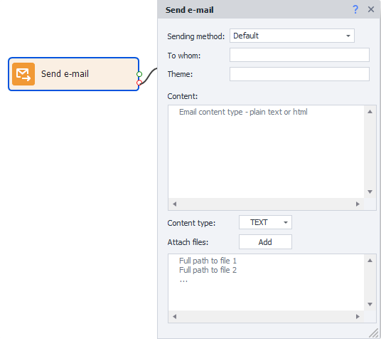

---
sidebar_position: 0
title: "Send Email"
description: ""
date: "2025-08-04"
converted: true
originalFile: "Отправить почту.txt"
targetUrl: "https://zennolab.atlassian.net/wiki/spaces/RU/pages/1399914500"
slug: PM_Editor_Actions_SendMail
---
import DisclaimerNotice from '@site/src/components/DisclaimerNotice';

<DisclaimerNotice />

> 🔗 **[Original page](https://zennolab.atlassian.net/wiki/spaces/RU/pages/1399914500)** — Source of this material

_______________________________________________  

## Description

Send a notification to any email address using an SMTP server.

  

## How to add this action to your project?

Via the context menu: **Add action → Mail operations → Send email**

Or use the [❗→ Smart Search](https://zennolab.atlassian.net/wiki/spaces/RU/pages/506200090/ProjectMaker+7#%D0%A3%D0%BC%D0%BD%D1%8B%D0%B9-%D0%BF%D0%BE%D0%B8%D1%81%D0%BA-%D0%B4%D0%B5%D0%B9%D1%81%D1%82%D0%B2%D0%B8%D0%B9 "https://zennolab.atlassian.net/wiki/spaces/RU/pages/506200090/ProjectMaker+7#%D0%A3%D0%BC%D0%BD%D1%8B%D0%B9-%D0%BF%D0%BE%D0%B8%D1%81%D0%BA-%D0%B4%D0%B5%D0%B9%D1%81%D1%82%D0%B2%D0%B8%D0%B9").

  

## What is this used for?

- You can use it to send notifications about project events, such as successful completion, errors, and more.
- Send messages to specified email addresses from your own address.

  

## How do you work with this action?

:::info Information
First, you need to add accounts to the program that will be used to send notifications. You can do this in the settings, under the Mail tab.
:::

### Sending method

The account from which the notification will be sent. You can add a new account in the [❗→ program settings](https://zennolab.atlassian.net/wiki/spaces/RU/pages/2096660481 "https://zennolab.atlassian.net/wiki/spaces/RU/pages/2096660481").
You can also use [❗→ project variables](https://zennolab.atlassian.net/wiki/spaces/RU/pages/486309922 "https://zennolab.atlassian.net/wiki/spaces/RU/pages/486309922") in this field.

### Recipient

The recipient's email address.

### Subject

The subject of the email.

### Body

The message text. You can use HTML markup.

### Content type

- TEXT — select this option if the “Body” is plain text.
- HTML — select this if the “Body” contains HTML markup.

### Attach files

You can send any number of files along with your email. Enter the file paths in this field, one path per line.
You can enter the paths manually, select them with the “Add” button, or specify them using [❗→ project variables](https://zennolab.atlassian.net/wiki/spaces/RU/pages/486309922 "https://zennolab.atlassian.net/wiki/spaces/RU/pages/486309922").

  

## Useful links

- [❗→ Mail (PM)](https://zennolab.atlassian.net/wiki/spaces/RU/pages/2096660481 "https://zennolab.atlassian.net/wiki/spaces/RU/pages/2096660481")
- [❗→ Receive email](https://zennolab.atlassian.net/wiki/spaces/RU/pages/735576144 "https://zennolab.atlassian.net/wiki/spaces/RU/pages/735576144")