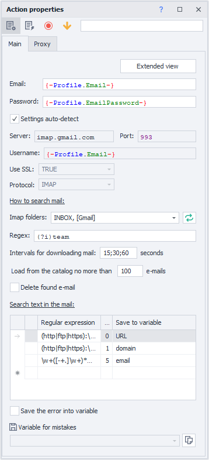
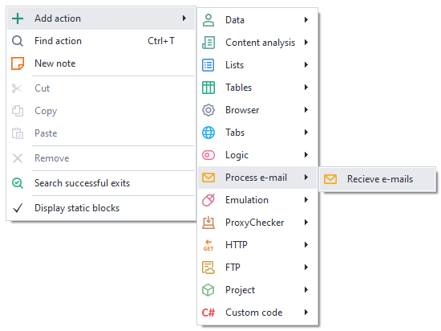
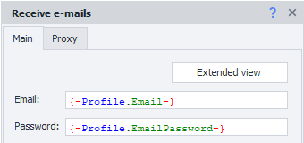
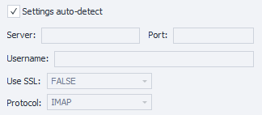
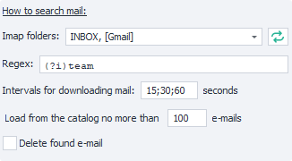
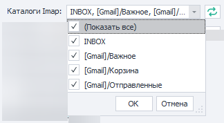
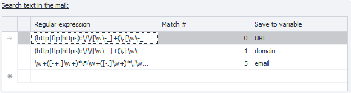
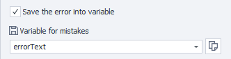
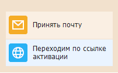

---
sidebar_position: 1
title: "Receive Mail"
description: ""
date: "2025-08-04"
converted: true
originalFile: "Принять почту.txt"
targetUrl: "https://zennolab.atlassian.net/wiki/spaces/RU/pages/735576144"
---
import DisclaimerNotice from '@site/src/components/DisclaimerNotice';

<DisclaimerNotice />

> 🔗 **[Original page](https://zennolab.atlassian.net/wiki/spaces/RU/pages/735576144)** — Source of this material

_______________________________________________  

## Description

Work with email accounts without using a browser window. Allows you to find the needed email and information inside it. Suitable for bulk processing of incoming messages.

## How do I add this action to a project?

Via the context menu **Add action** → **Work with mail** → **Receive mail**

Or use the [❗→ smart search](https://zennolab.atlassian.net/wiki/spaces/RU/pages/506200090/ProjectMaker+7#%D0%A3%D0%BC%D0%BD%D1%8B%D0%B9-%D0%BF%D0%BE%D0%B8%D1%81%D0%BA-%D0%B4%D0%B5%D0%B9%D1%81%D1%82%D0%B2%D0%B8%D0%B9 "https://zennolab.atlassian.net/wiki/spaces/RU/pages/506200090/ProjectMaker+7#%D0%A3%D0%BC%D0%BD%D1%8B%D0%B9-%D0%BF%D0%BE%D0%B8%D1%81%D0%BA-%D0%B4%D0%B5%D0%B9%D1%81%D1%82%D0%B2%D0%B8%D0%B9").

## What is this used for?

- Quick access to emails
- Getting data from an email
- Activating accounts on websites
- Deleting specific emails from the inbox
- Deleting downloaded emails

## How do I use the action?

:::note Note
Before using this action, please make sure the IMAP option is enabled in your account.
:::

### “Main” tab

#### Advanced view

Clicking this button will open the [❗→ Mail Processing](https://zennolab.atlassian.net/wiki/spaces/RU/pages/534086094/e-mail "https://zennolab.atlassian.net/wiki/spaces/RU/pages/534086094/e-mail") window.

#### Email

Email address.

#### Password

Password for the email account.

  

#### Connection settings

##### **Auto-detect settings**

When enabled, ZennoPoster will automatically select the parameters needed to connect to the mail server.

:::warning Attention
This does not work with all mail providers.
:::

##### **Server, Port, Username, Use SSL, Protocol**

All these parameters should be clarified in the documentation for your chosen mail provider.

  

#### How to search for an email

##### **IMAP Folders**

Here you can select the folders in your email account where the search for emails will be performed.

Using the button to the right of the selected folders field, you can refresh the folder list.

##### **Reg. exp. (Regular Expression)**

In this field, you need to enter a [❗→ regular expression](https://zennolab.atlassian.net/wiki/spaces/RU/pages/534086111 "https://zennolab.atlassian.net/wiki/spaces/RU/pages/534086111") by which the mail will be searched.

##### **Email loading intervals**

Emails from services might arrive with a delay, so you should specify the time interval in seconds and the number of attempts to download the message list. The delimiter "**;**" in the screenshot indicates the number of attempts. The first attempt after *15 sec, the second after *30 sec, the third after *60 sec.

##### **No more than emails to load from folder**

Specify the number of emails to be loaded.

##### **Delete found email**

If this is enabled, the found email will be deleted from the mailbox after processing.

  

#### Search for text in email

You can save the results of several regular expressions at once!
For example, if an email contains an activation code, website address, phone number, first and last name — you can extract all this in one go! Just create a regular expression for each item and add variables to store the results.

##### **Regular Expression**

Enter the regular expression here to find the desired text.

##### **Match number**

Often a single [❗→ regular expression](https://zennolab.atlassian.net/wiki/spaces/RU/pages/534086111 "https://zennolab.atlassian.net/wiki/spaces/RU/pages/534086111") can produce several results. This shows the serial number of the found item (counting starts from zero!).

:::warning Attention
It’s not recommended to hard-code the match number in your projects. Today the email might have one structure and the required link is the second match, but tomorrow the structure may change and the link could be the seventh match. Try to write your regular expressions so that only one result remains.
:::

##### **Save to variable**

In this column you should select an existing variable or create a new one to save the result of the regular expression.

  

#### Save error to variable

If an error occurs during execution of the action, you can save its message by enabling this setting and selecting (or creating) a variable where the message will be stored.

  

### “Proxy” tab

### No proxy

The action will run using the real IP address of the computer/server.

### Current project proxy

Uses the [❗→ proxy set in the project](https://zennolab.atlassian.net/wiki/spaces/RU/pages/489324572#%D0%A3%D1%81%D1%82%D0%B0%D0%BD%D0%BE%D0%B2%D0%B8%D1%82%D1%8C-%D0%BF%D1%80%D0%BE%D0%BA%D1%81%D0%B8 "https://zennolab.atlassian.net/wiki/spaces/RU/pages/489324572#%D0%A3%D1%81%D1%82%D0%B0%D0%BD%D0%BE%D0%B2%D0%B8%D1%82%D1%8C-%D0%BF%D1%80%D0%BE%D0%BA%D1%81%D0%B8").

### Format string

Enter the proxy in this format (you can use a [❗→ variable](https://zennolab.atlassian.net/wiki/spaces/RU/pages/486309922 "https://zennolab.atlassian.net/wiki/spaces/RU/pages/486309922")):  
a) *With authentication* – `socks5://login:password@ip:port` or `http://login:password@ip:port`  
b) *Without authentication* – `socks5://ip:port` or `http://ip:port`  
c) *Without protocol (default is http://)* – `login:password@ip:port` or `ip:port`  

### Other

Select this if you need to set detailed proxy settings: type, authentication data, address, and port. Please check with your service provider for details.

:::note Note
You can use variables in any input field.
:::

:::warning Attention
If the proxy protocol is not specified, http:// will be used by default.
:::

  

## Example usage

After registering on a website, you'll need to confirm your account by going to your mailbox, getting the activation link, and following it to verify your account.

1. Register on the website.  
2. Add the *Receive mail* action to your project and configure it.  
3. Get the activation link from the required email.  
4. Go to the link.  
5. Your account is activated.  

When working with mass actions on websites, working without a browser saves time and resources. The project won't load the email provider's site. So this action allows you to quickly process emails in mailboxes.

  

## Useful links

1. [❗→ E-mail Handling](https://zennolab.atlassian.net/wiki/spaces/RU/pages/534086094/e-mail "https://zennolab.atlassian.net/wiki/spaces/RU/pages/534086094/e-mail")
2. [❗→ Regular Expression Tester](https://zennolab.atlassian.net/wiki/spaces/RU/pages/534086111 "https://zennolab.atlassian.net/wiki/spaces/RU/pages/534086111")