:::info **Please read the [*Terms of Use for materials on this resource*](../Disclaimer).**
:::

> 🔗 **[Original page](https://zennolab.atlassian.net/wiki/spaces/RU/pages/475365697)** — Source of this material

_______________________________________________  
# Plugins

## Description

Plugins are actions created by the user.
Essentially, they are templates with a [❗→ bot interface (BotUI)](https://zennolab.atlassian.net/wiki/spaces/RU/pages/725352539 "https://zennolab.atlassian.net/wiki/spaces/RU/pages/725352539") saved in a special way. Plugins have the `.zpg` extension and can return the result of their work. 

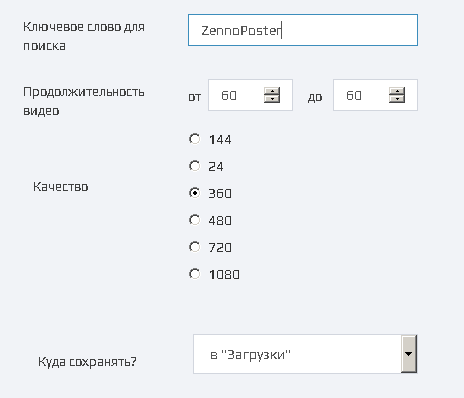

Every input field supports [❗→ variable macros](https://zennolab.atlassian.net/wiki/spaces/RU/pages/486309922 "https://zennolab.atlassian.net/wiki/spaces/RU/pages/486309922").

  

Plugins are very similar to a [❗→ project within a project](https://zennolab.atlassian.net/wiki/spaces/RU/pages/489291822 "https://zennolab.atlassian.net/wiki/spaces/RU/pages/489291822"), but they're much more convenient:

- you can create an easy-to-use interface for passing values to it (if you use project-in-project, you have to map variables from the main template to the called one, which often means switching to the sub-template just to remember why a certain [❗→ variable](https://zennolab.atlassian.net/wiki/spaces/RU/pages/486309922 "https://zennolab.atlassian.net/wiki/spaces/RU/pages/486309922") is used)
- plugins are installed once and then available in all projects as [❗→ standard actions](https://zennolab.atlassian.net/wiki/spaces/RU/pages/486342706 "https://zennolab.atlassian.net/wiki/spaces/RU/pages/486342706") (with project-in-project you have to specify the complete path to the called template every time, and if you move or rename the sub-template accidentally or intentionally, all projects calling it will break)
- you can [❗→ sell a template with unlimited plugins](https://zennolab.atlassian.net/wiki/spaces/RU/pages/494895200 "https://zennolab.atlassian.net/wiki/spaces/RU/pages/494895200") for just $12 (while using embedded projects increased the cost depending on the number of sub-templates)

## Where can this be used?

You can pack any repetitive actions into a plugin:

- for example, if you need to search for videos on YouTube and save their links. You already have a group of actions (or even a separate template) for this, and they're working great. To add this functionality to another template, you either use [❗→ project-in-project](https://zennolab.atlassian.net/wiki/spaces/RU/pages/489291822 "https://zennolab.atlassian.net/wiki/spaces/RU/pages/489291822") or copy and paste the actions where you need them. At first glance, copy-paste seems easy and convenient, but imagine you have 6 places in your template where you need to search for videos—so you copy the necessary actions 6 times. Everything works fine... but then you want to update the video search functionality. Now you must find all the places where you previously inserted those actions and update them (and if there are not one but 10-20-33 templates...). On the other hand, you can pack all this into a plugin and just call it. If you need to change how it works, you'll only need to update the plugin and reinstall it.
- sending notifications to Telegram/VK/other services. If you're only sending text, you can use a single [❗→ GET](https://zennolab.atlassian.net/wiki/spaces/RU/pages/534315165 "https://zennolab.atlassian.net/wiki/spaces/RU/pages/534315165") or [❗→ POST](https://zennolab.atlassian.net/wiki/spaces/RU/pages/534315180 "https://zennolab.atlassian.net/wiki/spaces/RU/pages/534315180") request block. But then you'll want to send formatted text, add images, audio files, and other attachments. Over time, one [❗→ action](https://zennolab.atlassian.net/wiki/spaces/RU/pages/486342706 "https://zennolab.atlassian.net/wiki/spaces/RU/pages/486342706") grows into a large group of blocks, and that's another great time to convert it into a plugin.
- take a random line from a given text file. For this, you need to create a separate list, link it to a file (preferably with a check to make sure the file exists), and get a random line from the list—at least three actions. Maybe you'll want all letters to be uppercase, or lowercase, or to trim the line to 80 characters. All this can be packed into a plugin.
- Any template can be made into a plugin. The only limit to using plugins is your imagination.

  

## Installing plugins in ProjectMaker

There are several ways to install ready-made plugins:

1. The simplest way is to double-click the plugin file. If a plugin with the same file name is already installed, a dialog box will ask if you want to replace it. If this is the first time installing the plugin, you'll see a message about successful installation.
2. Add via [❗→ settings](https://zennolab.atlassian.net/wiki/spaces/RU/pages/735379481/ "https://zennolab.atlassian.net/wiki/spaces/RU/pages/735379481/"). The advantage of this method is that you can select multiple files and install them all at once. If you try to add a plugin whose filename matches one that's already installed, a window will appear listing plugins that couldn't be installed. After adding, plugins are immediately ready to work.
3. Copy the plugins to the local directory on your computer (by default: `C:\Users\[user_name]\Documents\ZennoLab\Plugins\Local`). After that, you need to restart ProjectMaker.

## Removing plugins

1. Through [❗→ settings](https://zennolab.atlassian.net/wiki/spaces/RU/pages/735379481/ "https://zennolab.atlassian.net/wiki/spaces/RU/pages/735379481/"):

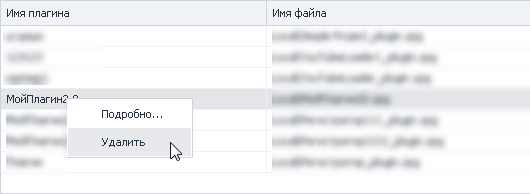

2. The second way is to delete the files from the local directory on your computer (in this case, it's best to restart ProjectMaker afterwards).

  

## How do I add plugins to a project?

There are several ways:

- Right-click context menu **Add Action** → **Local Plugins**
- At the very bottom of the [❗→ *Actions* window](https://zennolab.atlassian.net/wiki/spaces/RU/pages/727777324 "https://zennolab.atlassian.net/wiki/spaces/RU/pages/727777324")
- Or use the [❗→ smart search](https://zennolab.atlassian.net/wiki/spaces/RU/pages/506200090/ProjectMaker+7#%D0%A3%D0%BC%D0%BD%D1%8B%D0%B9-%D0%BF%D0%BE%D0%B8%D1%81%D0%BA-%D0%B4%D0%B5%D0%B9%D1%81%D1%82%D0%B2%D0%B8%D0%B9 "https://zennolab.atlassian.net/wiki/spaces/RU/pages/506200090/ProjectMaker+7#%D0%A3%D0%BC%D0%BD%D1%8B%D0%B9-%D0%BF%D0%BE%D0%B8%D1%81%D0%BA-%D0%B4%D0%B5%D0%B9%D1%81%D1%82%D0%B2%D0%B8%D0%B9").

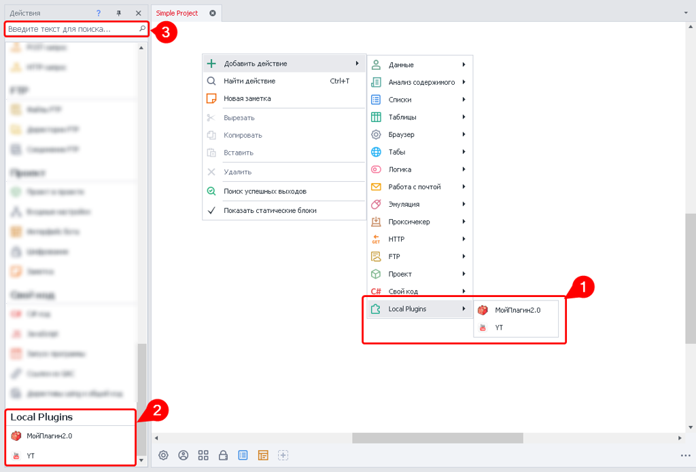

  

## How do I work with plugins?

Working with custom plugins is almost the same as working with standard [❗→ actions](https://zennolab.atlassian.net/wiki/spaces/RU/pages/486342706 "https://zennolab.atlassian.net/wiki/spaces/RU/pages/486342706")—you add the plugin to your project in whatever way is convenient, fill in [❗→ input settings](https://zennolab.atlassian.net/wiki/spaces/RU/pages/725352539 "https://zennolab.atlassian.net/wiki/spaces/RU/pages/725352539") (here you can use [❗→ project variables](https://zennolab.atlassian.net/wiki/spaces/RU/pages/486309922 "https://zennolab.atlassian.net/wiki/spaces/RU/pages/486309922"))

  

## Saving a template as a plugin

### How to save

There are several ways to save a template as a plugin:

- From the top menu, select *File–Publish Project* (or use the hotkey **Ctrl+Alt+P**). The project publication window appears; in the dropdown list "What to do", select *Save as Plugin*.

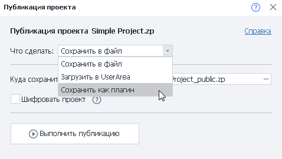

- In the same top menu, select *File–Save Project as Plugin*
- Right-click the tab of the required project in the projects window and choose *Save Project as Plugin* from the context menu

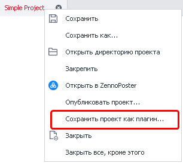

### Save Settings

#### Main window and "Plugin Settings" tab

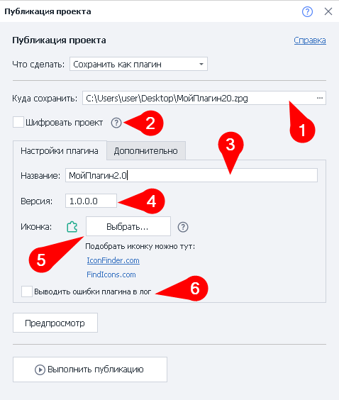

:::note Tip
If you hover over an input field or its name, a tooltip for that field will show up.
:::

##### **Where to save**

Choose where on your computer the plugin file will be saved.

:::note Tip
When you install the plugin in the program, this file is copied to the Installed Plugins Directory.
:::

##### **Encrypt project**

This option allows you to encrypt the entire project file. If embedding external libraries is enabled, they will also be encrypted.

:::warning Caution
When selling plugins, they should not be encrypted, as re-encryption is not possible. That is, you won’t be able to resell a plugin you bought yourself.
:::

##### **Name**

Set the plugin name (this is how it will be shown in ProjectMaker). 

:::note Tip
ProjectMaker allows saving plugins with the same name, but to avoid confusion try to give a unique name each time.
:::

##### **Version**

Set your desired plugin version.

##### **Icon**

Upload an icon for your plugin. 

Supported formats: png, ico, bmp; size: 16x16 up to 128x128. If your plugin has its own icon, it'll be easier to visually find it among other [❗→ actions](https://zennolab.atlassian.net/wiki/spaces/RU/pages/486342706 "https://zennolab.atlassian.net/wiki/spaces/RU/pages/486342706").

##### **Log plugin errors**

If this checkbox is checked and the template finishes with an unhandled error, the log will contain the error text (for example: "No HTML element found for the search criteria"). Otherwise, the log will only record "Plugin processing error".

#### "Advanced" tab

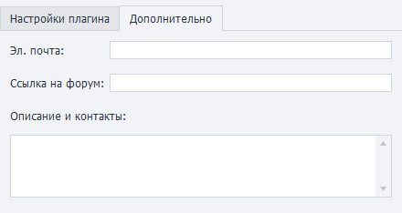

It's a good idea to fill out this tab if you plan to sell your plugin or share it with others. Here you can enter your email for feedback, add a description, extra contact info, and a link to the plugin's forum thread at http://zennolab.com (if you want to add the plugin file to the thread, you can first create and style the thread, publish it, add the link to the plugin, and then edit your post to add the plugin file itself).

#### Preview and publish

Before saving the plugin, you can click *Preview* to see how its description will look.

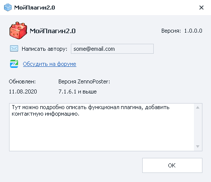

After you click "Publish", the project will be checked and compiled as a plugin. If no errors occur during compilation, two new buttons will appear: 

- Open folder with plugin
- Add to ProjectMaker

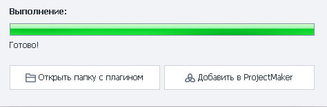

  

## Selling projects with plugins

For more details, see [❗→ Selling bots with plugins](https://zennolab.atlassian.net/wiki/spaces/RU/pages/494895200 "https://zennolab.atlassian.net/wiki/spaces/RU/pages/494895200") 

  

## Plugin input settings

Input settings for plugins are created using [❗→ BotUI](https://zennolab.atlassian.net/wiki/spaces/RU/pages/725352539 "https://zennolab.atlassian.net/wiki/spaces/RU/pages/725352539"). But when creating settings for plugins, there are some extra options—Mapper and return value.

### Mapper

This control lets you pass [❗→ lists](https://zennolab.atlassian.net/wiki/spaces/RU/pages/534053375 "https://zennolab.atlassian.net/wiki/spaces/RU/pages/534053375"), [❗→ tables](https://zennolab.atlassian.net/wiki/spaces/RU/pages/735903776 "https://zennolab.atlassian.net/wiki/spaces/RU/pages/735903776"), or [❗→ Google spreadsheets](https://zennolab.atlassian.net/wiki/spaces/RU/pages/509411347/ "https://zennolab.atlassian.net/wiki/spaces/RU/pages/509411347/") from the main template to the plugin.

:::warning Caution
Any changes made inside the plugin to the passed list/table will also affect the list/table in the main template!
:::

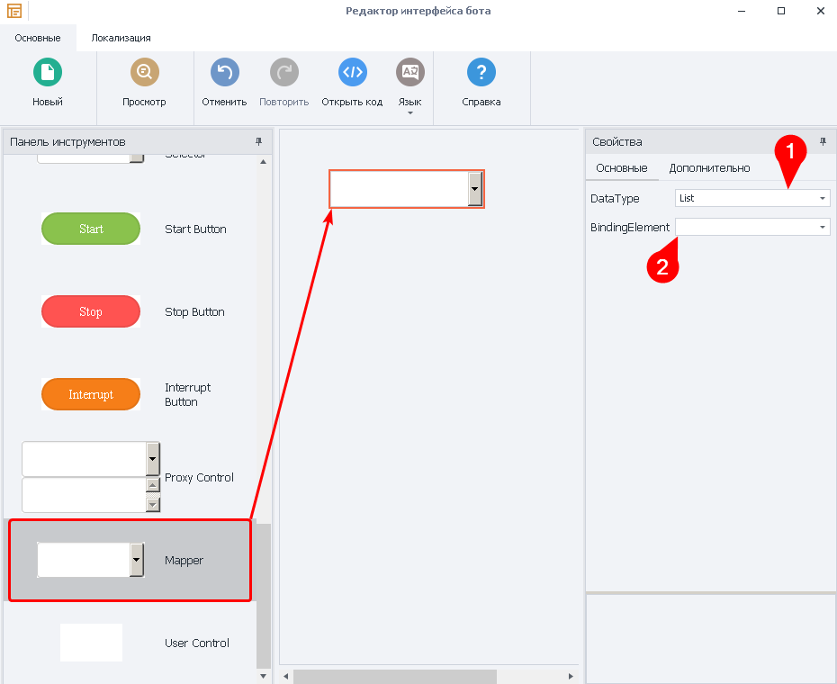

To add a *Mapper in the *Bot interface editor, scroll the toolbar all the way down and drag the control onto the main window. Click the added control and set up its settings (on the right):

1. DataType – type of the object being passed. Possible values:

 1. [❗→ List](https://zennolab.atlassian.net/wiki/spaces/RU/pages/534053375 "https://zennolab.atlassian.net/wiki/spaces/RU/pages/534053375")
 2. [❗→ Table (simple table)](https://zennolab.atlassian.net/wiki/spaces/RU/pages/735903776 "https://zennolab.atlassian.net/wiki/spaces/RU/pages/735903776")
 3. [❗→ GoogleSpreadsheet](https://zennolab.atlassian.net/wiki/spaces/RU/pages/509411347/ "https://zennolab.atlassian.net/wiki/spaces/RU/pages/509411347/")
2. BindingElement – the internal object (list or table) where data from the external template will be passed (this object must already exist when creating settings).

Now you can easily pass a list into the plugin:

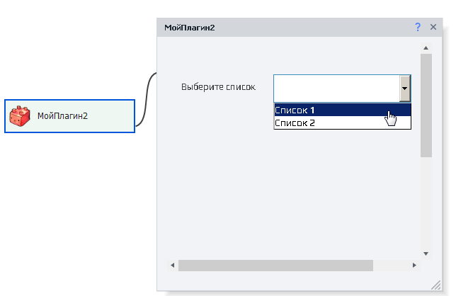

### Return value

A plugin can return the result of its work. To enable this feature, in the *Bot interface editor*, in the main window where you add controls, click in any empty space and check the *Return value (Plugin Mode)* checkbox on the right:

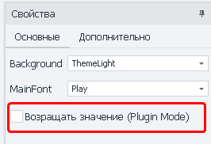

There are several types of return values:

1. [❗→ Variable](https://zennolab.atlassian.net/wiki/spaces/RU/pages/486309922 "https://zennolab.atlassian.net/wiki/spaces/RU/pages/486309922")
2. [❗→ List](https://zennolab.atlassian.net/wiki/spaces/RU/pages/534053375 "https://zennolab.atlassian.net/wiki/spaces/RU/pages/534053375")
3. [❗→ Table](https://zennolab.atlassian.net/wiki/spaces/RU/pages/735903776 "https://zennolab.atlassian.net/wiki/spaces/RU/pages/735903776")
4. Variables (you can also add a *description for each variable to help users of the plugin understand what they are for)

How the settings look when CREATING a plugin (returning multiple variables)

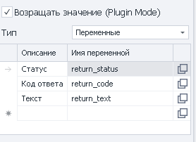

How the settings look when CALLING a plugin (returning multiple variables)

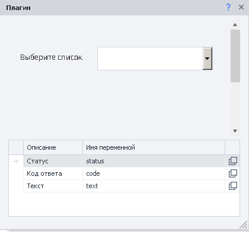

When choosing any return value type, you need to map it to an internal object where the returned value will be stored.

  

## Examples of user plugins from the [ZennoLab forum](https://zennolab.com/discussion/ "https://zennolab.com/discussion/") 

:::warning Caution
Do not run plugins obtained from unreliable sources—they can harm your computer!
:::

Open-source:

- [FindPhraseOrExc](https://zennolab.com/discussion/threads/plugin-uluchshenie-dejstvija-sozdat-proverku-nalichija-vydelennogo-teksta-plagin-findphraseorexc.57861/ "https://zennolab.com/discussion/threads/plugin-uluchshenie-dejstvija-sozdat-proverku-nalichija-vydelennogo-teksta-plagin-findphraseorexc.57861/")
- [Dialog window](https://zennolab.com/discussion/threads/plugin-dialogovoe-okno.54849/ "https://zennolab.com/discussion/threads/plugin-dialogovoe-okno.54849/")

Closed-source:

- [Telegram notification plugin](https://zennolab.com/discussion/threads/otlov-oshibok-shablona-s-momentalnym-opovescheniem-v-telegram.46438/page-5#post-492430 "https://zennolab.com/discussion/threads/otlov-oshibok-shablona-s-momentalnym-opovescheniem-v-telegram.46438/page-5#post-492430")
- [Custom log block for ProjectMaker](https://zennolab.com/discussion/threads/plugin-projectmaker-svoj-kubik-dlja-loga.70497/ "https://zennolab.com/discussion/threads/plugin-projectmaker-svoj-kubik-dlja-loga.70497/")
- [Template errors with instant Telegram notification](https://zennolab.com/discussion/threads/plugin-oshibki-shablona-s-momentalnym-opovescheniem-v-telegram.72596/ "https://zennolab.com/discussion/threads/plugin-oshibki-shablona-s-momentalnym-opovescheniem-v-telegram.72596/")

  

## Useful links

- [❗→ BotUI Interface](https://zennolab.atlassian.net/wiki/spaces/RU/pages/492175377 "https://zennolab.atlassian.net/wiki/spaces/RU/pages/492175377")
- [❗→ Working with Variables](https://zennolab.atlassian.net/wiki/spaces/RU/pages/486309922 "https://zennolab.atlassian.net/wiki/spaces/RU/pages/486309922")
- [❗→ Project within a Project (Nested Projects)](https://zennolab.atlassian.net/wiki/spaces/RU/pages/489291822 "https://zennolab.atlassian.net/wiki/spaces/RU/pages/489291822")
- [❗→ Selling bots with plugins](https://zennolab.atlassian.net/wiki/spaces/RU/pages/494895200 "https://zennolab.atlassian.net/wiki/spaces/RU/pages/494895200")
- [❗→ Actions window](https://zennolab.atlassian.net/wiki/spaces/RU/pages/727777324 "https://zennolab.atlassian.net/wiki/spaces/RU/pages/727777324")
- [❗→ List](https://zennolab.atlassian.net/wiki/spaces/RU/pages/534053375 "https://zennolab.atlassian.net/wiki/spaces/RU/pages/534053375")
- [❗→ Table](https://zennolab.atlassian.net/wiki/spaces/RU/pages/735903776 "https://zennolab.atlassian.net/wiki/spaces/RU/pages/735903776")
- [❗→ Google Tables (PM)](https://zennolab.atlassian.net/wiki/spaces/RU/pages/735576090 "https://zennolab.atlassian.net/wiki/spaces/RU/pages/735576090")
