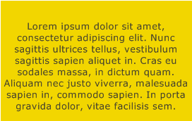
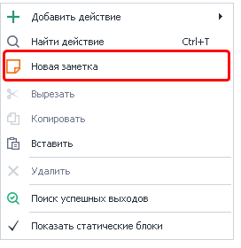
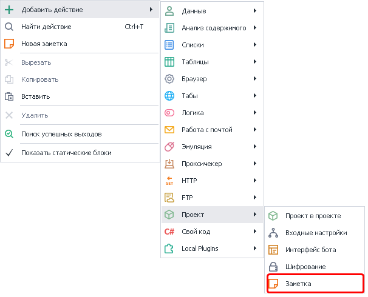
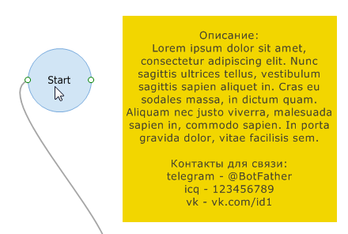
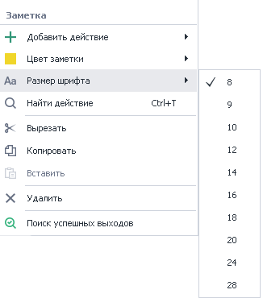
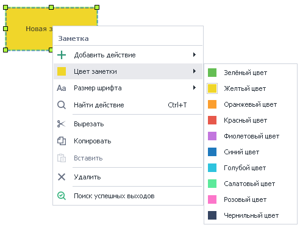

---
sidebar_position: 5
title: "Project Notes"
description: ""
date: "2025-08-04"
converted: true
originalFile: "Заметки в проекте.txt"
targetUrl: "https://zennolab.atlassian.net/wiki/spaces/RU/pages/534020312"
---
:::info **Please take a look at the [*Terms of use for materials on this resource*](../Disclaimer).**
:::

> 🔗 **[Original page](https://zennolab.atlassian.net/wiki/spaces/RU/pages/534020312)** — Source of this material

_______________________________________________  
# Project Notes

## Description

A *Note* is a canvas where you can leave a multi-line comment.

## How do you add an action to your project?

There are two ways to add a note to your project.

**Method #1** 

Right-click on the actions canvas and select **New Note**

**Method #2** 

Use the context menu **Add Action** → **Project** → **Note**

Or use the [❗→ smart search](https://zennolab.atlassian.net/wiki/spaces/RU/pages/506200090/ProjectMaker+7#%D0%A3%D0%BC%D0%BD%D1%8B%D0%B9-%D0%BF%D0%BE%D0%B8%D1%81%D0%BA-%D0%B4%D0%B5%D0%B9%D1%81%D1%82%D0%B2%D0%B8%D0%B9 "https://zennolab.atlassian.net/wiki/spaces/RU/pages/506200090/ProjectMaker+7#%D0%A3%D0%BC%D0%BD%D1%8B%D0%B9-%D0%BF%D0%BE%D0%B8%D1%81%D0%BA-%D0%B4%D0%B5%D0%B9%D1%81%D1%82%D0%B2%D0%B8%D0%B9").

## What is this used for?

- For in-depth commenting on a specific action
    - you can leave a comment in the action itself too, but it's very limited there—just a few words. Sometimes you need a detailed description of the action, because at first glance it may not be obvious what the action actually does. You can find examples in the test projects available on the [❗→ *Start page*](https://zennolab.atlassian.net/wiki/spaces/RU/pages/735608964 "https://zennolab.atlassian.net/wiki/spaces/RU/pages/735608964") of ProjectMaker.

- To comment on a large group of actions at once.
    - This is useful when your template gets so big that it's hard to visually keep track of what does what.

 In the screenshot, the two separate branches of the template are highlighted with red frames (there could be many more), and above those branches, numbers 1 and 2 point to notes where you can simply write the name of what that part of the template does (“Product Search”, “Product Publish”), or you can add a detailed description of how the branch works.  
- If you want to share your [❗→ public](https://zennolab.atlassian.net/wiki/spaces/RU/pages/534315498 "https://zennolab.atlassian.net/wiki/spaces/RU/pages/534315498") template with others, you can use a note to leave a template description and/or your contact info.

- You can store any information you find necessary in notes.

## How do you work with the action?

### Note font size

  

### Note background color

  

## Example use case

Among other things, you can use notes to visually separate different logic blocks from one another

