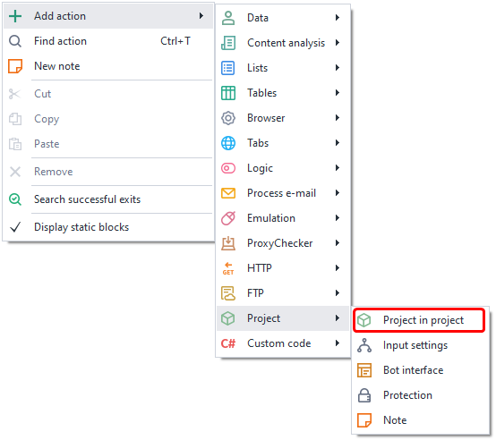
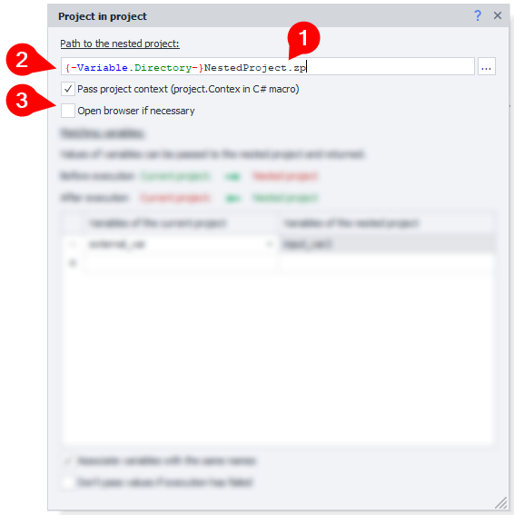
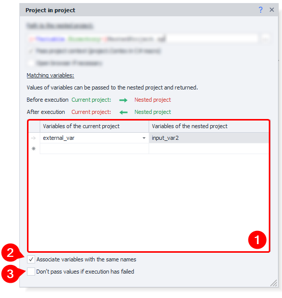
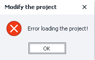

---
sidebar_position: 1
title: "Project in Project (Nested Projects)"
description: ""
date: "2025-08-04"
converted: true
originalFile: "Проект в проекте (Вложенные проекты).txt"
targetUrl: "https://zennolab.atlassian.net/wiki/spaces/RU/pages/489291822"
---
:::info **Please read the [*Material Usage Rules on this site*](../Disclaimer).**
:::

> 🔗 **[Original page](https://zennolab.atlassian.net/wiki/spaces/RU/pages/489291822)** — Source of this material

_______________________________________________  

## Description

*Project in Project lets you link an already finished, recorded project to your current project. This action is similar to [❗→ *Plugins](https://zennolab.atlassian.net/wiki/spaces/RU/pages/735379481/ "https://zennolab.atlassian.net/wiki/spaces/RU/pages/735379481/").

  

## How to add the action to a project?

Via the context menu: **Add action** → **Project** → **Project in Project**

Or use the [❗→ smart search](https://zennolab.atlassian.net/wiki/spaces/RU/pages/506200090/ProjectMaker+7#%D0%A3%D0%BC%D0%BD%D1%8B%D0%B9-%D0%BF%D0%BE%D0%B8%D1%81%D0%BA-%D0%B4%D0%B5%D0%B9%D1%81%D1%82%D0%B2%D0%B8%D0%B9 "https://zennolab.atlassian.net/wiki/spaces/RU/pages/506200090/ProjectMaker+7#%D0%A3%D0%BC%D0%BD%D1%8B%D0%B9-%D0%BF%D0%BE%D0%B8%D1%81%D0%BA-%D0%B4%D0%B5%D0%B9%D1%81%D1%82%D0%B2%D0%B8%D0%B9").

  

## Use Cases

- Most commonly, *Project in Project is used for repeated sections:
    - Example: You're working with a site. You have several separate templates for this site: product parser, user parser, message sender. To work with the site, you need to be logged in. Each of these templates has the same logic segment — checking whether the user is logged in, and if not, logging in. A good solution would be to take this login check and Auth logic out into a separate small sub-template and connect it wherever needed. Then in the future, if you want to update how authorization is handled, you'll only need to make changes in one place—the sub-template (instead of editing multiple templates)—which significantly reduces the chance of making a mistake.
- You can also put universal functions in sub-projects that can be used across different templates:
    - text generation
    - checking text for uniqueness
    - uploading images to image hosting, and much more
- Another possible use is splitting up one large template into sub-templates
    - Sometimes templates get really huge, especially when it's an "all-in-one" tool for working with some resource: registrar, parser, checker, sender. Splitting one big template into smaller parts and connecting those parts as *Project in Project (rather than keeping everything in one) is a good idea. Then, you set only the main settings in the base template.
- Any template can be used as a nested template, and just like with *Plugins, the only limit here is your imagination

  

## How to work with this action?

### Basic Settings

#### Path to the nested project

Here you specify the absolute path to the sub-template (you can use macros for [❗→ variables](https://zennolab.atlassian.net/wiki/spaces/RU/pages/486309922 "https://zennolab.atlassian.net/wiki/spaces/RU/pages/486309922")). In the screenshot, you can see the `{ -Project.Directory- }` variable—the path to your project's current folder. To have this variable entered automatically when writing your project, enable the [❗→ corresponding setting](https://zennolab.atlassian.net/wiki/spaces/RU/pages/727777290#%D0%90%D0%B2%D1%82%D0%BE%D0%BC%D0%B0%D1%82%D0%B8%D1%87%D0%B5%D1%81%D0%BA%D0%B8-%D0%B2%D1%81%D1%82%D0%B0%D0%B2%D0%BB%D1%8F%D1%82%D1%8C-%D0%BC%D0%B0%D0%BA%D1%80%D0%BE%D1%81-%D0%B4%D0%B8%D1%80%D0%B5%D0%BA%D1%82%D0%BE%D1%80%D0%B8%D0%B8-%D0%BF%D1%80%D0%BE%D0%B5%D0%BA%D1%82%D0%B0 "https://zennolab.atlassian.net/wiki/spaces/RU/pages/727777290#%D0%90%D0%B2%D1%82%D0%BE%D0%BC%D0%B0%D1%82%D0%B8%D1%87%D0%B5%D1%81%D0%BA%D0%B8-%D0%B2%D1%81%D1%82%D0%B0%D0%B2%D0%BB%D1%8F%D1%82%D1%8C-%D0%BC%D0%B0%D0%BA%D1%80%D0%BE%D1%81-%D0%B4%D0%B8%D1%80%D0%B5%D0%BA%D1%82%D0%BE%D1%80%D0%B8%D0%B8-%D0%BF%D1%80%D0%BE%D0%B5%D0%BA%D1%82%D0%B0")).

#### Pass project context (project.Context)

[❗→ project.Context](https://help.zennolab.com/en/v5/zennoposter/5.10.4.1/webframe.html#topic733.html "https://help.zennolab.com/en/v5/zennoposter/5.10.4.1/webframe.html#topic733.html") lets you save C# objects and transfer them between different parts of the template. This option is used when working with [❗→ *C# code*](https://zennolab.atlassian.net/wiki/spaces/RU/pages/492011596/C+.net "https://zennolab.atlassian.net/wiki/spaces/RU/pages/492011596/C+.net"). 

#### Open browser if needed

Enabling this setting allows the nested template to launch the [❗→ browser](https://zennolab.atlassian.net/wiki/spaces/RU/pages/534315373 "https://zennolab.atlassian.net/wiki/spaces/RU/pages/534315373") even if it's disabled in the main project via [❗→ *Project settings*](https://zennolab.atlassian.net/wiki/spaces/RU/pages/534315477 "https://zennolab.atlassian.net/wiki/spaces/RU/pages/534315477")

### Passing Variables

#### Mapping Variables

In this window, you transfer data from the outer project to the inner one. Data can only be transferred via variables. 

#### Match variables with the same name

If this option is enabled, all variables with identical names in both projects will be automatically matched, saving you from manual setup. 

:::warning Attention
Manual matching takes precedence over "Match variables with same name". Example: if you enable "Match variables..." and both projects have a variable named ***variable***, but you manually, in the settings, map the ***variable*** from the inner project to a different variable in the outer project, say ***second_var***, then the ***variable*** from the inner project will now be associated with ***second_var*** from the outer project.
:::

#### Do not send variable values back if action fails

By default, all changes to variables in the inner project also affect the outer project's variables. If you enable this setting, the variable changes will be ignored by the outer project if the inner one finishes with an error.

  

## Example Usage

One example is sending yourself notifications via email.

You can create a template that, based on the email address you provide, automatically determines the settings to connect to the server. All you need to do is send the message text, sender info, and recipient info from the main project.

  

## Selling templates containing nested projects

If you're selling your templates that use nested projects, don't forget about the [❗→ commission](https://zennolab.atlassian.net/wiki/spaces/RU/pages/495386651/ZennoBox#%D0%9A%D0%BE%D0%BC%D0%B8%D1%81%D1%81%D0%B8%D1%8F "https://zennolab.atlassian.net/wiki/spaces/RU/pages/495386651/ZennoBox#%D0%9A%D0%BE%D0%BC%D0%B8%D1%81%D1%81%D0%B8%D1%8F"). 

  

## Project Load Error

If, while creating a project, you see a window like this and in the log there's an error like "*Action ProjectInProject Error during processing*", then it's very likely that the problem is that you're trying to run a locked template on inactive hardware.

To fix this, go to your [Personal Account, *Equipment* tab](https://userarea.zennolab.com/lk/userarea/UserAddHardware.aspx "https://userarea.zennolab.com/lk/userarea/UserAddHardware.aspx") and activate the hardware you're currently working on.

  

## Search for .zp projects during "Project in Project" action execution

:::info Info
Added in ZennoPoster 7.4.0.0
:::

When you enable [❗→ this setting](https://zennolab.atlassian.net/wiki/spaces/RU/pages/809074766#%D0%98%D1%81%D0%BA%D0%B0%D1%82%D1%8C-%D0%BF%D1%80%D0%BE%D0%B5%D0%BA%D1%82-%D1%81-%D1%80%D0%B0%D1%81%D1%88%D0%B8%D1%80%D0%B5%D0%BD%D0%B8%D0%B5%D0%BC-.zp-%D0%BF%D1%80%D0%B8-%D0%B2%D1%8B%D0%BF%D0%BE%D0%BB%D0%BD%D0%B5%D0%BD%D0%B8%D0%B8-%D0%B4%D0%B5%D0%B9%D1%81%D1%82%D0%B2%D0%B8%D1%8F-%E2%80%9C%D0%9F%D1%80%D0%BE%D0%B5%D0%BA%D1%82-%D0%B2-%D0%BF%D1%80%D0%BE%D0%B5%D0%BA%D1%82%D0%B5%E2%80%9D "https://zennolab.atlassian.net/wiki/spaces/RU/pages/809074766#%D0%98%D1%81%D0%BA%D0%B0%D1%82%D1%8C-%D0%BF%D1%80%D0%BE%D0%B5%D0%BA%D1%82-%D1%81-%D1%80%D0%B0%D1%81%D1%88%D0%B8%D1%80%D0%B5%D0%BD%D0%B8%D0%B5%D0%BC-.zp-%D0%BF%D1%80%D0%B8-%D0%B2%D1%8B%D0%BF%D0%BE%D0%BB%D0%BD%D0%B5%D0%BD%D0%B8%D0%B8-%D0%B4%D0%B5%D0%B9%D1%81%D1%82%D0%B2%D0%B8%D1%8F-%E2%80%9C%D0%9F%D1%80%D0%BE%D0%B5%D0%BA%D1%82-%D0%B2-%D0%BF%D1%80%D0%BE%D0%B5%D0%BA%D1%82%D0%B5%E2%80%9D"), if the action uses a project in the old .xmlz format but that file is missing, ZennoPoster will search for a project with the same name but the new .zp extension.

***.xmlz*** - ZennoPoster project extension used in ZennoPoster 5 and below  
***.zp*** - project extension currently used in ZennoPoster 7.

  

## Useful Links

- [❗→ Plugins](https://zennolab.atlassian.net/wiki/spaces/RU/pages/475365697 "https://zennolab.atlassian.net/wiki/spaces/RU/pages/475365697")
- [❗→ Variables window](https://zennolab.atlassian.net/wiki/spaces/RU/pages/735608872 "https://zennolab.atlassian.net/wiki/spaces/RU/pages/735608872")