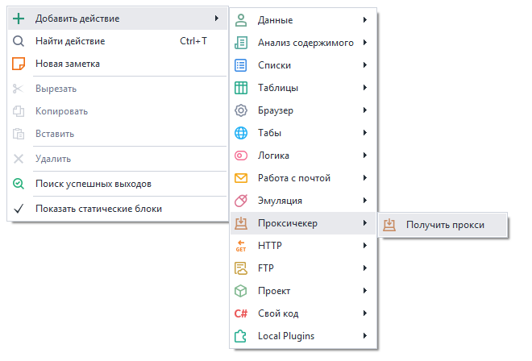
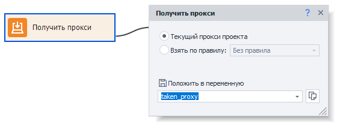
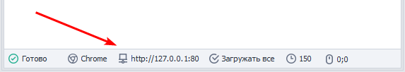
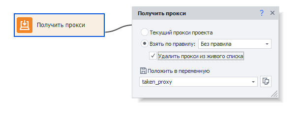

---
sidebar_position: 1
title: "Get proxy"
description: ""
date: "2025-08-04"
converted: true
originalFile: "Получить прокси.txt"
targetUrl: "https://zennolab.atlassian.net/wiki/spaces/RU/pages/492208129"
---
:::info **Please read the [*Rules for using materials on this resource*](../Disclaimer).**
:::

> 🔗 **[Original page](https://zennolab.atlassian.net/wiki/spaces/RU/pages/492208129)** — Source of this material

_______________________________________________  
# Get proxy

## Description

ZennoPoster allows you to use an external proxy server for working with websites while running your project. This is convenient if your IP address is blocked on the target site or you want to remain anonymous.

## How do I add this action to my project?

Through the context menu **Add action** → **ProxyChecker** → **Get proxy**

Or use [❗→ smart search](https://zennolab.atlassian.net/wiki/spaces/RU/pages/506200090/ProjectMaker+7#%D0%A3%D0%BC%D0%BD%D1%8B%D0%B9-%D0%BF%D0%BE%D0%B8%D1%81%D0%BA-%D0%B4%D0%B5%D0%B9%D1%81%D1%82%D0%B2%D0%B8%D0%B9 "https://zennolab.atlassian.net/wiki/spaces/RU/pages/506200090/ProjectMaker+7#%D0%A3%D0%BC%D0%BD%D1%8B%D0%B9-%D0%BF%D0%BE%D0%B8%D1%81%D0%BA-%D0%B4%D0%B5%D0%B9%D1%81%D1%82%D0%B2%D0%B8%D0%B9").

## What is this used for?

- To get a proxy from the ProxyChecker and set it in your project for anonymity, bypassing blocks, etc.
- To get the current proxy of your project.

## How do I work with this action?

### Project's current proxy

The project's current proxy is the one your template is currently using, and is set with the [❗→ Set proxy](https://zennolab.atlassian.net/wiki/spaces/RU/pages/489324572 "https://zennolab.atlassian.net/wiki/spaces/RU/pages/489324572") action. You can see it at the very bottom of the browser window:

When you select this function, the current project proxy will be placed into the specified variable (in the example - `{ -Variable.taken_proxy- }`). The current proxy

  

### Select by rule

When you select this option, you'll be able to choose a method from the dropdown menu.

You need to edit your rules in the ProxyChecker.

If you choose "No rules," proxies will be taken in order. The "Remove proxy from live list" checkbox allows you to remove the proxy server from the ProxyChecker list after it's retrieved.

The proxy will also be set as the value for the specified variable, in our case - `{ -Variable.taken_proxy- }`

:::info Information
After receiving the proxy, you need to set it through the Browser settings action.
:::

  

## Usage example

Let's imagine a situation where you need to perform a large number of similar actions on a specific website.

This is where a proxy server comes in handy – it allows you to hide your real IP address from the protection systems of that site.

  

## Useful links

- [❗→ Browser settings](https://zennolab.atlassian.net/wiki/spaces/RU/pages/489324572 "https://zennolab.atlassian.net/wiki/spaces/RU/pages/489324572")
- [❗→ Proxy services](https://zennolab.atlassian.net/wiki/spaces/RU/pages/809140312/- "https://zennolab.atlassian.net/wiki/spaces/RU/pages/809140312/-")
- [❗→ Browser window](https://zennolab.atlassian.net/wiki/spaces/RU/pages/534315373 "https://zennolab.atlassian.net/wiki/spaces/RU/pages/534315373")