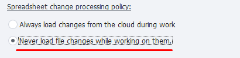

:::info **Please read the [*Material Usage Rules on this site*](../../../../Disclaimer).**
:::

> 🔗 **[Original page](https://zennolab.atlassian.net/wiki/spaces/RU/pages/851673094/Google-+7.1.7.0)** — Source of this material

_______________________________________________  

1. ZennoPoster supports multithreaded work with Google Sheets

This means you can access a single sheet from multiple threads. During execution, all threads will use one instance of the virtual table, and changes from it will be periodically synchronized with the cloud sheet.

### 2. Multiple instances of ZennoPoster can work with the same Google Sheet

But keep in mind, changes from the program are not sent to the cloud instantly—they are sent within 60 seconds. So this delay will apply between different copies of the ZennoPoster program. Therefore, to maintain data integrity, it is recommended to use atomic row addition, which can be enabled in the settings of the static block.

### 3. Atomic row addition

When the atomic row addition setting is enabled, rows added via the “Add Row” action will be sent to the cloud by a special request, independent of cell addresses. This ensures new data can be reliably added to the sheet without losing existing content due to the overwriting of already filled cells.

Note that in this case, rows will be sent as a separate request and, when executed, the data will be written sequentially to the end of the sheet. Because of this, there may be discrepancies between the local view of the data and the data in the cloud.

For example, with the following sequence of actions, data added via the “Add Row” action will be placed in rows 11 and 12 in Google, while being in rows 6 and 11 in the program:

1. Wrote cells into rows 0–5;
2. Added a row (row 6 in the program);
3. Wrote cells into rows 7–10;
4. Added a row (row 11 in the program).

With this in mind, when using atomic row addition, it’s best to add data only through the “Add Row” action.

Although it is possible to safely add rows, changing or deleting them may cause discrepancies due to the synchronization delay between program instances and the cloud. Therefore, for processing important and valuable data, it’s recommended to use a separate Google Sheet tab for each program instance.

### 4. How to optimize multithreaded data writing to one Google Sheet

There’s a solution for this. Suppose you are parsing data in batches and saving all results into a single Google Sheet.

ZennoPoster is designed to always try to synchronize the virtual table and the cloud-based sheet. If you have multiple ZennoPoster copies and/or the sheet contains a lot of data, the sync process may take considerable time.

In this case, if you don’t need up-to-date data from the sheet in every ZennoPoster instance, you can set up fast write mode using the option **Edit → Settings → Google Sheets → Change Processing Policy**:

In this mode, each program copy will simply send data, without worrying about matching the data in the cloud sheet and in the program—so no time will be spent on that.