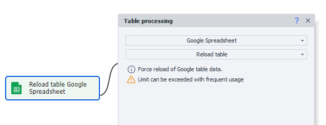
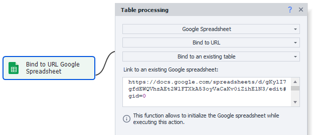
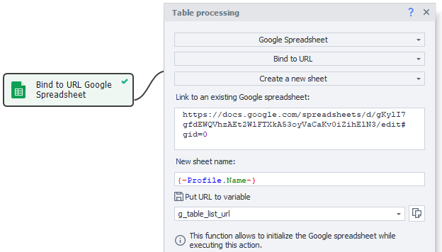
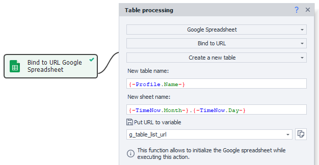

:::info **Please read the [*Material Usage Rules on this site*](../../../../Disclaimer).**
:::

> 🔗 **[Original page](https://zennolab.atlassian.net/wiki/spaces/RU/pages/509411347/Google-)** — Source of this material

_______________________________________________  
  
## Description

:::warning Attention
Before you start working with Google Sheets, you need to connect them in the program via Google Sheets Connection Setup and create a Google Sheet.
:::

Google Sheets are very similar to regular [❗→ Tables](/wiki/spaces/RU/pages/735903776 "/wiki/spaces/RU/pages/735903776").

The same action [❗→ Table Operations](/wiki/spaces/RU/pages/534052972 "/wiki/spaces/RU/pages/534052972") is used, and all actions available for regular Tables can also be used with Google Sheets (except *File Binding), but Google Sheets also have several unique features which are described below.

  

## How do I add the action to a project?

Via the context menu **Add Action** → **Tables** → **Table Operations**

Or you can use [❗→ smart search](https://zennolab.atlassian.net/wiki/spaces/RU/pages/506200090/ProjectMaker+7#%D0%A3%D0%BC%D0%BD%D1%8B%D0%B9-%D0%BF%D0%BE%D0%B8%D1%81%D0%BA-%D0%B4%D0%B5%D0%B9%D1%81%D1%82%D0%B2%D0%B8%D0%B9 "https://zennolab.atlassian.net/wiki/spaces/RU/pages/506200090/ProjectMaker+7#%D0%A3%D0%BC%D0%BD%D1%8B%D0%B9-%D0%BF%D0%BE%D0%B8%D1%81%D0%BA-%D0%B4%D0%B5%D0%B9%D1%81%D1%82%D0%B2%D0%B8%D0%B9").

  

## Working with Google Sheets

:::note Note
To work with Google Sheets, use the Table Operations action. This article describes functions that are unique to Google Sheets. For all other operations, see Table Operations.
:::

:::warning Attention
In all fields, you can use both static text and variables, as well as their combinations.
:::

### Reload Table

:::info Info
Added in ZennoPoster 7.7.0.0
:::

This function allows you to retrieve up-to-date data from a Google Sheet.

This may be useful if changes were made to the sheet manually or via another template.

:::warning Attention
The local table will be overwritten with data from the remote sheet.
:::

### Link to URL → Link to Existing Sheet

This action allows you to link to a sheet while the project is running. It's convenient to use when the sheet address is not known at the start of the template (for example, if the sheet is being created by the template itself (how to do this is described below)).

**Link to an existing Google Sheet**

Specify the link to the sheet you want to attach.

### Link to URL → Create New Sheet

Allows you to create a new sheet in a Google spreadsheet.

**Link to an existing Google Sheet**

Specify the link to the sheet in which you want to create the new sheet.

**New sheet name**

Enter the name of the new sheet here.

**Save URL to variable**

Specify the variable where the link to the new sheet will be saved.

### Link to URL → Create New Table

As you would expect, this action lets you create a new Google Sheet.

**New table name**

Enter the name of the table here.

**New sheet name**

The sheet will be created with one tab. Specify the name of this tab here.

**Save URL to variable**

Specify the variable where the link to the new table will be saved.

  

## Multithreaded Work with Google Sheets up to and including 7.1.6.1

:::note Note
Starting from version 7.1.7.0, the algorithm for multithreaded work with Google Sheets was changed. Details: Multithreaded Work with Google Sheets (Version 7.1.7.0 and above)
:::

### ZennoPoster supports multithreaded work with Google Sheets

This means you can access a sheet from several threads. While running, there will be a single instance of the virtual table for all threads, and changes will be periodically synchronized with the cloud sheet.

### Multiple copies of ZennoPoster can work with one Google Sheet

But keep in mind that changes from the program are not sent to the cloud instantly, but within 30-60 seconds. As a result, this delay applies between different copies of ZennoPoster.

### How to optimize multithreaded data writing to a single Google Sheet

There is a solution for this. For example, if you are parsing data in batches and saving all the results to a single Google Sheet.

ZennoPoster is designed to always try to synchronize the virtual table with the cloud sheet. If there are several copies of ZennoPoster and/or the sheet contains a lot of data, synchronization may take a long time.

In that case, if you don't need up-to-date data from the sheet in every copy of ZennoPoster, you can set up fast record mode via the option [❗→ **Edit → Settings → Google Sheets → Table change processing policy**](https://zennolab.atlassian.net/wiki/spaces/RU/pages/735576090/Google%2BPM#%D0%9F%D0%BE%D0%BB%D0%B8%D1%82%D0%B8%D0%BA%D0%B0-%D0%BE%D0%B1%D1%80%D0%B0%D0%B1%D0%BE%D1%82%D0%BA%D0%B8-%D0%B8%D0%B7%D0%BC%D0%B5%D0%BD%D0%B5%D0%BD%D0%B8%D0%B9-%D1%82%D0%B0%D0%B1%D0%BB%D0%B8%D1%86 "https://zennolab.atlassian.net/wiki/spaces/RU/pages/735576090/Google%2BPM#%D0%9F%D0%BE%D0%BB%D0%B8%D1%82%D0%B8%D0%BA%D0%B0-%D0%BE%D0%B1%D1%80%D0%B0%D0%B1%D0%BE%D1%82%D0%BA%D0%B8-%D0%B8%D0%B7%D0%BC%D0%B5%D0%BD%D0%B8%D0%B9-%D1%82%D0%B0%D0%B1%D0%BB%D0%B8%D1%86"):

In this mode, each program copy will only upload data without worrying about reading them into the program (and won't waste time on this). All data sent from different ZennoPoster copies will be saved in the cloud.

  

## Useful links

- [❗→ Google Sheets Connection Setup](/wiki/spaces/RU/pages/1667727363 "/wiki/spaces/RU/pages/1667727363")
- [❗→ Google Sheet](/wiki/spaces/RU/pages/724566092 "/wiki/spaces/RU/pages/724566092")
- [❗→ Google Sheets (PM)](/wiki/spaces/RU/pages/735576090 "/wiki/spaces/RU/pages/735576090")
- [❗→ Table Operations](/wiki/spaces/RU/pages/534052972 "/wiki/spaces/RU/pages/534052972")