---
sidebar_position: 1
title: "Table Operations"
description: "Converted from HTML to MDX"
date: "2025-07-24"
converted: true
originalFile: "Операции над таблицами.txt"
targetUrl: "https://zennolab.atlassian.net/wiki/spaces/RU/pages/534052972"
---
import DisclaimerNotice from '@site/src/components/DisclaimerNotice';

<DisclaimerNotice />

> 🔗 **[Original page](https://zennolab.atlassian.net/wiki/spaces/RU/pages/534052972)** — Source of this material

_______________________________________________  
  
## Description

Tables are used to handle more complex data than [❗→ lists](/wiki/spaces/RU/pages/534053375 "/wiki/spaces/RU/pages/534053375"), for example, a catalog for an online store where each row contains different data: name, price, description, etc.

:::note Note
The same action is used when working with Tables and with Google Sheets, but Google Sheets has a few unique actions that are covered in the article Operations with Google Sheets.
:::

  

## How do I add a Table to a project?

:::info Info
Before you start, you need to create either a Table or a Google Sheet.
:::

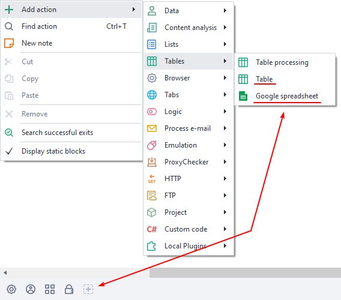

## How do I add an action to a project?

From the context menu, select **Add action** → **Tables** → **Table Operations**

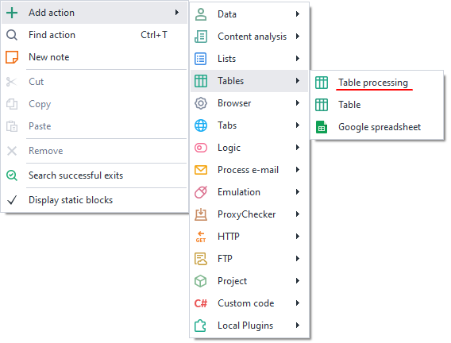

Or use the [❗→ smart search](https://zennolab.atlassian.net/wiki/spaces/RU/pages/506200090/ProjectMaker+7#%D0%A3%D0%BC%D0%BD%D1%8B%D0%B9-%D0%BF%D0%BE%D0%B8%D1%81%D0%BA-%D0%B4%D0%B5%D0%B9%D1%81%D1%82%D0%B2%D0%B8%D0%B9 "https://zennolab.atlassian.net/wiki/spaces/RU/pages/506200090/ProjectMaker+7#%D0%A3%D0%BC%D0%BD%D1%8B%D0%B9-%D0%BF%D0%BE%D0%B8%D1%81%D0%BA-%D0%B4%D0%B5%D0%B9%D1%81%D1%82%D0%B2%D0%B8%D0%B9").

## What is this used for?

- Working with sets of data
- Adding and retrieving table elements
- Deleting rows, columns, and duplicates
- Linking to a file
- Getting the number of rows and columns

## How does the action work?

:::note Note
You can specify the column number as either a number (starting from zero!) or, like in Excel, as an uppercase Latin letter!
:::

### Get column

Put the values of a specific column into a [❗→ list](/wiki/spaces/RU/pages/534053375 "/wiki/spaces/RU/pages/534053375")

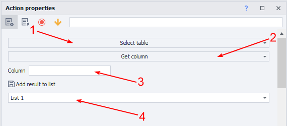

1. Select the table you'll work with.
2. Choose the function.
3. Set the column or variable.
4. The [❗→ list](/wiki/spaces/RU/pages/534053375 "/wiki/spaces/RU/pages/534053375") where all column values will be saved.

Example

Put all values from column B of [❗→ Table](/wiki/spaces/RU/pages/735903776 "/wiki/spaces/RU/pages/735903776") 1 into [❗→ List](/wiki/spaces/RU/pages/534053375 "/wiki/spaces/RU/pages/534053375") 1

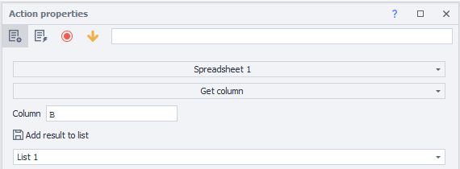

Table 1

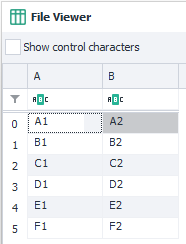

The values of the specified column are not deleted after processing

  

### Get lines

Get rows optionally deleting them from the table, and write them into a [❗→ list](/wiki/spaces/RU/pages/534053375 "/wiki/spaces/RU/pages/534053375") or [❗→ variables](/wiki/spaces/RU/pages/735608872 "/wiki/spaces/RU/pages/735608872").

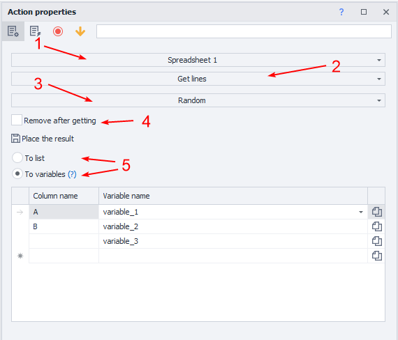

1. Select the table you'll work with.
2. Choose the function.
3. Row criteria (can use a variable): 
a) All
b) Does not contain text
c) Does not match a [❗→ regular expression](/wiki/spaces/RU/pages/534086111 "/wiki/spaces/RU/pages/534086111")
d) First
e) [❗→ By index](/wiki/spaces/RU/pages/488964137 "/wiki/spaces/RU/pages/488964137") (indexing from zero!)
f) Random
g) Contains text
h) Matches a [❗→ regular expression](/wiki/spaces/RU/pages/534086111 "/wiki/spaces/RU/pages/534086111")
4. Should the rows be deleted after processing?
5. Save the result to a [❗→ list](/wiki/spaces/RU/pages/534053375 "/wiki/spaces/RU/pages/534053375") or variables.

Example

Take random rows from [❗→ Table](/wiki/spaces/RU/pages/735903776 "/wiki/spaces/RU/pages/735903776") 1 and put them into variables, deleting them after.

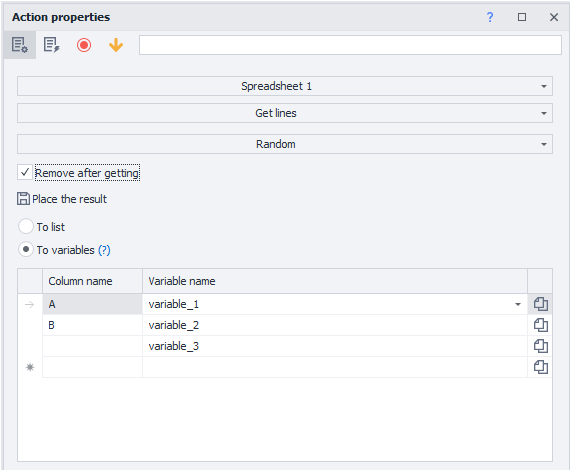

[❗→ Table](/wiki/spaces/RU/pages/735903776 "/wiki/spaces/RU/pages/735903776") 1

Before processing

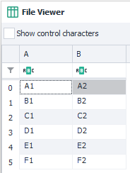

After processing

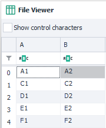

Variables

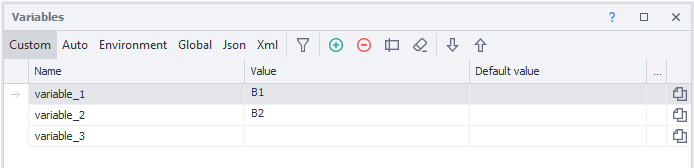

The variable *peremennay\_3 is empty because the table only contains columns A and B

  

### Add list

Put the values from a list into a specific column.

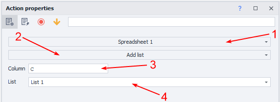

1. Select the table you'll work with.
2. Choose the function.
3. Set the column or variable.
4. [❗→ List](/wiki/spaces/RU/pages/534053375 "/wiki/spaces/RU/pages/534053375") with the values.

Example

Take values from [❗→ List](/wiki/spaces/RU/pages/534053375 "/wiki/spaces/RU/pages/534053375") 1 and put them into column D of [❗→ Table](/wiki/spaces/RU/pages/735903776 "/wiki/spaces/RU/pages/735903776") 1

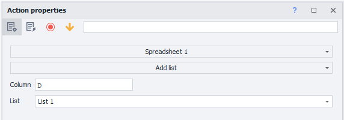

[❗→ List](/wiki/spaces/RU/pages/534053375 "/wiki/spaces/RU/pages/534053375") 1

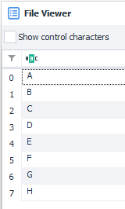

[❗→ Table](/wiki/spaces/RU/pages/735903776 "/wiki/spaces/RU/pages/735903776") 1

Before processing

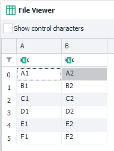

After processing

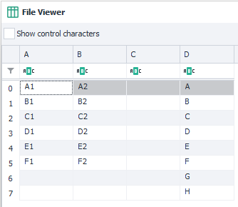

List values are not deleted

  

### Add row

Add a row to the table.

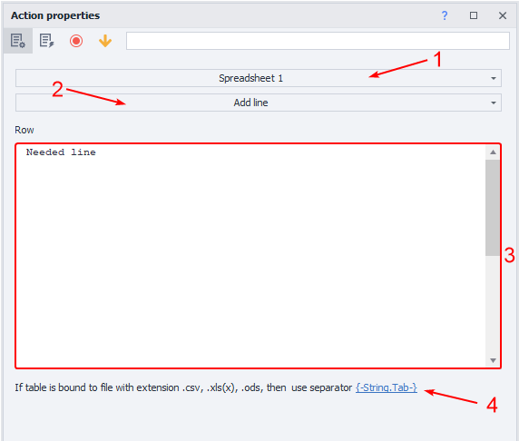

1. Select the table you'll work with.
2. Choose the function.
3. Enter static text or a variable.
4. Important note

:::note Note
The row will be added to the end of the table
:::

:::tip Tip
If you want to add several rows at once, use the Text Processing-to Table action.
:::

Example

Add a custom text row to different columns.

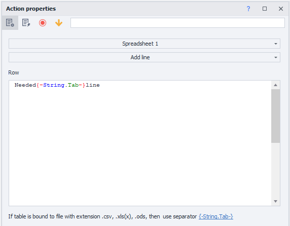

[❗→ Table](/wiki/spaces/RU/pages/735903776 "/wiki/spaces/RU/pages/735903776") 1

Before processing

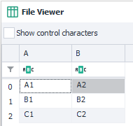

After processing

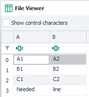

  

### Write to cell

Add text to a specific cell.

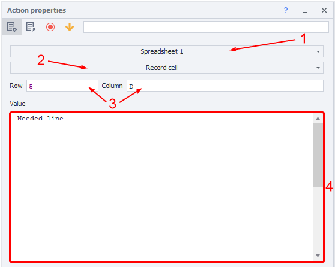

1. Select the table you'll work with.
2. Choose the function.
3. Specify cell coordinates as static values or using [❗→ variables](/wiki/spaces/RU/pages/735608872 "/wiki/spaces/RU/pages/735608872").
4. Enter static text or a variable.

Example

Add text to a specific cell

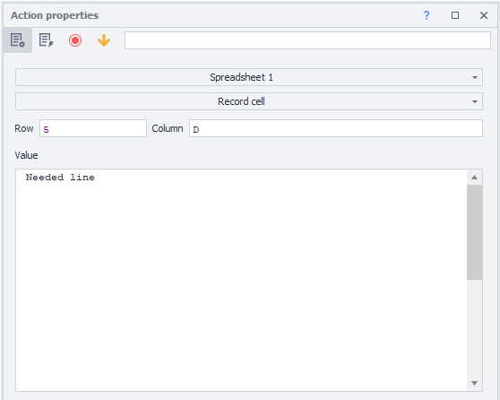

[❗→ Table](/wiki/spaces/RU/pages/735903776 "/wiki/spaces/RU/pages/735903776") 1

Before processing

After processing

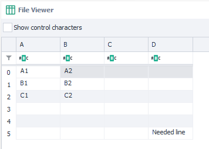

Rows are always added to the end of the table

  

### Get number of columns

How many columns the table contains

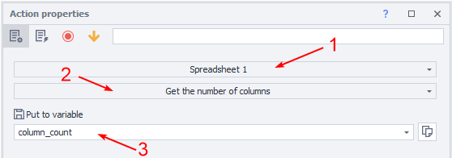

1. Select the table you'll work with.
2. Choose the function.
3. Variable for the result.

:::note Note
The variable will always contain only a numeric value
:::

Example

Get the number of columns in [❗→ Table](/wiki/spaces/RU/pages/735903776 "/wiki/spaces/RU/pages/735903776") 1 and save to a variable

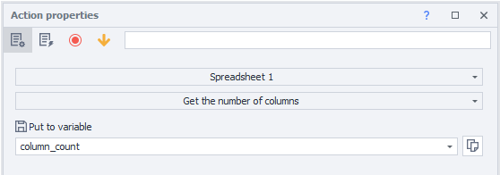

Contents of [❗→ Table](/wiki/spaces/RU/pages/735903776 "/wiki/spaces/RU/pages/735903776") 1

Result saved to variable *kolichestvo\_strok

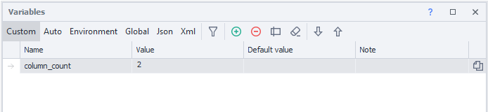

  

### Get number of rows

How many rows the table contains

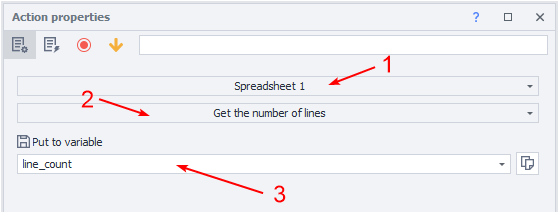

1. Select the table you'll work with.
2. Choose the function.
3. Variable for the result.

:::note Note
The variable will always contain only a numeric value
:::

Example

Get the number of rows in [❗→ Table](/wiki/spaces/RU/pages/735903776 "/wiki/spaces/RU/pages/735903776") 1 and save to a variable

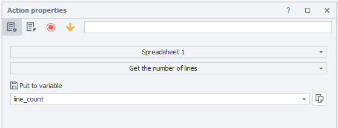

Contents of [❗→ Table](/wiki/spaces/RU/pages/735903776 "/wiki/spaces/RU/pages/735903776") 1

Result saved to variable *kolichestvo\_strok

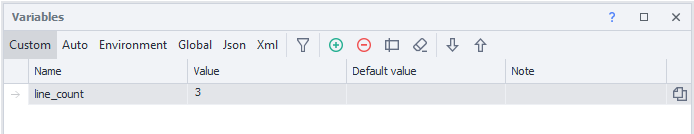

  

### Link to file

Link the table to a file during project execution.

This action should be used when the file path is not known at template start but will be determined while the project runs.

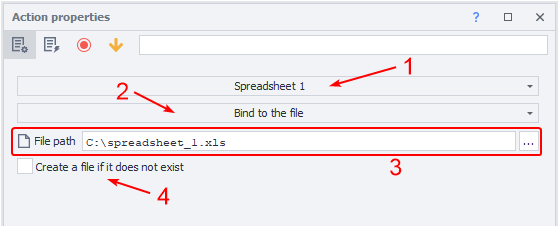

1. Select the table you'll work with.
2. Choose the function.
3. Select the file or specify a variable containing the file path.
4. If there’s no file at the specified path, **Zennoposter** will automatically create it.

Example

Link [❗→ Table](/wiki/spaces/RU/pages/735903776 "/wiki/spaces/RU/pages/735903776") 1 to a specific file

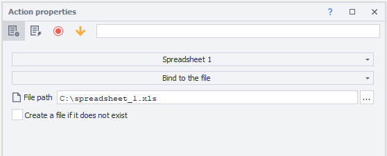

[❗→ Table](/wiki/spaces/RU/pages/735903776 "/wiki/spaces/RU/pages/735903776") 1 will be linked to the corresponding file

  

### Read cell

Get the value from a specific cell

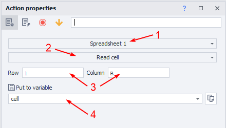

1. Select the table you'll work with.
2. Choose the function.
3. Specify cell coordinates as static values or via variables.
4. Variable for the result.

Example

Save the value from cell B2 of [❗→ Table](/wiki/spaces/RU/pages/735903776 "/wiki/spaces/RU/pages/735903776") 1 to a variable

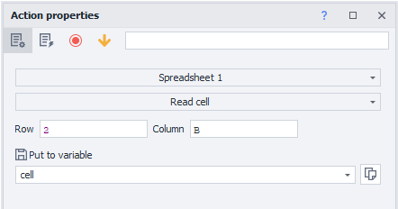

Contents of [❗→ Table](/wiki/spaces/RU/pages/735903776 "/wiki/spaces/RU/pages/735903776") 1

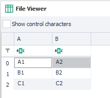

After running the action, the result is saved to variable *yacheika

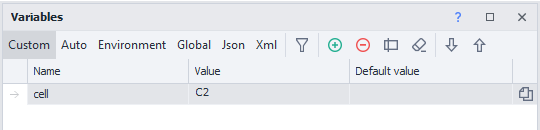

  

### Sort table

Sort table elements in ascending or descending order.

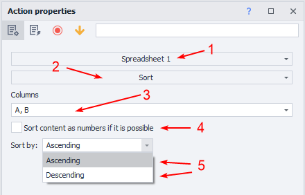

1. Select the table you'll work with.
2. Choose the function.
3. **Zennoposter** will automatically detect columns that have values and offer a selection.
4. Use number comparing logic (this works when the column only has integers. If there are floating-point values, the column is sorted as strings).
5. Set the sort type: *descending or *ascending.

Example

Sort all columns of [❗→ Table](/wiki/spaces/RU/pages/735903776 "/wiki/spaces/RU/pages/735903776") 1 in descending order

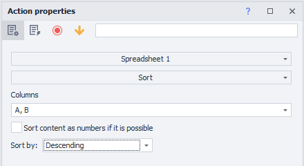

[❗→ Table](/wiki/spaces/RU/pages/735903776 "/wiki/spaces/RU/pages/735903776") 1

Before processing

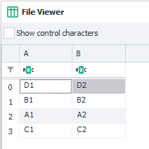

After processing

  

### Save to file

Save the table to a file during project execution

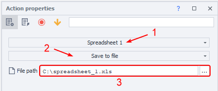

1. Select the table you'll work with.
2. Choose the function.
3. Select the file or specify a variable containing the file path.

:::warning Warning
The function only overwrites files
:::

Example

Save the values of [❗→ Table](/wiki/spaces/RU/pages/735903776 "/wiki/spaces/RU/pages/735903776") 1 to a file

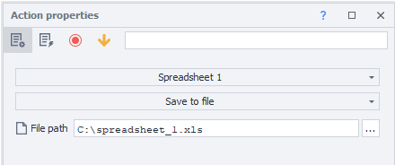

Contents of [❗→ Table](/wiki/spaces/RU/pages/735903776 "/wiki/spaces/RU/pages/735903776") 1

After execution, all values will be saved to the file

  

### Remove duplicates

Remove duplicate values from the table

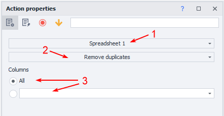

1. Select the table you'll work with.
2. Choose the function.
3. **Zennoposter** will automatically detect columns with values and offer a choice.

Example

Remove all duplicates in [❗→ Table](/wiki/spaces/RU/pages/735903776 "/wiki/spaces/RU/pages/735903776") 1

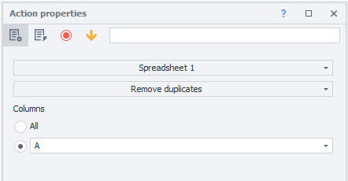

[❗→ Table](/wiki/spaces/RU/pages/735903776 "/wiki/spaces/RU/pages/735903776") 1 

Before processing

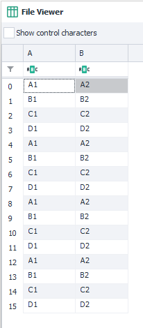

After processing

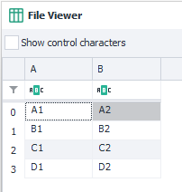

  

### Delete column

Completely removes the specified column from the table

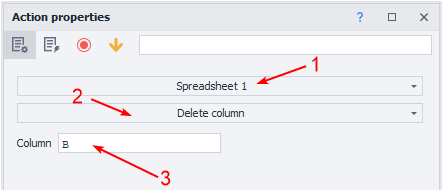

1. Select the table you'll work with.
2. Choose the function.
3. Specify the column or variable.

:::warning Warning
The column will be deleted with all its values
:::

Example

Delete column B from [❗→ Table](/wiki/spaces/RU/pages/735903776 "/wiki/spaces/RU/pages/735903776")1

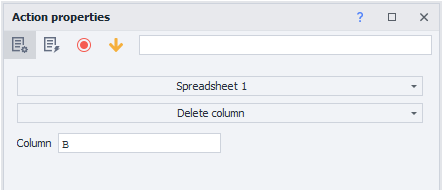

[❗→ Table](/wiki/spaces/RU/pages/735903776 "/wiki/spaces/RU/pages/735903776") 1

Before processing

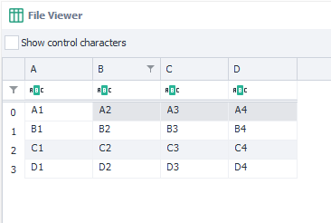

After processing

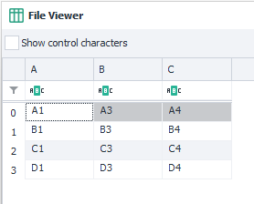

  

### Delete rows

Deletes the specified rows from all columns

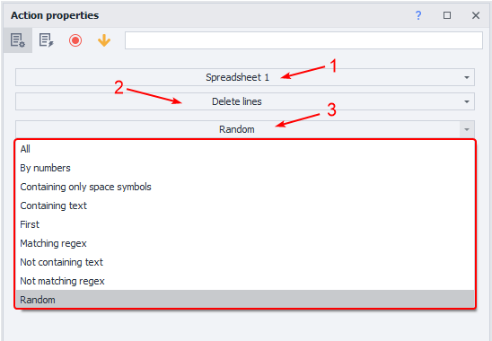

1. Select the table you'll work with.
2. Choose the function.
3. Row criteria (can use a variable): 
a) All
b) Does not contain text
c) Does not match a [❗→ regular expression](/wiki/spaces/RU/pages/534086111 "/wiki/spaces/RU/pages/534086111")
d) First
e) [❗→ By index](/wiki/spaces/RU/pages/488964137 "/wiki/spaces/RU/pages/488964137") (indexing from zero!)
f) Random
g) Contains text
h) Contains only whitespace
i) Matches a [❗→ regular expression](/wiki/spaces/RU/pages/534086111 "/wiki/spaces/RU/pages/534086111")

:::warning Warning
The specified row will be deleted in all columns
:::

Example

Delete the third row from [❗→ Table](/wiki/spaces/RU/pages/735903776 "/wiki/spaces/RU/pages/735903776") 1

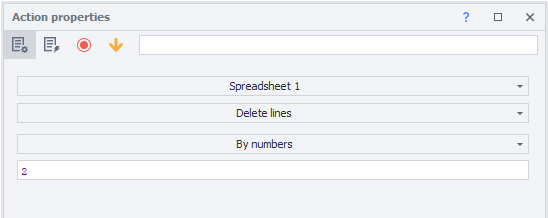

[❗→ Table](/wiki/spaces/RU/pages/735903776 "/wiki/spaces/RU/pages/735903776") 1

Before processing

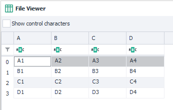

After processing

The third row was removed entirely

  

### Recommendations for working with tables

:::note Note
Follow these rules to ensure your projects work correctly
:::

- Avoid linking very large files (hundreds of megabytes) to a table without the “[❗→ Save table changes to file](https://zennolab.atlassian.net/wiki/spaces/RU/pages/735903776#%D0%A1%D0%BE%D1%85%D1%80%D0%B0%D0%BD%D1%8F%D1%82%D1%8C-%D0%B8%D0%B7%D0%BC%D0%B5%D0%BD%D0%B5%D0%BD%D0%B8%D1%8F-%D1%82%D0%B0%D0%B1%D0%BB%D0%B8%D1%86%D1%8B-%D0%B2-%D1%84%D0%B0%D0%B9%D0%BB "https://zennolab.atlassian.net/wiki/spaces/RU/pages/735903776#%D0%A1%D0%BE%D1%85%D1%80%D0%B0%D0%BD%D1%8F%D1%82%D1%8C-%D0%B8%D0%B7%D0%BC%D0%B5%D0%BD%D0%B5%D0%BD%D0%B8%D1%8F-%D1%82%D0%B0%D0%B1%D0%BB%D0%B8%D1%86%D1%8B-%D0%B2-%D1%84%D0%B0%D0%B9%D0%BB")” option, especially if you have little RAM.
- When you use a table linked to one file in several templates, use the same delimiter. If in one template your columns are separated by `;` and in another by `-`, you will get an error.
- If you run your template in multithreaded mode and want each thread to work with its own row, enable the “[❗→ Save table changes to file](https://zennolab.atlassian.net/wiki/spaces/RU/pages/735903776#%D0%A1%D0%BE%D1%85%D1%80%D0%B0%D0%BD%D1%8F%D1%82%D1%8C-%D0%B8%D0%B7%D0%BC%D0%B5%D0%BD%D0%B8%D1%8F-%D1%82%D0%B0%D0%B1%D0%BB%D0%B8%D1%86%D1%8B-%D0%B2-%D1%84%D0%B0%D0%B9%D0%BB "https://zennolab.atlassian.net/wiki/spaces/RU/pages/735903776#%D0%A1%D0%BE%D1%85%D1%80%D0%B0%D0%BD%D1%8F%D1%82%D1%8C-%D0%B8%D0%B7%D0%BC%D0%B5%D0%BD%D0%B8%D1%8F-%D1%82%D0%B0%D0%B1%D0%BB%D0%B8%D1%86%D1%8B-%D0%B2-%D1%84%D0%B0%D0%B9%D0%BB")” option and take data from the table with [❗→ deletion after fetching](https://zennolab.atlassian.net/wiki/spaces/RU/pages/534052972#%D0%92%D0%B7%D1%8F%D1%82%D1%8C-%D1%81%D1%82%D1%80%D0%BE%D0%BA%D0%B8 "https://zennolab.atlassian.net/wiki/spaces/RU/pages/534052972#%D0%92%D0%B7%D1%8F%D1%82%D1%8C-%D1%81%D1%82%D1%80%D0%BE%D0%BA%D0%B8").
- If all projects are only reading from the file, there shouldn’t be any issues. When you sync with the file, there’s one table for all threads and all changes in any thread are reflected in the table.
- If you don’t use file syncing, then a separate table copy is created for each thread. In this case, deleting a row in one thread won’t affect the table in others.
- Keep in mind that tables in RAM take up much more space than the original file on disk. For example, a table based on a 10 MB CSV file in 100 threads <u data-renderer-mark="true">without file syncing</u> can take up 5 GB in RAM. Try not to use lists and tables in “without syncing” mode unless absolutely necessary.

  

## Usage example

Collect the names of needed products from web pages into a list and add them from the list to a table for further use.

1. Load the pages.
2. Collect the required values into a list.
3. Create a table.
4. Add the action and specify Add list.
5. Specify the list and column to save values to.

  

## Useful links

1. [❗→ Table](/wiki/spaces/RU/pages/735903776 "/wiki/spaces/RU/pages/735903776")
2. [❗→ Google Sheets](/wiki/spaces/RU/pages/735576090 "/wiki/spaces/RU/pages/735576090")
3. [❗→ List](/wiki/spaces/RU/pages/534053375 "/wiki/spaces/RU/pages/534053375")
4. [❗→ List operations](/wiki/spaces/RU/pages/534085798 "/wiki/spaces/RU/pages/534085798")
5. [❗→ Project variables](/wiki/spaces/RU/pages/735608872 "/wiki/spaces/RU/pages/735608872")
6. [❗→ Regex tester](/wiki/spaces/RU/pages/534086111 "/wiki/spaces/RU/pages/534086111")
7. [❗→ Value ranges](/wiki/spaces/RU/pages/488964137 "/wiki/spaces/RU/pages/488964137")