---
sidebar_position: 9
title: "Captcha Recognition"
description: "Converted from HTML to MDX"
date: "2025-07-30"
converted: true
originalFile: "Распознать каптчу.txt"
targetUrl: "https://example.com/target-page"
---
import DisclaimerNotice from '@site/src/components/DisclaimerNotice';

<DisclaimerNotice />

> 🔗 **[Original page](https://example.com/target-page)** — Source of this material

_______________________________________________  
# Captcha Recognition

  

## Description

This action is used for automatic captcha solving via [❗→ services](/wiki/spaces/RU/pages/808845385 "/wiki/spaces/RU/pages/808845385") or [❗→ manually](/wiki/spaces/RU/pages/534053215 "/wiki/spaces/RU/pages/534053215").

A captcha (from CAPTCHA — **C**ompletely **A**utomated **P**ublic **T**uring test to tell **C**omputers and **H**umans **A**part) is a computer test used to determine whether the user is human or a bot.

|  |
| :--: |
| Some types of captchas |


## How to add the action to your project?

There are several ways to add this action to your project.

### Via the BROWSER context menu

To add the captcha recognition action using the [❗→ browser](/wiki/spaces/RU/pages/534315373 "/wiki/spaces/RU/pages/534315373")ProjectMaker context menu, right-click on the image on the site and choose *This is a captcha!*

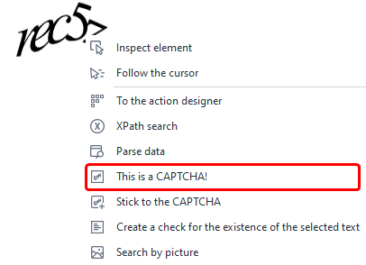


Once the action is added, the [❗→ manual captcha recognition](/wiki/spaces/RU/pages/534053215 "/wiki/spaces/RU/pages/534053215") window will immediately pop up, which you can close for now and move on to configuring the action.

### Via the **PROJECT** context menu

**Add action** → **Tabs** → **Recognize captcha**

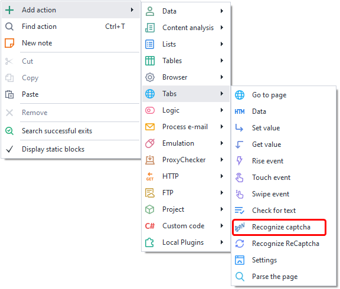


The downside to this method is that you first need to download the image to your computer and then specify the file path in the action.

Or you can use the [❗→ smart search](https://zennolab.atlassian.net/wiki/spaces/RU/pages/506200090/ProjectMaker+7#%D0%A3%D0%BC%D0%BD%D1%8B%D0%B9-%D0%BF%D0%BE%D0%B8%D1%81%D0%BA-%D0%B4%D0%B5%D0%B9%D1%81%D1%82%D0%B2%D0%B8%D0%B9 "https://zennolab.atlassian.net/wiki/spaces/RU/pages/506200090/ProjectMaker+7#%D0%A3%D0%BC%D0%BD%D1%8B%D0%B9-%D0%BF%D0%BE%D0%B8%D1%81%D0%BA-%D0%B4%D0%B5%D0%B9%D1%81%D1%82%D0%B2%D0%B8%D0%B9").

## Captcha recognition action settings

### Main

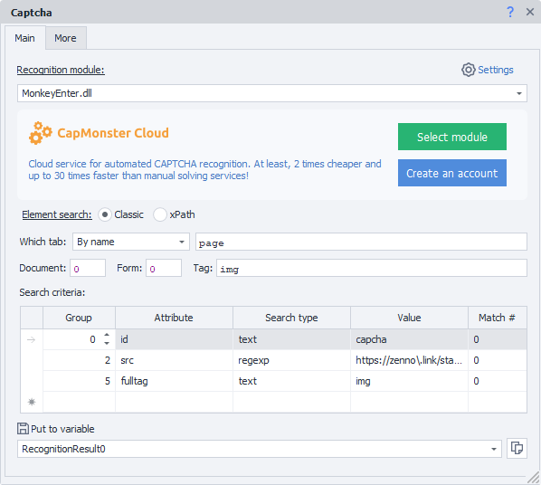


#### Recognition module

Choose the module (captcha service) through which the captcha will be recognized.

From the dropdown list, select the desired captcha recognition service (you’ll need to specify its [❗→ API key in the settings](/wiki/spaces/RU/pages/808845385 "/wiki/spaces/RU/pages/808845385") first). By default, *MonkeyEnter.dll* is used — [❗→ manual input](/wiki/spaces/RU/pages/534053215 "/wiki/spaces/RU/pages/534053215").

:::note Keep in mind
You can use project variables in this field.
:::

#### Settings

Clicking the *Settings* button opens the program settings, in the [❗→ captcha service tab](/wiki/spaces/RU/pages/808845385 "/wiki/spaces/RU/pages/808845385").

#### Element search

Before you can interact with an element on a page, you have to find it. In the actions [❗→ Get value](https://zennolab.atlassian.net/wiki/spaces/RU/pages/534315124 "https://zennolab.atlassian.net/wiki/spaces/RU/pages/534315124") , [❗→ Set value](https://zennolab.atlassian.net/wiki/spaces/RU/pages/534315117 "https://zennolab.atlassian.net/wiki/spaces/RU/pages/534315117") , [❗→ Fire event](https://zennolab.atlassian.net/wiki/spaces/RU/pages/534020211 "https://zennolab.atlassian.net/wiki/spaces/RU/pages/534020211") , [❗→ Touch event](https://zennolab.atlassian.net/wiki/spaces/RU/pages/735674386 "https://zennolab.atlassian.net/wiki/spaces/RU/pages/735674386") , [❗→ Swipe event](https://zennolab.atlassian.net/wiki/spaces/RU/pages/735739970 "https://zennolab.atlassian.net/wiki/spaces/RU/pages/735739970"), there are two ways of finding elements - classic and XPath.

  

**Classic** - Search by HTML element parameters: tag, attribute, and its value.

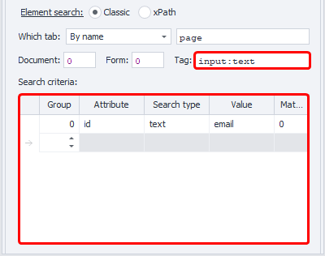


**XPath** - search using [❗→ XPath expressions](https://zennolab.atlassian.net/wiki/spaces/RU/pages/862093419/ "https://zennolab.atlassian.net/wiki/spaces/RU/pages/862093419/"). With this, you can implement a more robust way of finding data that withstands layout changes compared to the classic search or regex.

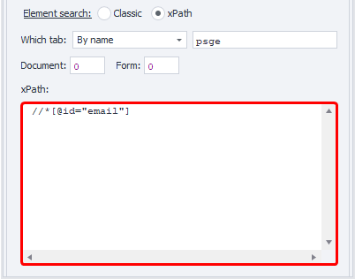


### **Which tab**

Select the tab in which the element will be searched.
Possible values:

- Active tab
- First
- By name - when selected, an input field will appear to enter the tab name.
- By number - the input field here should contain the tab’s number (count starts from zero!)

### **Document**

It’s recommended to set this value to **-1** (search in all documents on the page).

### **Form**

Also better to set as **-1** (search all forms on the page). This makes your template more universal.

<details>
<summary>Why set "-1"?</summary>

Example: there are 3 forms on a page — search, registration, and order. You need to click a button in the order form, so you choose “Form” value **2** (index starts from zero). After some time, a new login form is added before the order form, so number 2 will now be the login form — your template will either throw an error (button not found), or worse, click the wrong button.

</details>
:::note Keep in mind
In the program’s settings, you can tick two checkboxes — Search in all forms on the page and Search in all documents on the page. This means whenever an element is added to Action Builder, -1 is used for document and form numbers by default.
:::

### **Tag (classic search only)**

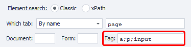


The HTML tag you want to get the value from.

:::tip Tip
You can specify several tags, separated by ; (semicolon)
:::

### **Conditions (classic search only)**

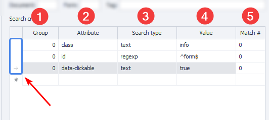


1. **Group** - priority of this condition. The higher the number, the lower the priority. If the element can’t be found using the condition with the highest priority, it moves to the next, and so on, until the element is found or the conditions run out. You can add multiple conditions with the same priority – in that case, search is done across all of them simultaneously.
2. **Attribute** — the HTML tag attribute to search by.
3. **Search type**:

 1. text - search for full or partial text match;
 2. notext - search for elements not containing the specified text;
 3. regexp - using [❗→ regular expressions](https://zennolab.atlassian.net/wiki/spaces/RU/pages/534086111 "https://zennolab.atlassian.net/wiki/spaces/RU/pages/534086111").
By default, the search is case-insensitive. To make regex case-sensitive, add `(?-i)` to the start of your pattern (turns off case insensitivity).
4. **Value** - value of the HTML tag attribute.
5. **# of match** - sequence number of the found element (count starts from zero!). You can [❗→ use ranges](https://zennolab.atlassian.net/wiki/spaces/RU/pages/488964137 "https://zennolab.atlassian.net/wiki/spaces/RU/pages/488964137") and [❗→ variable macros](https://zennolab.atlassian.net/wiki/spaces/RU/pages/486309922 "https://zennolab.atlassian.net/wiki/spaces/RU/pages/486309922") here.

:::note Keep in mind
To delete a search condition, left-click the field to its left (blue highlighted in the screenshot), then press Delete on your keyboard.
:::

:::note Keep in mind
You can use several conditions to search for an element.
:::

It’s always important to try and choose your search conditions so only one element remains, i.e., match number 0 (count starts from zero).

#### Save the result to a variable

The recognition result will be saved into the specified [❗→ project variable](/wiki/spaces/RU/pages/486309922 "/wiki/spaces/RU/pages/486309922").

  

### Additional

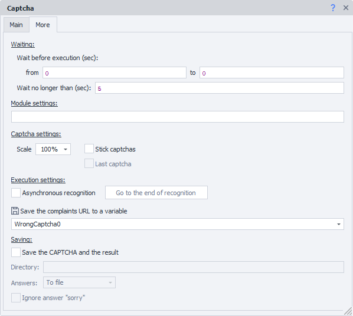


#### Waiting

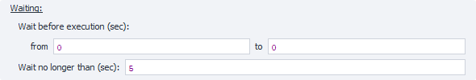


*Wait before execution*
If you specify positive numbers in the *FROM and *TO fields, the action will pause for a random amount of time within that range before starting.

*Wait for element up to*
If after this time the element is not found, the action will exit via the red branch (with an error).

#### Module parameters

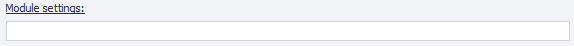


Here you can specify additional parameters (options) for solving the captcha — case sensitivity, only Cyrillic letters, math captcha, multiple words, etc.

Format: `parameter_name=parameter_value` — separate multiple parameters with ***&*** (ampersand)

Example (based on the RuCaptcha API): `phrase=1&numeric=2&regsense=1`
- captcha consists of two or more words, only letters, case sensitive

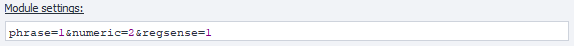


<details>
<summary>Sample parameters from different services</summary>

:::warning Warning
Additional parameters and their possible values are specific to each service.
:::

Here are a few examples based on two popular captcha solving services.

*RuCaptcha* - go to the API documentation page https://rucaptcha.com/api-rucaptcha#solving_normal_captcha and scroll down to find a table with parameters you can specify

| 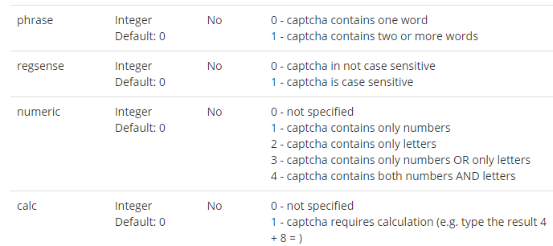 |
| :--: |
| here are just some of the possible parameters |


*Anti-Captcha* - on the [❗→ documentation page](https://anticaptcha.atlassian.net/wiki/spaces/API/pages/4227078/ImageToTextTask "https://anticaptcha.atlassian.net/wiki/spaces/API/pages/4227078/ImageToTextTask") for solving simple text captchas, there’s also a table of allowed parameters

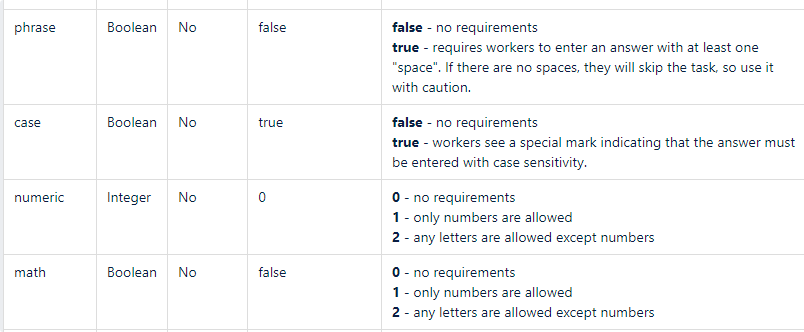


Even just between these two services and just a small fraction of their parameters, you’ll see that

- some parameters mean the same thing but are named differently (case sensitivity — *case and *regsense)
- others have the same name and meaning, but accept different types of values (*phrase)
- some parameters fully match by name, purpose, and accepted values, but one service allows more options than another (*numeric)

Be extremely careful when using additional parameters if you are creating a project for multiple captcha services.

</details>
#### Captcha parameters

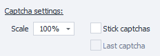


*Scale*
This option lets you reduce or increase the size of the captcha image you send.

*Combine captchas*
Sometimes a captcha consists of several images, so you can combine them to avoid paying for each piece separately. To combine captchas (if you didn’t do it when recording your template), set the “Combine captchas” flag in the properties window for the first captcha element. Then right-click on the next element, and a new context menu item will appear: *Attach to captcha.*

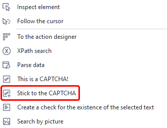


Each click creates a new action; for the last one, the *Last captcha* checkbox will be set (for previous ones, this checkbox is unchecked).

#### Async recognition

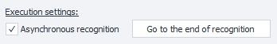


This setting allows you not to wait for a service response and continue executing your template.

Enabling this option creates a new action: *Wait for captcha recognition*. It does not have any settings, just a *To start of recognition* button, which will take you back to the main action (very handy if your template’s actions are on opposite sides of the workspace). The main action has a back button — *To end of recognition*.

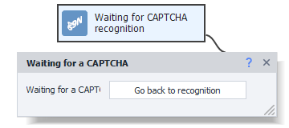


Once the template reaches the main *Captcha Recognition* action, it will send the captcha to the service and keep working until it hits the *Waiting...* action, where it will pause until the service’s response is received. Afterward, you can use the variables you specified in the main action.

#### Complaint URL

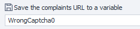


Captchas are solved by humans on the service, and people, as we know, can make mistakes. Sometimes workers are inattentive or misread the task and, instead of writing the answer to an expression 
`3+88=?`
, just write down the expression itself, even though the settings asked them to solve the math task.

For such cases, you can use this setting — if a captcha was solved incorrectly, send a request to this URL to complain about this specific recognition and the service will refund you.

:::warning Warning
Please don’t abuse this feature and only use it when a worker actually made a mistake and really solved the captcha incorrectly. If you complain and refund for correctly solved captchas, you will get banned very quickly.
:::

#### Saving


These options let you save the captcha image and answer to the specified folder.

- *Folder -* the directory where images will be saved (you can use [❗→ variables](/wiki/spaces/RU/pages/486309922 "/wiki/spaces/RU/pages/486309922"))
- *Answers -* where to save the answers to captchas:

 - *In the filename -* handy, but may not always work since captchas might contain characters that cannot be used in Windows filenames.


 - *To a file -* in this case the captcha image will be saved as *captcha(X)**.png** in the chosen directory, where *X* is the captcha number. A file *captcha(X)**.txt*** will also be created containing the answer. Here, filename restrictions won’t be a problem.
- *Ignore “sorry” answer -* for some errors, the *Recognize captcha* action returns *sorry* instead of a captcha answer. If this option is enabled, the program will not save captchas with such a response.

##### Where this can be useful:

- if you want to [create your own module](https://zennolab.atlassian.net/wiki/pages/createpage.action?spaceKey=APIS&amp;title=%D0%A1%D0%BE%D0%B7%D0%B4%D0%B0%D0%BD%D0%B8%D0%B5%20%D0%BF%D0%BE%D0%BB%D1%8C%D0%B7%D0%BE%D0%B2%D0%B0%D1%82%D0%B5%D0%BB%D1%8C%D1%81%D0%BA%D0%BE%D0%B3%D0%BE%20%D0%BC%D0%BE%D0%B4%D1%83%D0%BB%D1%8F "https://zennolab.atlassian.net/wiki/pages/createpage.action?spaceKey=APIS&amp;title=%D0%A1%D0%BE%D0%B7%D0%B4%D0%B0%D0%BD%D0%B8%D0%B5%20%D0%BF%D0%BE%D0%BB%D1%8C%D0%B7%D0%BE%D0%B2%D0%B0%D1%82%D0%B5%D0%BB%D1%8C%D1%81%D0%BA%D0%BE%D0%B3%D0%BE%20%D0%BC%D0%BE%D0%B4%D1%83%D0%BB%D1%8F") for the [CapMonster Cloud](https://capmonster.cloud/ "https://capmonster.cloud/") service.
- when using [❗→ CapMonster 2](/wiki/spaces/RU/pages/475332615 "/wiki/spaces/RU/pages/475332615") (a program for automatic captcha recognition) — this software supports many captchas out of the box, but there are some for which you need to [❗→ create modules yourself](/wiki/spaces/RU/pages/515932198 "/wiki/spaces/RU/pages/515932198"). To create a module, you need a base of correctly solved captchas — that’s where these action options come in: solve captchas (manually or via services), save the captchas and answers, and then train CapMonster 2 on them.

* * *

## More information

### Text captchas

Quite often, especially on poorly protected resources, you’ll encounter text captchas. Unlike an ordinary (graphic) captcha, these aren’t drawn on an image — they’re just text. Such captchas don’t need to be sent anywhere, you can just extract (parse) them directly from the page text. To do this, get the page text via the [❗→ Data](https://zennolab.atlassian.net/wiki/spaces/RU/pages/534085840/- "https://zennolab.atlassian.net/wiki/spaces/RU/pages/534085840/-") action, select the page text, check “parse result”, and enter a [❗→ regular expression](/wiki/spaces/RU/pages/534086111 "/wiki/spaces/RU/pages/534086111") in the parameters for parsing the page.

### Math captcha

You might also encounter math text captchas. These are just like text captchas, except they usually show a math expression like 58+63. You could turn this text into an image and send it for recognition, or you can use JavaScript. To solve such a captcha, you can use the [❗→ JavaScript](/wiki/spaces/RU/pages/489259137 "/wiki/spaces/RU/pages/489259137") action from the “Your code” category. In the code field, insert a link to the variable that contains the parsed expression (like 58+63), and after execution, the action will return the result (121).

### Flash captcha or captcha from any other element

If you come across a flash captcha, you can render it as a regular image and also send it for recognition. Find this element in the [❗→ elements tree](/wiki/spaces/RU/pages/727777355 "/wiki/spaces/RU/pages/727777355"), right-click to open the action menu, and choose “This is a captcha” — that’s it!

### How to handle CAPTCHA recognition errors

<iframe width="560" height="315" src="https://www.youtube.com/embed/z1uLzCEUcZ8" title="YouTube video player" frameborder="0" allow="accelerometer; autoplay; clipboard-write; encrypted-media; gyroscope; picture-in-picture; web-share" allowfullscreen></iframe>

:::warning Warning
The video was recorded for an older version of ZennoPoster, but the error handling algorithm remains the same and is not dependent on the program version.
:::

### How to take a browser screenshot using the Recognize Captcha action?

Sometimes there’s a need to take a screenshot of a specific HTML element or the whole site (even parts outside the visible area).

:::warning Warning
If you only need a screenshot of the browser window (the visible part of the site), it’s better to use the Image Processing action.
:::

To do this:

- add the Recognize Captcha action to your project (make sure to do it via the browser context menu , i.e., right-click any image on the site)
- for the recognition module, select *CaptchaSaver.dll*
- specify the search criteria for the element you want to screenshot
- on the *Additional* tab, in the *Module Parameters* field, specify the full path for saving the image (you can use [❗→ variable macros](/wiki/spaces/RU/pages/486309922 "/wiki/spaces/RU/pages/486309922"))

<details>
<summary>Example action settings to screenshot the entire site</summary>

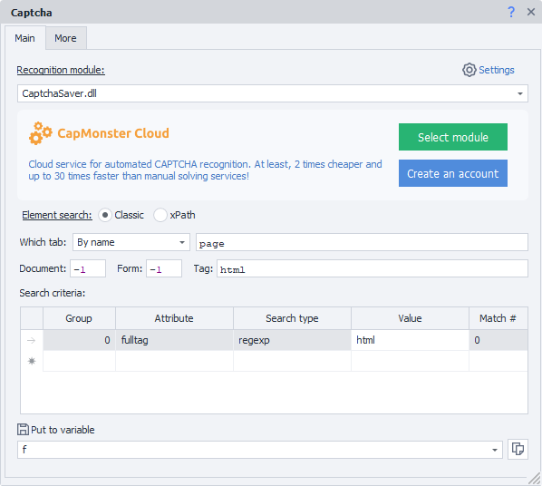


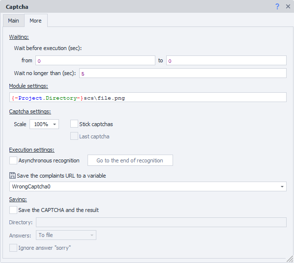


</details>
* * *

## Example usage

### Typical case

- Right-click (RMB) on the captcha image and choose *This is a captcha!* from the context menu

 - right after adding this action, the [❗→ manual recognition window](/wiki/spaces/RU/pages/534053215 "/wiki/spaces/RU/pages/534053215") will pop up — you can close it
- select the desired recognition module (by default, *MonkeyEnter.dll* - manual input)

 - make sure you’ve entered the API key in the [❗→ settings](/wiki/spaces/RU/pages/808845385 "/wiki/spaces/RU/pages/808845385") and funded your service account
- Right-click in the input field where the captcha answer should go and select *Field for captcha recognition result* to add another [❗→ action](/wiki/spaces/RU/pages/486342706 "/wiki/spaces/RU/pages/486342706") for inputting the captcha answer (recording must be enabled in the project).

 - Or, you can find the field manually using the [❗→ Action Builder](/wiki/spaces/RU/pages/483426337 "/wiki/spaces/RU/pages/483426337") and input the answer using a [❗→ Set value](/wiki/spaces/RU/pages/534315117 "/wiki/spaces/RU/pages/534315117") action.

### Combining

For this example, we’ll use a page with the following content:

<details>
<summary>Source code of the test page.</summary>

```html
<!DOCTYPE html>
<html>
<head>
	<title>CAPTCHA Test</title>
</head>
<body>
	
	
	
	
</body>
</html>
```

</details>
Each symbol is a separate HTML element. Right-click the first image — *This is a captcha!*, select *Combine captchas* in the settings, then right-click the other images and select *Attach to captcha* from their context menus. In the end, you should have four actions:


When you run the project, the first three actions will just collect the images and merge them, and only the last one will add the final part and send it to the service for full captcha recognition.

### Additional parameters when sending

Let’s say you get a captcha like this:

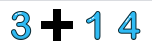


It consists of separate pieces and you need to write the result of the expression (in this case — addition).

<details>
<summary>Source code of the page with the captcha</summary>

```html
<!DOCTYPE html>
<html>
<head>
	<title>CAPTCHA Test</title>
</head>
<body>
	
	
	
	
</body>
</html>
```

</details>
First, merge all the images into one. Then, for the final action, select the required service (in this example, RuCaptcha) and in *Parameters* under *Additional*, specify that a math operation must be performed (for RuCaptcha: 
```calc=1`)

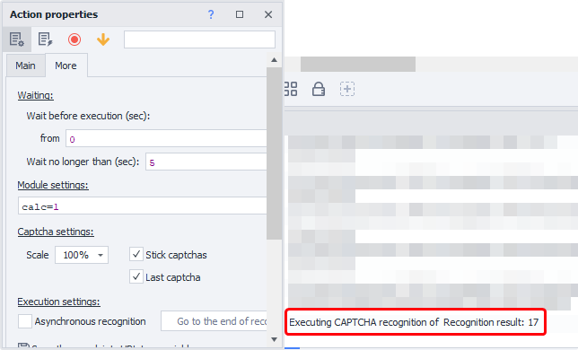


  

## Useful links

- [❗→ ReCaptcha2 action](https://zennolab.atlassian.net/wiki/spaces/RU/pages/534053033/ReCaptcha "https://zennolab.atlassian.net/wiki/spaces/RU/pages/534053033/ReCaptcha")
- [❗→ Captcha service settings](/wiki/spaces/RU/pages/808845385 "/wiki/spaces/RU/pages/808845385")
- [Pages with different types of captchas](https://lessons.zennolab.com/captchas/ "https://lessons.zennolab.com/captchas/")
- [❗→ Browser](/wiki/spaces/RU/pages/534315373 "/wiki/spaces/RU/pages/534315373")
- [❗→ Regex tester](/wiki/spaces/RU/pages/534086111 "/wiki/spaces/RU/pages/534086111")