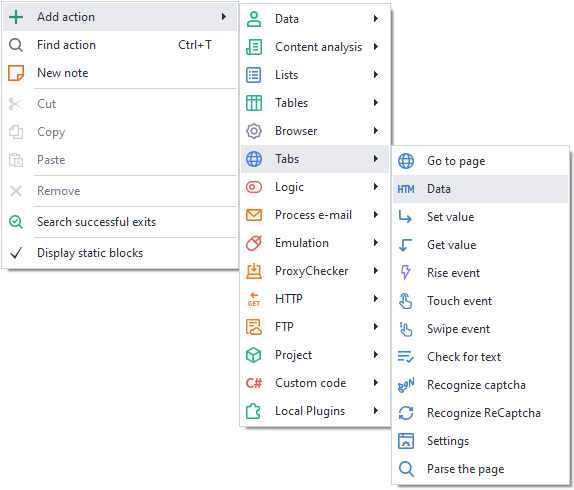
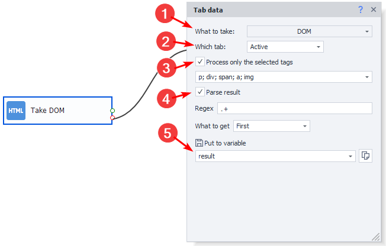
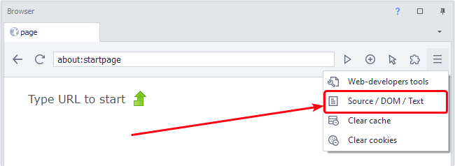
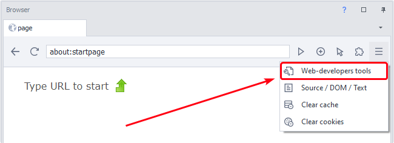
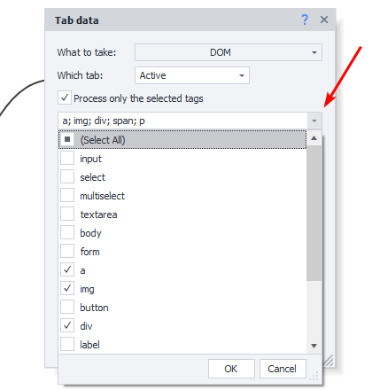
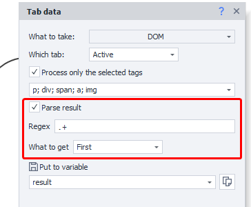
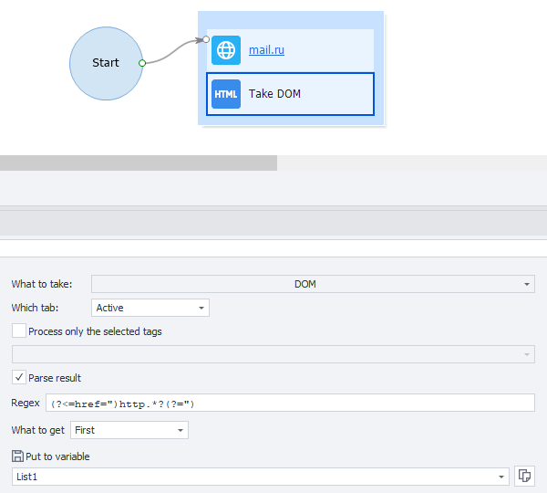

---
sidebar_position: 2
title: "Data (tab operations)"
description: ""
date: "2025-07-30"
converted: true
originalFile: "Данные (операции с табом).txt"
targetUrl: "https://zennolab.atlassian.net/wiki/spaces/RU/pages/534085840"
---
import DisclaimerNotice from '@site/src/components/DisclaimerNotice';

<DisclaimerNotice />

> 🔗 **[Original page](https://zennolab.atlassian.net/wiki/spaces/RU/pages/534085840)** — Source of this material

_______________________________________________  

## Description

This action is designed to retrieve data from a page.

  

## How do I add the action to my project?

Via the context menu **Add action** → **Tabs** → **Data**

Or use [❗→ Smart Search](https://zennolab.atlassian.net/wiki/spaces/RU/pages/506200090/ProjectMaker+7#%D0%A3%D0%BC%D0%BD%D1%8B%D0%B9-%D0%BF%D0%BE%D0%B8%D1%81%D0%BA-%D0%B4%D0%B5%D0%B9%D1%81%D1%82%D0%B2%D0%B8%D0%B9 "https://zennolab.atlassian.net/wiki/spaces/RU/pages/506200090/ProjectMaker+7#%D0%A3%D0%BC%D0%BD%D1%8B%D0%B9-%D0%BF%D0%BE%D0%B8%D1%81%D0%BA-%D0%B4%D0%B5%D0%B9%D1%81%D1%82%D0%B2%D0%B8%D0%B9").

  

## What is it used for?

- Find and save the information you need from a page
- Check if any values are present on a page
- Parse text from a page
- Get the page URL

## How do I use the action?

### What to get

Choose the type of data you want to retrieve:

- DOM - Document Object Model;
- Source - source code of the page;
- Text - visible text of the page;
- URL - the URL from the address bar.

#### The difference between Source and Dom

Click here to expand

**Source** - the source code of the page received from the server.
**DOM** - this is the object tree created by the browser in your computer's memory based on the source code (*Source).

To put it simply, the browser works as follows:

1. You enter a URL in the address bar and press Enter.
2. The browser sends a request to the server.
3. The server returns the response in the form of the HTML source code of the page (*Source)
4. Based on the source code, the browser builds the *DOM (Data Object Model — document object model)

 - handles errors (adds html, body, head tags, etc. if they’re missing)
 - closes unclosed tags
 - adds a &lt;tbody&gt; tag to tables if there isn’t one. According to the DOM, tables (&lt;table&gt;) should have a &lt;tbody&gt; tag, but in HTML it’s optional. (Keep this in mind when building [❗→ XPath](/wiki/spaces/RU/pages/862093419 "/wiki/spaces/RU/pages/862093419") and [❗→ regular expressions](/wiki/spaces/RU/pages/534086111 "/wiki/spaces/RU/pages/534086111"))
 - processes scripts on the page (which can add new elements to the page—even after it's fully loaded)
5. Finally, the browser renders and shows you the web page content based on the DOM.

The DOM can contain information and elements that won’t be in the source code (Source), because the DOM includes content that can be inserted dynamically using JavaScript.

When working with requests ([❗→ GET](/wiki/spaces/RU/pages/534315165 "/wiki/spaces/RU/pages/534315165"), [❗→ POST](/wiki/spaces/RU/pages/534315180 "/wiki/spaces/RU/pages/534315180"), and [❗→ other types of requests](/wiki/spaces/RU/pages/489259052 "/wiki/spaces/RU/pages/489259052")), you’re always dealing with the Source.

To view the Source and DOM in ProjectMaker, there are two tools:

- [❗→ View Source Code](https://zennolab.atlassian.net/wiki/spaces/RU/pages/534315373#%D0%9F%D1%80%D0%BE%D1%81%D0%BC%D0%BE%D1%82%D1%80-%D0%B8%D1%81%D1%85%D0%BE%D0%B4%D0%BD%D0%BE%D0%B3%D0%BE-%D0%BA%D0%BE%D0%B4%D0%B0 "https://zennolab.atlassian.net/wiki/spaces/RU/pages/534315373#%D0%9F%D1%80%D0%BE%D1%81%D0%BC%D0%BE%D1%82%D1%80-%D0%B8%D1%81%D1%85%D0%BE%D0%B4%D0%BD%D0%BE%D0%B3%D0%BE-%D0%BA%D0%BE%D0%B4%D0%B0")

- [❗→ Web Developer Tools](https://zennolab.atlassian.net/wiki/spaces/RU/pages/534315373#%D0%98%D0%BD%D1%81%D1%82%D1%80%D1%83%D0%BC%D0%B5%D0%BD%D1%82%D1%8B-web-%D1%80%D0%B0%D0%B7%D1%80%D0%B0%D0%B1%D0%BE%D1%82%D1%87%D0%B8%D0%BA%D0%B0 "https://zennolab.atlassian.net/wiki/spaces/RU/pages/534315373#%D0%98%D0%BD%D1%81%D1%82%D1%80%D1%83%D0%BC%D0%B5%D0%BD%D1%82%D1%8B-web-%D1%80%D0%B0%D0%B7%D1%80%D0%B0%D0%B1%D0%BE%D1%82%D1%87%D0%B8%D0%BA%D0%B0") (for Chrome engine only)

### Which tab

Select which tab to get data from:

- *Active — the currently active tab;
- *First — if there are several tabs, take the first one;
- *By name — specify the name of the tab;
- *By number — specify the tab number if there are several.

### Process only the specified tags

If you need to process only one or several specific HTML tags, enable the checkbox and select the desired options.

### Parse result

If you need to parse the obtained result, you can specify a regular expression (Regex), set the number and indexes of matches, and choose where to save the result — to a variable or a table. You can select the right regular expression using the [❗→ Regex Tester](/wiki/spaces/RU/pages/534086111 "/wiki/spaces/RU/pages/534086111").

:::note Note
The control elements that appear when you enable the “Parse data” setting are the same as in “Text Processing – Regex” (you’ll find a more detailed description there).
:::

:::tip Tip
To get data from a page, there is a more convenient tool — Parse data
:::

  

## Example usage

Let’s get all the links on a page. Choose DOM or Source as the source, enable result parsing, and set a Regex expression:

`(?<=href=")http.*?(?=")`

Grab all matches and put the results in a list.

As a result, you’ll get a list of all the links found on the page.

  

## Useful links

- [❗→ Regex Tester](/wiki/spaces/RU/pages/534086111 "/wiki/spaces/RU/pages/534086111")
- [❗→ 💻Browser Window](/wiki/spaces/RU/pages/534315373 "/wiki/spaces/RU/pages/534315373")