---
sidebar_position: 4
title: "Getting a Value"
description: ""
date: "2025-07-30"
converted: true
originalFile: "Получение значения.txt"
targetUrl: "https://zennolab.atlassian.net/wiki/spaces/RU/pages/534315124"
---
import DisclaimerNotice from '@site/src/components/DisclaimerNotice';

<DisclaimerNotice />

> 🔗 **[Original page](https://zennolab.atlassian.net/wiki/spaces/RU/pages/534315124)** — Source of this material

_______________________________________________  

  

## Description

This action is used to retrieve the value of a specified element. This can be:

- Height/width
- Inner text/HTML code
- HTML attributes – id, class, name, style, and others
- Tag name
- And much more

  

## How do I add the action to a project?

Via the context menu **Add action** → **Tabs** → **Get value**

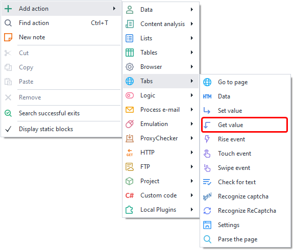

Or by using the [❗→ action builder](https://zennolab.atlassian.net/wiki/spaces/RU/pages/483426337/ "https://zennolab.atlassian.net/wiki/spaces/RU/pages/483426337/").

Or you can use the [❗→ smart search](https://zennolab.atlassian.net/wiki/spaces/RU/pages/506200090/ProjectMaker+7#%D0%A3%D0%BC%D0%BD%D1%8B%D0%B9-%D0%BF%D0%BE%D0%B8%D1%81%D0%BA-%D0%B4%D0%B5%D0%B9%D1%81%D1%82%D0%B2%D0%B8%D0%B9 "https://zennolab.atlassian.net/wiki/spaces/RU/pages/506200090/ProjectMaker+7#%D0%A3%D0%BC%D0%BD%D1%8B%D0%B9-%D0%BF%D0%BE%D0%B8%D1%81%D0%BA-%D0%B4%D0%B5%D0%B9%D1%81%D1%82%D0%B2%D0%B8%D0%B9").

  

## How do I select an element to get a value from?

Let's look at an example: https://lessons.zennolab.com/ru/registration. Let’s say you need to extract the text of the button that submits the form. To do this, right-click on the button and select *To Action Builder* from the context menu.

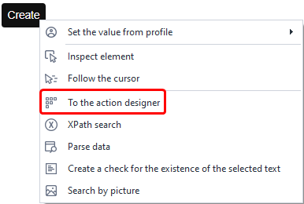

At the bottom, under the browser window, the [❗→ *Action Builder*](https://zennolab.atlassian.net/wiki/spaces/RU/pages/483426337/.+XPath "https://zennolab.atlassian.net/wiki/spaces/RU/pages/483426337/.+XPath") will open.

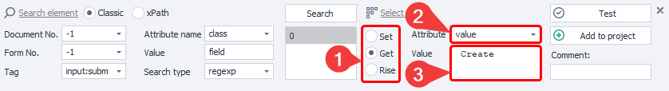

The data for the search will be automatically selected so that only one element is found as a result. Here’s what you should do:

- In the *Action* field, choose *Get^(1)^*.
- The button text is stored in the value attribute, so select it from the *Attribute^(2)^* dropdown. In the *Value* field, the contents of the selected attribute will appear— in our example, it’s the text “Создать аккаунт” (“Create Account”).
- Before adding the action to your project, it’s a good idea to test it by clicking the appropriate button (especially if you have made changes in the action builder).
- (Optional but recommended) Add a comment to the action (especially for Get Value actions, since the default comment provides very little information).
- Add the action to your project by clicking *Add to project*.

  

## What is this used for?

- Data parsing (though there is a more suitable tool for that – the [❗→ Parse Page](/wiki/spaces/RU/pages/534085857 "/wiki/spaces/RU/pages/534085857") action)
- Checking for the presence of an element on the page. This can be useful to:

 - determine if you are logged in (for example, when you are logged in, a personal account button appears on the site— if it’s there, you’re good. Or vice versa: when logged in, some element disappears—like a “Login” button, and if it’s gone, you know you are logged in)
 - search for error messages (especially helpful when solving captchas: if the captcha is not solved correctly, a new HTML element with the error text often appears on the page; if a page like that appears after submitting a captcha, you need to try solving it again. Also, there is a special [❗→ Check for text](/wiki/spaces/RU/pages/1308426253 "/wiki/spaces/RU/pages/1308426253") action you can use to check for text on a page)
- Checking element visibility: sometimes a template finds an element, but it isn’t actually visible on the page (due to HTML construction quirks), for example a registration button. To make sure it is really displayed, you can get its height and width attributes and check that each is greater than 0.

  

## Action settings: "Main" tab

Once you’ve added the action through the [❗→ action builder](https://zennolab.atlassian.net/wiki/spaces/RU/pages/483426337/.+XPath "https://zennolab.atlassian.net/wiki/spaces/RU/pages/483426337/.+XPath"), open its settings:

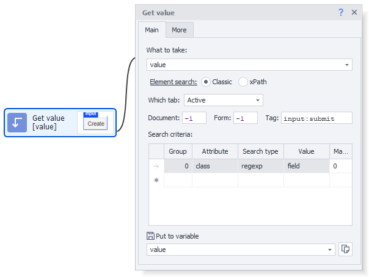

### What to grab

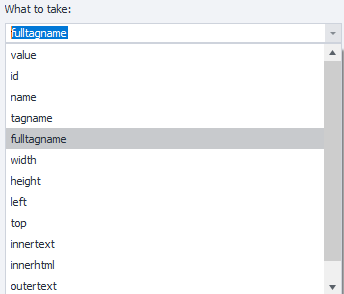

Choose exactly what you want to get—`id, class, innerText, innerHtml, value, height, width, style`, etc.

You can also enter a value manually instead of selecting from the list.
On websites, you’ll often see attributes like `data-...` (for example, data-name, data-value, data-testid, data-whatever). Such attributes (those not in the dropdown) can be entered manually.

:::note Note
You can use project variables (`{ -Variable.var_name- }`)
:::

### Element search

Before interacting with an element on the page, you need to find it. In the [❗→ Get Value](https://zennolab.atlassian.net/wiki/spaces/RU/pages/534315124 "https://zennolab.atlassian.net/wiki/spaces/RU/pages/534315124"), [❗→ Set Value](https://zennolab.atlassian.net/wiki/spaces/RU/pages/534315117 "https://zennolab.atlassian.net/wiki/spaces/RU/pages/534315117"), [❗→ Trigger event](https://zennolab.atlassian.net/wiki/spaces/RU/pages/534020211 "https://zennolab.atlassian.net/wiki/spaces/RU/pages/534020211"), [❗→ Touch event](https://zennolab.atlassian.net/wiki/spaces/RU/pages/735674386 "https://zennolab.atlassian.net/wiki/spaces/RU/pages/735674386"), and [❗→ Swipe event](https://zennolab.atlassian.net/wiki/spaces/RU/pages/735739970 "https://zennolab.atlassian.net/wiki/spaces/RU/pages/735739970") actions, there are two ways to search for elements—classic and XPath.

  

**Classic** – Search by HTML element parameters: tag, attribute and value.

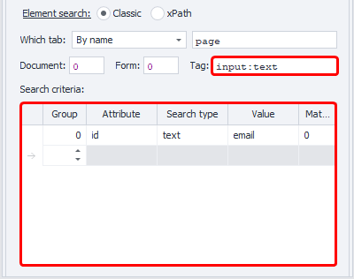

**XPath** – search using [❗→ XPath expressions](https://zennolab.atlassian.net/wiki/spaces/RU/pages/862093419/ "https://zennolab.atlassian.net/wiki/spaces/RU/pages/862093419/"). This allows you to implement a more flexible and robust way of searching for data, compared to classic search or regular expressions.

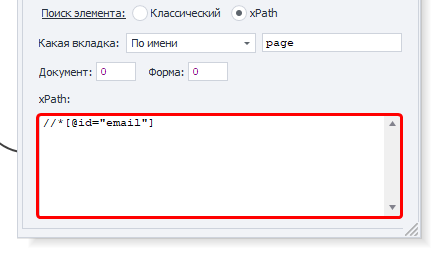

### **Which tab**

Select the tab where the element search will be performed.
Possible values:

- Current tab
- First
- By name – when you choose this option, an input field to enter the tab name appears.
- By number – you will need to enter the tab’s index (counting starts from zero!)

### **Document**

It is recommended to set **-1** (search across all documents on the page). 

### **Form**

It’s also best to set **-1** (search through all forms on the page). This makes your template more generic.

Why is it better to set "-1"?

Example: the page has three forms—search, registration, order. You want to click the order form’s button and set the “Form” value to **2** (numbering starts from zero). Later, a new form (login) is added before the order form. Now, index 2 points to the login form, and your template either fails to find the button (error), or worse—it clicks a button in the wrong form.

:::note Note
There are two checkboxes in the program settings—Search in all forms on the page and Search in all documents on the page. When these are checked, -1 will be set automatically for document and form numbers when adding elements in Action Builder.
:::

### **Tag (classic search only)**

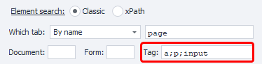

The actual HTML tag whose value you need to get.

:::tip Tip
You can specify multiple tags, separated by a semicolon (;)
:::

### **Conditions (classic search only)**

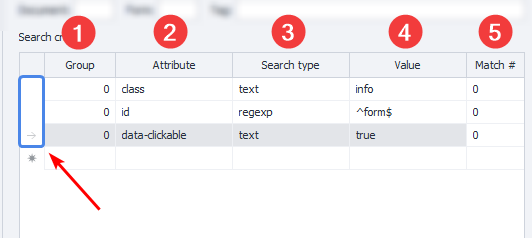

1. **Group** – priority of this condition. The higher this number, the lower the priority. If the element couldn’t be found with the highest priority condition, the process goes to the next, and so on until the element is found or all conditions are exhausted. You can add several conditions with the same priority, in which case the search will be performed for all same-priority conditions at once.
2. **Attribute** – the HTML tag attribute used for search.
3. **Search type**:

 1. text – search by full or partial text match;
 2. notext – search for elements where the specified text does not appear;
 3. regexp – search with [❗→ regular expressions](https://zennolab.atlassian.net/wiki/spaces/RU/pages/534086111 "https://zennolab.atlassian.net/wiki/spaces/RU/pages/534086111")
By default, search is case-insensitive. To make your regular expression search case-sensitive, add
`(?-i)` at the very beginning of the expression (this disables case-insensitive search)
4. **Value** – the value of the HTML tag’s attribute
5. **# of match** – the index of the found element (numbering starts from zero!). In this field, you can use [❗→ ranges](https://zennolab.atlassian.net/wiki/spaces/RU/pages/488964137 "https://zennolab.atlassian.net/wiki/spaces/RU/pages/488964137") and [❗→ variable macros](https://zennolab.atlassian.net/wiki/spaces/RU/pages/486309922 "https://zennolab.atlassian.net/wiki/spaces/RU/pages/486309922").

:::note Note
To delete a search condition, left-click the field to the left of it (highlighted in blue on the screenshot) and press delete on your keyboard.
:::

:::note Note
To find the desired element, you can use multiple conditions.
:::

It’s always important to try and set your conditions so that only one element is found, i.e., the index is 0 (numbering starts from zero).

* * *

## Action settings: "Advanced" tab

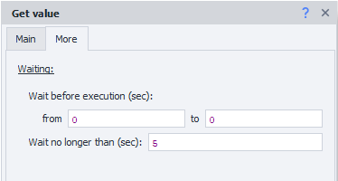

### Wait before execution

How long the action will wait before execution.

### Wait for element (timeout)

If the element does not appear on the page within the specified time, the action will finish with an error.

* * *

## Example use case

Let’s look at one way to use this. Example: https://lessons.zennolab.com/ru/advanced.

We use [❗→ Set Value](/wiki/spaces/RU/pages/534315117 "/wiki/spaces/RU/pages/534315117") and [❗→ profile variables](/wiki/spaces/RU/pages/486309922 "/wiki/spaces/RU/pages/486309922") to fill the form fields. In a real project you might have to [❗→ recognize the captcha](/wiki/spaces/RU/pages/534053026 "/wiki/spaces/RU/pages/534053026") using services or [❗→ do it manually](/wiki/spaces/RU/pages/534053215 "/wiki/spaces/RU/pages/534053215"), but on this page the captcha image is always the same. After entering all the data, use the [❗→ Trigger event](/wiki/spaces/RU/pages/534020211 "/wiki/spaces/RU/pages/534020211") action to click the *Create account* button. From here, things can go in several directions:

If you filled everything correctly and solved the captcha, you get a page with the text **Wellcome!**

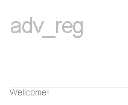

If the captcha is wrong, you’ll see a page with **wrong captcha**

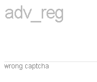

Use the action builder to create a Get Value action that saves the text shown in the screenshots above. However, the variable ends up with a lot of extra stuff—like *adv_reg*, menu item names, etc. With [❗→ Text processing](https://zennolab.atlassian.net/wiki/spaces/RU/pages/488865793#Regex "https://zennolab.atlassian.net/wiki/spaces/RU/pages/488865793#Regex") and a simple [❗→ regular expression](/wiki/spaces/RU/pages/534086111 "/wiki/spaces/RU/pages/534086111") `(Wellcome!|wrong\ captcha)` you search for either *Welcome* or *wrong captcha*. Using [❗→ Switch](/wiki/spaces/RU/pages/534085864 "/wiki/spaces/RU/pages/534085864"), you check what’s in your variable. If it’s *Welcome*, [❗→ send](/wiki/spaces/RU/pages/534053050 "/wiki/spaces/RU/pages/534053050") an informational message to the [❗→ log](/wiki/spaces/RU/pages/725352532 "/wiki/spaces/RU/pages/725352532"); if it’s *wrong captcha*—send a log message that registration failed.

## Useful links

- [❗→ Action Builder and XPath search](/wiki/spaces/RU/pages/483426337 "/wiki/spaces/RU/pages/483426337")
- [❗→ Set Value](/wiki/spaces/RU/pages/534315117 "/wiki/spaces/RU/pages/534315117")
- [❗→ Trigger event](/wiki/spaces/RU/pages/534020211 "/wiki/spaces/RU/pages/534020211")
- [❗→ Text processing](/wiki/spaces/RU/pages/488865793 "/wiki/spaces/RU/pages/488865793")
- [❗→ Regex tester](/wiki/spaces/RU/pages/534086111 "/wiki/spaces/RU/pages/534086111")
- [❗→ Parse page (Extract page data)](/wiki/spaces/RU/pages/534085857 "/wiki/spaces/RU/pages/534085857")
- [❗→ Working with variables](/wiki/spaces/RU/pages/486309922 "/wiki/spaces/RU/pages/486309922")
- [❗→ XPath](/wiki/spaces/RU/pages/862093419 "/wiki/spaces/RU/pages/862093419")
- [❗→ Value ranges](/wiki/spaces/RU/pages/488964137 "/wiki/spaces/RU/pages/488964137")
- [❗→ Check for text](/wiki/spaces/RU/pages/1308426253 "/wiki/spaces/RU/pages/1308426253")