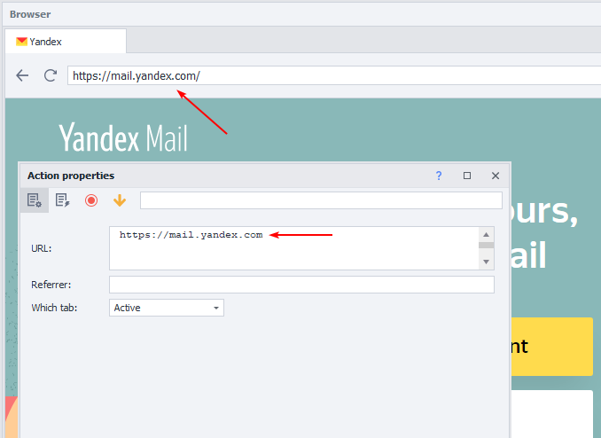
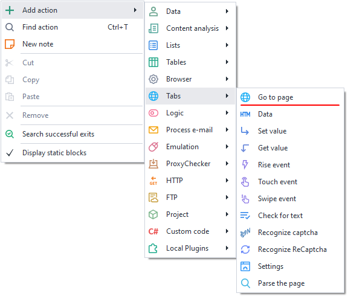
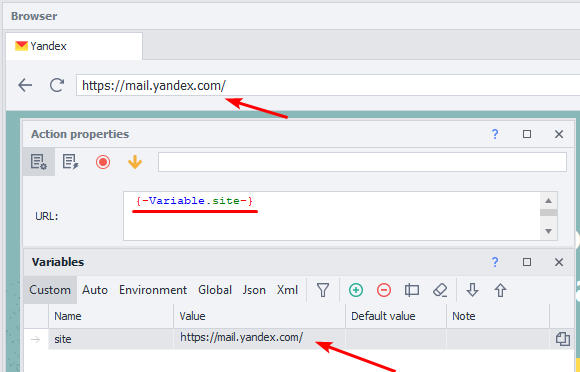
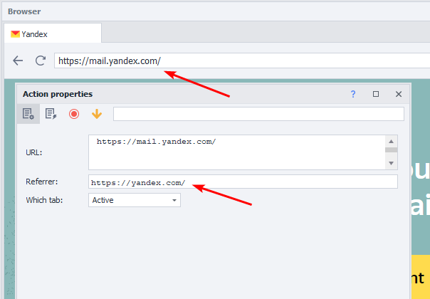
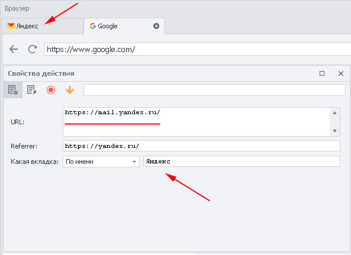
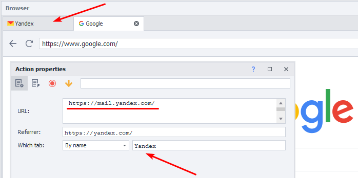

:::info **Please read the [*Material Usage Rules on this site*](../../../../Disclaimer).**
:::

> 🔗 **[Original page](https://zennolab.atlassian.net/wiki/spaces/RU/pages/534052989/Navigate)** — Source of this material

_______________________________________________  

## Description

Loads the required website or a specific page in the designated browser tab.

|  |
| :--: |
| The exact specified website page opened in the active browser tab |

## Where can you use it: 

- Website loading
- Opening a specific web page
- Account activation
- Simulating navigation from one site to another resource
- Loading a website in an inactive browser tab

## How to add this action to your project?

Using the context menu **Add Action** → **Tabs** → **Navigate to Page**

Or use the [❗→ smart search](https://zennolab.atlassian.net/wiki/spaces/RU/pages/506200090/ProjectMaker+7#%D0%A3%D0%BC%D0%BD%D1%8B%D0%B9-%D0%BF%D0%BE%D0%B8%D1%81%D0%BA-%D0%B4%D0%B5%D0%B9%D1%81%D1%82%D0%B2%D0%B8%D0%B9 "https://zennolab.atlassian.net/wiki/spaces/RU/pages/506200090/ProjectMaker+7#%D0%A3%D0%BC%D0%BD%D1%8B%D0%B9-%D0%BF%D0%BE%D0%B8%D1%81%D0%BA-%D0%B4%D0%B5%D0%B9%D1%81%D1%82%D0%B2%D0%B8%D0%B9").

## How to work with this action?

- **URL** – in this field, specify the page you want to open or a variable containing the address.

- **Referrer** — here you enter the resource **from** which the transition occurred, thereby demonstrating to the site that you're a real user. You can insert a variable with a prepared list.

We navigated to Yandex.Mail from the Yandex homepage.
- **Which tab** – specify exactly in which window you want to load the website or page.

1. *Active – the tab currently in front of you.
2. *First – loads the site in the leftmost window, i.e., the first, counting from the left.
3. *By name – specify the tab name or a variable with the name, case sensitive.
4. *By number – the tab’s number from left to right, starting at zero. The first window is always 0, the next tabs are 1, 2, 3, and so on.

:::info Information
If you specify to load the page in the first, by name, or by number tab, the currently active window won't change or activate. The loading will happen in an inactive tab.
:::

## Example usage: 

You need to load the email site in the second tab to activate an account.

1. In the active window, perform the necessary registration steps.
2. Specify the tab with number 1 (remember, tabs are counted from zero), and simultaneously load the email site.
3. Switch to the required tab and activate the account.

  

## Useful links

1. [❗→ Tab management](/wiki/spaces/RU/pages/534020201 "/wiki/spaces/RU/pages/534020201")
2. [❗→ Settings](https://zennolab.atlassian.net/wiki/spaces/RU/pages/534020228/- "https://zennolab.atlassian.net/wiki/spaces/RU/pages/534020228/-")