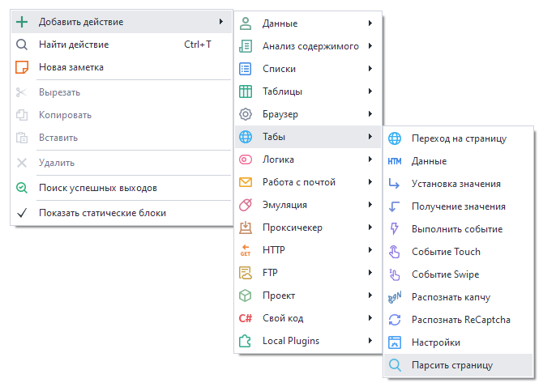
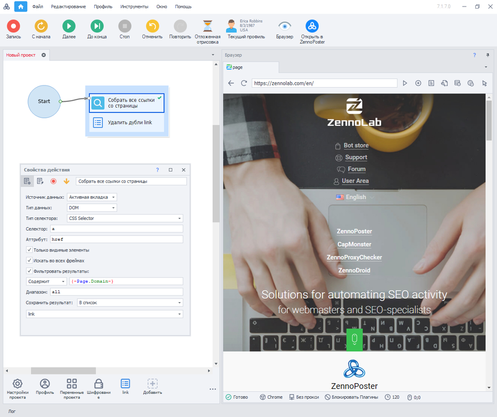
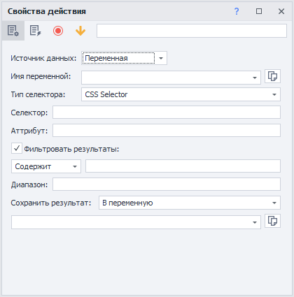
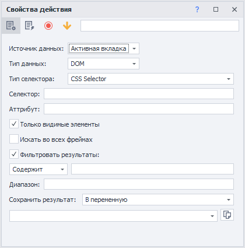
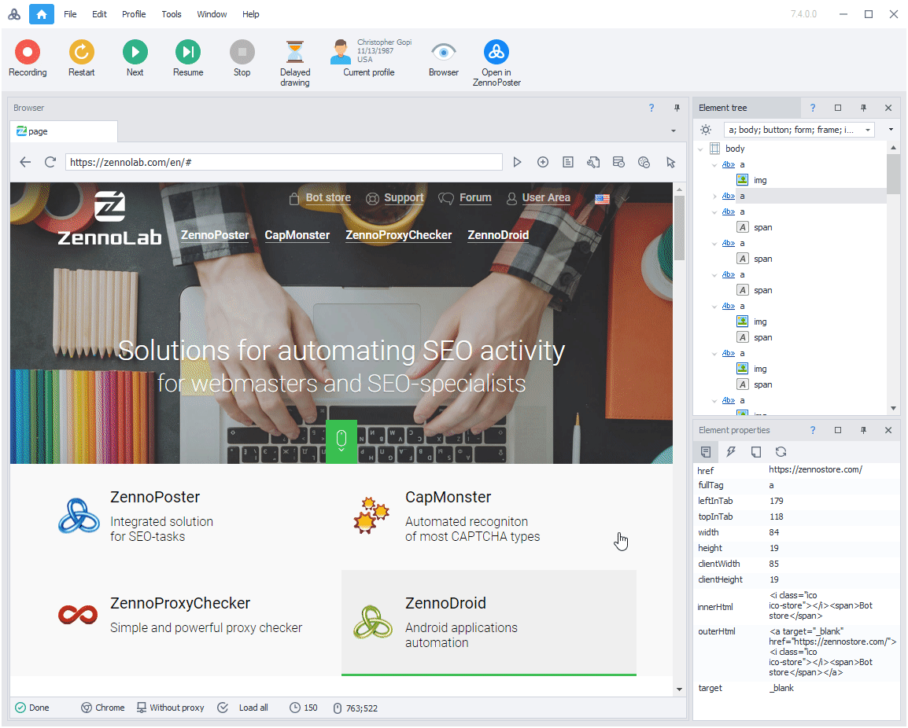

:::info **Please review the [*Terms of Use for Materials on This Resource*](../Disclaimer).**
:::

> 🔗 **[Original page](https://zennolab.atlassian.net/wiki/spaces/RU/pages/534085857)** — Source of this material

_______________________________________________  

## Description

The “*Parse Data*” action allows you to extract the information you need from a data source based on a variety of conditions, making searches more flexible and, therefore, more accurate.

  

## How to add an action to your project?

Via the context menu: **Add Action** → **Tabs** → **Parse Page**

Alternatively, you can use the [❗→ smart search](https://zennolab.atlassian.net/wiki/spaces/RU/pages/506200090/ProjectMaker+7#%D0%A3%D0%BC%D0%BD%D1%8B%D0%B9-%D0%BF%D0%BE%D0%B8%D1%81%D0%BA-%D0%B4%D0%B5%D0%B9%D1%81%D1%82%D0%B2%D0%B8%D0%B9 "https://zennolab.atlassian.net/wiki/spaces/RU/pages/506200090/ProjectMaker+7#%D0%A3%D0%BC%D0%BD%D1%8B%D0%B9-%D0%BF%D0%BE%D0%B8%D1%81%D0%BA-%D0%B4%D0%B5%D0%B9%D1%81%D1%82%D0%B2%D0%B8%D0%B9").

  

## Example use case

A straightforward example of how the “*Collect Data from Page*” action works:

- Collect all visible links on the current domain’s page.

As a result, you’ll get the data in the project’s [❗→ list](/wiki/spaces/RU/pages/534053375 "/wiki/spaces/RU/pages/534053375"). And using the [❗→ Remove Duplicates](https://zennolab.atlassian.net/wiki/spaces/RU/pages/534085798#%D0%A3%D0%B4%D0%B0%D0%BB%D0%B8%D1%82%D1%8C-%D0%B4%D1%83%D0%B1%D0%BB%D0%B8 "https://zennolab.atlassian.net/wiki/spaces/RU/pages/534085798#%D0%A3%D0%B4%D0%B0%D0%BB%D0%B8%D1%82%D1%8C-%D0%B4%D1%83%D0%B1%D0%BB%D0%B8") function, you’ll keep only unique links in the list.

  

## Detailed overview of the “Parse Data” action property window

By double-clicking the “*Parse Data*” action (in the project workspace), a “*Action Properties*” window will open, which is logically divided into two parts. The core of each data collection is the ***<u data-renderer-mark="true">data source</u>*** (from which you’ll retrieve information for further processing).

### Main data sources

- *Variable*
- *Active tab* (Current ZennoPoster browser page)

### **Variable**

If you select “Variable” as the data source, the following parameter list will appear:

- **Variable name** - the [❗→ project variable](/wiki/spaces/RU/pages/735608872 "/wiki/spaces/RU/pages/735608872") that contains the HTML code.
- **Selector type** - query language: [❗→ *XPath](/wiki/spaces/RU/pages/862093419 "/wiki/spaces/RU/pages/862093419") or *CSS Selector.
- **Selector** - the path that tells it which specific element(s) of the web page to target, using either *XPath or *CSS Selector.
- **Attribute** - the HTML tag property that you want to get during data collection.
- **Filter results** - boolean value; if checked, you can use a condition on the object: Contains, Does Not Contain, Regex (regular expression).
- **Range** - [❗→ condition](/wiki/spaces/RU/pages/488964137 "/wiki/spaces/RU/pages/488964137") for filtering data from the array of objects.
- **Save result** - after data collection completes, put the result into a [❗→ variable](/wiki/spaces/RU/pages/486309922 "/wiki/spaces/RU/pages/486309922") or [❗→ list](/wiki/spaces/RU/pages/534053375 "/wiki/spaces/RU/pages/534053375").

### **Active tab (current page)**

If you choose “Active Tab” as the data source, the following parameter list appears:

This is similar to the “Variable” data source, with the following differences:

- **Data type** (source: DOM, Html ([❗→ what’s the difference?](https://zennolab.atlassian.net/wiki/spaces/RU/pages/534085840#%D0%A0%D0%B0%D0%B7%D0%BD%D0%B8%D1%86%D0%B0-%D0%BC%D0%B5%D0%B6%D0%B4%D1%83-Source-%D0%B8-Dom "https://zennolab.atlassian.net/wiki/spaces/RU/pages/534085840#%D0%A0%D0%B0%D0%B7%D0%BD%D0%B8%D1%86%D0%B0-%D0%BC%D0%B5%D0%B6%D0%B4%D1%83-Source-%D0%B8-Dom"))) - where the data is obtained for working with objects.
- **Only visible elements** - only those objects that are displayed on the page.
- **Search in all frames** - means searching within any nested (frame) HTML documents that might contain the required data.

  

## Fast way to collect data

An alternative, faster way to set up data collection can be found in the context menu of the “[❗→ ***Element Tree***](/wiki/spaces/RU/pages/727777355 "/wiki/spaces/RU/pages/727777355")” panel (or by right-clicking in the browser) → select “***Parse Data***”. In the window that opens, you can set search parameters and start collecting information in just a few clicks—no special knowledge of *XPath or *CSS Selector query languages required.

  

## Useful links

- [❗→ Action Builder and XPath Search](/wiki/spaces/RU/pages/483426337 "/wiki/spaces/RU/pages/483426337")
- [❗→ Element tree window](/wiki/spaces/RU/pages/727777355 "/wiki/spaces/RU/pages/727777355")
- [❗→ Element properties window](/wiki/spaces/RU/pages/735608879 "/wiki/spaces/RU/pages/735608879")
- [❗→ XPath](/wiki/spaces/RU/pages/862093419 "/wiki/spaces/RU/pages/862093419")
- [❗→ Regular Expression Tester](/wiki/spaces/RU/pages/534086111 "/wiki/spaces/RU/pages/534086111")
- [❗→ Value Ranges](/wiki/spaces/RU/pages/488964137 "/wiki/spaces/RU/pages/488964137")