---
sidebar_position: 5
title: "Perform Event"
description: ""
date: "2025-07-30"
converted: true
originalFile: "Выполнить событие.txt"
targetUrl: "https://zennolab.atlassian.net/wiki/spaces/RU/pages/534020211"
---
import DisclaimerNotice from '@site/src/components/DisclaimerNotice';

<DisclaimerNotice />

> 🔗 **[Original page](https://zennolab.atlassian.net/wiki/spaces/RU/pages/534020211)** — Source of this material

_______________________________________________   

## Description

This action is used when you need to interact with the site in some way (other than entering text, in which case you should use the action [❗→ Set Value](https://zennolab.atlassian.net/wiki/spaces/RU/pages/534315117 "https://zennolab.atlassian.net/wiki/spaces/RU/pages/534315117")).

What can be emulated:

- clicking an element
- Mouse hovering
- Pressing a button
- Dragging elements around the site (drag&drop)
- And other actions

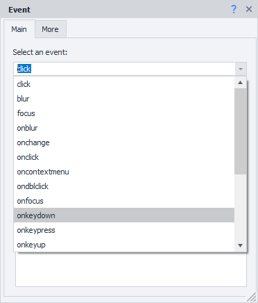


:::note Note
As you can see in the screenshot above, the list of possible actions is quite extensive, and it’s not always obvious what a particular event does. To get more details, copy the event name and paste it into your favorite search engine, adding “javascript”; for example: “oncontextmenu javascript”, “javascript ondblclick”, “javascript onkeyup”. This way, you can find a description of the event you're interested in.
:::

## How do I add the action to a project?

Through the context menu **Add Action** → **Tabs** → **Perform Event**

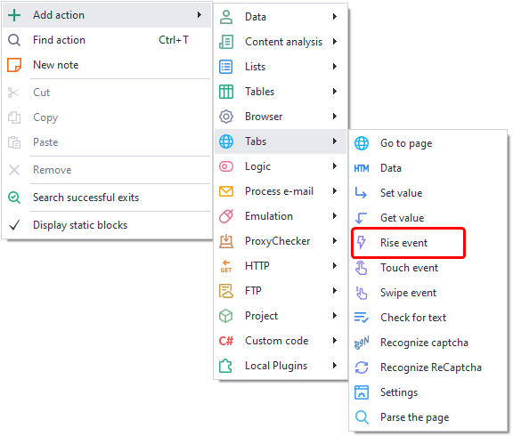


Through the [❗→ Action Builder](https://zennolab.atlassian.net/wiki/spaces/RU/pages/483426337 "https://zennolab.atlassian.net/wiki/spaces/RU/pages/483426337").

Or use the [❗→ Smart Search](https://zennolab.atlassian.net/wiki/spaces/RU/pages/506200090/ProjectMaker+7#%D0%A3%D0%BC%D0%BD%D1%8B%D0%B9-%D0%BF%D0%BE%D0%B8%D1%81%D0%BA-%D0%B4%D0%B5%D0%B9%D1%81%D1%82%D0%B2%D0%B8%D0%B9 "https://zennolab.atlassian.net/wiki/spaces/RU/pages/506200090/ProjectMaker+7#%D0%A3%D0%BC%D0%BD%D1%8B%D0%B9-%D0%BF%D0%BE%D0%B8%D1%81%D0%BA-%D0%B4%D0%B5%D0%B9%D1%81%D1%82%D0%B2%D0%B8%D0%B9").

## How do I choose an element to perform the event on?

Let's look at an example from [this page](https://learn.javascript.ru/article/mousemove-mouseover-mouseout-mouseenter-mouseleave/mouseoverout/ "https://learn.javascript.ru/article/mousemove-mouseover-mouseout-mouseenter-mouseleave/mouseoverout/").

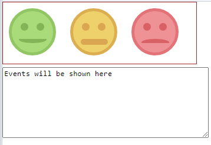


When the mouse cursor is over one of the smileys, it changes color (this also applies to their background, eyes, and mouth). Right-click any of the smileys and send to the [❗→ Action Builder](https://zennolab.atlassian.net/wiki/spaces/RU/pages/483426337 "https://zennolab.atlassian.net/wiki/spaces/RU/pages/483426337")^(1)^. 

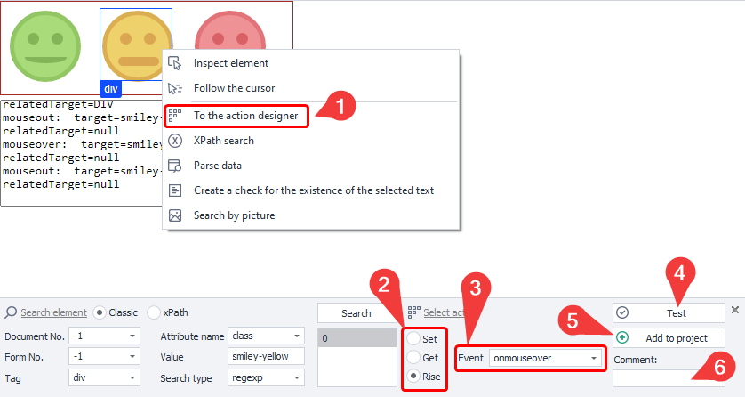


The element search parameters fill in automatically—no need to focus on them for now. What you should pay attention to:

- in the *Choose Action* section <sup>(2)</sup>, select *Rise* (by default it is set to *Set* — [❗→ Set Value](https://zennolab.atlassian.net/wiki/spaces/RU/pages/534315117 "https://zennolab.atlassian.net/wiki/spaces/RU/pages/534315117"))
- select the required *Event* <sup>(3)</sup>—in our case, [*onmouseover](https://learn.javascript.ru/mousemove-mouseover-mouseout-mouseenter-mouseleave "https://learn.javascript.ru/mousemove-mouseover-mouseout-mouseenter-mouseleave")
- be sure to press the *Test* button <sup>(4)</sup> to make sure everything is set up correctly (in our specific example, the central yellow smiley should change color)
- (optional) add a comment <sup>(6)</sup>. The auto-generated comment is not very informative, so if your template includes many actions, it will be difficult to understand what each one does

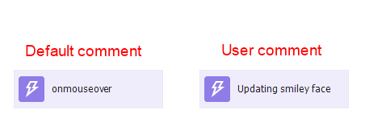


- if everything is set up and works as intended, add the action to the project <sup>(5)</sup>

  

## What is it used for?

- most often, you will use this action for clicking buttons, menu items ([radio buttons](http://htmlbook.ru/samhtml5/formy/pereklyuchateli "http://htmlbook.ru/samhtml5/formy/pereklyuchateli")), checkboxes
- dragging elements around the site
- emulating mouseover events to get tooltips
- triggering JavaScript events for input fields

 - sometimes, some sites attach extra JavaScript scripts to input fields (for example, checking whether correct data was entered), and without triggering these scripts, you can’t proceed. In such cases, try triggering events like *onchange, onkeypress, etc. (if triggering these doesn’t help, you can use [❗→ keyboard emulation](https://zennolab.atlassian.net/wiki/spaces/RU/pages/735608949 "https://zennolab.atlassian.net/wiki/spaces/RU/pages/735608949") and [❗→ mouse emulation](https://zennolab.atlassian.net/wiki/spaces/RU/pages/534315158 "https://zennolab.atlassian.net/wiki/spaces/RU/pages/534315158")).

## How do I work with the action?

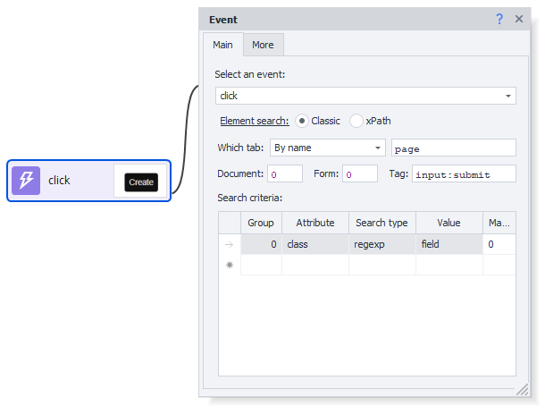


### Choose an event
Select what exactly you want to do with the element.

:::note Note
In this field, you can manually enter the value rather than selecting from the dropdown. You can also use project variables here (`{ -Variable.var_name- }`)
:::

### Finding the element

Before you can interact with a page element, you need to find it. In the actions [❗→ Get Value](https://zennolab.atlassian.net/wiki/spaces/RU/pages/534315124 "https://zennolab.atlassian.net/wiki/spaces/RU/pages/534315124"), [❗→ Set Value](https://zennolab.atlassian.net/wiki/spaces/RU/pages/534315117 "https://zennolab.atlassian.net/wiki/spaces/RU/pages/534315117"), [❗→ Perform Event](https://zennolab.atlassian.net/wiki/spaces/RU/pages/534020211 "https://zennolab.atlassian.net/wiki/spaces/RU/pages/534020211"), [❗→ Touch Event](https://zennolab.atlassian.net/wiki/spaces/RU/pages/735674386 "https://zennolab.atlassian.net/wiki/spaces/RU/pages/735674386"), [❗→ Swipe Event](https://zennolab.atlassian.net/wiki/spaces/RU/pages/735739970 "https://zennolab.atlassian.net/wiki/spaces/RU/pages/735739970"), there are two ways to search for elements—classic and using XPath.

  

**Classic** — search by HTML element parameters: tag, attribute, and its value.


**XPath** — searching using [❗→ XPath expressions](https://zennolab.atlassian.net/wiki/spaces/RU/pages/862093419/ "https://zennolab.atlassian.net/wiki/spaces/RU/pages/862093419/"). With XPath, you can implement a more universal and robust way to locate data compared to classic search or regular expressions.


### **Which Tab**

Select the tab where the element should be found.
Possible values:

- Active tab
- First
- By name - when this option is selected, you'll see a field where you can enter the tab's name.
- By number - in this field, enter the tab’s ordinal number (counting from zero!)

### **Document**

It's recommended to set this to **-1** (search in all documents on the page). 

### **Form**

It’s also best to set this to **-1** (search in all forms on the page). By using this value, your template will be more universal.

<details>
<summary>Why is it better to use "-1"?</summary>

Example: if there are 3 forms on a page—search, registration, order form. You need to click a button inside the order form, so you set the “Form” value to **2** (two) (counting from zero). Later, a new form is added, for login, before the order form. Now, number 2 matches the login form, and your template will either throw an error saying the button wasn’t found, or (even worse) will click a different button in the wrong form.

</details>
:::note Note
In the program settings, you can check two boxes—Search all forms on the page and Search all documents on the page—so that every time you add an element in the Action Builder, both the document and form number will be set to -1 by default.
:::

### **Tag (classic search only)**


This is the actual HTML tag where you want to get the value from.

:::tip Tip
You can specify several tags at once, separated by a semicolon (;)
:::

### **Conditions (classic search only)**


1. **Group** - priority for this condition. The higher this number, the lower the priority. If the element couldn't be found by the condition with the highest priority, it goes to the next priority, and so on until the element is found or there are no more conditions. You can add multiple conditions at the same priority; in that case, the search will process all those conditions at once.
2. **Attribute** - the HTML tag attribute the search is based on.
3. **Search Type**:

 1. text - search by full or partial text match;
 2. notext - look for elements that do not have the specified text;
 3. regexp - search using [❗→ regular expressions](https://zennolab.atlassian.net/wiki/spaces/RU/pages/534086111 "https://zennolab.atlassian.net/wiki/spaces/RU/pages/534086111") 
By default, the search is case-insensitive. To make a regex case-sensitive, add `(?-i)` at the start of the expression
(this disables case-insensitive searching)
4. **Value** - value of the HTML tag attribute
5. **Match number** - ordinal number of the found element (counting from zero!). You can use [❗→ ranges](https://zennolab.atlassian.net/wiki/spaces/RU/pages/488964137 "https://zennolab.atlassian.net/wiki/spaces/RU/pages/488964137") and macros for [❗→ variables](https://zennolab.atlassian.net/wiki/spaces/RU/pages/486309922 "https://zennolab.atlassian.net/wiki/spaces/RU/pages/486309922") in this field.

:::note Note
To delete a search condition, left-click the area to its left (highlighted in blue in the screenshot), then press delete on your keyboard.
:::

:::note Note
Multiple conditions can be used to search for an element.
:::

It's always important to select your search conditions so that only one element remains, i.e., the match number is 0 (counting from zero).

### Mouse cursor coordinates (for drag and drop events only)

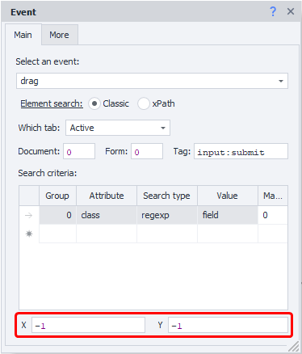


These are unique properties, available only for dragging events: *drag (where you drag from) and *drop (where you drop to).


## Usage examples

### Simple clicks

You can practice simple clicks on https://lessons.zennolab.com/ru/index (radio buttons, checkboxes) or here https://lessons.zennolab.com/ru/registration (button at the bottom of the form).

Right-click any checkbox/radio button → Action Builder → *Rise&gt;click – Test (or *Add to Project)

<details>
<summary>Screenshot</summary>

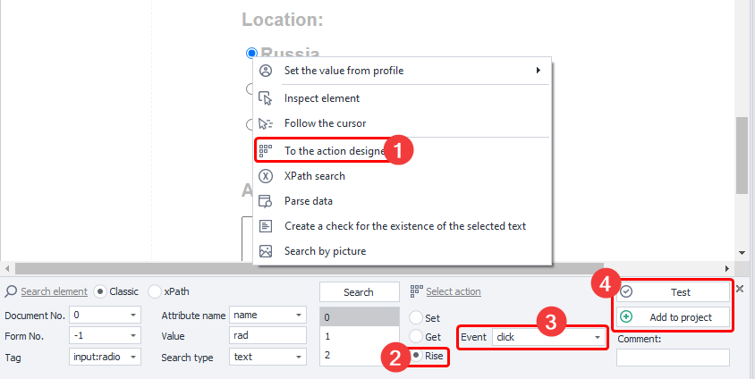


</details>
  

### Tooltip

#### Example #1

These tooltips appear when the user hovers the mouse over different elements of the site.

You can see an example here: https://learn.javascript.ru/task/behavior-tooltip

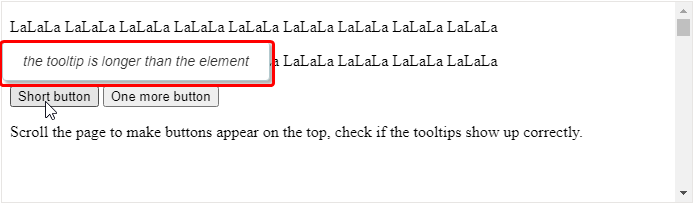


But in this case, you don’t actually need to bother with manually emulating events—you can look in the page’s source code and see that the tooltip text is stored in the 
```data-tooltip ``attribute, and you can easily get it using the [❗→ Get Value](https://zennolab.atlassian.net/wiki/spaces/RU/pages/534315124 "https://zennolab.atlassian.net/wiki/spaces/RU/pages/534315124") action. Very often, the code for such tooltips is included directly on the page, and with some searching, you can find it.

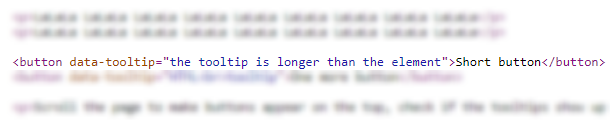


* * *

#### Example #2

But sometimes it’s a bit more complicated—when the mouse hovers, a JavaScript script sends a request to the server, waits for a response, and then JavaScript inserts the response into the page. For example, on the Zennolab forum: when you hover the cursor over the subject of a topic, after a short delay, a small window with content from the topic appears.

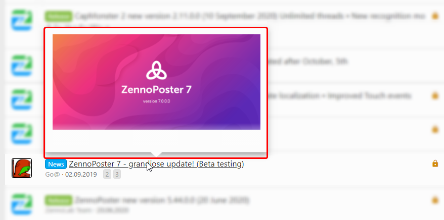


In this case, you have several options:

- You can use the *Perform Event* action to emulate *onmouseover*, wait for the popup, and then use the [❗→ Get Value](https://zennolab.atlassian.net/wiki/spaces/RU/pages/534315124 "https://zennolab.atlassian.net/wiki/spaces/RU/pages/534315124") block to parse the *innerHtml* and then use [❗→ Text Processing](https://zennolab.atlassian.net/wiki/spaces/RU/pages/488865793 "https://zennolab.atlassian.net/wiki/spaces/RU/pages/488865793") to extract the values you need.
- Or you can try to repeat the request sent to the server. To do this, you can use either external means or built-in tools: either the [❗→ web developer tools](https://zennolab.atlassian.net/wiki/spaces/RU/pages/1331134465 "https://zennolab.atlassian.net/wiki/spaces/RU/pages/1331134465") (available only for Chrome browser), or the [❗→ Traffic window](https://zennolab.atlassian.net/wiki/spaces/RU/pages/735805465 "https://zennolab.atlassian.net/wiki/spaces/RU/pages/735805465")

<details>
<summary>Tools for working with requests</summary>

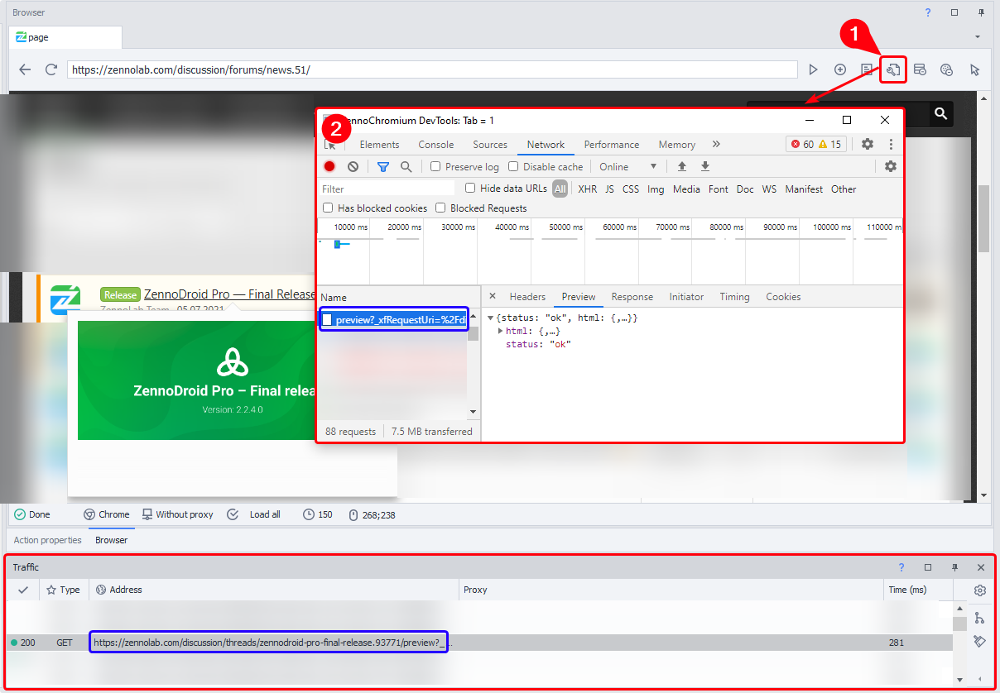


1. Button to open web developer tools
2. Web developer tools window
3. Traffic monitor

The same request is highlighted in blue in both the developer tools and the traffic window.

</details>
One of the advantages of the Traffic window is that you can automatically create a request action from it. Right-click the request and select *Create action from request*:

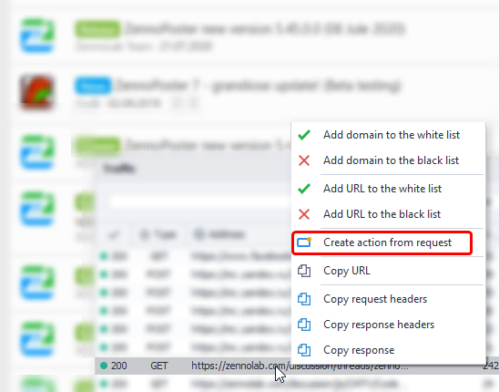


* * *

### Drag&Drop 

- Right-click the element you want to drag, and send it to the [❗→ Action Builder](https://zennolab.atlassian.net/wiki/spaces/RU/pages/483426337 "https://zennolab.atlassian.net/wiki/spaces/RU/pages/483426337"). 

 - Action — *Rise*, event — *drag.*
 - Set *X* and *Y* – these are the starting coordinates. The coordinates start from the top-left corner of the selected element (in this corner, X=1 and Y=1). The template will perform the first click here—the grab (*drag)*.
- Now right-click the element you want to drop onto, and also send it to the Action Builder.

 - Action — *Rise*, event — *drop.*
 - Set *X* and *Y* – these are the ending coordinates. Coordinates start from the top-left corner of the selected element (in this corner, X=1 and Y=1). The template will drop the first element at these coordinates of the second element.

<details>
<summary>Screenshot</summary>

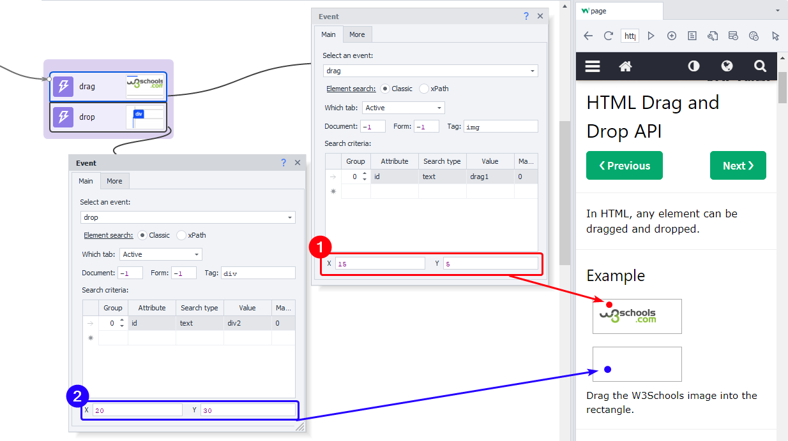


1. Where movement starts.
2. Where the element is dropped.

</details>
## Useful links

- [❗→ Action Builder and XPath Search](https://zennolab.atlassian.net/wiki/spaces/RU/pages/483426337 "https://zennolab.atlassian.net/wiki/spaces/RU/pages/483426337")
- [❗→ Set Value](https://zennolab.atlassian.net/wiki/spaces/RU/pages/534315117 "https://zennolab.atlassian.net/wiki/spaces/RU/pages/534315117")
- [❗→ Get Value](https://zennolab.atlassian.net/wiki/spaces/RU/pages/534315124 "https://zennolab.atlassian.net/wiki/spaces/RU/pages/534315124")
- [❗→ Regex Tester](https://zennolab.atlassian.net/wiki/spaces/RU/pages/534086111 "https://zennolab.atlassian.net/wiki/spaces/RU/pages/534086111")
- [❗→ Value Ranges](https://zennolab.atlassian.net/wiki/spaces/RU/pages/488964137 "https://zennolab.atlassian.net/wiki/spaces/RU/pages/488964137")
- [❗→ XPath](https://zennolab.atlassian.net/wiki/spaces/RU/pages/862093419 "https://zennolab.atlassian.net/wiki/spaces/RU/pages/862093419")
- [❗→ Working with Variables](https://zennolab.atlassian.net/wiki/spaces/RU/pages/486309922 "https://zennolab.atlassian.net/wiki/spaces/RU/pages/486309922")
- [❗→ Keyboard Emulation](https://zennolab.atlassian.net/wiki/spaces/RU/pages/735608949 "https://zennolab.atlassian.net/wiki/spaces/RU/pages/735608949")
- [❗→ Mouse Emulation](https://zennolab.atlassian.net/wiki/spaces/RU/pages/534315158 "https://zennolab.atlassian.net/wiki/spaces/RU/pages/534315158")