:::info **Please read the [*Rules for using materials on this site*](../Disclaimer).**
:::

> 🔗 **[Original page](https://zennolab.atlassian.net/wiki/spaces/RU/pages/534053033/ReCaptcha)** — Source of this material

_______________________________________________  

## Description

Allows you to pass verification on sites protected against bots. This method is suitable only for the following captchas: **reCAPTCHA v2, reCAPTCHA v2 Invisible**, and **reCAPTCHA v3**.

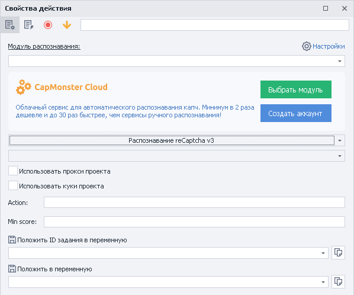

  

## How to add the action to your project?

Use the context menu **Add Action** → **Tabs** → **Recognize ReCaptcha**

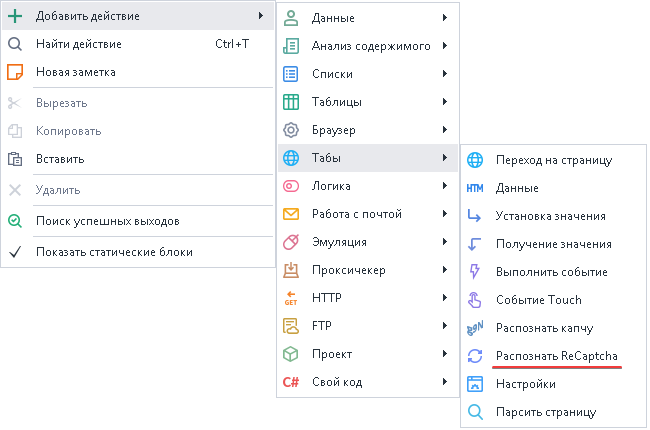

Or use the [❗→ smart search](https://zennolab.atlassian.net/wiki/spaces/RU/pages/506200090/ProjectMaker+7#%D0%A3%D0%BC%D0%BD%D1%8B%D0%B9-%D0%BF%D0%BE%D0%B8%D1%81%D0%BA-%D0%B4%D0%B5%D0%B9%D1%81%D1%82%D0%B2%D0%B8%D0%B9 "https://zennolab.atlassian.net/wiki/spaces/RU/pages/506200090/ProjectMaker+7#%D0%A3%D0%BC%D0%BD%D1%8B%D0%B9-%D0%BF%D0%BE%D0%B8%D1%81%D0%BA-%D0%B4%D0%B5%D0%B9%D1%81%D1%82%D0%B2%D0%B8%D0%B9").

  

## What is this used for?

- Registering accounts
- Parsing websites and search engines
- Performing bulk actions

  

## How to work with the action?

### Main settings

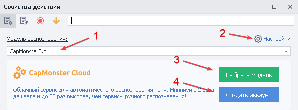

1. Choose a captcha recognition module. Select the desired captcha solving service from the dropdown list (you should first provide its [❗→ API key in the settings](/wiki/spaces/RU/pages/808845385 "/wiki/spaces/RU/pages/808845385")).
2. [❗→ Captcha service settings](/wiki/spaces/RU/pages/808845385 "/wiki/spaces/RU/pages/808845385").
3. Set [CapMonster.Cloud](https://capmonster.cloud/ "https://capmonster.cloud/") as the default service.
4. Register an account at [CapMonster.Cloud](https://capmonster.cloud/ "https://capmonster.cloud/"). All ZennoPoster license owners receive a free $5 credit for captcha solving.

  

### Recognizing reCaptcha v2 in a tab

The solving happens directly in the browser window.

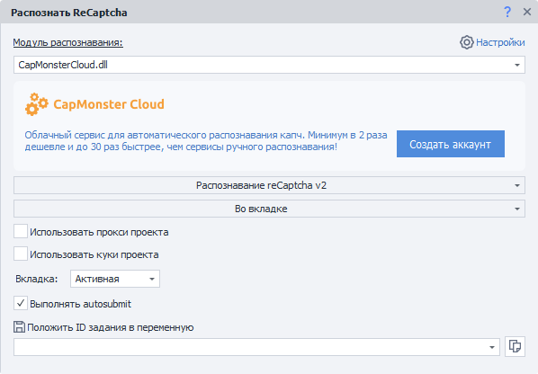

#### Recognition method

Select the relevant function (**Recognize reCaptcha v2**) and method (**In Tab**).

#### Use project proxy

The project’s current proxy will be sent to the recognition service along with the captcha.

#### Use project cookies

The project’s current cookies will be sent to the recognition service along with the captcha.

#### Tab

Choose on which tab to recognize the captcha:

a) **Active** — the tab that you currently see.  
b) **First** — the first window on the left.  
c) **By name** — specify the tab name or variable (case-sensitive).  
d) **By number** — enter the tab number. Tabs are numbered left to right starting from 0.  

#### Perform autosubmit

If there is no button on the page to submit the form with the solved reCaptcha, enable this option to perform auto-submission.

#### Put Task ID in variable

Variable for the task identifier.

  

### Recognizing reCaptcha v2 using sitekey

This process occurs without loading the browser.

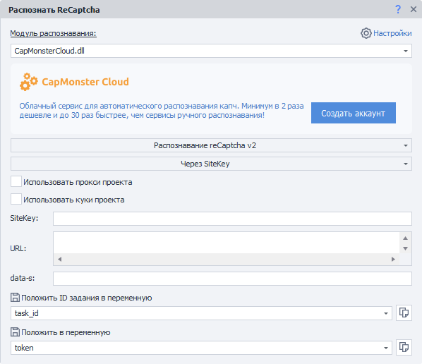

#### Recognition method

Select the relevant function (**Recognize reCaptcha v2**) and method (**Via SiteKey**).

#### Use project proxy

The project’s current proxy will be sent to the recognition service along with the captcha.

#### Use project cookies

The project’s current cookies will be sent to the recognition service along with the captcha.

#### SiteKey

Recaptcha site key.

:::warning Attention
The SiteKey parameter is unique for each site.
:::

#### URL

The full address of the page where ReCaptcha is being solved.

#### data-s

Optional

This is an extra parameter that does not appear on all sites, so passing it is optional.

At a minimum, this parameter appears in Google search and its related services.

#### Put Task ID in variable

Variable for the task identifier.

#### Store in variable

The specified variable will hold the response from the recognition service — the solved ReCaptcha token.

#### Token sending examples

<details>
<summary>Sending Token in the browser</summary>

Once you receive the *token, you need to insert it into the appropriate field.

Below is how to trigger the field in the browser.

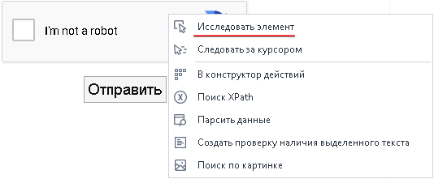

Call up the [❗→ Element Tree](/wiki/spaces/RU/pages/727777355 "/wiki/spaces/RU/pages/727777355") from the context menu and find the (**textarea**) field for entering inside the captcha.

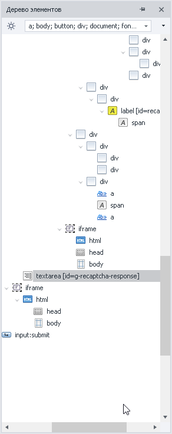

Right-click to open the context menu and select **To Action Constructor**

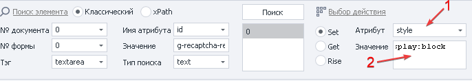

1. Choose the **style** attribute.
2. Set the value to **display:block**

You can use the **Test** button to check in the browser if the function works. Then add the action to your project.

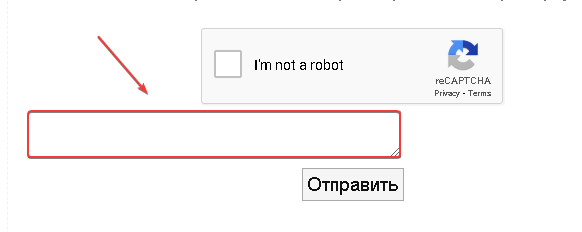

A field will appear below the captcha where you need to enter the *token. You can do this using the [❗→ Set Value](/wiki/spaces/RU/pages/534315117 "/wiki/spaces/RU/pages/534315117") action.

</details>
<details>
<summary>Sending Token to the server via requests</summary>

After successfully solving the captcha, the response containing the *token will be stored in a variable to send to the server. You need to add it to the request, most often as the **g-recaptcha-response** argument.

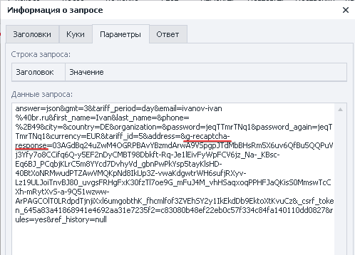

You can always check an example request to the site in the [❗→ traffic window](/wiki/spaces/RU/pages/735805465 "/wiki/spaces/RU/pages/735805465")

</details>
  

### Recognizing reCaptcha v3 in a tab

The solving happens directly in the browser window.

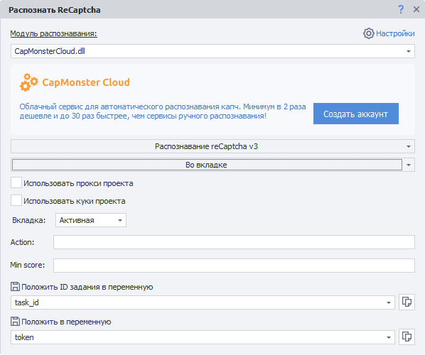

#### Recognition method

Select the relevant function (**Recognize reCaptcha v3**) and method (**In Tab**).

#### Use project proxy

The project’s current proxy will be sent to the recognition service along with the captcha.

#### Use project cookies

The project’s current cookies will be sent to the recognition service along with the captcha.

#### Tab

Choose on which tab to recognize the captcha:

a) **Active** — the tab that you currently see.  
b) **First** — the first window on the left.  
c) **By name** — specify the tab name or variable (case-sensitive).  
d) **By number** — enter the tab number. Tabs are numbered left to right starting from 0.  

#### Action

A parameter you need to find in the source code of the site.

It is found in the page code in the **grecaptcha.execute** function call.


:::warning Attention
Unique for each site!
:::

#### Min score

The user rating at which the verification will be considered successful, range from 0.1 to 0.9.

Usually, a value of 0.3 is sufficient, but you need to check for each site individually.

#### Put Task ID in variable

Variable for the task identifier.

#### Store in variable

The specified variable will hold the response from the recognition service — the solved ReCaptcha token.

  

### Recognizing reCaptcha v3 via sitekey

The solving process takes place without loading the browser.

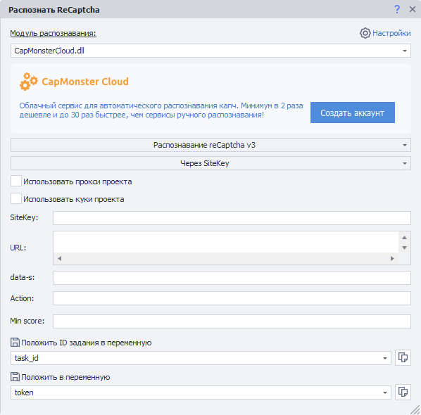

#### Recognition method

Select the relevant function (**Recognize reCaptcha v3**) and method (**Via SiteKey**).

#### Use project proxy

The project’s current proxy will be sent to the recognition service along with the captcha.

#### Use project cookies

The project’s current cookies will be sent to the recognition service along with the captcha.

#### SiteKey

Recaptcha site key.

:::warning Attention
The SiteKey parameter is unique for each site.
:::

<details>
<summary>How to get the SiteKey</summary>

- In the page source code [❗→ DOM](https://zennolab.atlassian.net/wiki/spaces/RU/pages/534085840/- "https://zennolab.atlassian.net/wiki/spaces/RU/pages/534085840/-")

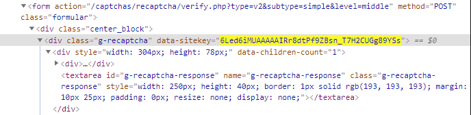

- In the [❗→ traffic window](/wiki/spaces/RU/pages/735805465 "/wiki/spaces/RU/pages/735805465") when the page loads

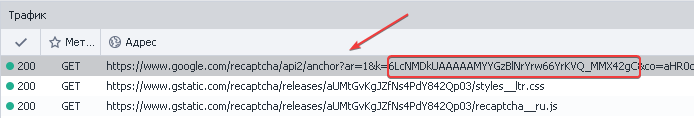

Click the request and go to the Parameters tab

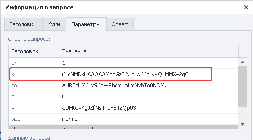

The parameter might be called **k** or **key**

</details>
#### URL

The full address of the page where ReCaptcha is being solved.

#### data-s

Optional

This is an extra parameter that does not appear on all sites, so passing it is optional.

At a minimum, this parameter appears in Google search and its related services.

#### Action

A parameter you need to find in the source code of the site.

It is found in the page code in the **grecaptcha.execute** function call.


:::warning Attention
Unique for each site!
:::

#### Min score

The user rating at which the verification will be considered successful, range from 0.1 to 0.9.

Usually, a value of 0.3 is sufficient, but you need to check for each site individually.

#### Put Task ID in variable

Variable for the task identifier.

#### Store in variable

The specified variable will hold the response from the recognition service — the solved ReCaptcha token.

  

### Note regarding reCaptcha v3

When loading the page in the [❗→ traffic window](/wiki/spaces/RU/pages/735805465 "/wiki/spaces/RU/pages/735805465"), it’s very important to pay attention to the request

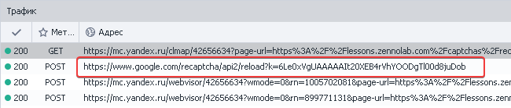

- If the request occurs when the page loads, choose **reCaptcha v3 recognition via sitekey**.
- If the request occurs after submitting a form on the site, use **reCaptcha v3 recognition in tab**.
- Parameters: **SiteKey**, **Action**, **Score**, **Url** can be set via variables.

:::note Note
Token substitution happens before sending the request.
:::

#### Example: Sending the reCaptcha v3 token when solving in a tab

<details>
<summary>How to send the token in the browser</summary>

Token is sent in the browser by substituting it. The in-tab method works only when the request to Google will be made after the form is submitted.


Let’s look at an example site: [!\[\](https://lessons.zennolab.com/favicon.ico)reCAPTCHA V3 (Beta)](https://lessons.zennolab.com/captchas/recaptcha/v3.php?level=beta) 

If there was no request to captcha when the site loaded, the in-tab solving method is what you need.

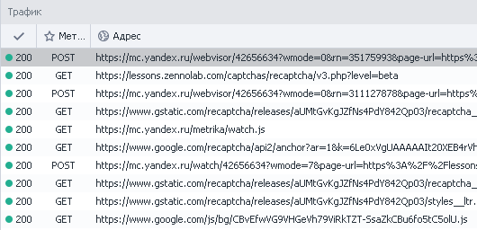

Configure the block for solving ReCaptcha v3

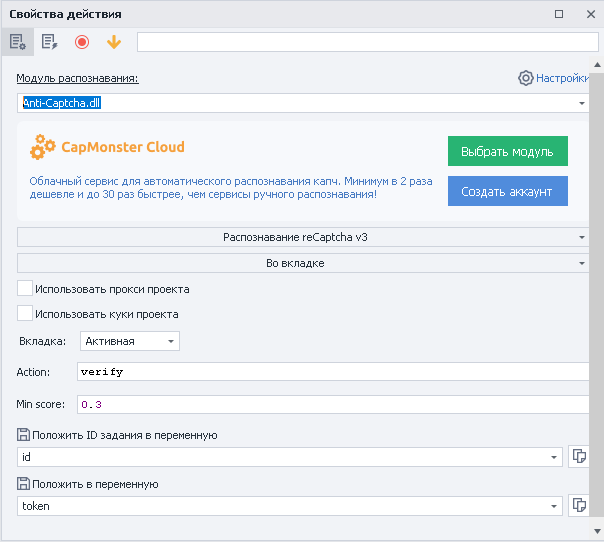

Get the *token. Then, using a [❗→ C# snippet](https://zennolab.atlassian.net/wiki/spaces/RU/pages/492011596/ "https://zennolab.atlassian.net/wiki/spaces/RU/pages/492011596/"), send it to the site:

```json
var sitekey = project.Variables["имя_переменной_sitekey"].Value;
var newToken = project.Variables["имя_переменной_token"].Value;
var replaceRegex = @"(?&lt;=\[""rresp"","")[^""]+";
instance.ChangeResponse("https://www.google.com/recaptcha/api2/reload\\?k="+sitekey,
 new List&lt;string&gt; {replaceRegex}, new List<string> {newToken}, false);
```

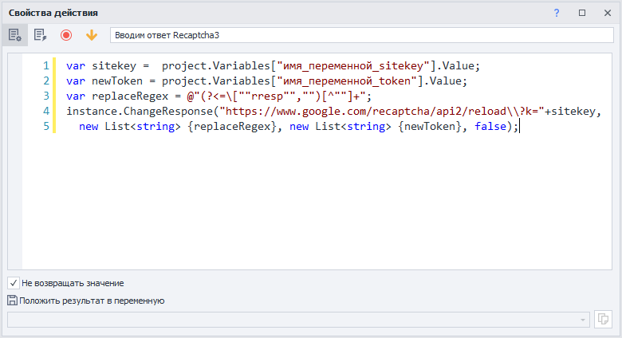

Using SiteKey in the snippet is not strictly necessary. But keep in mind that without a SiteKey, requests from all captchas, including ReCaptcha2, will be intercepted.

If this is not an issue, you can use this version of the snippet:

```json
var newToken = project.Variables["имя_переменной_token"].Value;
var replaceRegex = @"(?&lt;=\[""rresp"","")[^""]+";
instance.ChangeResponse("https://www.google.com/recaptcha/api2/reload\\?k=",
 new List&lt;string&gt; {replaceRegex}, new List<string> {newToken}, false);
```

Submit the form on the site.

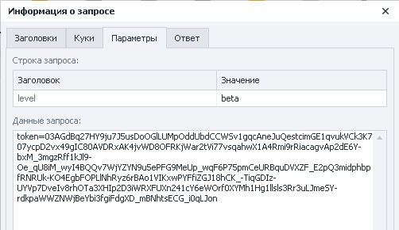

In the traffic window, you can confirm that the *token was replaced with the required value

</details>
#### Example: Sending the reCaptcha v3 token when solving via SiteKey

<details>
<summary>How to substitute the token</summary>

If you see in the [❗→ traffic window](/wiki/spaces/RU/pages/735805465 "/wiki/spaces/RU/pages/735805465") that the request is made along with the site loading, the process differs from in-tab solving.

First, configure the block for captcha solving and get the *token.

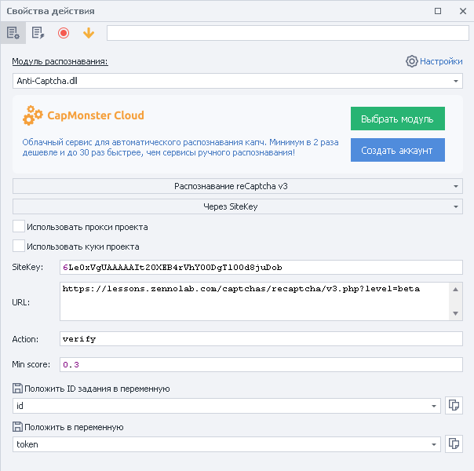

Get the *token. Then, using a [❗→ C# snippet](https://zennolab.atlassian.net/wiki/spaces/RU/pages/492011596/ "https://zennolab.atlassian.net/wiki/spaces/RU/pages/492011596/"), send it to the site:

```json
var sitekey = project.Variables["имя_переменной_sitekey"].Value;
var newToken = project.Variables["имя_переменной_token"].Value;
var replaceRegex = @"(?&lt;=\[""rresp"","")[^""]+";
instance.ChangeResponse("https://www.google.com/recaptcha/api2/reload\\?k="+sitekey,
 new List&lt;string&gt; {replaceRegex}, new List<string> {newToken}, false);
```

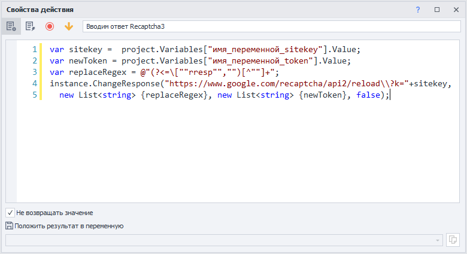

Using SiteKey in the snippet is not strictly necessary. But keep in mind that without a SiteKey, requests from all captchas, including ReCaptcha2, will be intercepted.

If this is not an issue, you can use this version of the snippet:

```json
var newToken = project.Variables["имя_переменной_token"].Value;
var replaceRegex = @"(?&lt;=\[""rresp"","")[^""]+";
instance.ChangeResponse("https://www.google.com/recaptcha/api2/reload\\?k=",
 new List&lt;string&gt; {replaceRegex}, new List<string> {newToken}, false);
```

Only after this do you load the page with ReCaptcha v3 and perform the necessary actions

</details>

  

### Error report

Allows you to get a refund in case of an unsuccessful attempt to solve the captcha.

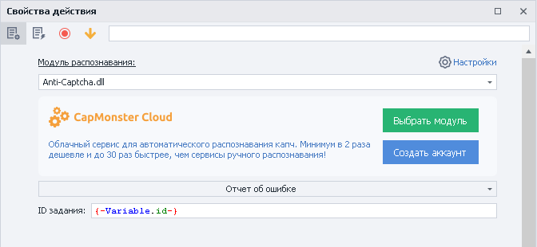

**Task ID** can be specified as a static value or via a variable.

  

### Success report

Let the service know that the captcha was solved successfully.


**Task ID** can be specified as a static value or via a variable.

  

## Usage example

When you access the page, the anti-bot system asks you to confirm that you are not a robot.

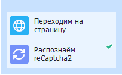

1. Go to the page.
2. Add the action to solve reCaptcha to the project.
3. Configure the block.
4. Pass the site verification.

These days, many resources use Google's protection. It helps sites stop mass actions or detect bots, but with **Zennoposter** functionality, passing such checks is simple.

  

## Useful links

1. [❗→ Traffic window](/wiki/spaces/RU/pages/735805465 "/wiki/spaces/RU/pages/735805465")
2. [❗→ Variables window](/wiki/spaces/RU/pages/735608872 "/wiki/spaces/RU/pages/735608872")
3. [❗→ Data](https://zennolab.atlassian.net/wiki/spaces/RU/pages/534085840/- "https://zennolab.atlassian.net/wiki/spaces/RU/pages/534085840/-")
4. [CapMonster Cloud](https://capmonster.cloud/ru/ "https://capmonster.cloud/ru/")