:::info **Please review the [*Terms of Use for materials on this resource*](../Disclaimer).**
:::

> 🔗 **[Original page](https://zennolab.atlassian.net/wiki/spaces/RU/pages/1795163670/hCaptcha)** — Source for this material

_______________________________________________  

## Description

:::warning Attention
This captcha is currently not recognized.
:::

:::info Information
Added in ZennoPoster 7.5.0.0
:::

Allows you to pass verification on sites protected from bots. This method is only suitable for **hCaptcha** type captchas.

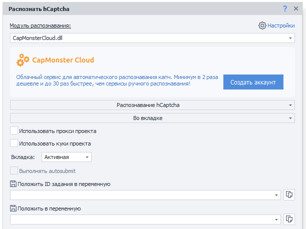

## How to add the action to your project?

Via the context menu **Add action** → **Tabs** → **Recognize hCaptcha**

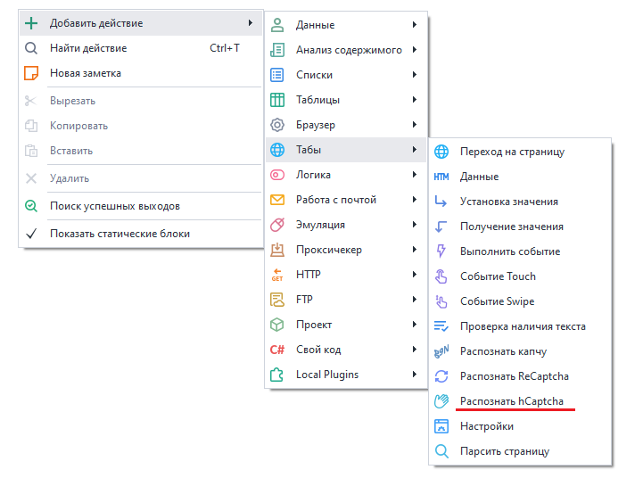

Or use the [❗→ smart search](https://zennolab.atlassian.net/wiki/spaces/RU/pages/506200090/ProjectMaker+7#%D0%A3%D0%BC%D0%BD%D1%8B%D0%B9-%D0%BF%D0%BE%D0%B8%D1%81%D0%BA-%D0%B4%D0%B5%D0%B9%D1%81%D1%82%D0%B2%D0%B8%D0%B9 "https://zennolab.atlassian.net/wiki/spaces/RU/pages/506200090/ProjectMaker+7#%D0%A3%D0%BC%D0%BD%D1%8B%D0%B9-%D0%BF%D0%BE%D0%B8%D1%81%D0%BA-%D0%B4%D0%B5%D0%B9%D1%81%D1%82%D0%B2%D0%B8%D0%B9").

  

## What is this used for?

- Completing registrations
- Parsing websites and search engines
- Performing bulk actions

  

## How to work with the action?

### Main settings

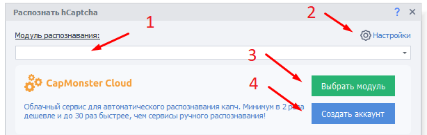

1. Choose the captcha recognition module. Select the desired captcha recognition service from the dropdown list (you need to specify its [❗→ API key in the settings](/wiki/spaces/RU/pages/808845385 "/wiki/spaces/RU/pages/808845385") first).
2. [❗→ Captcha service settings](/wiki/spaces/RU/pages/808845385 "/wiki/spaces/RU/pages/808845385").
3. Set [CapMonster.Cloud](https://capmonster.cloud/ "https://capmonster.cloud/") as the default service.
4. Register an account on [CapMonster.Cloud](https://capmonster.cloud/ "https://capmonster.cloud/"). All ZennoPoster license holders receive $5 free on their captcha solving balance.

  

### hCaptcha interception

:::info Information
Added in ZennoPoster 7.5.1.0
:::

:::warning Attention
When interception is enabled, you will not be able to solve hCaptcha manually.
:::

The “Start hCaptcha interception” and “Stop hCaptcha interception” options are needed for using autosubmit when solving in a tab. These are not required if you are not using autosubmit, or if you are solving via sitekey. The most correct (and recommended) way to use these blocks is to enable interception immediately before navigating to the page with hCaptcha, and disable it right after completing the target hCaptcha. However, technically, nothing prevents you from enabling hCaptcha interception at the very beginning of your project so it stays active throughout.

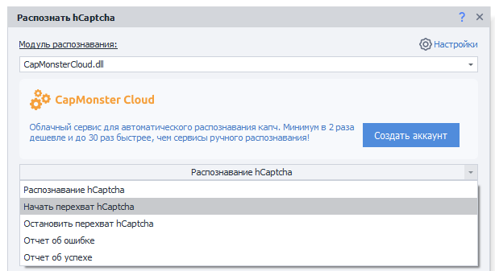

#### Start hCaptcha interception

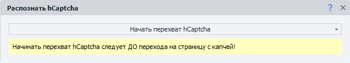

You should use this action before navigating to the page with hCaptcha, as it takes effect on the following navigation. While interception is active, you can solve hCaptcha in the tab using autosubmit. Please note, this is about changing the URL in the address bar: if, for example, after clicking a button in the browser the page content changes and hCaptcha appears, but the address bar doesn't change, it's still the same page. So, in this case, you need to start interception **before navigating** to that page (not right before clicking the button in the browser).

#### Stop hCaptcha interception

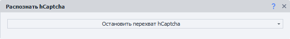

This action is used during the next navigation. It disables hCaptcha interception.

  

### hCaptcha solving in a tab

The solving takes place directly in the browser window.

#### Recognition method

Select the appropriate function (**Recognize hCaptcha**) and method (**In tab**).

#### Use project proxy

The current project proxy will be sent to the solving service along with the captcha.

#### Use project cookies

Project cookies will be sent to the service along with the captcha.

#### Tab

Select where you want to solve the captcha:

a) **Active** — the tab currently in front of you.  
b) **First** — the first window from the left.  
c) **By name** — specify the tab name or variable (case sensitive).  
d) **By number** — set the tab number. Numbering starts from the left, beginning at 0.  

#### Perform autosubmit

:::info Information
Added in ZennoPoster 7.5.1.0
:::

Perform autosubmit for the received token.
For this option to work correctly, you need to enable hCaptcha interception before navigating to the page with the captcha (as described above).

#### Save job ID to variable

The variable for the job identifier.

  

### hCaptcha solving via sitekey

The process takes place without loading the browser.

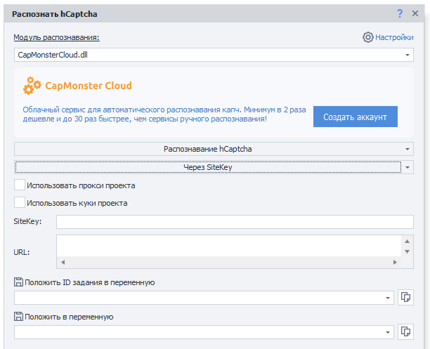

#### Recognition method

Select the appropriate function (**Recognize hCaptcha**) and method (**Via SiteKey**).

#### Use project proxy

The current project proxy will be sent to the solving service along with the captcha.

#### Use project cookies

Project cookies will be sent to the service along with the captcha.

#### SiteKey

The hCaptcha site key.

:::warning Attention
The Sitekey parameter is individual for every site.
:::

How to get the SiteKey

- In the page source code [❗→ DOM](https://zennolab.atlassian.net/wiki/spaces/RU/pages/534085840/- "https://zennolab.atlassian.net/wiki/spaces/RU/pages/534085840/-")

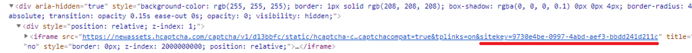

- In the [❗→ traffic window](/wiki/spaces/RU/pages/735805465 "/wiki/spaces/RU/pages/735805465") while the page is loading

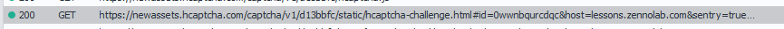

Click on the request and check the full address in the “Headers” tab

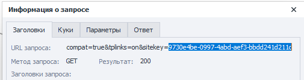

#### URL

The full address of the page where hCaptcha is being solved.

#### Save job ID to variable

The variable for the job identifier.

#### Save to variable

The service’s response — the solved hCaptcha token — will be saved to the specified variable.

#### Token submission examples

Sending the Token in the browser

After receiving the *token*, you need to insert it into the relevant field. For hCaptcha, there are usually two such fields.

Let’s see how to locate the field in the browser.

Open the [❗→ Element Tree](/wiki/spaces/RU/pages/727777355 "/wiki/spaces/RU/pages/727777355") and find the (**textarea**) fields inside the captcha.

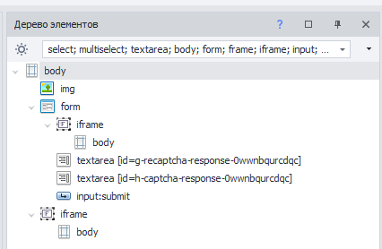

Right-click each text field to open the context menu and select **To Action Builder**. ** You may need to slightly adjust the element search filter each time, since the ending may be unique for each page load. Remove the ending in the “Value” field and switch the search type to regexp.

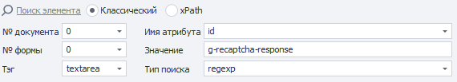

You need to insert the obtained token into these fields. You can do this using the [❗→ Set Value](/wiki/spaces/RU/pages/534315117 "/wiki/spaces/RU/pages/534315117") action.

Sending the Token to the server via requests

Once the captcha is successfully solved, the response containing the *token* will be saved to a variable for sending to the server. You need to include it in the request — most often as two arguments with the same value: **g-recaptcha-response** and **h-captcha-response**

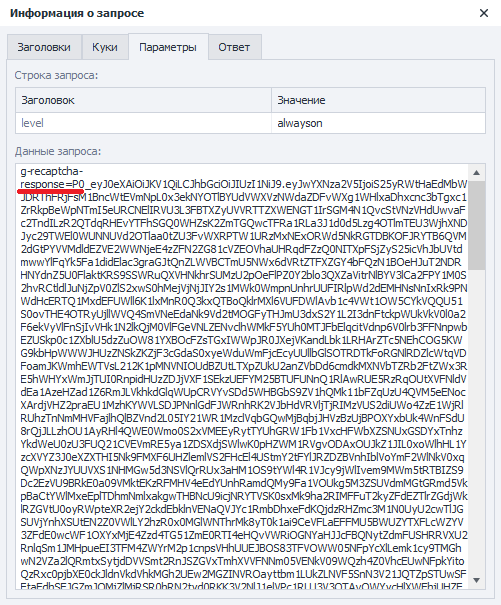

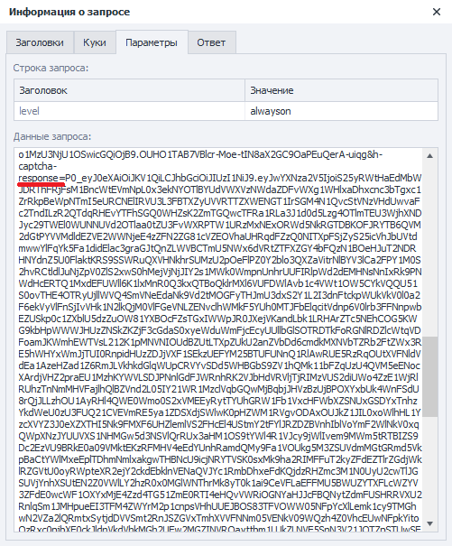

You can always check an example request in the [❗→ traffic window](/wiki/spaces/RU/pages/735805465 "/wiki/spaces/RU/pages/735805465")

  

### Error report

Allows you to get your money back in case of an unsuccessful captcha solving attempt.

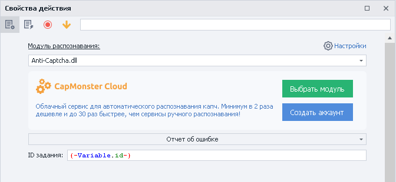

**Job ID** is specified as a static value or via a variable.

  

### Success report

Report to the service that the captcha was successfully solved.

**Job ID** is specified as a static value or via a variable.

  

## Usage example

When you land on a page with anti-bot, the system asks you to confirm you are not a robot.

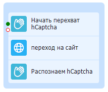

1. To use autosubmit, start hCaptcha interception before going to the target page.
2. Go to the page.
3. Add the "solve hCaptcha" action to your project.
4. Configure the block.
5. Pass the site’s verification.
6. Disable hCaptcha interception (optional).

Currently, many resources use hCaptcha for protection. It helps sites block bulk actions or detect bots, but thanks to **ZennoPoster**’s features, passing such checks is easy.

  

## Useful links

1. [❗→ Traffic window](/wiki/spaces/RU/pages/735805465 "/wiki/spaces/RU/pages/735805465")
2. [❗→ Variables window](/wiki/spaces/RU/pages/735608872 "/wiki/spaces/RU/pages/735608872")
3. [❗→ Data](https://zennolab.atlassian.net/wiki/spaces/RU/pages/534085840/- "https://zennolab.atlassian.net/wiki/spaces/RU/pages/534085840/-")
4. [CapMonster Cloud](https://capmonster.cloud/ru/ "https://capmonster.cloud/ru/")