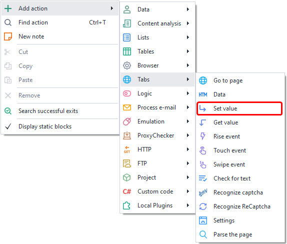
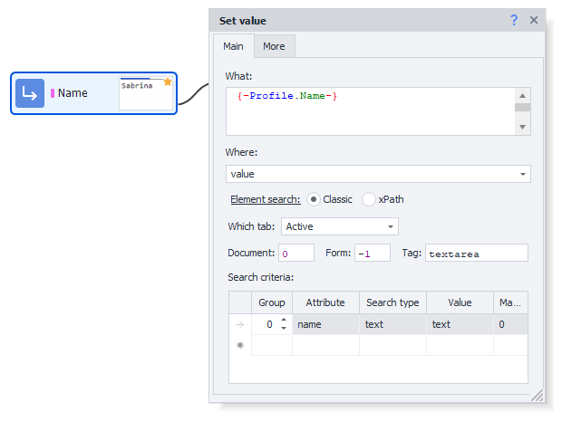
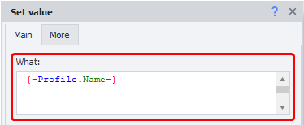
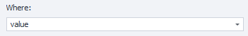
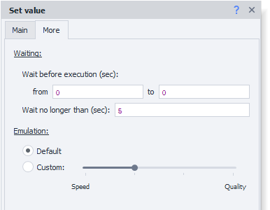
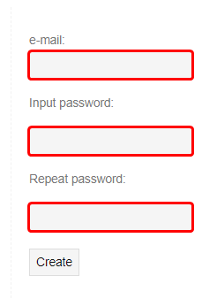
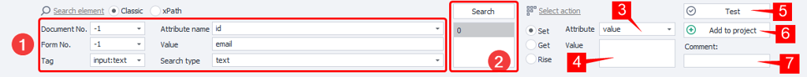
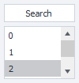
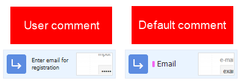

:::info **Please read the [*Material Usage Rules on this site*](../../../../Disclaimer).**
:::

> 🔗 **[Original page](https://zennolab.atlassian.net/wiki/spaces/RU/pages/534315117)** — Source of this material

_______________________________________________  

## Description

The "**Set Value**" action is used to set values for various HTML elements:

- Single-line input fields. HTML tag `<input />`. Commonly used to set names, passwords, addresses, and other values. [Example](https://lessons.zennolab.com/ru/registration "https://lessons.zennolab.com/ru/registration")    
- Multi-line fields. HTML tag `<textarea />`. Used when you need to enter a message, article text, or any other large amount of text.
- Drop-down lists. HTML tag `<select />`. These can be found when selecting gender, country, and/or city in various registration forms.

Example of a form with the above fields:

- https://lessons.zennolab.com/ru/registration
- [<u data-renderer-mark="true">https://lessons.zennolab.com/ru/index</u>](https://lessons.zennolab.com/ru/index "https://lessons.zennolab.com/ru/index")

Additionally, with this action, you can change not only visible text, but also the code of elements on the page. This can be useful when one element covers another; in such cases, it's enough to replace the extra element’s code with an empty string and it will be removed from the page.

  

## How to add the action to a project?

Via the context menu **Add Action** → **Tabs** → **Set Value**




Via [❗→ Action Builder](https://zennolab.atlassian.net/wiki/spaces/RU/pages/483426337/ "https://zennolab.atlassian.net/wiki/spaces/RU/pages/483426337/").

Or use [❗→ Smart Search](https://zennolab.atlassian.net/wiki/spaces/RU/pages/506200090/ProjectMaker+7#%D0%A3%D0%BC%D0%BD%D1%8B%D0%B9-%D0%BF%D0%BE%D0%B8%D1%81%D0%BA-%D0%B4%D0%B5%D0%B9%D1%81%D1%82%D0%B2%D0%B8%D0%B9 "https://zennolab.atlassian.net/wiki/spaces/RU/pages/506200090/ProjectMaker+7#%D0%A3%D0%BC%D0%BD%D1%8B%D0%B9-%D0%BF%D0%BE%D0%B8%D1%81%D0%BA-%D0%B4%D0%B5%D0%B9%D1%81%D1%82%D0%B2%D0%B8%D0%B9").

  

## How to select a field to set a value?

Open the required page in the ProjectMaker browser and right-click the element you want to set a value for. From the context menu, select “[❗→ To Action Builder](https://zennolab.atlassian.net/wiki/spaces/RU/pages/483426337/ "https://zennolab.atlassian.net/wiki/spaces/RU/pages/483426337/")”; the Action Builder will load below the browser window, select the action type “**Set**” and click the “**Add to Project**” button.

  

## Action settings: “Main” tab




### What




The text you want to insert. You can use plain text or macros like `{ -Variable.someVar- }`, `{ -Profile.Name- }`.

### Where




Here you need to choose the attribute of the element whose value you want to change:

- value — the value of the element,
- innerHtml\outerHtml ([what's the difference](http://www.quizful.net/interview/js/inner-outer-html-functions "http://www.quizful.net/interview/js/inner-outer-html-functions")) — the HTML code of the element (by setting one of these attributes to an empty value, you can remove the element from the page).
- You can also specify more common HTML tags here — `id`, `name`, `class`, `style`, `placeholder```json
.

This is not a complete list of possible values — there are others, but these are the most commonly used.

:::note Tip
In this field you can enter a value manually, not just select from the options. You can also use project variables (`{ -Variable.var_name- }`) here.
:::

### Finding the Element

Before interacting with an element on the page, you first need to find it. In the actions [❗→ Get Value](https://zennolab.atlassian.net/wiki/spaces/RU/pages/534315124 "https://zennolab.atlassian.net/wiki/spaces/RU/pages/534315124") , [❗→ Set Value](https://zennolab.atlassian.net/wiki/spaces/RU/pages/534315117 "https://zennolab.atlassian.net/wiki/spaces/RU/pages/534315117") , [❗→ Execute Event](https://zennolab.atlassian.net/wiki/spaces/RU/pages/534020211 "https://zennolab.atlassian.net/wiki/spaces/RU/pages/534020211") , [❗→ Touch Event](https://zennolab.atlassian.net/wiki/spaces/RU/pages/735674386 "https://zennolab.atlassian.net/wiki/spaces/RU/pages/735674386") , [❗→ Swipe Event](https://zennolab.atlassian.net/wiki/spaces/RU/pages/735739970 "https://zennolab.atlassian.net/wiki/spaces/RU/pages/735739970") there are two ways to find elements — classic and via XPath.

  

**Classic** — Search by HTML element parameters: tag, attribute, and its value.


**XPath** — Search using [❗→ XPath expressions](https://zennolab.atlassian.net/wiki/spaces/RU/pages/862093419/ "https://zennolab.atlassian.net/wiki/spaces/RU/pages/862093419/"). With XPath you can implement a more universal and layout-change-resistant way of searching for data compared to the classic search or regular expressions.


### **Which Tab**

Choose the browser tab where the element should be searched for.
Possible values:

- Active tab
- First
- By name — when selecting this option, a field will appear to enter the tab name.
- By number — you’ll need to enter the tab's index (numbering starts from zero!)

### **Document**

It is recommended to set this to **-1** (search in all documents on the page). 

### **Form**

Also, it's best to set **-1** (search in all forms on the page). Choosing this value makes your template more universal.

<details>
<summary>Why is it better to set "-1"?</summary>

Example: There are 3 forms on the page — search, registration, product order. You need to click a button in the order form and select value **2** (numbering starts from zero) in the “Form” field. Later, a new form (login) appears on the site and is inserted before the order form. Now, form 2 is the login form, and your template will either throw a “button not found” error or (which is worse) click a button in the wrong form.

</details>
:::note Tip
In the program’s settings, you can check two boxes — Search in all forms on the page and Search in all documents on the page. Then, whenever you add an element to the Action Builder, the document and form number will be set to -1 by default.
:::

### **Tag (classic search only)**


The HTML tag whose value you want to get.

:::tip Advice
You can enter several tags at once, separated by ; (semicolon)
:::

### **Conditions (classic search only)**


1. **Group** — the priority of this condition. The higher the number, the lower the priority. If an element couldn't be found by the highest-priority condition, it moves to the next one, and so on until the element is found or all conditions are exhausted. You can add multiple conditions with the same priority — in this case, the search will be performed by all conditions of that priority at once.
2. **Attribute** — the HTML tag attribute to search by.
3. **Search type**:

 1. text — search by full or partial text match;
 2. notext — search for elements that do not contain the specified text;
 3. regexp — search using [❗→ regular expressions](https://zennolab.atlassian.net/wiki/spaces/RU/pages/534086111 "https://zennolab.atlassian.net/wiki/spaces/RU/pages/534086111") 
By default, the search is case-insensitive. To make it case-sensitive with regular expressions, add this at the start: 
```(?-i)`(this disables case-insensitive search)
4. **Value** — the value of the HTML tag attribute
5. **Match #** — the index of the found element (numbering starts at zero!). You can [❗→ use ranges](https://zennolab.atlassian.net/wiki/spaces/RU/pages/488964137 "https://zennolab.atlassian.net/wiki/spaces/RU/pages/488964137") and [❗→ variable macros](https://zennolab.atlassian.net/wiki/spaces/RU/pages/486309922 "https://zennolab.atlassian.net/wiki/spaces/RU/pages/486309922") in this field.

:::note Tip
To delete a search condition, left-click the field to the left of it (marked blue in the screenshot) and press the delete key on your keyboard.
:::

:::note Tip
Several conditions can be used for element search.
:::

It is always important to select search conditions so that only one element remains, i.e., the index is 0 (numbering starts at zero).

## Action settings: “Advanced” tab




### **Wait**

### **1. Wait before execution**

How long the template will wait before setting the value.

### **2. Wait for element no more than**

If the element does not appear on the page within the specified time, the action will end with an error.

### **3. Emulation**

**Default** — uses the value from [❗→ project settings](/wiki/spaces/RU/pages/534315477 "/wiki/spaces/RU/pages/534315477").
**Custom** — you can set your own emulation level for this action (the project settings will be ignored in this case).

* * *

## Example usage

Let's look at this action in a real-world example. We’ll use https://lessons.zennolab.com/ru/registration as a test site. On this page, you’ll see a simple form with three input fields and a button; for this article, we’re interested in the text input fields




The easiest way to create this action is to right-click the input field and select “To Action Builder” from the context menu. Under the ProjectMaker browser, an [❗→ Action Builder](https://zennolab.atlassian.net/wiki/spaces/RU/pages/483426337/ "https://zennolab.atlassian.net/wiki/spaces/RU/pages/483426337/") will appear (if it wasn’t already open).




ProjectMaker tries to make your life as easy as possible, so the Action Builder will already have suggested search values^(1)^ (these fields are described above). Sometimes the program does not select the optimal values, and you’ll need to do that manually.

After you’ve chosen the element search parameters, click **Search** — below this button, there’s a field^(2)^ that will show as many elements as were found based on the specified settings (in our case, only one was found, so you see “0” in the field. As mentioned above — always try to set search parameters so that only one element is found). Here’s how this field looks when several elements are found:




Next, select which attribute^(3)^ you want to update in the found element. In our case, **value** is selected, meaning the field’s displayed value will be changed. Then, enter the desired text in the **Value** field^(4)^. Here you can use [❗→ project variables](/wiki/spaces/RU/pages/735608872 "/wiki/spaces/RU/pages/735608872") in macro format: `{ -Profile.Name- }`, `{ -Variable.generatedText- }`, `{ -Page.Url- }`. You can use variables to make complex strings, for example, a birth date string based on [❗→ profile](/wiki/spaces/RU/pages/735903758 "/wiki/spaces/RU/pages/735903758") values: `{ -Profile.BornDay- }.{ -Profile.BornMonth- }.{ -Profile.BornYear- }`.

Then click the **Test** button^(5)^ and check if the value of the target element was updated. To make your project easier to read, you can add a comment^(7)^ to the action (an automatic comment is generated based on the entered **Value**, but it’s not always very useful).

:::info Info
If you are developing a large and complex project that will need to be maintained over time, try to use Action comments as much as possible. A week, month, or even six months later, you’ll be able to understand how things work in your project by reading the comments, without needing to run it (to see what the action does) and/or digging into its settings. You can also use project notes.
:::




After everything is set and confirmed, you can click **Add to Project** — your new action will appear on the project canvas.

* * *

## Useful links

- [❗→ Get Value](/wiki/spaces/RU/pages/534315124 "/wiki/spaces/RU/pages/534315124")
- [❗→ Execute Event](/wiki/spaces/RU/pages/534020211 "/wiki/spaces/RU/pages/534020211")
- [❗→ Touch Event](/wiki/spaces/RU/pages/735674386 "/wiki/spaces/RU/pages/735674386")
- [❗→ Swipe Event](/wiki/spaces/RU/pages/735739970 "/wiki/spaces/RU/pages/735739970")
- [❗→ XPath](/wiki/spaces/RU/pages/862093419 "/wiki/spaces/RU/pages/862093419")
- [❗→ Action Builder and XPath Search](/wiki/spaces/RU/pages/483426337 "/wiki/spaces/RU/pages/483426337")