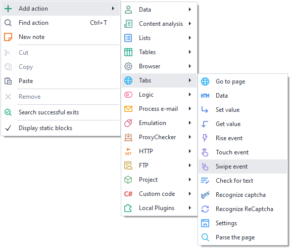
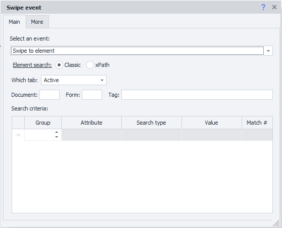
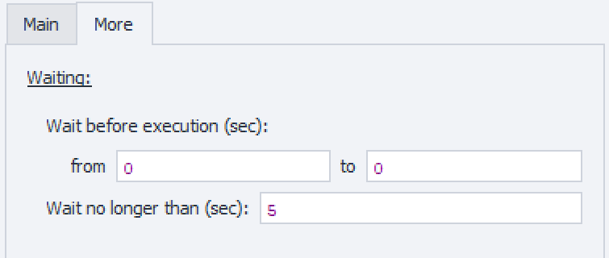

---
sidebar_position: 7
title: "Swipe Event"
description: ""
date: "2025-07-30"
converted: true
originalFile: "Событие Swipe.txt"
targetUrl: "https://zennolab.atlassian.net/wiki/spaces/RU/pages/735739970/Swipe"
---
import DisclaimerNotice from '@site/src/components/DisclaimerNotice';

<DisclaimerNotice />

> 🔗 **[Original page](https://zennolab.atlassian.net/wiki/spaces/RU/pages/735739970/Swipe)** — Source of this material

_______________________________________________  

## Description

This action allows you to emulate finger movements on the screen (swipe).

  

## How to add this action to your project?

Via the context menu **Add Action** → **Tabs** → **Swipe Event**

Or use the [❗→ smart search](https://zennolab.atlassian.net/wiki/spaces/RU/pages/506200090/ProjectMaker+7#%D0%A3%D0%BC%D0%BD%D1%8B%D0%B9-%D0%BF%D0%BE%D0%B8%D1%81%D0%BA-%D0%B4%D0%B5%D0%B9%D1%81%D1%82%D0%B2%D0%B8%D0%B9 "https://zennolab.atlassian.net/wiki/spaces/RU/pages/506200090/ProjectMaker+7#%D0%A3%D0%BC%D0%BD%D1%8B%D0%B9-%D0%BF%D0%BE%D0%B8%D1%81%D0%BA-%D0%B4%D0%B5%D0%B9%D1%81%D1%82%D0%B2%D0%B8%D0%B9").

  

## Where can this be used?

- When you need to emulate a phone or any other touchscreen device
- When you want your actions to be as close to human as possible

  

## How to use this action?

You need to enable “Recording” and the [❗→ Input Mode](https://zennolab.atlassian.net/wiki/spaces/RU/pages/534315373#%D0%A0%D0%B5%D0%B6%D0%B8%D0%BC-%D0%B2%D0%B2%D0%BE%D0%B4%D0%B0 "https://zennolab.atlassian.net/wiki/spaces/RU/pages/534315373#%D0%A0%D0%B5%D0%B6%D0%B8%D0%BC-%D0%B2%D0%B2%D0%BE%D0%B4%D0%B0") “Touch” in the browser window so that all actions performed in the browser are automatically recorded as Touch events.

### Selecting the event

- **Swipe to element** - scroll the page until the element becomes visible.
- **Simple swipe** - Up / Down / Left / Right.

  

### Finding an element

Before interacting with an element on the page, you need to find it. In the following actions: [❗→ Get Value](https://zennolab.atlassian.net/wiki/spaces/RU/pages/534315124 "https://zennolab.atlassian.net/wiki/spaces/RU/pages/534315124"), [❗→ Set Value](https://zennolab.atlassian.net/wiki/spaces/RU/pages/534315117 "https://zennolab.atlassian.net/wiki/spaces/RU/pages/534315117"), [❗→ Perform Event](https://zennolab.atlassian.net/wiki/spaces/RU/pages/534020211 "https://zennolab.atlassian.net/wiki/spaces/RU/pages/534020211"), [❗→ Touch Event](https://zennolab.atlassian.net/wiki/spaces/RU/pages/735674386 "https://zennolab.atlassian.net/wiki/spaces/RU/pages/735674386"), and [❗→ Swipe Event](https://zennolab.atlassian.net/wiki/spaces/RU/pages/735739970 "https://zennolab.atlassian.net/wiki/spaces/RU/pages/735739970"), there are two ways to find elements — classic and via XPath.

  

**Classic** — Search by HTML element parameters: tag, attribute and its value.

**XPath** — search using [❗→ XPath expressions](https://zennolab.atlassian.net/wiki/spaces/RU/pages/862093419/ "https://zennolab.atlassian.net/wiki/spaces/RU/pages/862093419/"). With it, you can implement a more universal and resilient way to find data compared to classic search or regular expressions.

### **Which tab**

Choose the tab where the element will be searched.
Available options:

- Active tab
- First
- By name — when you select this option, an input field will appear for the tab name.
- By number — you will need to specify the tab number in the input field (numbering starts from zero!)

### **Document**

It is recommended to use the value **-1** (search across all documents on the page). 

### **Form**

It’s also preferable to set **-1** (search in all forms on the page). With this value, the template will be more universal.

Why is it better to use "-1"?

Example: There are three forms on the page — search, registration, and order. You need to click a button in the order form and you selected **2** (two) (numbering starts at zero) as the value for the “Form” field. Some time later, a new login form appears on the site and is placed before the order form. Now, number 2 refers to the login form, and your template will either throw an error saying the button was not found, or (worse) will click a different button in a different form.

:::note Tip
In the program settings, you can check two boxes — “Search in all forms on the page” and “Search in all documents on the page” — and then, whenever you add an element in the Action Builder, the document and form numbers will always be set to -1.
:::

### **Tag (classic search only)**

This is the actual HTML tag whose value you need to retrieve.

:::tip Advice
You can specify multiple tags at once; use ; (semicolon) as the separator.
:::

### **Conditions (classic search only)**

1. **Group** — the priority of this condition. The higher this number, the lower the priority. If the element could not be found with the highest priority condition, it moves to the next one, continuing until the element is found or no conditions remain. You can add several conditions with the same priority; in this case, all these conditions will be checked simultaneously.
2. **Attribute** — the HTML tag attribute you are searching by.
3. **Search type**:

 1. text — search by full or partial text match;
 2. notext — search for elements that do not have the specified text;
 3. regexp — search using [❗→ regular expressions](https://zennolab.atlassian.net/wiki/spaces/RU/pages/534086111 "https://zennolab.atlassian.net/wiki/spaces/RU/pages/534086111").
By default, the search is case-insensitive. To make regular expression search case-sensitive, add `(?-i)` at the very start of the expression (this disables case-insensitivity).
4. **Value** — the value of the HTML tag attribute
5. **Match number** — the index of the found element (numbering starts at zero!). In this field, you can [❗→ use ranges](https://zennolab.atlassian.net/wiki/spaces/RU/pages/488964137 "https://zennolab.atlassian.net/wiki/spaces/RU/pages/488964137") and macros [❗→ variables](https://zennolab.atlassian.net/wiki/spaces/RU/pages/486309922 "https://zennolab.atlassian.net/wiki/spaces/RU/pages/486309922").

:::note Tip
To delete a search condition, left-click the field to the left of it (highlighted in blue in the screenshot) and press the delete key on your keyboard.
:::

:::note Tip
Several conditions can be used to find the necessary element.
:::

It’s always important to set up search conditions so that only one element remains — i.e., the match number is 0 (count starts from zero).

### “Advanced” tab

**“Wait before execution”.**

How long the action will wait before being carried out.

**“Wait for element no more than”.**

If the element does not appear on the page within the specified time, the action will finish with an error.

  

## Usage example

Works great together with [❗→ Touch](https://zennolab.atlassian.net/wiki/spaces/RU/pages/735674386 "https://zennolab.atlassian.net/wiki/spaces/RU/pages/735674386"). First, do Swipe to the element, then Touch.

It can also be useful for emulating live page scrolling or “flipping through” photos.

In the Touch article, there are [❗→ swipe examples in C#](https://zennolab.atlassian.net/wiki/spaces/RU/pages/735674386/Touch#%D0%9F%D1%80%D0%B8%D0%BC%D0%B5%D1%80%D1%8B-%D1%80%D0%B0%D0%B1%D0%BE%D1%82%D1%8B-%D0%BD%D0%B0-C%23 "https://zennolab.atlassian.net/wiki/spaces/RU/pages/735674386/Touch#%D0%9F%D1%80%D0%B8%D0%BC%D0%B5%D1%80%D1%8B-%D1%80%D0%B0%D0%B1%D0%BE%D1%82%D1%8B-%D0%BD%D0%B0-C%23").

  

## Useful links

- [❗→ Action Builder and XPath Search](https://zennolab.atlassian.net/wiki/spaces/RU/pages/483426337 "https://zennolab.atlassian.net/wiki/spaces/RU/pages/483426337")
- [❗→ Touch Event](https://zennolab.atlassian.net/wiki/spaces/RU/pages/735674386 "https://zennolab.atlassian.net/wiki/spaces/RU/pages/735674386")
- [❗→ C# Code (.NET C# code)](https://zennolab.atlassian.net/wiki/spaces/RU/pages/492011596 "https://zennolab.atlassian.net/wiki/spaces/RU/pages/492011596")
- [❗→ Perform Event](https://zennolab.atlassian.net/wiki/spaces/RU/pages/534020211 "https://zennolab.atlassian.net/wiki/spaces/RU/pages/534020211")
- [❗→ Value Ranges](https://zennolab.atlassian.net/wiki/spaces/RU/pages/488964137 "https://zennolab.atlassian.net/wiki/spaces/RU/pages/488964137")