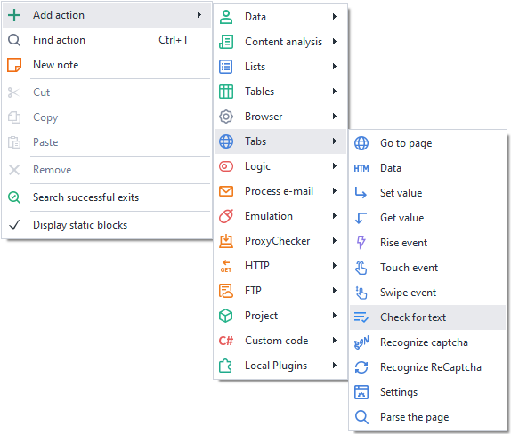
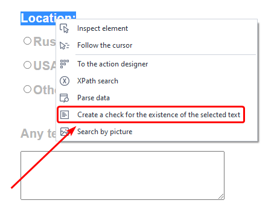
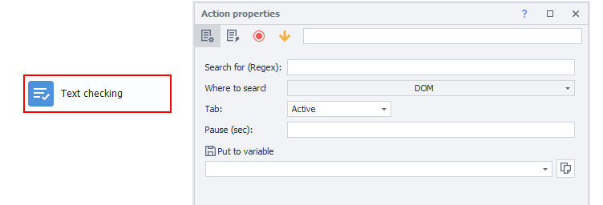

:::info **Please read the [*Material Usage Rules on this site*](../../../../Disclaimer).**
:::

> 🔗 **[Original page](https://zennolab.atlassian.net/wiki/spaces/RU/pages/1308426253)** — Source of this material

_______________________________________________  

## Description

This action is used to check for the presence of text on a page or in a URL. It is an alternative to the function [❗→ for checking the presence of selected text](/wiki/spaces/RU/pages/534053296 "/wiki/spaces/RU/pages/534053296").

:::info Information
Added in ZennoPoster 7.3.1.0
:::

  

## How do I add this action to a project?

- Via the context menu **Add action** → **Tabs** → **Text presence check**

- Using the browser context menu: highlight the text you want to check, right-click on it, and select *Create selected text presence check*.

- Or use the [❗→ smart search](https://zennolab.atlassian.net/wiki/spaces/RU/pages/506200090/ProjectMaker+7#%D0%A3%D0%BC%D0%BD%D1%8B%D0%B9-%D0%BF%D0%BE%D0%B8%D1%81%D0%BA-%D0%B4%D0%B5%D0%B9%D1%81%D1%82%D0%B2%D0%B8%D0%B9 "https://zennolab.atlassian.net/wiki/spaces/RU/pages/506200090/ProjectMaker+7#%D0%A3%D0%BC%D0%BD%D1%8B%D0%B9-%D0%BF%D0%BE%D0%B8%D1%81%D0%BA-%D0%B4%D0%B5%D0%B9%D1%81%D1%82%D0%B2%D0%B8%D0%B9").

  

## What is this used for?

- To check if authorization was successful
- To check if an action on the page was completed successfully

  

## How does this action work?

### What to search for (Regex)

The text you want to find. [❗→ Regular expressions](/wiki/spaces/RU/pages/534086111 "/wiki/spaces/RU/pages/534086111") are supported.

### Where to search

Choose the data to be searched:

- DOM
- Source

:::note Note
What's the difference between DOM and Source?
:::

- Text (all the visible text on the page)
- URL

### Tab

Select which tab to retrieve the data from:

- *Active - the currently active tab;
- *First - if there are multiple tabs, use the first one;
- *By name - specify the tab name;
- *By number - specify the tab number if there are several (numbering starts from zero).

### Pause

Waiting time (in seconds) before the search is performed.

  

## Useful links

- [❗→ Create selected text presence check](/wiki/spaces/RU/pages/534053296 "/wiki/spaces/RU/pages/534053296")
- [❗→ Regular expressions](/wiki/spaces/RU/pages/534086111 "/wiki/spaces/RU/pages/534086111")