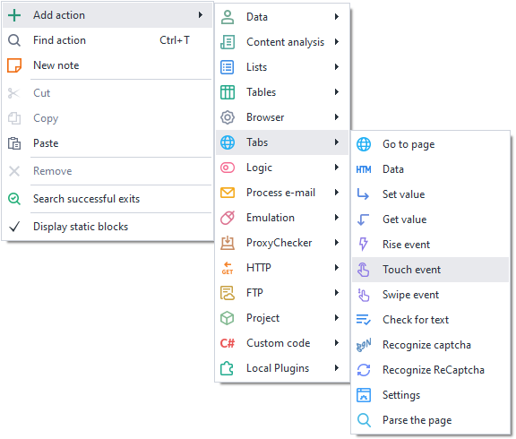
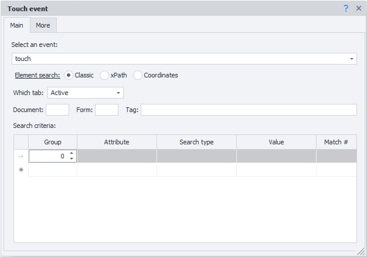
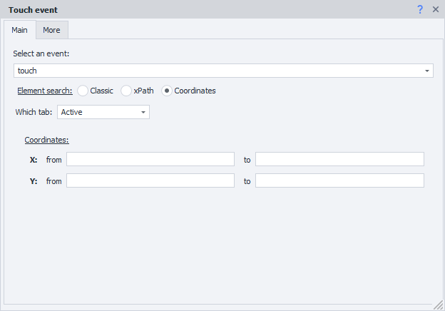
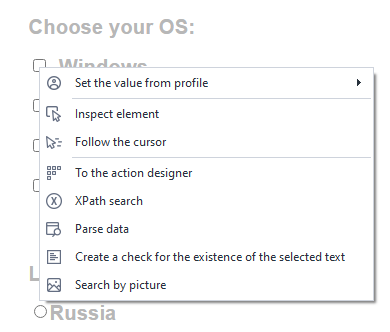
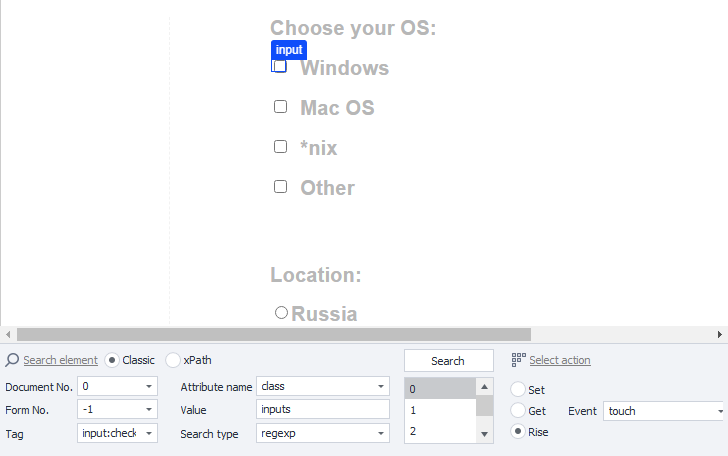
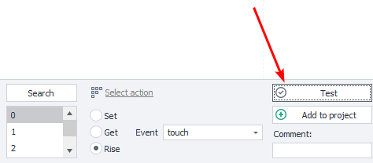

---
sidebar_position: 6
title: "Touch Event"
description: ""
date: "2025-07-30"
converted: true
originalFile: "Событие Touch.txt"
targetUrl: "https://zennolab.atlassian.net/wiki/spaces/RU/pages/735674386/Touch"
---
import DisclaimerNotice from '@site/src/components/DisclaimerNotice';

<DisclaimerNotice />

> 🔗 **[Original page](https://zennolab.atlassian.net/wiki/spaces/RU/pages/735674386/Touch)** — Source of this material 

## Description

This action allows you to emulate a Touch event (finger tap).

  

## How do I add the action to a project?

Via the context menu **Add action** → **Tabs** → **Touch Event**

  


Or use [❗→ smart search](https://zennolab.atlassian.net/wiki/spaces/RU/pages/506200090/ProjectMaker+7#%D0%A3%D0%BC%D0%BD%D1%8B%D0%B9-%D0%BF%D0%BE%D0%B8%D1%81%D0%BA-%D0%B4%D0%B5%D0%B9%D1%81%D1%82%D0%B2%D0%B8%D0%B9 "https://zennolab.atlassian.net/wiki/spaces/RU/pages/506200090/ProjectMaker+7#%D0%A3%D0%BC%D0%BD%D1%8B%D0%B9-%D0%BF%D0%BE%D0%B8%D1%81%D0%BA-%D0%B4%D0%B5%D0%B9%D1%81%D1%82%D0%B2%D0%B8%D0%B9").

  

## Where can this be used?

- When you need to emulate a phone or any other device with a touchscreen
- When you need to make all actions as close to human behavior as possible

  

## How do you work with the action?

You need to enable "Recording" and the [❗→ input mode](https://zennolab.atlassian.net/wiki/spaces/RU/pages/534315373#%D0%A0%D0%B5%D0%B6%D0%B8%D0%BC-%D0%B2%D0%B2%D0%BE%D0%B4%D0%B0 "https://zennolab.atlassian.net/wiki/spaces/RU/pages/534315373#%D0%A0%D0%B5%D0%B6%D0%B8%D0%BC-%D0%B2%D0%B2%D0%BE%D0%B4%D0%B0") "Touch" in the browser window so that all actions performed in the browser are automatically recorded as Touch events.




### Event selection

- Touch - tap (click/touch);
- Long Touch - long press (RMB)

### Element search

Before interacting with an element on the page, you need to find it. In the actions [❗→ Get value](https://zennolab.atlassian.net/wiki/spaces/RU/pages/534315124 "https://zennolab.atlassian.net/wiki/spaces/RU/pages/534315124") , [❗→ Set value](https://zennolab.atlassian.net/wiki/spaces/RU/pages/534315117 "https://zennolab.atlassian.net/wiki/spaces/RU/pages/534315117") , [❗→ Execute event](https://zennolab.atlassian.net/wiki/spaces/RU/pages/534020211 "https://zennolab.atlassian.net/wiki/spaces/RU/pages/534020211") , [❗→ Touch Event](https://zennolab.atlassian.net/wiki/spaces/RU/pages/735674386 "https://zennolab.atlassian.net/wiki/spaces/RU/pages/735674386") , [❗→ Swipe Event](https://zennolab.atlassian.net/wiki/spaces/RU/pages/735739970 "https://zennolab.atlassian.net/wiki/spaces/RU/pages/735739970") there are two ways to search for elements — classic and using XPath.

  

**Classic** — search by HTML element parameters: tag, attribute, and its value.


**XPath** — search using [❗→ XPath expressions](https://zennolab.atlassian.net/wiki/spaces/RU/pages/862093419/ "https://zennolab.atlassian.net/wiki/spaces/RU/pages/862093419/"). With it, you can implement a more universal and layout-change-resistant way of searching for data compared to classic search or regular expressions.


### **Which tab**

Select the tab where the element search will be performed.
Possible values:

- Active tab
- First
- By name — when selecting this option, an input field for the tab name will appear.
- By number — you need to enter the tab index in the input field (numbering starts from zero!)

### **Document**

It is recommended to set the value to **-1** (search in all documents on the page). 

### **Form**

It is also better to set **-1** (search across all forms on the page). When choosing this value, the template will be more universal.

<details>
<summary>Why is it better to set -1?</summary>

Example: there are 3 forms on the page — search, registration, product order. We need to click a button in the order form, and we selected **2** (two) as the value of the "Form" field (numbering starts from zero). After some time, a new login form appears on the site and is inserted before the order form. Now form number 2 will be the login form, and our template will either throw an error saying the button was not found or (much worse) will click a different button in a different form.

</details>
:::note Note
In the program settings, you can check two checkboxes — Search in all forms on the page and Search in all documents on the page, and then whenever you add an element to the Action Constructor, the document and form numbers will always be set to -1.
:::

### Tag (classic search only)**


The actual HTML tag whose value needs to be obtained.

:::tip Tip
You can specify several tags at once; the separator is ; (semicolon)
:::

### Conditions (classic search only)**


1. **Group** — the priority of this condition. The higher this number, the lower the priority. If the element could not be found by the condition with the highest priority, the search moves to the condition with the next priority, and so on until the element is found or the search conditions are exhausted. You can add several conditions with the same priority; in that case, the search will be performed across all conditions with the same priority simultaneously.
2. **Attribute** — the HTML tag attribute used for searching.
3. **Search type**:

 1. text — search by full or partial text match;
 2. notext — search for elements that do not contain the specified text;
 3. regexp — search using [❗→ regular expressions](https://zennolab.atlassian.net/wiki/spaces/RU/pages/534086111 "https://zennolab.atlassian.net/wiki/spaces/RU/pages/534086111") 
By default, the search is case-insensitive. To make regular expression searches case-sensitive, add `(?-i)` at the very beginning of the expression (this means disabling case-insensitive search).
4. **Value** — the value of the HTML tag attribute
5. **Match №** — the index of the found element (numbering starts from zero!). In this field, you can [❗→ use ranges](https://zennolab.atlassian.net/wiki/spaces/RU/pages/488964137 "https://zennolab.atlassian.net/wiki/spaces/RU/pages/488964137") and [❗→ variable macros](https://zennolab.atlassian.net/wiki/spaces/RU/pages/486309922 "https://zennolab.atlassian.net/wiki/spaces/RU/pages/486309922").

:::note Note
To delete a search condition, you need to left-click the field to the left of it (highlighted in blue in the screenshot) and press the delete key on the keyboard.
:::

:::note Note
Multiple conditions can be used to search for the desired element.
:::

It is always important to try to choose search conditions so that only one element remains, i.e., the index is 0 (numbering starts from zero).

### Coordinates

Execute the Touch event within the specified coordinates




1. **Which tab** — Active / First / By name / By number
2. **Coordinates** — you need to enter a range of X and Y coordinates. You can use project [❗→ variables](https://zennolab.atlassian.net/wiki/spaces/RU/pages/486309922 "https://zennolab.atlassian.net/wiki/spaces/RU/pages/486309922") — `{ -Variable.example_var- }`
.

### Tab "Advanced"


**"Wait before execution".**

How long the action will wait before being executed.

**"Wait for element no longer than".**

If the element does not appear on the page within the specified time, the action will finish with an error.

  

## Usage example

Let’s take our resource as an example, where you can practice making simple clicks — https://lessons.zennolab.com/ru/index. To implement this, we will use the [❗→ Action Constructor](https://zennolab.atlassian.net/wiki/spaces/RU/pages/483426337 "https://zennolab.atlassian.net/wiki/spaces/RU/pages/483426337").

Go to the page in ProjectMaker.




Scroll down and find the field for clicking and selecting the OS. Right-click on the checkbox area and select "To Action Constructor".




Select the **Rise** action and the **touch** event. Click the **Test** button to check.




If the click was successful, click **Add to project**

  

### C# usage examples

Starting with version 7.1.4.0, the Touch property with a set of methods has been added to CommandCenter.Tab. The Touch property includes basic methods: [<u data-renderer-mark="true">TouchStart</u>](https://help.zennolab.com/en/v7/zennoposter/7.1.4/webframe.html#topic693.html "https://help.zennolab.com/en/v7/zennoposter/7.1.4/webframe.html#topic693.html"), [<u data-renderer-mark="true">TouchEnd</u>](https://help.zennolab.com/en/v7/zennoposter/7.1.4/webframe.html#topic691.html "https://help.zennolab.com/en/v7/zennoposter/7.1.4/webframe.html#topic691.html"), [<u data-renderer-mark="true">TouchMove</u>](https://help.zennolab.com/en/v7/zennoposter/7.1.4/webframe.html#topic692.html "https://help.zennolab.com/en/v7/zennoposter/7.1.4/webframe.html#topic692.html"), [<u data-renderer-mark="true">TouchCancel</u>](https://help.zennolab.com/en/v7/zennoposter/7.1.4/webframe.html#topic690.html "https://help.zennolab.com/en/v7/zennoposter/7.1.4/webframe.html#topic690.html"), as well as composite methods with overloads [<u data-renderer-mark="true">Touch</u>](https://help.zennolab.com/en/v7/zennoposter/7.1.4/webframe.html#topic685.html "https://help.zennolab.com/en/v7/zennoposter/7.1.4/webframe.html#topic685.html"), [<u data-renderer-mark="true">SwipeIntoView</u>](https://help.zennolab.com/en/v7/zennoposter/7.1.4/webframe.html#topic683.html "https://help.zennolab.com/en/v7/zennoposter/7.1.4/webframe.html#topic683.html"), [<u data-renderer-mark="true">SwipeBetween</u>](https://help.zennolab.com/en/v7/zennoposter/7.1.4/webframe.html#topic679.html "https://help.zennolab.com/en/v7/zennoposter/7.1.4/webframe.html#topic679.html") and others.

#### Touch tap emulation


```csharp
var tab = instance.ActiveTab;
var init = tab.FindElementByXPath("/html/body/button", 0); // Search for an HTML element via XPath
tab.Touch.Touch(init); // Tap on it
```

* * *

#### Scroll


```csharp
var tab = instance.ActiveTab;
HtmlElement init = tab.FindElementByXPath(".//button", 0); // Search for an HTML element via XPath
tab.Touch.SwipeIntoView(init); // Scroll the screen with touch gestures to the desired HTML element
```


#### Swipe right


```csharp
var tab = instance.ActiveTab;

// We will perform a swipe inside an HTML element. Let’s build an XPath expression.
var canvas = tab.FindElementByXPath(@"//*[@id=""canvas""]", 0);

// Get its dimensions: width and height
var width = canvas.BoundingClientWidth;
var height = canvas.BoundingClientHeight;

// Determine the X coordinates of the first touch and the last one when releasing the finger
var offsetX = width / 4;
var minX = canvas.DisplacementInBrowser.X + offsetX;
var maxX = minX + width - 2*offsetX;

// Determine the Y coordinates of the first touch and the last one when releasing the finger
var offsetY = height / 4;
var minY = canvas.DisplacementInBrowser.Y + offsetY;
var maxY = minY;

// Swipe right
tab.Touch.SwipeBetween(minX, minY, maxX, maxY);
```

* * *

#### Settings

Only part of the settings is shown here. You can find the full list in the [❗→ documentation](https://zennolab.atlassian.net/wiki/spaces/RU/pages/495058994 "https://zennolab.atlassian.net/wiki/spaces/RU/pages/495058994").

<details>
<summary>Click here to expand</summary>

By default, a number of parameters are taken into account and randomized: speed, acceleration, movement curve, and others. All movements will be as natural as possible out of the box, but if you need to make adjustments to the behavior of touch events, that option is also available.


```csharp
var tab = instance.ActiveTab;
var parameters = tab.Touch.GetCopyOfTouchEmulationParameters(); // Get current touch settings
// Then type "parameters." and after the dot the syntax editor will suggest available fields of this object.

////////////////////////
// Some examples
////////////////////////
parameters.Acceleration = 1.2f; // Increase acceleration

parameters.MinCurvature = 0; // Minimum curvature — straight line
parameters.MaxCurvature = 1; // Maximum curvature — very strong bend

// Curve bend closer to the starting point
parameters.MinCurvePeakShift = 0f;
parameters.MaxCurvePeakShift = 0.2f;

parameters.MinStep = 1; // Lower starting speed
parameters.MaxStep = 60; // Higher final speed

parameters.RightThumbProbability = 0.7f; // In 70% of cases the right finger will be used, and in 30% — the left one.

tab.Touch.SetTouchEmulationParameters(parameters); // IMPORTANT: APPLY SETTINGS — OTHERWISE NOTHING WILL CHANGE

// Even more settings here: https://help.zennolab.com/en/v7/zennoposter/7.1.4/webframe.html#topic951.html
// instance.ActiveTab.Touch.SetTouchEmulationParameters(new TouchEmulationParameters()); // Set default settings
```

</details>
  

###  Demo project
[**Touch Sample Project**](./assets/Touch_Event/Touch_Sample.zp)

## Useful links

- [❗→ Action Constructor and XPath Search](https://zennolab.atlassian.net/wiki/spaces/RU/pages/483426337 "https://zennolab.atlassian.net/wiki/spaces/RU/pages/483426337")
- [❗→ Swipe Event](https://zennolab.atlassian.net/wiki/spaces/RU/pages/735739970 "https://zennolab.atlassian.net/wiki/spaces/RU/pages/735739970")
- [❗→ C# code (.NET)](https://zennolab.atlassian.net/wiki/spaces/RU/pages/492011596 "https://zennolab.atlassian.net/wiki/spaces/RU/pages/492011596")
- [❗→ Execute event](https://zennolab.atlassian.net/wiki/spaces/RU/pages/534020211 "https://zennolab.atlassian.net/wiki/spaces/RU/pages/534020211")
- [❗→ Value ranges](https://zennolab.atlassian.net/wiki/spaces/RU/pages/488964137 "https://zennolab.atlassian.net/wiki/spaces/RU/pages/488964137")