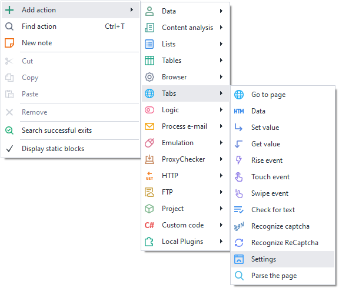
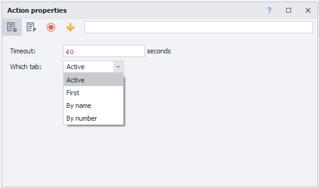

---
sidebar_position: 11
title: "Web Page Settings"
description: ""
date: "2025-07-30"
converted: true
originalFile: "Настройки веб-страницы.txt"
targetUrl: "https://zennolab.atlassian.net/wiki/spaces/RU/pages/534020228/-"
---
import DisclaimerNotice from '@site/src/components/DisclaimerNotice';

<DisclaimerNotice />

> 🔗 **[Original page](https://zennolab.atlassian.net/wiki/spaces/RU/pages/534020228/-)** — Source of this material

_______________________________________________  

## Description

Specifies the maximum wait time for a site to load in a specific tab. The default is 120 seconds.

## How do I add this action to my project?

Via the context menu: **Add Action** → **Tabs** → **Settings**

Or use the [❗→ smart search](https://zennolab.atlassian.net/wiki/spaces/RU/pages/506200090/ProjectMaker+7#%D0%A3%D0%BC%D0%BD%D1%8B%D0%B9-%D0%BF%D0%BE%D0%B8%D1%81%D0%BA-%D0%B4%D0%B5%D0%B9%D1%81%D1%82%D0%B2%D0%B8%D0%B9 "https://zennolab.atlassian.net/wiki/spaces/RU/pages/506200090/ProjectMaker+7#%D0%A3%D0%BC%D0%BD%D1%8B%D0%B9-%D0%BF%D0%BE%D0%B8%D1%81%D0%BA-%D0%B4%D0%B5%D0%B9%D1%81%D1%82%D0%B2%D0%B8%D0%B9").

## What is this used for?

Changing the website load wait time may be needed if a page takes a long time to load.

## How do you work with this action?

1. Enter a pause or variable for the website load wait time, in seconds.
2. Select which tab to apply this to:  
a) *Active* — the current tab you see in front of you  
b) *First* — the leftmost tab  
c) *By name* — enter the tab name or variable (case-sensitive)  
d) *By number* — numbered from left to right, starting with **0**. You can use a variable  

:::info Information
Tab numbers go from left to right and always start from 0.
:::

  

## Useful links

1. [❗→ Go to page](https://zennolab.atlassian.net/wiki/spaces/RU/pages/534052989/Navigate "https://zennolab.atlassian.net/wiki/spaces/RU/pages/534052989/Navigate")
2. [❗→ Tab management](/wiki/spaces/RU/pages/534020201 "/wiki/spaces/RU/pages/534020201")
3. [❗→ Variables window](/wiki/spaces/RU/pages/735608872 "/wiki/spaces/RU/pages/735608872")