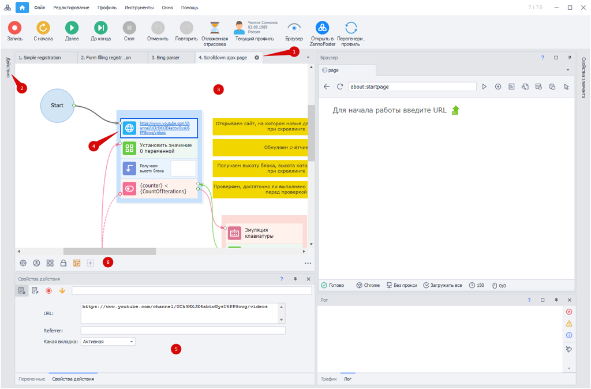
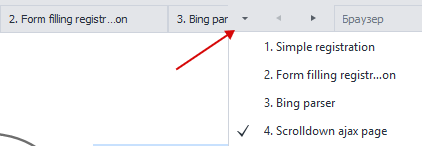
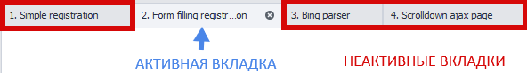
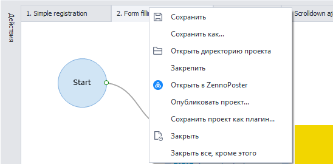
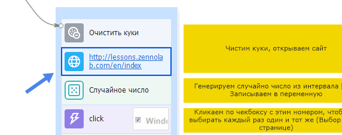
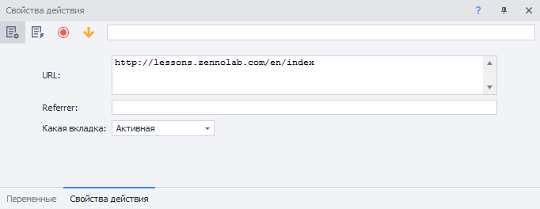
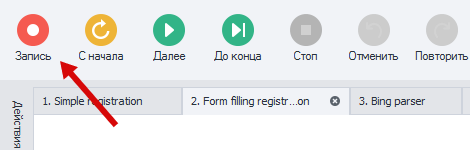

---
sidebar_position: 0
title: "Project Editor"
description: "Converted from HTML to MDX"
date: "2025-07-24"
converted: true
originalFile: "Редактор проектов.txt"
targetUrl: "https://zennolab.atlassian.net/wiki/spaces/RU/pages/534052914"
---
:::info **Please read the [*Terms of Use for Materials on This Resource*](../Disclaimer).**
:::

> 🔗 **[Original Page](https://zennolab.atlassian.net/wiki/spaces/RU/pages/534052914)** — Source of this material

_______________________________________________  

The Project Editor in ProjectMaker is the main place where you work with your projects.

Let's take a look at what it's made of.

1. Open Projects Panel
2. Actions Panel
3. Currently Selected Project
4. Currently Selected Action
5. Properties of the Selected Action
6. Static Blocks Panel

## Open Projects Panel

When you open several projects, all of them appear as tabs in the editor panel. If there isn't enough room for all tabs, you can use a special menu:

## Actions Panel

:::tip Tip
The Actions Panel contains the full functionality of the program—over a hundred features in total. You can find all available actions here: Actions
:::

Take a look at how you can add an action to your project:

**📹 There was a video here**

Additionally, you can pin the Actions Panel so it doesn't get hidden.

## Current Project and Selected Action

You can see which project you're working in by looking at the state of the tabs in the Open Projects Panel.

You can also open the context menu and perform certain actions with the project. To do this, simply right-click on the project's tab.

The action you select will be highlighted with a border.

To select a specific action, just click on it with the **left mouse button**.

## Action Properties

In this section, you can configure each individual action. Here you'll see all available features of the selected action. For more details, check out the [❗→ Actions section](https://zennolab.atlassian.net/wiki/spaces/RU/pages/486342706/ProjectMaker "https://zennolab.atlassian.net/wiki/spaces/RU/pages/486342706/ProjectMaker").

You can also open several actions at the same time. Read more: [❗→ Open multiple action settings at once](https://zennolab.atlassian.net/wiki/spaces/RU/pages/725385223#%D0%9E%D1%82%D0%BA%D1%80%D1%8B%D0%B2%D0%B0%D1%82%D1%8C-%D0%BD%D0%B5%D1%81%D0%BA%D0%BE%D0%BB%D1%8C%D0%BA%D0%BE-%D0%BD%D0%B0%D1%81%D1%82%D1%80%D0%BE%D0%B5%D0%BA-%D0%B4%D0%B5%D0%B9%D1%81%D1%82%D0%B2%D0%B8%D0%B9-%D0%B2-%D1%80%D0%B5%D0%B6%D0%B8%D0%BC%D0%B5-%E2%80%9C%E2%80%A6%E2%80%9C "https://zennolab.atlassian.net/wiki/spaces/RU/pages/725385223#%D0%9E%D1%82%D0%BA%D1%80%D1%8B%D0%B2%D0%B0%D1%82%D1%8C-%D0%BD%D0%B5%D1%81%D0%BA%D0%BE%D0%BB%D1%8C%D0%BA%D0%BE-%D0%BD%D0%B0%D1%81%D1%82%D1%80%D0%BE%D0%B5%D0%BA-%D0%B4%D0%B5%D0%B9%D1%81%D1%82%D0%B2%D0%B8%D0%B9-%D0%B2-%D1%80%D0%B5%D0%B6%D0%B8%D0%BC%D0%B5-%E2%80%9C%E2%80%A6%E2%80%9C") 

## Static Blocks Panel

Here you can add a [❗→ List](https://zennolab.atlassian.net/wiki/spaces/RU/pages/534053375), [❗→ Table](https://zennolab.atlassian.net/wiki/spaces/RU/pages/735903776), [❗→ Google Sheet](https://zennolab.atlassian.net/wiki/spaces/RU/pages/724566092), [❗→ Project Input Settings](https://zennolab.atlassian.net/wiki/spaces/RU/pages/534020594), [❗→ Bot Interface](https://zennolab.atlassian.net/wiki/spaces/RU/pages/725352539), [❗→ FTP Settings](https://zennolab.atlassian.net/wiki/spaces/RU/pages/534315484), [❗→ Links from GAC](https://zennolab.atlassian.net/wiki/spaces/RU/pages/534315491), [❗→ Using Directives and General Code](https://zennolab.atlassian.net/wiki/spaces/RU/pages/534086229).

Learn more about this panel in [❗→ this section](/wiki/spaces/RU/pages/534315470 "/wiki/spaces/RU/pages/534315470").

## Browser Window

Everything that's happening is displayed here: your automated clicks, text input, and other actions. By clicking on the **Record** button, you can record any actions you perform in the browser window. The necessary actions will automatically be added to your project.

