---
sidebar_position: 12
title: "Bot Interface"
description: ""
date: "2025-08-04"
converted: true
originalFile: "Интерфейс бота.txt"
targetUrl: "https://zennolab.atlassian.net/wiki/spaces/RU/pages/725352539"
---
:::info **Please review the [*Terms of Use for Materials on this Resource*](../Disclaimer).**
:::

> 🔗 **[Original page](https://zennolab.atlassian.net/wiki/spaces/RU/pages/725352539)** — Source for this material

_______________________________________________  

The bot interface (bot user interface, hereafter BotUI) is a visual builder for creating interfaces based on web technologies: HTML, CSS, and JavaScript. With this editor, you can easily and quickly create beautiful, intuitive, modern, multilingual interfaces for your projects, even if you don't have much experience in web development! BotUI includes settings functionality and lets you pass input parameters to a template/plugin for later execution in ZennoPoster.

  

## Add "Bot Interface" to a Project

To do this, click "***Add***" on the [❗→ static blocks panel](https://zennolab.atlassian.net/wiki/spaces/RU/pages/534053179 "https://zennolab.atlassian.net/wiki/spaces/RU/pages/534053179") in the ProjectMaker editor, and in the context menu that appears, select "***Add bot interface***", or right-click anywhere in the lower section to open the context menu.

| 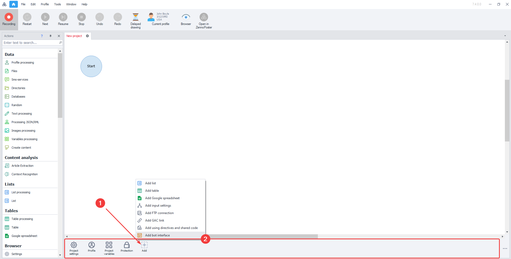 |
| :--: |
| Add bot interface to the ZennoPoster project |

A corresponding icon will appear on the panel, which you can open by double-clicking it.

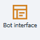

:::info Information
Please note that this block cannot be present in the project at the same time as the "Input Settings" block. When you add "BotUI", the "Input Settings" block will be removed! The same happens the other way around! Please be careful and be sure to save the input settings for your interface in advance!
:::

## Bot Interface Editor

| 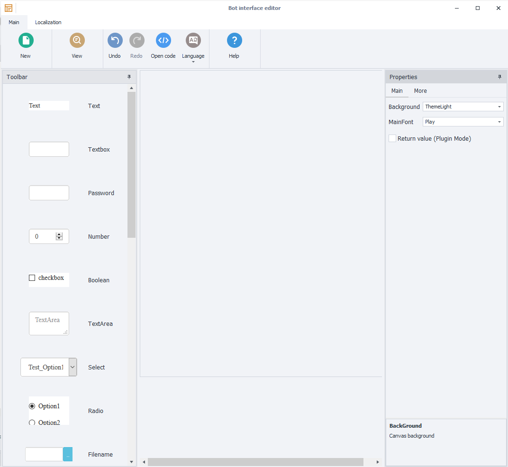 |
| :--: |
| Bot interface editor |

### **The visual builder is divided into 2 main sections:**

**Main interface settings**

- Menu
- Workspace

**Interface localization**

- Menu
- Elements panel

### - Next, let's look at each section step by step.

## **Section: Main Settings**

  

### **Menu**

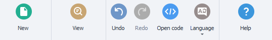

- **New** – create a new interface, completely clearing the main canvas and removing all elements from it.
- **Preview** – opens a preview form of the interface; this is how it will look in ZennoPoster after you save the project and add it.
- **Undo** – go one step back.
- **Redo** – go one step forward.
- **Open code** – opens the source code editor of the visual builder.
- **Language** – switch between different interface localizations.
- **Help** – reference information on the user interface editor.

### **Workspace**

| 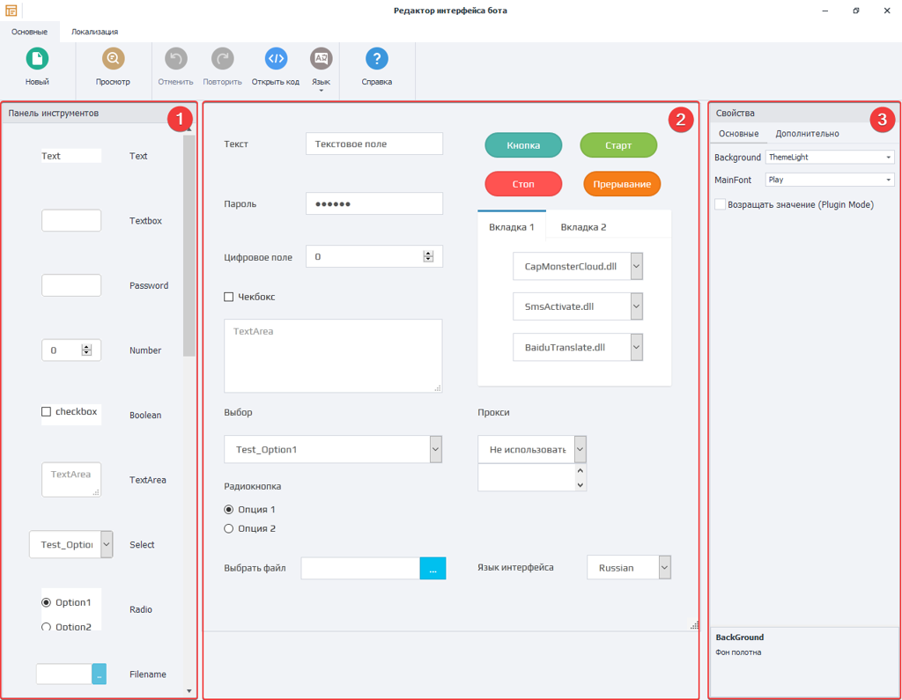 |
| :--: |
| Workspace for creating interfaces |

**The workspace for creating interfaces consists of 3 parts:**

1. Toolbar
2. Interface preview
3. Element properties

On the left is the toolbar with various elements: text input fields, choice options, additional modules and services, buttons, checkboxes, and other components (each is explained below), allowing you to build an attractive, user-friendly client interface. In the center is a layout for your future input settings (the canvas), where you can drag and drop elements from the toolbar on the left and arrange them as needed. On the right is the properties panel for the selected element, where you can set things like color, font, the variable to store the element's value, and many other settings which are explained further below.

### **Toolbar**

**Text** – simple text for notes on the canvas.

| 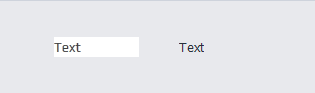 |
| :--: |
| Simple text for notes on the interface canvas |

**Textbox** – single-line text input field.

| 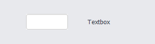 |
| :--: |
| Single-line text input field |

**Password** – password input field (unlike Textbox, the characters are replaced by dots).

| 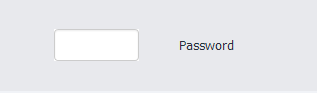 |
| :--: |
| Password input field |

**Number** – a field where only integer values can be entered.

| 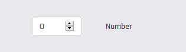 |
| :--: |
| Field for integer values |

**Boolean** – a checkbox that can be either true or false.

| 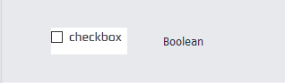 |
| :--: |
| Checkbox, can be true or false |

**TextArea** – multiline text input field.

| 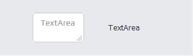 |
| :--: |
| Multiline text input field |

**Select** – dropdown list. Options are set via the "Options" property, where "Text" is the visible label, and "Value" is what gets passed to a variable when the option is chosen.

| 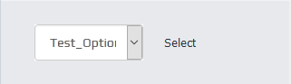 |
| :--: |
| Dropdown list |

**Radio** – a group of radio buttons. Options are set via the "Options" property, where "Text" is the visible label, and "Value" is what gets passed to a variable when selected.

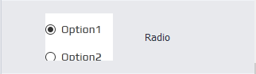

**Filename** – field for entering a file path. The default value is set via the FilePath property; in ZennoPoster, the path can be set via a dialog that opens when you click **[…]**.

| 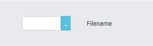 |
| :--: |
| File path input field |

**Button** – a button that can have a JavaScript event attached, affecting the current element.

| 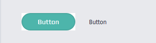 |
| :--: |
| Button with JavaScript event option |

**Multiselect** – dropdown allowing multiple selections. Options are set via the Options property, with Text as the visible label and Value as the value passed to a variable when chosen.

| 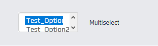 |
| :--: |
| Dropdown allowing multiple selections |

**Capcha Modules** – dropdown for selecting a [❗→ captcha recognition service](https://zennolab.atlassian.net/wiki/spaces/RU/pages/808845385 "https://zennolab.atlassian.net/wiki/spaces/RU/pages/808845385") from those available in ZennoPoster.

| 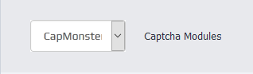 |
| :--: |
| Dropdown for selecting a captcha recognition service |

**Sms Service** – dropdown for selecting an [❗→ SMS receiving service](https://zennolab.atlassian.net/wiki/spaces/RU/pages/809074773/ "https://zennolab.atlassian.net/wiki/spaces/RU/pages/809074773/") from those available in ZennoPoster.

| 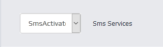 |
| :--: |
| Dropdown for selecting an SMS receiving service |

**Translate Service** – dropdown for selecting a [❗→ text translation service](https://zennolab.atlassian.net/wiki/spaces/RU/pages/808747136/ZennoPoster "https://zennolab.atlassian.net/wiki/spaces/RU/pages/808747136/ZennoPoster") from those available in ZennoPoster.

| 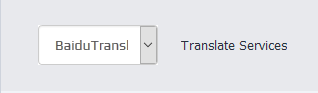 |
| :--: |
| Dropdown for selecting a text translation service |

**Tab** – control containing a collection of tabs. Each tab can contain any controls except another Tab. The collection of tabs can be edited via the Tabs property.

| 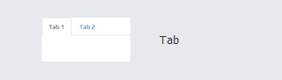 |
| :--: |
| Collection of tabs |

**Language Selector** – dropdown to display the interface localization you have configured under: "Bot Interface Editor" – "Localization".

| 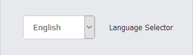 |
| :--: |
| Bot interface language selector |

**Start Button** – start button.

**Stop Button** – stop button.

**Interrupt Button** – interrupt button.

| 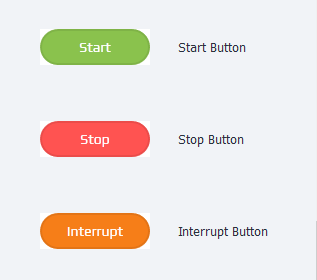 |
| :--: |
| Bot interface control button in ZennoPoster |

**Proxy Control** – control for configuring the use of proxies in the current project.

| 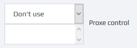 |
| :--: |
| Proxy Control |

Proxy Control matches the proxy settings and rules in your ZennoPoster project.

| 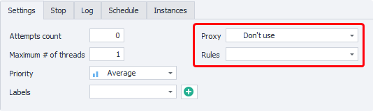 |
| :--: |
| Template proxy settings in a ZennoPoster project |

**Mapper** – for syncing lists/tables/Google Sheets of the current project with the plugin.

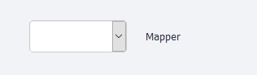

**User Control** – a custom control that lets you add any user elements you wish via HTML code.

| 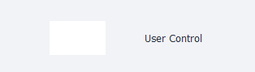 |
| :--: |
| User Control |

### Adding an Element to the Interface

Any element can be easily dragged from the toolbar onto the canvas with your mouse, and you can place elements anywhere within the visible area.

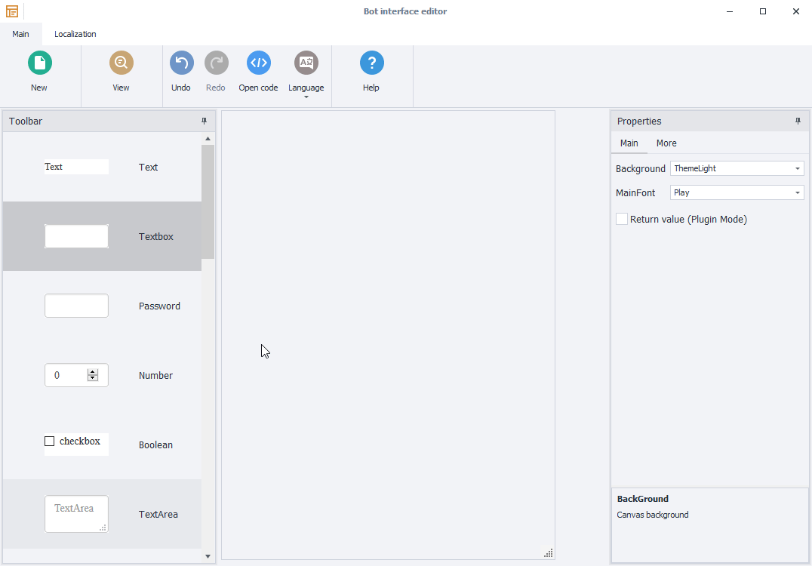

### **Interface Appearance**

The canvas (or stage) where the interface elements you add are placed.

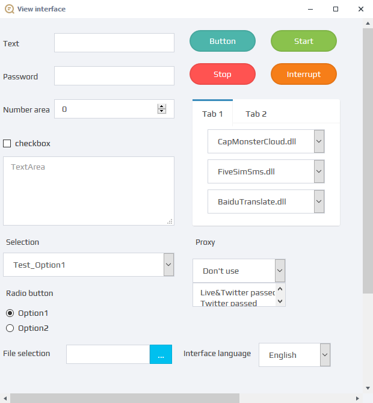

### **Element Properties**

This area has two sections:

- **Main**

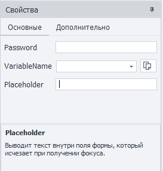

When you click on an element (on the canvas), parameters will appear in the properties window. Here, you can set values such as font, font size, text color, etc. Each element has its own unique parameters, with descriptions available in the same window below.

- **Advanced**

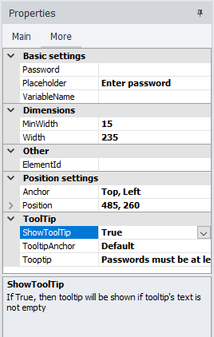

Additional (metadata) properties for advanced display customization.

Example: “*Password input field*”

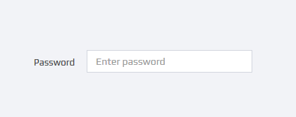

There are many settings, each explained in the lower area of the window.

## **Section: Localization**

  

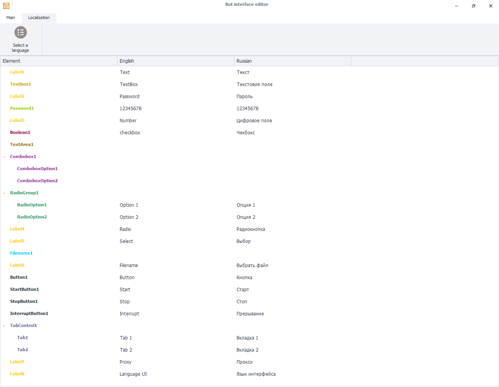

Localization of the user interface is just as intuitive as the editor itself. At the top, there's a "Language Selection" menu item.

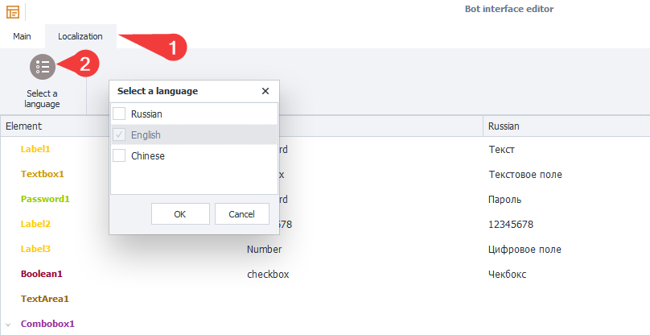

After choosing the desired language(s), you can use the "Element" panel to make your interface even more user-friendly for different language groups.

## Example Interface in a ZennoPoster Project

  

### Project Input Settings Using BotUI

| 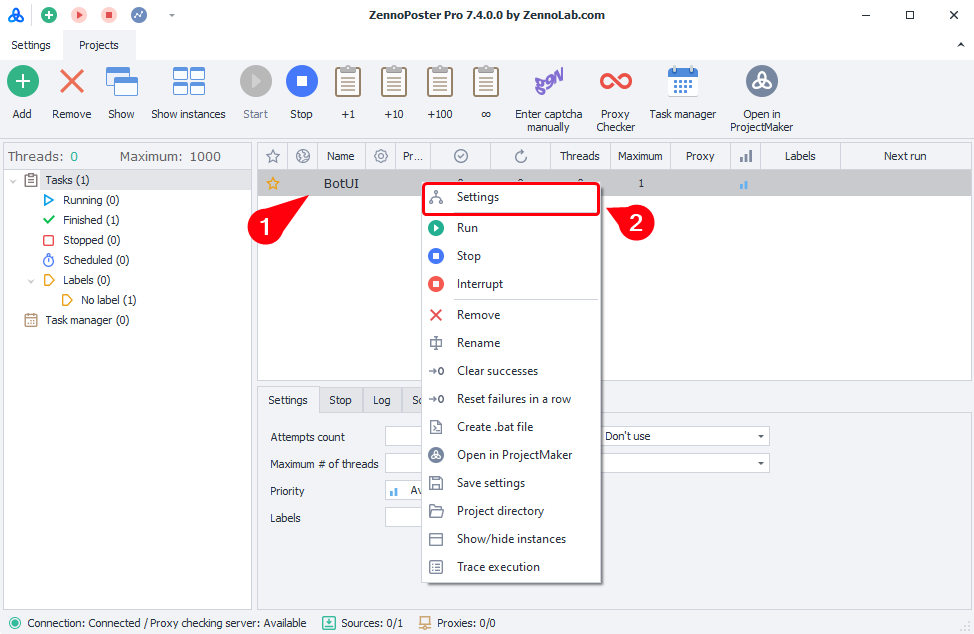 |
| :--: |
| Project input settings |

To open the project settings user interface, right-click the project and, in the context menu that appears, select "Settings".

| 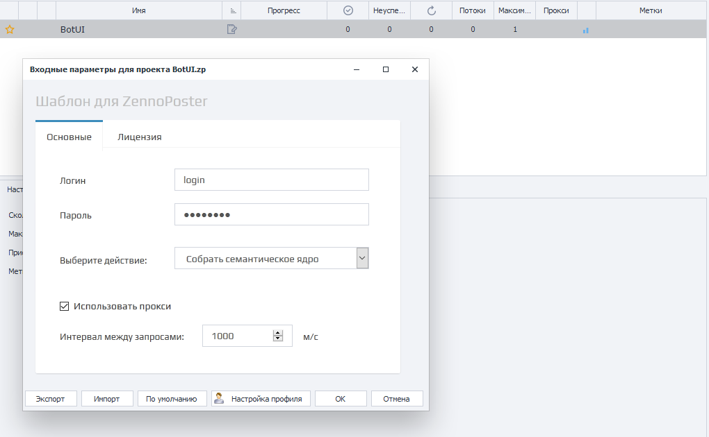 |
| :--: |
| Project input settings via bot interface |

Voilà! That's how easily and quickly you can create an attractive, intuitive, and informative interface for your project/plugin, which you can then share with other ZennoPoster users, and they will have no trouble using it.