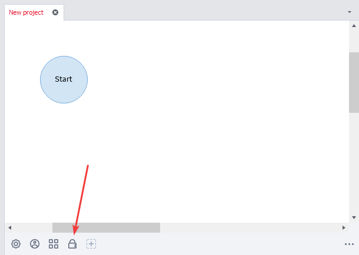
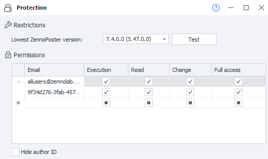
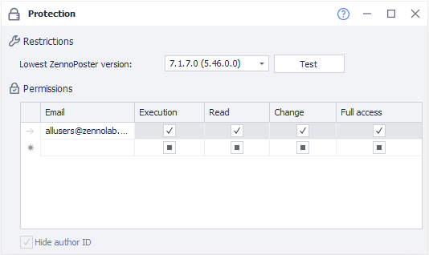

---
sidebar_position: 4
title: "Encryption"
description: ""
date: "2025-08-04"
converted: true
originalFile: "Шифрование.txt"
targetUrl: "https://zennolab.atlassian.net/wiki/spaces/RU/pages/534315498"
---
import DisclaimerNotice from '@site/src/components/DisclaimerNotice';

<DisclaimerNotice />

> 🔗 **[Original page](https://zennolab.atlassian.net/wiki/spaces/RU/pages/534315498)** — Source of this material

_______________________________________________  

## Description

Encryption allows you to protect the projects you’ve created from unexpected copying and editing.

## What is it used for?

- Protecting a project from being copied
- Transferring a template to another user so that only they have access to the project

## Where to find it

After you create a project, you'll see a padlock icon on the [❗→ static blocks panel](https://zennolab.atlassian.net/wiki/spaces/RU/pages/534053179 "https://zennolab.atlassian.net/wiki/spaces/RU/pages/534053179"); this is the encryption block.

## Field descriptions

### Minimum ZennoPoster version

In this dropdown list, you can select the minimum version required to run the template.

#### "Check" button

:::info Information
Added in ZennoPoster 7.2.1.0
:::

After clicking this button, a check will be run on the template to assess the minimum possible version it can run on.

### Permissions

#### Email

The field for entering an identifier; several formats are available:

- support@zennolab.com — the email linked to ZennoPoster
- e927aabf-5ee3-4d3d-9ba7-e0f70537b923@zenno.club or e927aabf-5ee3-4d3d-9ba7-e0f70537b923@zennolab.com—this can be obtained in your [Personal Account](https://userarea.zennolab.com/lk/userarea/Profile.aspx "https://userarea.zennolab.com/lk/userarea/Profile.aspx").
- allusers@zennolab.com — applies to any user.

#### Execute

Allows the user to only run the project

#### Read

Allows the user to view the project’s structure

#### Edit

Allows the user to edit the project

#### Full access

All of the above, plus the ability to grant permissions to other users.

### Hide Author ID

:::warning Attention
When this option is enabled, the minimum ZennoPoster version is automatically set to 7.1.7.0.
:::

If you're transferring a template to other users and don’t want them to know your internal ZennoLab system ID, enable the **"Hide Author ID"** option in the encryption block.

Here’s how the encryption block will look for other users:

### Hide instance from users

:::warning Attention
When this option is enabled, the minimum ZennoPoster version is automatically set to 7.7.2.0.
:::

If, when sharing a template with others, you don’t want the browser to be visible when running the project, enable the **"Hide instance from users"** option.

This option doesn’t affect the execution of the project; it just hides the browser display in ZennoPoster and ProjectMaker and applies to those template users who have only the *Execute* privilege. Hiding occurs in:

- Instance previews in ZennoPoster.
- Showing the instance via double-click in ZennoPoster.
- The browser window in ProjectMaker when executing the project as a plugin or subproject.

This does not apply to the [❗→ Wait for User Action](https://zennolab.atlassian.net/wiki/spaces/RU/pages/2110259201) action.

  

## More about permissions

**Execute, Read, Edit, Full access** — permissions are assigned according to a hierarchical system. When a higher-level permission is granted, the previous ones are automatically given as well. Conversely, if both **"Execute"** and **"Read"** are checked and you decide to remove **"Execute"**, then Read will be automatically deactivated too.

**📹 There was a video here**

  

## Example of use

Suppose you’ve created a project and want to give it to another user, but you only want them to be able to run the project, without access to view or edit the template.

To do this, just enter their email or ID from your [personal account](https://userarea.zennolab.com/ "https://userarea.zennolab.com/") and grant **"Execute"** permissions.