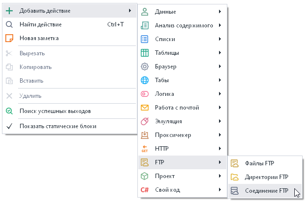
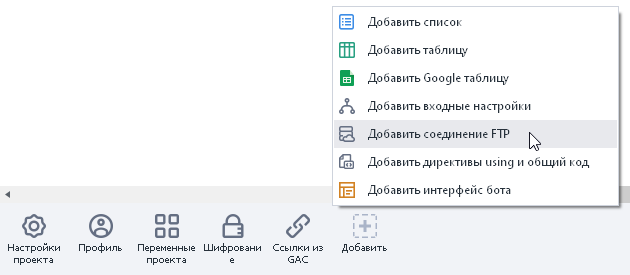
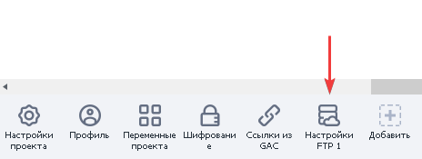
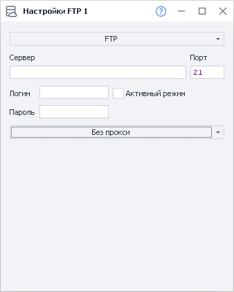
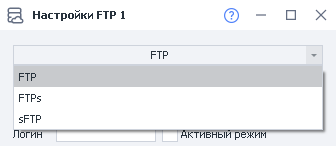
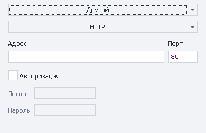

---
sidebar_position: 9
title: "FTP Settings"
description: ""
date: "2025-08-04"
converted: true
originalFile: "Настройки FTP.txt"
targetUrl: "https://zennolab.atlassian.net/wiki/spaces/RU/pages/534315484/FTP"
---
:::info **Please review the [*Terms of Use for materials on this resource*](../Disclaimer).**
:::

> 🔗 **[Original page](https://zennolab.atlassian.net/wiki/spaces/RU/pages/534315484/FTP)** — Source for this material

_______________________________________________  
# FTP Settings

## Description

ZennoPoster has built-in features for working with FTP resources. The program allows you to automatically upload files to an FTP server, create and delete directories, as well as perform other FTP operations. This can be useful, for example, if the project data files you are working with are stored on an FTP server.

## Creating an FTP Connection

You can create a new FTP connection from the context menu: **Add Action → FTP → FTP Connection**:

Or

Alternatively, use the [❗→ Smart Search](https://zennolab.atlassian.net/wiki/spaces/RU/pages/506200090/ProjectMaker+7#%D0%A3%D0%BC%D0%BD%D1%8B%D0%B9-%D0%BF%D0%BE%D0%B8%D1%81%D0%BA-%D0%B4%D0%B5%D0%B9%D1%81%D1%82%D0%B2%D0%B8%D0%B9 "https://zennolab.atlassian.net/wiki/spaces/RU/pages/506200090/ProjectMaker+7#%D0%A3%D0%BC%D0%BD%D1%8B%D0%B9-%D0%BF%D0%BE%D0%B8%D1%81%D0%BA-%D0%B4%D0%B5%D0%B9%D1%81%D1%82%D0%B2%D0%B8%D0%B9").

The newly created FTP connection will appear in the static blocks panel:

## FTP Connection Settings

### Main

- **Choose transfer protocol type** - FTP, FTPs or sFTP:
FTP (File Transfer Protocol) - a standard protocol for file transfers;
FTPs (File Transfer Protocol + SSL, or FTP/SSL) - a secure protocol for file transfers;
sFTP (SSH File Transfer Protocol) – a protocol for file operations over a reliable and secure connection.
- **Server** - the FTP server name (required field);
- **Port** - the FTP connection port (required field). The default port value is 21;
- **Login and Password** - credentials for authorization (optional). If these are not specified and the server supports unauthenticated connections, the connection will still be established;
- **Active mode** - select if you need to use active FTP mode;
- **Proxy mode** - you can choose between “No Proxy“, “Current Project Proxy“, “String in the format protocol://login:pass@ip:port“, or “Other“. In the “Other“ mode, you can enter a proxy in any format you prefer by filling in the required information—address, port, and authorization data—in the specified fields.

For more detailed information on working with FTP connections, see the articles [❗→ FTP Files](https://zennolab.atlassian.net/wiki/spaces/RU/pages/534315197/FTP "https://zennolab.atlassian.net/wiki/spaces/RU/pages/534315197/FTP") and [❗→ FTP Directories](https://zennolab.atlassian.net/wiki/spaces/RU/pages/534085901/FTP "https://zennolab.atlassian.net/wiki/spaces/RU/pages/534085901/FTP").