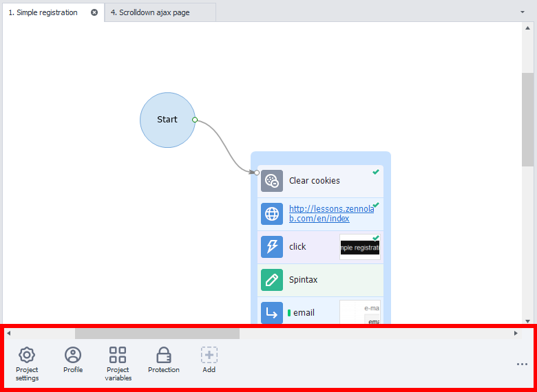
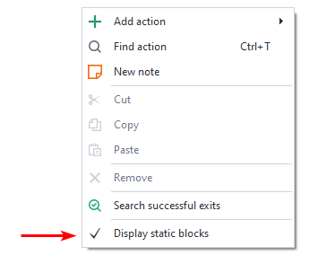
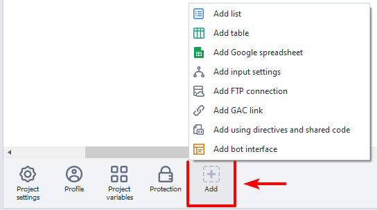
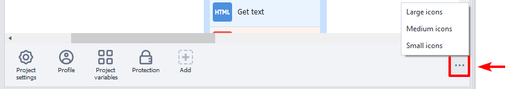
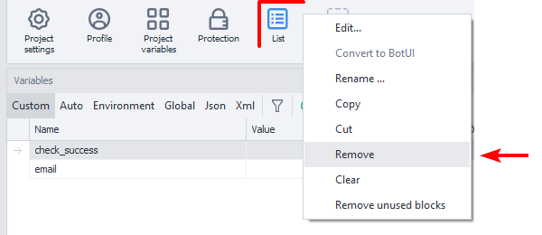

:::info **Please read the [*Material Usage Rules on this site*](../../../Disclaimer).**
:::

> 🔗 **[Original page](https://zennolab.atlassian.net/wiki/spaces/RU/pages/534315470)** — Source of this material

_______________________________________________  

### What Are Static Blocks

Each project has a special field at the bottom — the static blocks panel. It contains “static blocks” — these are elements of the project that belong to the entire project and are accessible from any part of it. Unlike actions (cubes), which are performed sequentially over time.

Each static block is responsible for one or more properties of the project — these might be project settings, profile settings within the project, encryption, as well as lists and tables with data.

When you create a project, it already comes with several required static blocks (they cannot be deleted).

### How to Show the Static Blocks Panel

:::warning Attention
If you don't see the static blocks panel, right-click the project and select “Show static blocks” from the context menu.
:::

### How to Add Static Blocks

Right-click the “Add” button, or use the context menu of the panel:

### How to Resize the Panel

Click the button on the right side of the panel:

### How to Delete a Static Block

Right-click the static block → Delete:

If the “Delete” option is inactive, it means you cannot delete this static block.