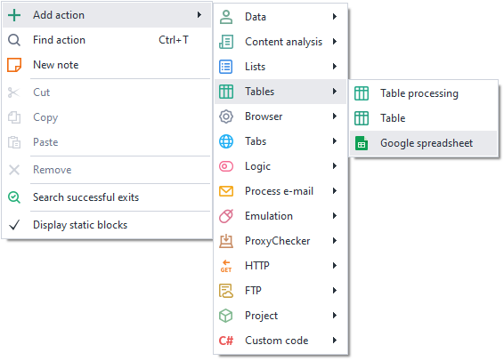
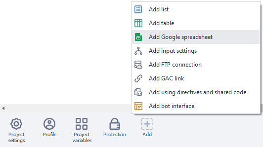
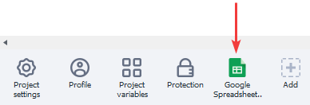
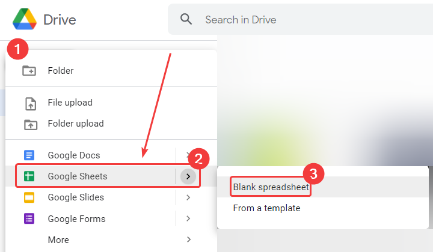
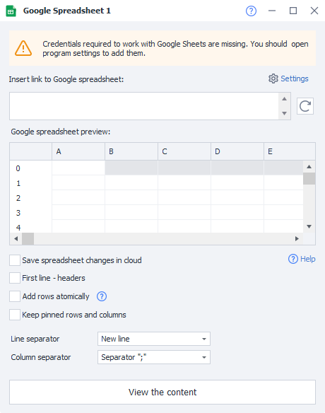
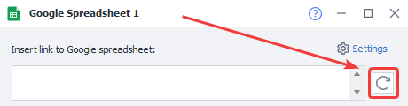
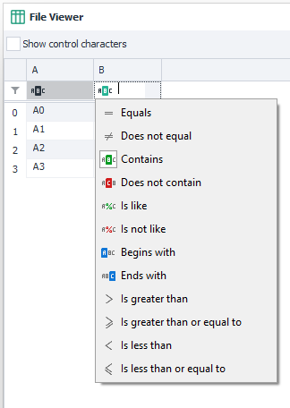
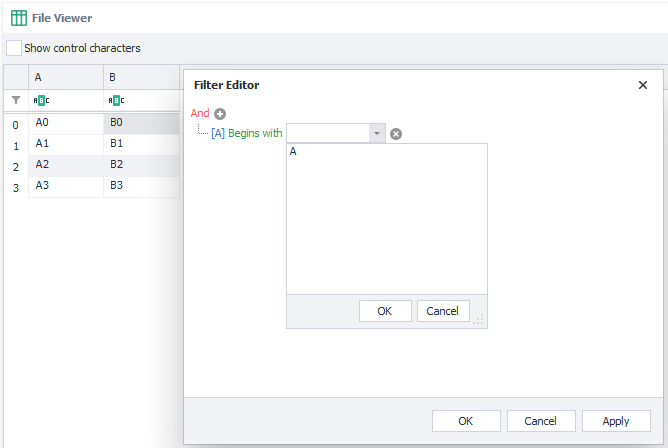

---
sidebar_position: 7
title: "Google Spreadsheet"
description: ""
date: "2025-08-04"
converted: true
originalFile: "Google таблица.txt"
targetUrl: "https://zennolab.atlassian.net/wiki/spaces/RU/pages/724566092/Google"
---
:::info **Please read the [*Material Usage Rules on this site*](../Disclaimer).**
:::

> 🔗 **[Original page](https://zennolab.atlassian.net/wiki/spaces/RU/pages/724566092/Google)** — Source of this material

_______________________________________________  

## Creating a Google Spreadsheet

### In ProjectMaker

You can create a new Google Spreadsheet:

- From the context menu **Add action → Tables → Google Spreadsheet**:

- Through the [❗→ static blocks panel](https://zennolab.atlassian.net/wiki/spaces/RU/pages/534053179 "https://zennolab.atlassian.net/wiki/spaces/RU/pages/534053179"):

- Or use the [❗→ smart search](https://zennolab.atlassian.net/wiki/spaces/RU/pages/506200090/ProjectMaker+7#%D0%A3%D0%BC%D0%BD%D1%8B%D0%B9-%D0%BF%D0%BE%D0%B8%D1%81%D0%BA-%D0%B4%D0%B5%D0%B9%D1%81%D1%82%D0%B2%D0%B8%D0%B9 "https://zennolab.atlassian.net/wiki/spaces/RU/pages/506200090/ProjectMaker+7#%D0%A3%D0%BC%D0%BD%D1%8B%D0%B9-%D0%BF%D0%BE%D0%B8%D1%81%D0%BA-%D0%B4%D0%B5%D0%B9%D1%81%D1%82%D0%B2%D0%B8%D0%B9").

The created spreadsheet will be shown in the static blocks panel:

### In the cloud

- Log into your Google account.
- Go to your [Google Drive](https://drive.google.com/drive/my-drive "https://drive.google.com/drive/my-drive") and in the upper left corner, select **New → Google Sheets → Blank spreadsheet**.

- You can enter any starting data or leave the spreadsheet empty.
- Wait for the spreadsheet to load, and then copy the URL from your browser's address bar. You will need this when linking the spreadsheet to ProjectMaker.

  

## Spreadsheet Settings

:::warning Attention
Before you start working with Google Sheets, you need to connect them to the program in Settings. You can read how to set up the connection in the article Setting up Google Sheets integration.
:::

### Paste the link to the Google Spreadsheet

Paste the link to the spreadsheet you want to work with into this input field.

### Reload Google Spreadsheet

This button lets you refresh the data in the spreadsheet.

:::note Note
This may be useful if changes have been made not through the program, but from a regular browser or another device.
:::

### Google Spreadsheet Preview

The data from the spreadsheet will be shown in this window.

:::warning Attention
Not all spreadsheet data may be displayed here, but only a part of it.
:::

### Save changes to the spreadsheet in the cloud

Should ZennoPoster save any changes it makes to the spreadsheet in the cloud?

### First row as headers

Use the first row of the spreadsheet as column headers

### Use atomic row addition

Enabling this setting can be helpful when several ZennoPoster instances are working with the same spreadsheet simultaneously. You can read more about atomic addition in the article [❗→ Multithreaded work with Google Sheets (Version 7.1.7.0 and above)](https://zennolab.atlassian.net/wiki/spaces/RU/pages/851673094 "https://zennolab.atlassian.net/wiki/spaces/RU/pages/851673094") 

### Remember frozen rows and columns

:::info Information
Added in ZennoPoster 7.6.0.0
:::

If your spreadsheet has frozen rows or columns and you want to preserve their frozen state, you need to enable this option.
In this case, an additional request will be sent, which will consume [❗→ quotas](https://zennolab.atlassian.net/wiki/spaces/RU/pages/1667727363/Google#%D0%9B%D0%B8%D0%BC%D0%B8%D1%82%D1%8B-%D0%B7%D0%B0%D0%BF%D1%80%D0%BE%D1%81%D0%BE%D0%B2-%D0%BA-API "https://zennolab.atlassian.net/wiki/spaces/RU/pages/1667727363/Google#%D0%9B%D0%B8%D0%BC%D0%B8%D1%82%D1%8B-%D0%B7%D0%B0%D0%BF%D1%80%D0%BE%D1%81%D0%BE%D0%B2-%D0%BA-API").

### Row separator

Indicates what will be used as the row separator in the spreadsheet. The separator can be “New line”, “Custom separator” or “Multiple separators”.

### Column separator

Indicates what will be used as the column separator in the spreadsheet. The separator can be the symbol “;”, the “Tab” character, any custom separator, or several separators.

### View contents

Allows you to view the full contents of the entire spreadsheet. In this section, you can also enable the display of control characters, set a filter to search for a specific row or cell, and use the filter constructor. 

  

## How Google Sheets Work in the Program

- Every time a project starts, the program creates a virtual copy of the Google Spreadsheet.
- This virtual copy contains all the data from the Google Spreadsheet.
- While the project is running, the program works with the virtual copy.
- If **Save changes to the spreadsheet in the cloud** is checked, the program will periodically write the data from the virtual copy to your actual Google Spreadsheet.

:::warning Attention
Important: Data in the Google Spreadsheet doesn't appear instantly; it can take from 10 to 60 seconds.
:::

  

## Useful Links:

- [❗→ Google Sheets Settings](https://zennolab.atlassian.net/wiki/spaces/RU/pages/735576090/Google+PM "https://zennolab.atlassian.net/wiki/spaces/RU/pages/735576090/Google+PM")
- [❗→ Setting up Google Sheets integration](https://zennolab.atlassian.net/wiki/spaces/RU/pages/1667727363 "https://zennolab.atlassian.net/wiki/spaces/RU/pages/1667727363")
- [❗→ Multithreaded work with Google Sheets (Version 7.1.7.0 and above)](https://zennolab.atlassian.net/wiki/spaces/RU/pages/851673094 "https://zennolab.atlassian.net/wiki/spaces/RU/pages/851673094")
- [❗→ Google Sheets Operations](https://zennolab.atlassian.net/wiki/spaces/RU/pages/509411347 "https://zennolab.atlassian.net/wiki/spaces/RU/pages/509411347")