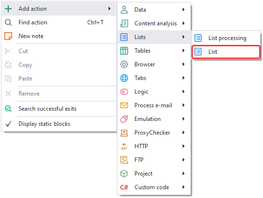
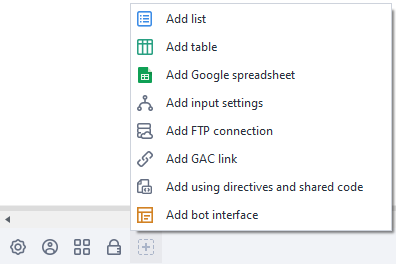
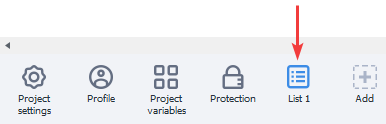
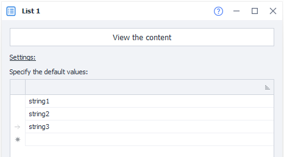
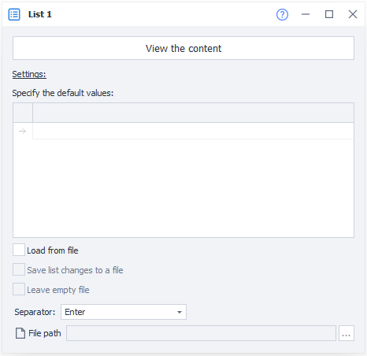
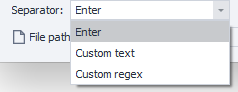
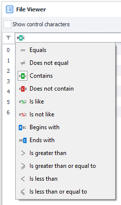
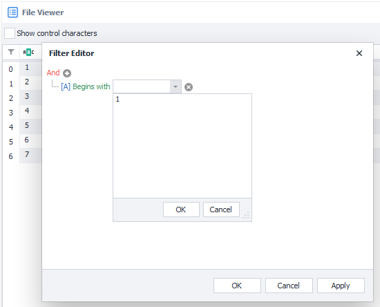

---
sidebar_position: 5
title: "List"
description: ""
date: "2025-08-04"
converted: true
originalFile: "Список.txt"
targetUrl: "https://zennolab.atlassian.net/wiki/spaces/RU/pages/534053375"
---
:::info **Please read the [*Terms of Use for the materials on this resource*](../Disclaimer).**
:::

> 🔗 **[Original page](https://zennolab.atlassian.net/wiki/spaces/RU/pages/534053375)** — Source for this material

_______________________________________________  

## Description

Lists are an ordered set of strings. They allow you to retrieve data from a text document, save data to a file, or work with a set of strings in memory without a file. Detailed work with lists is described in the article [❗→ List operations](https://zennolab.atlassian.net/wiki/spaces/RU/pages/534085798 "https://zennolab.atlassian.net/wiki/spaces/RU/pages/534085798").

## Creating a list 

You can create a new list from the context menu Add action → Lists → List:

Or via [❗→ Static Block Panel](https://zennolab.atlassian.net/wiki/spaces/RU/pages/534053179 "https://zennolab.atlassian.net/wiki/spaces/RU/pages/534053179") (click the “+” icon or right-click in the area)

Or use the [❗→ smart search](https://zennolab.atlassian.net/wiki/spaces/RU/pages/506200090/ProjectMaker+7#%D0%A3%D0%BC%D0%BD%D1%8B%D0%B9-%D0%BF%D0%BE%D0%B8%D1%81%D0%BA-%D0%B4%D0%B5%D0%B9%D1%81%D1%82%D0%B2%D0%B8%D0%B9 "https://zennolab.atlassian.net/wiki/spaces/RU/pages/506200090/ProjectMaker+7#%D0%A3%D0%BC%D0%BD%D1%8B%D0%B9-%D0%BF%D0%BE%D0%B8%D1%81%D0%BA-%D0%B4%D0%B5%D0%B9%D1%81%D1%82%D0%B2%D0%B8%D0%B9").

The newly created list will show up in the static blocks panel:

When you open the list in the static blocks panel, you'll see the list settings as well as a preview of the list's contents. If the list is linked to a file, the contents of that file will be displayed. If there's no file link, you can set default values for the list.

## List settings

### Main

#### Load from file

Use data for the list from a .txt text file;

:::note Note
If you do NOT load the list from a file, each thread will have its own independent copy of the list.
:::

#### Save list changes to file

The result of working with the list will be automatically saved to the linked text file;

:::note Note
If you load data from a file but don't enable the Save list changes to file setting, each thread will have its own local copy of the list based on the specified file. Any changes to the list within a thread will not affect the linked file. But if the Save list changes to file option is enabled, then all threads will work with one copy of the list, and all changes will be saved to the attached file.
:::

#### Keep file empty

If all the data in the list runs out, should an empty file be left or removed.

#### Separator

Specifies what should be used to separate the lines in the list. The separator can be “Enter,“ any custom text, or a regular expression.

#### File path

If you choose to load the list from a file, you need to specify the path to the .txt text document. The data will be loaded into the list when the project starts.

:::note Note
If the file path is not known in advance and will only be determined while the project is running, you can use the list action and its Bind to file function.
:::

### View contents

Allows you to view the entire contents of the list. In this section, you can enable display of control characters, set a filter to search for the desired line, and use the filter constructor.

Detailed work with lists is described in the article [❗→ List operations](https://zennolab.atlassian.net/wiki/spaces/RU/pages/534085798 "https://zennolab.atlassian.net/wiki/spaces/RU/pages/534085798").