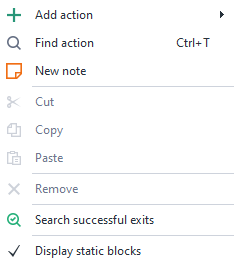
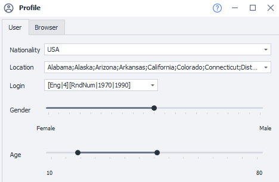
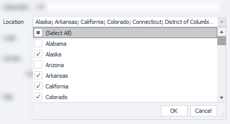
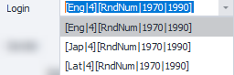
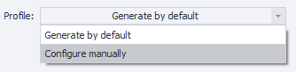
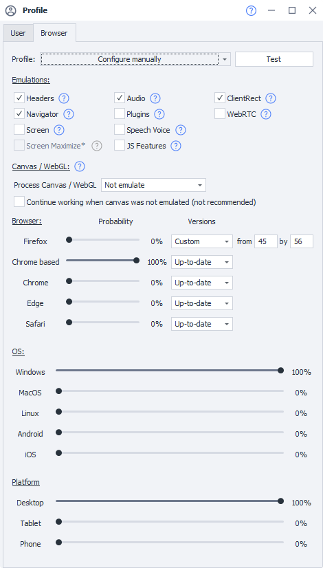
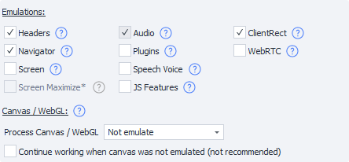
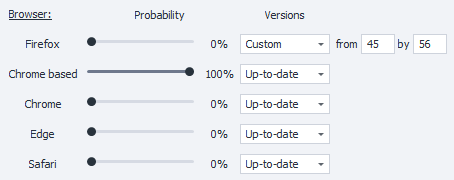
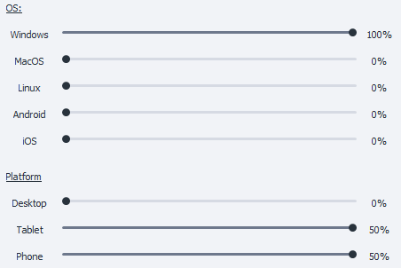

---
sidebar_position: 3
title: "Profile"
description: ""
date: "2025-08-04"
converted: true
originalFile: "Профиль.txt"
targetUrl: "https://zennolab.atlassian.net/wiki/spaces/RU/pages/483426308"
---
:::info **Please read the [*Guidelines for using materials on this resource*](../Disclaimer).**
:::

> 🔗 **[Original page](https://zennolab.atlassian.net/wiki/spaces/RU/pages/483426308)** — Source of this material

_______________________________________________  

## Description

A profile is a virtual identity, with its data generated each time a new template is launched (in ProjectMaker, generation happens when you click the *From Beginning* button; in ZennoPoster, it happens every time a project runs). You can get detailed profile data in the [❗→ Profile window](https://zennolab.atlassian.net/wiki/spaces/RU/pages/735903758 "https://zennolab.atlassian.net/wiki/spaces/RU/pages/735903758")

When running a project, the profile will generate all the necessary data used for registration, including browser information (language, screen size, User Agent, and dozens of other things).

So, a profile is needed for:

- Quick generation of identity data used for registration.
- Correct generation of browser data that will be visible to services.
- Saving and loading Cookies (and all other data) used during registration. Sometimes you need to access a site a few hours after registering, as if from the same browser and user.
- Centralized, convenient access to all identity and browser data when setting up a project.

We recommend organizing your project logic in a way that avoids unnecessary internal loops and reassigning individual profile settings during a single project run. Meaning: you start the project, a new profile gets generated, the necessary actions are performed on the site, and the project ends. There's no need to overload your projects with internal loops and try, for example, to register several accounts by manually changing something in the profile. It's more logical to complete the project and run it a few more times.

  

## Profile generation settings for the current project

To open the profile generation settings, click on the *Profile icon in the [❗→ *Static Blocks panel](https://zennolab.atlassian.net/wiki/spaces/RU/pages/534053179 "https://zennolab.atlassian.net/wiki/spaces/RU/pages/534053179") (located below the action canvas):

I can't see the Static Blocks Panel. What should I do?

You can enable/disable this area by right-clicking anywhere in the empty area of the action canvas and choosing the appropriate setting from the context menu:

A settings window will open with two tabs: *User* and *Browser.*

  

### User Tab

#### Nationality

:::info Information
You can set the default nationality in Settings, on the Profile tab. You can also set the email and password for it there.
:::

Currently (program version 7.1.6.0) there are 6 nationalities available:

1. Russia
2. USA
3. Germany
4. France
5. Spain
6. United Kingdom

#### Location

A dropdown list where you can select multiple values. The contents of this list depend on the selected country:

- For Russia: regions, districts, republics, and some large cities (Moscow, Sochi, etc.)
- For USA: states
- For Germany: lands
- For France: regions
- For Spain: autonomous communities
- For United Kingdom: countries that make up the UK

#### Login

When generating the login, a formula consisting of several parts is used. By default, several types of formulas are already saved in the settings. You can enter your own here.

Detailed description of formulas

*Currently supported languages: Eng - English, Lat - Latin, Jap - Japanese.*

So, if you write `[Eng|4]`, a nickname with 4 English syllables will be generated, with the likelihood of the syllables following each other close to real words. By playing around with the formula, you can create more complex constructions:

`[RndSym|[RndNum|0|4]|0123456789][Lat|3][RndSym|[RndNum|0|2]|-][Jap|1][RndText|2|D]`

where `[RndSym|[RndNum|0|4]|0123456789]` - at the start of the nickname, from 0 to 3 digits;

`[Lat|3]` - 3 Latin syllables;

`[RndSym|[RndNum|0|2]|-]` - a dash may appear;

`[Jap|1]` - one Japanese syllable;

`[RndText|2|D]`
 - then 2 random letters or digits;

As a result, nicknames like:

> 053bomenca-iem  
> 7lialeme-nozr  
> 46atbemig-poex  
> simpvido-se8f  
> 3afosuxhif6  
> frigulimdeif  
> misssefu-yucn  
> 5grasacin-maew  
> trodalcelfu88  
> 6nasercia-risc  

will be generated.

#### Gender

With this slider, you set the probability of generating a certain gender.

#### Age

With this slider, you set the age range from which the profile age will be generated.

### Browser Tab

By default, the settings are hidden; to show them, select "Configure manually" from the dropdown list

After activating the settings, you will see this window:

#### Check

At the very end, after you've set all the parameters as needed, you should click this button to check that the chosen settings are correct and compatible with each other.

  

#### Emulations

With these settings, you can enable or disable blocks that make up the [browser fingerprint](https://ru.wikipedia.org/wiki/%D0%A6%D0%B8%D1%84%D1%80%D0%BE%D0%B2%D0%BE%D0%B9_%D0%BE%D1%82%D0%BF%D0%B5%D1%87%D0%B0%D1%82%D0%BE%D0%BA_%D1%83%D1%81%D1%82%D1%80%D0%BE%D0%B9%D1%81%D1%82%D0%B2%D0%B0 "https://ru.wikipedia.org/wiki/%D0%A6%D0%B8%D1%84%D1%80%D0%BE%D0%B2%D0%BE%D0%B9_%D0%BE%D1%82%D0%BF%D0%B5%D1%87%D0%B0%D1%82%D0%BE%D0%BA_%D1%83%D1%81%D1%82%D1%80%D0%BE%D0%B9%D1%81%D1%82%D0%B2%D0%B0"). When you click on the question mark next to any setting, you'll be redirected to this page with the relevant setting.

##### Headers

Every browser sends its own specific [headers](https://developer.mozilla.org/en-US/docs/Web/HTTP/Headers "https://developer.mozilla.org/en-US/docs/Web/HTTP/Headers"), such as Accept, Accept-Encoding, Accept-Charset, Accept-Language. ZennoPoster allows you to change these headers via profile actions or C# code. A new profile guarantees that the [Headers](https://developer.mozilla.org/en-US/docs/Web/HTTP/Headers "https://developer.mozilla.org/en-US/docs/Web/HTTP/Headers") block matches correctly with the [Navigator](https://developer.mozilla.org/ru/docs/Web/API/Navigator "https://developer.mozilla.org/ru/docs/Web/API/Navigator") block.

##### Navigator

The Navigator block contains a fully correct set of fields and values. By enabling the [Navigator](https://developer.mozilla.org/ru/docs/Web/API/Navigator "https://developer.mozilla.org/ru/docs/Web/API/Navigator") emulation, not only will field values change, but their visibility will too. What previously required large code snippets is now handled automatically.

##### Screen

Screen resolution. [Screen](https://developer.mozilla.org/ru/docs/Web/API/Screen "https://developer.mozilla.org/ru/docs/Web/API/Screen") object parameters, which you could previously emulate via profile actions or C# code, are now set automatically. They also match the current [Navigator](https://developer.mozilla.org/ru/docs/Web/API/Navigator "https://developer.mozilla.org/ru/docs/Web/API/Navigator") and other blocks.

##### Screen Maximize

:::info Information
Available in ZennoPoster starting from version 7.3.0.0
:::

Sets the window size to match the generated Screen size.

:::note Note
To activate this setting, you first need to enable Screen.
:::

:::warning Warning
Using this may cause layout issues.
:::

Equivalent to the C# method call `SetWindowSize`.

##### Plugins

Every browser can have a set of plugins, which varies based on browser type, OS, and platform. We provide you with a unique set of plugins. You no longer need to think about which plugins to install—they will be set up automatically.

##### Audio

ZennoPoster can emulate the context and some parameters of the browser's audio environment. When you enable the [Audio](https://developer.mozilla.org/ru/docs/Web/API/AudioContext "https://developer.mozilla.org/ru/docs/Web/API/AudioContext") block, the context and parameters are automatically emulated.

##### Speech Voice

:::info Information
Available in ZennoPoster starting from version 7.3.0.0
:::

[Web Speech API](https://developer.mozilla.org/ru/docs/Web/API/Web_Speech_API "https://developer.mozilla.org/ru/docs/Web/API/Web_Speech_API") allows you to interact with speech interfaces for recognition and synthesis. Speech Voice is a set of voice presets used to generate audio representations of information.

##### Canvas / WebGL

What are Canvas and WebGL?

Canvas is an HTML5 element designed for creating graphics on web pages.

WebGL is an API for rendering 3D graphics in the browser. Both WebGL and Canvas can be used for browser fingerprinting. There are several ways to get fingerprints, and one involves the WebGL Image method.

Fingerprinting works roughly like this: a hidden image is drawn on the site page, from which a hash is then generated. The results differ across devices, as they depend on the hardware, drivers, and browser combination. This difference allows tracking of users.

Up to version 7.7.7.0

[Canvas](https://developer.mozilla.org/ru/docs/Web/API/Canvas_API "https://developer.mozilla.org/ru/docs/Web/API/Canvas_API") has several possible contexts, [WebGL](https://developer.mozilla.org/en-US/docs/Web/API/WebGL_API "https://developer.mozilla.org/en-US/docs/Web/API/WebGL_API") has a huge number of parameters and extensions. All of this can be emulated in ZennoPoster. When the Canvas / WebGL block is enabled, all parameters and contexts are automatically emulated.

In version 7.7.0.0, Canvas/WebGL emulation was significantly improved!

Now there are three modes:

- *No emulation* - the same browser fingerprint will be used for all created profiles.
- *Add noise* - when this setting is enabled, the fingerprint will be new for each profile.
The downside of this mode is that you'll always get a 100% unique fingerprint, which isn't very realistic, since similar fingerprints are rare but do happen for regular browsers (for a thousand users, about 5 may have the same fingerprint—just an example, it could be more or less in reality).
For many sites, this mode will be enough.
- *Super emulation* - the fingerprint generated in this mode won't be 100% unique. This lets you blend in with the crowd, since there are lots of identical device copies worldwide.  
**WARNING!** *The "Super emulation" mode only works on the Chromium engine.*

:::warning Warning
To use WebGL in the browser, you need to enable the setting in "Instance" > "Use GPU for rendering acceleration".
:::

**Continue running if Canvas unavailable (**not recommended**)** - if this setting is enabled and Canvas couldn't be generated, the project will continue. If it's disabled, the template will stop with an error if Canvas couldn't be generated.

##### JS Features

Many advanced techniques can be used to fingerprint your browser. For example, calling the toString() function on any JS object or function can reveal a lot about your browser. The JS Features block is meant to protect against such identification techniques.

##### ClientRect

Every device is unique, and this shows up in tiny details, like the sizes of elements when different styles are applied. Enabling the ClientRect block will protect your browser from this type of fingerprinting.

##### WebRTC

All devices—cameras, headphones, microphones—can be visible to your browser via [WebRTC](https://developer.mozilla.org/ru/docs/Web/API/WebRTC_API "https://developer.mozilla.org/ru/docs/Web/API/WebRTC_API"). Your device list is also a reliable browser fingerprint. The WebRTC block provides you with a unique set of devices for the chosen platform, OS, and browser.

* * *

#### Browser

These sliders let you set the probability of generating specific browsers.

:::warning Warning
This setting generates a value for the User-Agent string (the string sent with requests that contains info about the browser, OS and its bitness, and other details). Don't confuse this with the browser type used for the current project, which can be changed in the Project settings.
:::

* * *

#### Operating System and Platform

With these settings, you can adjust which OS and platforms are generated (and with what probability).

## What is this used for?

- Registering on sites, forums, blogs, social networks, and other places

 - thanks to the *Profile* feature in ProjectMaker, you don't have to worry about where to get names, surnames, zip codes, cities, logins, or how to generate User-Agents and other parameters. All of this is already built into the program. You can focus on solving more important tasks.
- With the [❗→ *Profile actions*](https://zennolab.atlassian.net/wiki/spaces/RU/pages/486539291 "https://zennolab.atlassian.net/wiki/spaces/RU/pages/486539291") action, you can reassign some profile fields. This action also lets you save and load profiles, which can be useful so you don't have to log in every time you visit a site: on your first visit, you log in and work with the site, then save the profile. Next time, you load the previously saved profile and you're already authorized, so you don't need to enter your login info (this works because the browser's cookies are saved in the profile).

* * *

## Useful links

- [❗→ Profile window](https://zennolab.atlassian.net/wiki/spaces/RU/pages/735903758 "https://zennolab.atlassian.net/wiki/spaces/RU/pages/735903758")
- [❗→ Profile actions](https://zennolab.atlassian.net/wiki/spaces/RU/pages/486539291 "https://zennolab.atlassian.net/wiki/spaces/RU/pages/486539291")
- [❗→ Profile (PM)](https://zennolab.atlassian.net/wiki/spaces/RU/pages/735608848 "https://zennolab.atlassian.net/wiki/spaces/RU/pages/735608848")