---
sidebar_position: 8
title: "Project Input Settings"
description: ""
date: "2025-08-04"
converted: true
originalFile: "Входные настройки проекта.txt"
targetUrl: "https://zennolab.atlassian.net/wiki/spaces/RU/pages/534020594"
---
import DisclaimerNotice from '@site/src/components/DisclaimerNotice';

<DisclaimerNotice />

> 🔗 **[Original page](https://zennolab.atlassian.net/wiki/spaces/RU/pages/534020594)** — Source of this material

_______________________________________________  

## Description

With input parameters, you can provide values your project needs
for correct template launch in [❗→ ZennoPoster](https://zennolab.atlassian.net/wiki/spaces/RU/pages/475562059 "https://zennolab.atlassian.net/wiki/spaces/RU/pages/475562059") or [❗→ ZennoBox](https://zennolab.atlassian.net/wiki/spaces/RU/pages/495386651 "https://zennolab.atlassian.net/wiki/spaces/RU/pages/495386651").

:::warning Attention
Input settings are only read when the thread starts! Changing input settings during project execution will not affect it at all until the next run begins.
:::

  

## Add "Input Settings" to Your Project

To do this, click "***Add***" on the [❗→ Static Blocks Panel](https://zennolab.atlassian.net/wiki/spaces/RU/pages/534053179 "https://zennolab.atlassian.net/wiki/spaces/RU/pages/534053179") in the [❗→ ProjectMaker Editor](https://zennolab.atlassian.net/wiki/spaces/RU/pages/534052914 "https://zennolab.atlassian.net/wiki/spaces/RU/pages/534052914"), and in the context menu that appears, select "***Add Input Settings***", or right-click in any area at the bottom to open the context menu.

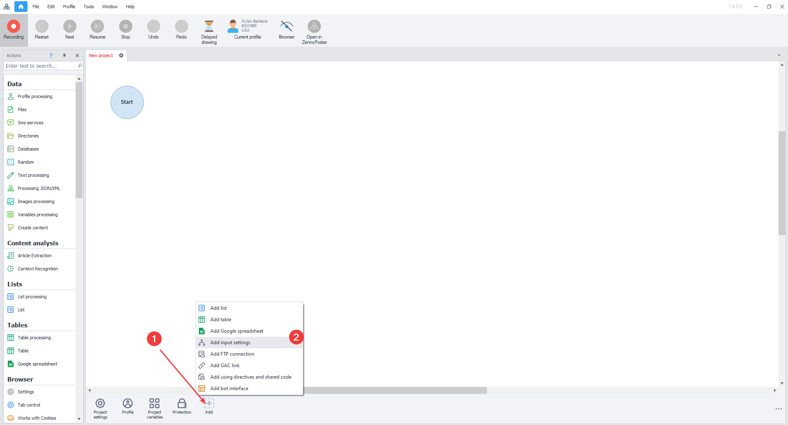

You'll see a corresponding icon on the panel, which you can open by double-clicking.

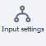

:::info Info
Please note that this block cannot be present in your project at the same time as the "Bot Interface" block. When you add "Input Settings", the "BotUI" interface block is removed! The same happens in reverse. Be careful and make sure to save your interface input settings in advance!
:::

  

## Editing the Input Parameters Form

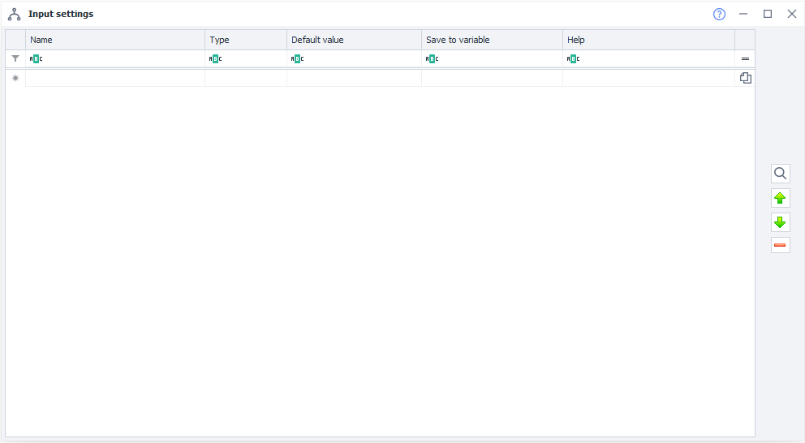

### Name

The setting will be displayed to users with this name.

### Type

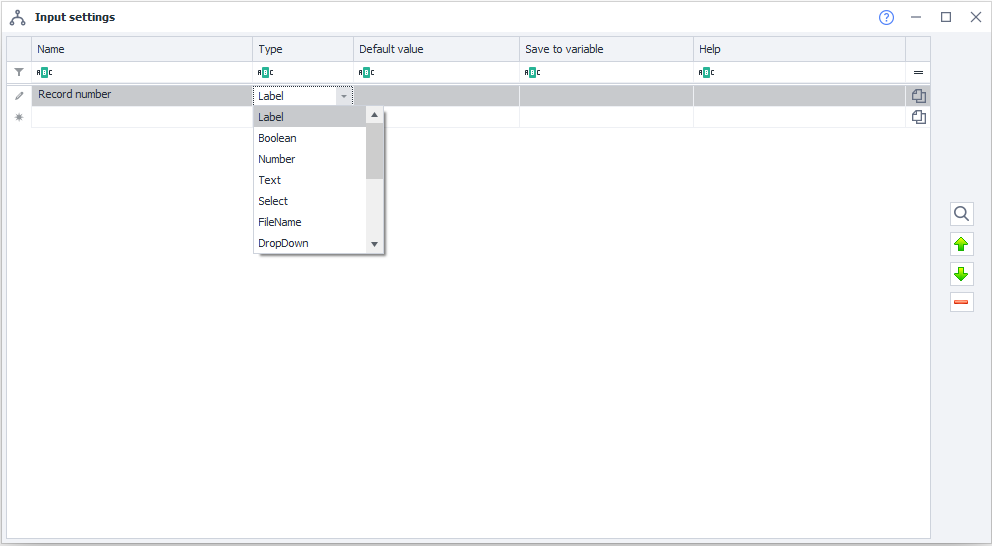

Input settings support different data types. The chosen type determines what data the user can enter and how the setting will appear to them.

Each type is described in detail below, along with a screenshot of how it will look to users.

### Default Value

The initial value of the parameter, which will be in the [❗→ project variable](https://zennolab.atlassian.net/wiki/spaces/RU/pages/735608872 "https://zennolab.atlassian.net/wiki/spaces/RU/pages/735608872") when the template starts, in case the user ignores this parameter.

### Save to Variable

The name of the project variable where the value entered by the user in the form will be stored.

### Help

A helpful explanation for the field, shown as a tooltip.

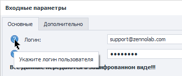

### Preview

At any time while editing settings, you can see how they will be displayed to the user. To do this, click the button with the magnifying glass icon on the right in the window.

Example

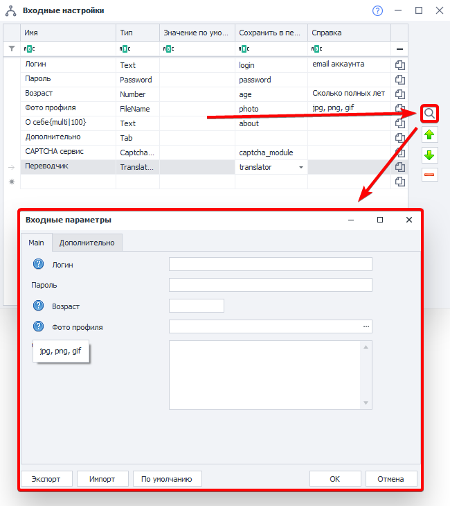

#### Export

Allows you to save the current settings to a file.

#### Import

Allows you to load settings from a file that was saved using the "Export" button.

#### Default

Resets the settings to their default values.

### Moving Settings Up and Down

To move a setting higher or lower in the list, select it and use the "up" and "down" buttons on the right.

Example

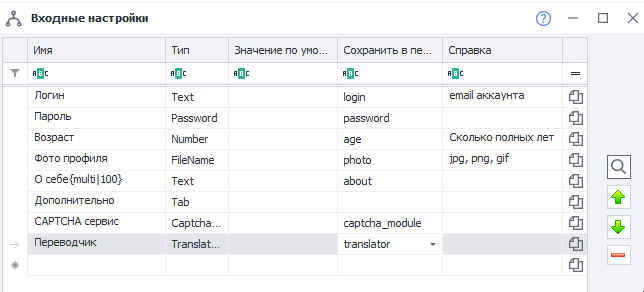

### Deleting a Setting

To delete a setting, select it and press the "Delete" button on the right side of the window.

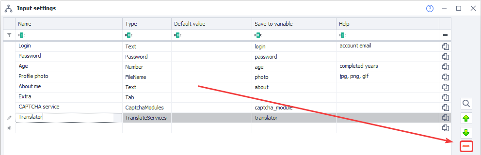

### Copy Macro of Variable to Clipboard

To copy the variable's macro to the clipboard, click the corresponding button next to the desired setting.

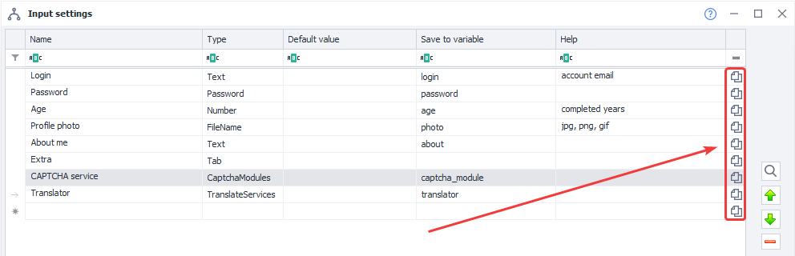

## Available Parameter Types

#### Label

A heading. Can be used to visually separate logical sections.

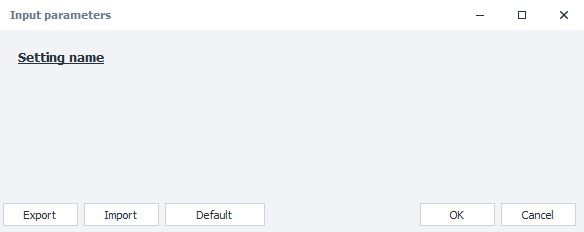

#### Boolean

Checkbox. Can be True or False.

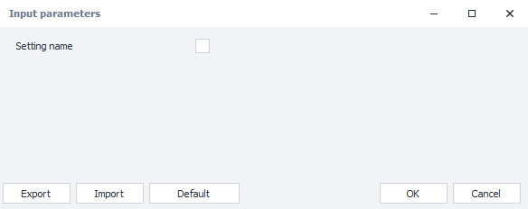

#### Number

A field where you can enter an integer.

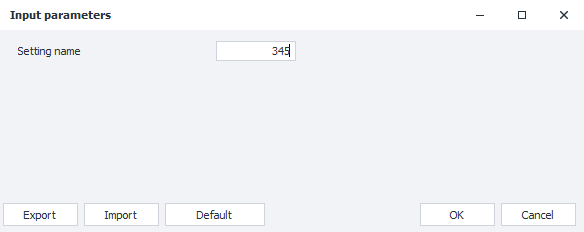

#### Text

Text field. Can be single-line (by default) or multi-line. To insert a multi-line text box, add extra options to the parameter name in the format: `{multi|height}`. For example, if you need a multi-line "Post" field with 100px height, specify the parameter name as: `Post {multi|100}`.

##### **Single-line text**

Editor

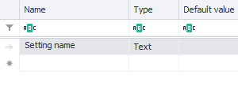

Final view

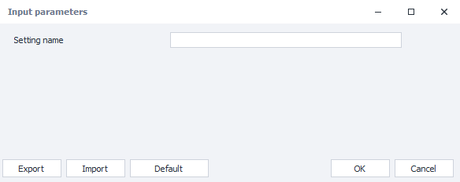

##### **Multi-line text**

Editor

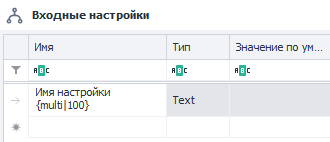

Final view

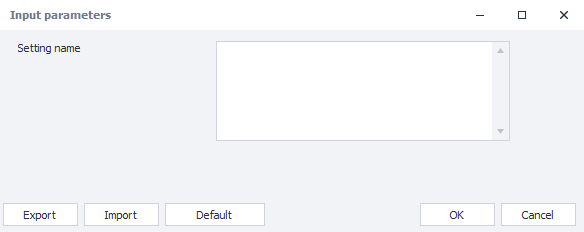

#### Select

Radio button group, allowing selection among multiple options. You need to specify all possible options in the parameter name, for example: `{HTTP|SOCKS4|SOCKS5}`.

Editor

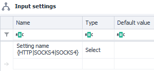

Final view

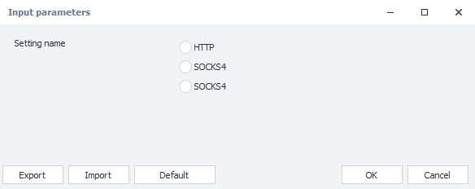

#### FileName

An input field for specifying the path to a file or folder in the file system. You can enter the path manually or choose the file/folder via a file dialog by clicking the […] button.

You can change the type of dialog window that opens when clicking […]:

##### **Open File**

The standard behavior of this field. It opens a dialog to select an existing file. This is handy when you need to select a file to read data from.

| ![Settings editor window (1), how the user sees the setting (2), and the dialog box that opens when you click […] in Windows 10 (3)](./assets/Project_Input_Settings/Project_Input_Settings_pic19.png) |
| :--: |
| Settings editor window (1), how the user sees the setting (2), and the dialog box that opens when you click […] in Windows 10 (3) |

##### **Save File**

To call a save file dialog when you click […], add the construction `{save}` to the setting's name.

This dialog is handy when you need to specify a file to save the results to.

| ![Settings editor window (1), how the user sees the setting (2), and the dialog box that opens when you click […] in Windows 10 (3)](./assets/Project_Input_Settings/Project_Input_Settings_pic20.png) |
| :--: |
| Settings editor window (1), how the user sees the setting (2), and the dialog box that opens when you click […] in Windows 10 (3) |

:::note Note
You can specify a non-existent file. When using the "Open File" dialog, the file you specify must already exist.
:::

##### **Folder Path**

To specify a folder path, add `{folder}` to the parameter name.

| ![Settings editor window (1), how the user sees the setting (2), and the dialog box that opens when you click […] in Windows 10 (3)](./assets/Project_Input_Settings/Project_Input_Settings_pic21.png) |
| :--: |
| Settings editor window (1), how the user sees the setting (2), and the dialog box that opens when you click […] in Windows 10 (3) |

#### Dropdown

A dropdown list for choosing a value.
There are 2 ways to configure DropDown.

##### **Display Items “As Is”**

Options in the dropdown list will appear to the user exactly as you set them up in the settings editor.

The syntax is: `Setting Name {Option1|Option2|Option3}`, so the default value should be one of these options.

| 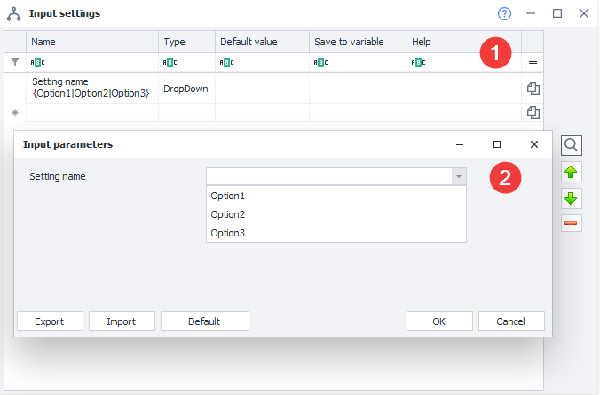 |
| :--: |
| Settings editor window (1), how the user sees the setting (2) |

##### **Named Items** 

Syntax: `Setting Name {Option1:Value1|Option2:Value2|Option3:Value3}`. The user will see the names (`Option1`, `Option2`, `Option3`), but the template will get the value (`Value1`, `Value2`, `Value3`).

| 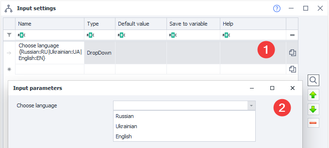 |
| :--: |
| Settings editor window (1), how the user sees the setting (2). The variable will contain RU, EN, or UA. |

#### DropDownMultiSelect

A dropdown list allowing users to select multiple values by checking checkboxes. In the default value field, you can specify multiple values separated by a comma.

Syntax is the same as the DropDown type — `Setting Name {Option1|Option2|Option3}`
(only the "As Is" option; named values are not supported). If several options are selected, they will be saved to the variable separated by commas.

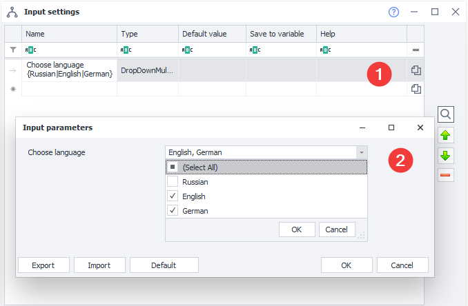

#### CaptchaModules

Choose a service for [❗→ captcha recognition](https://zennolab.atlassian.net/wiki/spaces/RU/pages/534053026 "https://zennolab.atlassian.net/wiki/spaces/RU/pages/534053026") from those available in ZennoPoster.

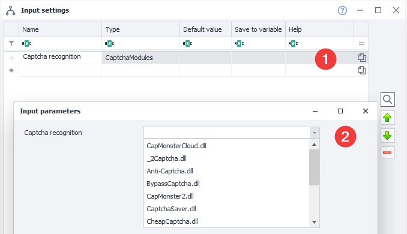

#### SmsServices

Choose a service for [❗→ receiving SMS](https://zennolab.atlassian.net/wiki/spaces/RU/pages/486539308/SMS "https://zennolab.atlassian.net/wiki/spaces/RU/pages/486539308/SMS") from those available in ZennoPoster.

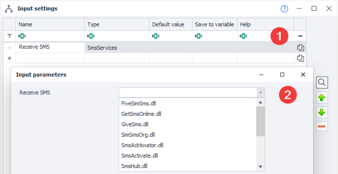

#### TranslateServices

Choose a service for [❗→ text translation](https://zennolab.atlassian.net/wiki/spaces/RU/pages/808747136/ZennoPoster "https://zennolab.atlassian.net/wiki/spaces/RU/pages/808747136/ZennoPoster") from those available in ZennoPoster.

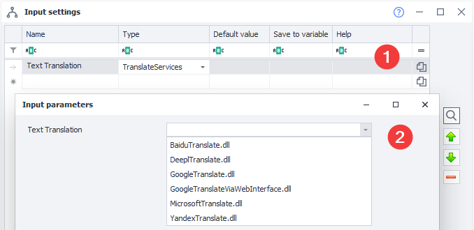

#### Tab

Add another tab to the settings window. For example, you can separate "Basic" and "Advanced Settings" into different tabs.

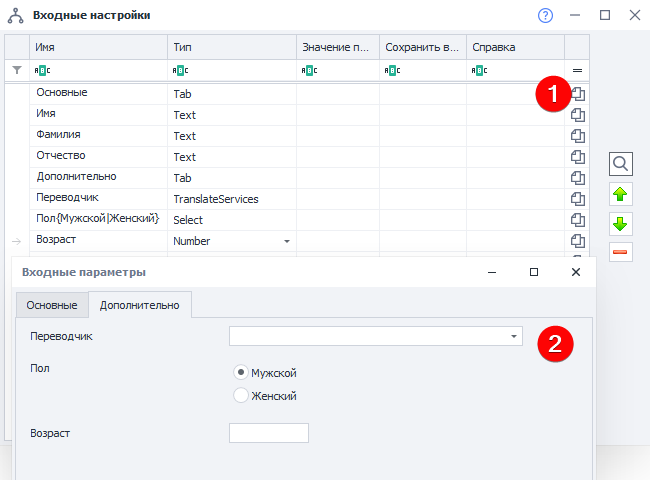

#### Comment

A field with a comment or description, letting you insert text across the entire width of the settings window. Can be used as a description for other settings.

##### **Formatting**

The value displayed in the *Comment type can be slightly customized. Supported tags:

| **Description** | **Syntax** |
| --- | --- |
| Bold text | `<b>Text</b>` |
| Text color | `<color=red>Red font color</color>` `<color=#00ff00>Green font color</color>`|
| Text size | `<size=6>Text size</size>` |

Sample formatted text

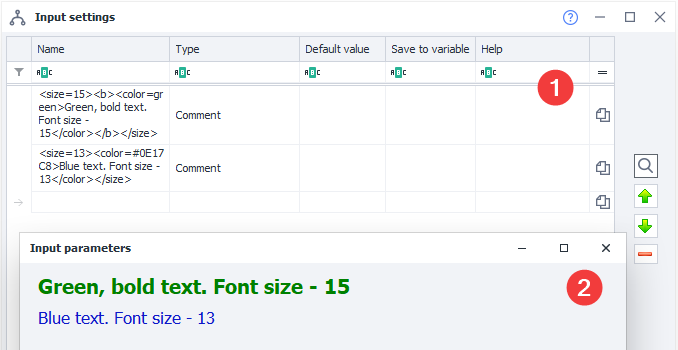

The first line is `<size=15><b><color=green>Green, bold text. Font size - 15</color></b></size>`  
The second line is `<size=13><color=#0E17C8>Blue text. Font size - 13</color></size>`

#### Password

Data entered in this field will be hidden from view (but will be sent to the project as plain text).

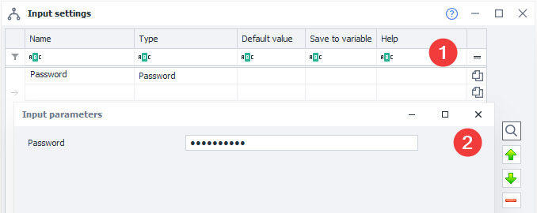

### Unicode Characters

You can use Unicode symbols in all fields. Example: ± ♻ 📞 💙 🚢 (note that browsers display them in color, but in the settings, the symbols look like they do in the screenshot below):

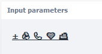

  

## Overview of Input Settings in ZennoPoster

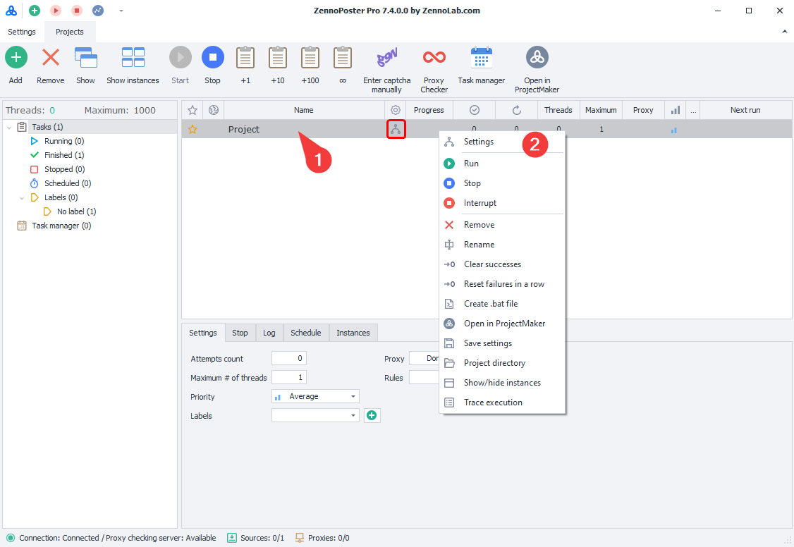

To open "Project Input Settings", right-click on a project, select "Settings" from the context menu that appears, or double-click the project in the project list.

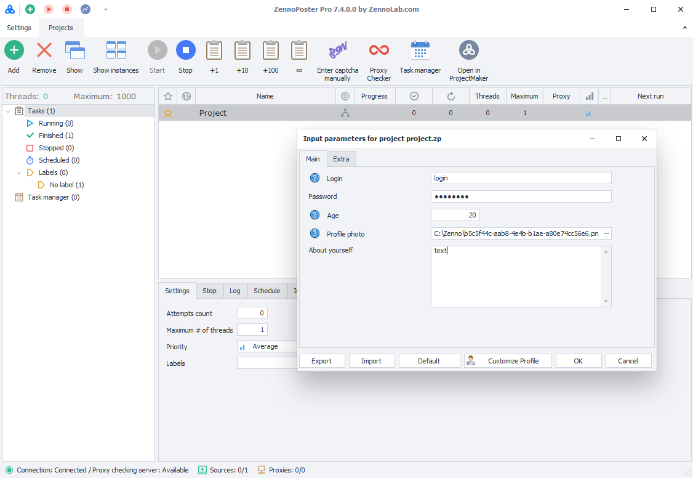

This simple yet clear interface for input settings doesn't take much time or require any special knowledge! Now, you can easily share your project with another ZennoPoster user, and they won't have any trouble running it!